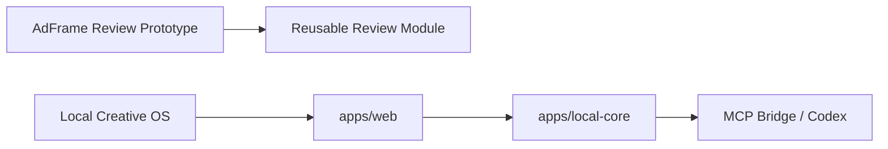

# CODEX_START_HERE

你正在接手 Local Creative OS 仓库。

## 任务目标

先建立可靠开发基线，再根据获批 Sprint 开发。不要从完整 PRD 一次实现整个平台。

## 第一步：阅读

1. `README.md`
2. `AGENTS.md`
3. 最新 PRD 冻结决策稿
4. 最新 UI & Interaction Spec 冻结决策稿
5. 当前 Handoff
6. 当前代码、测试与历史报告

## 第二步：检查仓库

执行：

```bash
git status
git branch
git log --oneline -10
git diff --check
```

然后检查：

- 所有 `package.json`；
- lockfile；
- TypeScript / Vite 配置；
- scripts；
- README / AGENTS；
- src / docs / tests / scripts；
- `.env*` 与敏感信息；
- localStorage；
- schemaVersion；
- ReviewRepository；
- ReviewEvaluator；
- ExecutionRuntime；
- Bridge / Codex；
- Mock / CopyOnly；
- changed_files / artifacts。

## 第三步：验证当前基线

只运行仓库中已存在的命令：

```bash
npm run lint
npm run typecheck
npm run test
npm run build
npm run smoke
```

不存在的命令不要自行创建。不要为了通过而立即修改代码。

## 第四步：生成报告

生成：

```text
docs/audit/CURRENT_REPOSITORY_BASELINE.md
docs/architecture/CURRENT_TO_TARGET_ARCHITECTURE.md
docs/handoffs/SPRINT_0_PROPOSAL.md
```

### `CURRENT_REPOSITORY_BASELINE.md`

包含 Git 状态、目录树、可运行命令、检查结果、旧 Prototype 状态、可复用模块、Demo 专属模块、高耦合点、敏感信息、绝对路径、localStorage、依赖与配置风险。

### `CURRENT_TO_TARGET_ARCHITECTURE.md`

至少包含：



列出保留、移动、归档、新建、暂缓和不应继续扩展的内容。

### `SPRINT_0_PROPOSAL.md`

Sprint 0 只能包含：

- 保护稳定 Prototype；
- 建立目录与边界；
- 补齐开发基线；
- Canvas Spike；
- 文件 Preview Spike；
- Runtime Spike；
- 数据 / 接口合同；
- PortaSplit Reset 样例；
- Golden Path / Failure Path。

必须写任务拆分、预计修改文件、依赖、风险、验收、回滚和需用户确认项。

## 第五步：停止

完成三份报告后停止，不要自动：

- 移动文件；
- 重写 App；
- 新建完整 App Shell；
- 接 API；
- 接 Codex Runtime；
- 接 MCP；
- 引入 SQLite；
- 升级依赖；
- 提交；
- Push；
- 创建 Tag 或 Branch。

等待用户批准 `SPRINT_0_PROPOSAL.md`。

## 最终回复格式

1. 检查了什么；
2. 哪些命令通过 / 失败；
3. 发现的最高风险；
4. 生成的三份文件；
5. 建议的 Sprint 0 顺序；
6. 当前是否适合开始编码。
