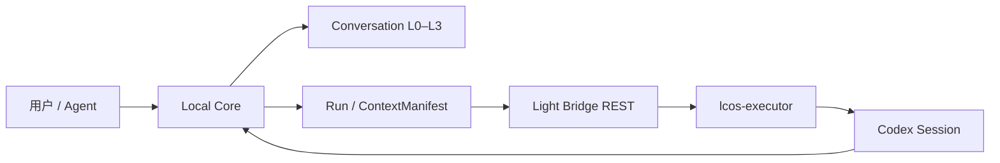

# LCOS Gate F Plus 大轮从这里开始

本包集中完成：

```text
双 MCP 角色拆分
Bridge REST-only 解耦
Watchdog 并发与超时
Context Import L0–L3
Conversation Timeline / Outline / Graph / Search
Canvas Observation / Typed Actions
上一轮 GUI 与恢复入口补齐
```

## 目标流程



## 快速检查

```powershell
npm ci
npm run build:local-core
npm run check:gatef-plus
npm run smoke:conversation
npm run smoke:conversation-semantic
npm run smoke:conversation-recovery
npm run smoke:schema-v18
npm run smoke:watchdog
npm run smoke:lcosproj-browser
npm run test:lcos-mcp-e2e
```

## Bootstrap

```powershell
node scripts/bootstrap-lcos.mjs
```

可选安装 sqlite-vec：

```powershell
node scripts/bootstrap-lcos.mjs --with-sqlite-vec
```

## 先读

```text
docs/architecture/ADR_GATEF_PLUS_MCP_BRIDGE_CONTEXT_IMPORT_20260805.md
docs/handoffs/LCOS_GATEF_PLUS_BIG_ROUND_DEVELOPMENT_REPORT_20260805.md
docs/testing/GATEF_PLUS_BIG_ROUND_WINDOWS_EVIDENCE_CHECKLIST_20260805.md
```

本包是 Windows Evidence Candidate，不声称已经在目标 Windows / Codex / Ollama 环境完成最终验收。
