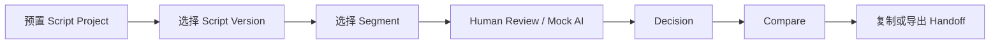
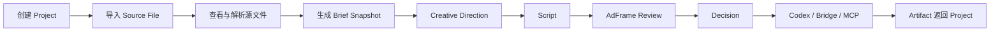
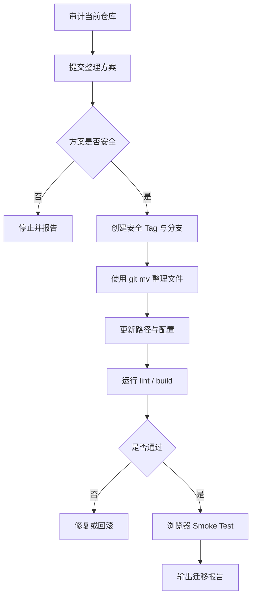

# Local Creative OS — 本地项目整理与改造预备说明

> 交接对象：Codex  
> 当前项目目录：`E:\Codex 项目\演示demo`  
> 当前目标：先整理本地项目文件与代码边界，为后续高保真前端、Figma 交互、Local Core、Codex Runtime、MCP、Skill、Plugin 和 Connector 留出稳定位置。  
> 任务性质：**结构整理与改造预备，不进行新产品功能开发，不重做 UI，不接真实 API。**

---

# 1. 项目现状

当前仓库最初是一个 AdFrame Script Review 作品集 Demo，已经完成：

- Script V1 / V2 / V3
- Segment
- Brief Snapshot
- Purpose
- Product Role
- Locked Elements
- Human Review
- Mock AI Draft
- Accept / Revise / Reject
- Keep / Modify / Remove
- Decision
- Source / Current Compare
- localStorage
- Markdown / JSON / Codex Handoff
- Demo Reset
- Repository / Evaluator / Runtime Adapter
- README / Case Study / Demo Script / QA 截图

当前旧版的价值是：

> 它验证了 Review、Decision、Locked Elements、版本对比和 Codex Handoff 的领域逻辑。

当前旧版的问题是：

- 主应用从预置脚本开始；
- 没有 Source Import；
- 没有真实文件预览与解析；
- 没有真实 AI 对话；
- 没有 Local Core；
- Codex Handoff 仍以复制文本为主；
- MCP、飞书、Notion、Plugin 尚未真实接通；
- 固定三栏 UI 不再作为新主产品结构；
- Review 不应该继续充当整个产品首页。

因此，旧版必须保留为可复用模块，但主应用未来将转向：

> **Local Creative OS：从原始 Brief 文件进入项目，经 AI 整理、方向生成、脚本创作、审核、Decision，到 Codex / MCP 执行和 Artifact 回收。**

---

# 2. 本次整理目标

本次只完成四件事：

1. **保护旧版成果**
2. **识别现有文件职责**
3. **整理成可演进的目录**
4. **为未来模块预留清晰位置**

本次不应该：

- 开发新 App Shell
- 重做视觉
- 接 DeepSeek API
- 接 Codex CLI
- 接 MCP
- 接飞书
- 接 Notion
- 引入 Electron
- 引入数据库
- 引入复杂状态管理库
- 擅自删除现有 Demo
- 大规模改写现有业务逻辑

---

# 3. 变更前后流程图

## 3.1 当前代码代表的产品流程



## 3.2 未来主产品流程



## 3.3 本次整理在整体路线中的位置


本次只执行：

```text
A → B
```

不进入后续阶段。

---

# 4. 执行前必须完成

## 4.1 检查工作区

执行：

```bash
git status
git branch
git log --oneline -10
git diff --check
```

确认：

- 当前分支名称；
- 是否存在未提交文件；
- 是否存在未跟踪但重要的设计稿、文档或截图；
- 是否存在本地配置或密钥；
- 是否存在构建产物混入仓库；
- 是否存在已经失效但仍被引用的文件。

不要在工作区不干净时直接移动大量文件。

## 4.2 创建安全节点

若当前状态尚未冻结：

```bash
git add .
git commit -m "chore: freeze AdFrame review prototype"
git tag v0.3-review-prototype
```

然后创建整理分支：

```bash
git switch -c chore/prepare-local-creative-os
```

若 tag 已存在，不要覆盖。先报告现状。

## 4.3 生成审计文件

先生成：

```text
docs/audit/PROJECT_FILE_AUDIT.md
```

必须记录：

- 当前目录树；
- 每个主要目录职责；
- 可复用文件；
- Demo 专属文件；
- 待废弃文件；
- 重复文件；
- 未使用文件；
- 高耦合点；
- 配置文件；
- 本地路径依赖；
- 潜在密钥或敏感信息；
- 建议移动方案。

**审计完成前，不允许开始大范围移动。**

---

# 5. 目标目录结构

整理目标不是一步到位做成完整平台，而是建立稳定骨架。

```text
E:\Codex 项目\演示demo
├── apps/
│   ├── web/
│   │   ├── src/
│   │   │   ├── app/
│   │   │   ├── features/
│   │   │   │   └── review/
│   │   │   ├── shared/
│   │   │   └── demo/
│   │   ├── public/
│   │   ├── index.html
│   │   ├── package.json
│   │   ├── tsconfig.json
│   │   └── vite.config.ts
│   │
│   └── local-core/
│       ├── README.md
│       ├── src/
│       │   ├── api/
│       │   ├── projects/
│       │   ├── sources/
│       │   ├── runtimes/
│       │   ├── connectors/
│       │   └── artifacts/
│       └── .gitkeep
│
├── packages/
│   ├── domain/
│   │   ├── README.md
│   │   └── src/
│   │       ├── project.ts
│   │       ├── source.ts
│   │       ├── brief.ts
│   │       ├── direction.ts
│   │       ├── script.ts
│   │       ├── review.ts
│   │       ├── decision.ts
│   │       ├── run.ts
│   │       └── artifact.ts
│   │
│   ├── contracts/
│   │   ├── README.md
│   │   └── src/
│   │       ├── repository.ts
│   │       ├── evaluator.ts
│   │       ├── runtime.ts
│   │       └── connector.ts
│   │
│   └── skills/
│       ├── README.md
│       ├── user/
│       ├── project/
│       └── registry/
│
├── projects/
│   ├── README.md
│   └── .gitkeep
│
├── docs/
│   ├── product/
│   ├── architecture/
│   ├── design/
│   ├── handoffs/
│   ├── audit/
│   ├── qa/
│   └── archive/
│
├── scripts/
│   ├── README.md
│   └── .gitkeep
│
├── .env.example
├── .gitignore
├── AGENTS.md
├── README.md
└── package.json
```

---

# 6. 目录职责

## 6.1 `apps/web`

当前 React + TypeScript + Vite 应用。

本次应该：

- 将现有前端移动或整理进 `apps/web`；
- 保持当前 Demo 可启动；
- 不重做 UI；
- 不修改产品路径；
- 不引入新依赖；
- 不破坏现有构建命令。

现有 Review 能力应归入：

```text
apps/web/src/features/review/
```

推荐内部结构：

```text
features/review/
├── components/
├── model/
├── services/
├── adapters/
└── ReviewWorkspace.tsx
```

## 6.2 `apps/local-core`

本次只建立骨架和 README，不开发服务。

未来职责：

- 本地项目目录管理
- 文件导入
- 文本提取
- DeepSeek API
- Codex / Bridge
- MCP
- Connector
- Run 状态
- Artifact 回收

本次不得安装后端框架。

## 6.3 `packages/domain`

保存跨 UI、Local Core 和 Runtime 共用的领域类型。

第一阶段先迁移或预留：

- Project
- SourceDocument
- SourceSnapshot
- BriefDocument
- CreativeDirection
- ScriptDocument
- ScriptVersion
- ScriptSegment
- Review
- Decision
- Run
- Artifact
- Connector

本次不要为了“未来通用”创建复杂泛型系统。

## 6.4 `packages/contracts`

保存边界接口：

```ts
interface ProjectRepository {}
interface ReviewRepository {}
interface ReviewEvaluator {}
interface ExecutionRuntime {}
interface SourceConnector {}
interface ArtifactRepository {}
```

当前已有的 Repository、Evaluator、Runtime Adapter 可以迁入或被这里引用。

## 6.5 `packages/skills`

只创建目录规范，不开发 Skill 市场。

结构：

```text
skills/
├── user/
├── project/
└── registry/
```

未来用于：

- 用户级 Skill
- 项目级 Skill
- Skill 索引
- Codex 按需加载

## 6.6 `projects`

未来存真实本地项目。

示例：

```text
projects/
└── portasplit-thinker/
    ├── project.json
    ├── sources/
    ├── snapshots/
    ├── documents/
    ├── reviews/
    ├── runs/
    └── artifacts/
```

本次只创建：

```text
projects/README.md
projects/.gitkeep
```

不要把当前 Demo seed 直接当成真实项目迁进去。

## 6.7 `docs`

重新分类：

```text
docs/product/
```

放：

- 产品定位
- 用户流程
- Scope
- Roadmap

```text
docs/architecture/
```

放：

- 技术架构
- 数据模型
- Runtime
- Connector
- MCP

```text
docs/design/
```

放：

- Image2 提示词
- Figma 交互
- Motion Spec
- 视觉参考
- 页面说明

```text
docs/handoffs/
```

放：

- 给 Codex 的任务
- 给 Figma 的任务
- 给其他 Agent 的任务
- 开发交接说明

```text
docs/audit/
```

放：

- 文件审计
- 依赖审计
- 迁移报告
- 风险报告

```text
docs/qa/
```

放：

- 浏览器截图
- 回归结果
- Smoke Test
- 演示检查

```text
docs/archive/
```

放：

- 旧 Day 报告
- 旧提示词
- 旧方案
- 已废弃但需要保留的文档

---

# 7. 文件移动规则

## 7.1 必须使用 Git Move

移动已跟踪文件时优先：

```bash
git mv old/path new/path
```

不要复制一份后删除旧文件，避免历史丢失。

## 7.2 不允许直接删除

发现旧文件时按三类处理：

```text
KEEP
MOVE
ARCHIVE
```

只有明确属于以下情况才允许删除：

- 构建产物；
- 可再生成缓存；
- 确认未使用的重复文件；
- 已被 `.gitignore` 覆盖的临时文件。

删除前必须写进审计报告。

## 7.3 不移动敏感配置

检查：

- `.env`
- API Key
- Token
- 本地绝对路径
- 飞书凭据
- Notion Token
- Bridge 配置
- MCP 配置

若发现敏感信息：

1. 不提交；
2. 转为 `.env.example`；
3. 在报告中只说明类型，不复制密钥；
4. 更新 `.gitignore`。

## 7.4 保持旧 Demo 可运行

整理后至少保证：

```bash
npm install
npm run dev
npm run lint
npm run build
```

若改成 workspace 命令，需要在根 README 明确：

```bash
npm run dev:web
npm run lint
npm run build
```

但本次尽量不要引入 monorepo 工具。

可以使用 npm workspaces，但只有在确实必要且迁移成本可控时采用。不要引入 Turborepo、Nx 等额外系统。

---

# 8. 推荐根目录 `package.json`

若当前项目适合迁移为 npm workspaces，可采用：

```json
{
  "name": "local-creative-os",
  "private": true,
  "workspaces": [
    "apps/*",
    "packages/*"
  ],
  "scripts": {
    "dev": "npm run dev --workspace apps/web",
    "dev:web": "npm run dev --workspace apps/web",
    "build": "npm run build --workspace apps/web",
    "lint": "npm run lint --workspace apps/web"
  }
}
```

但必须满足：

- 当前依赖安装正常；
- Windows 路径兼容；
- Vite 正常启动；
- 不破坏现有 lockfile；
- lint / build 通过。

若迁移风险较高，本次可先只建立目录，不启用 workspaces。

Codex 应先评估再选择，不能为了目录“看起来专业”强行引入。

---

# 9. `AGENTS.md` 应新增的项目规则

根目录创建或更新 `AGENTS.md`：

```markdown
# Local Creative OS Engineering Rules

## Product boundary

The current AdFrame Script Review is a reusable Review Module.
It is not the final App Shell.

Do not extend the old permanent three-column UI.

## Design gate

Do not implement a new main product flow until:
1. Image direction is approved.
2. Figma interaction states are approved.
3. A downloadable handoff document exists.

## Architecture

- Web UI lives in apps/web.
- Local execution will live in apps/local-core.
- Shared domain types live in packages/domain.
- Runtime and connector contracts live in packages/contracts.
- Real project data will live in projects.

## Safety

- Do not delete the existing review prototype.
- Do not introduce API keys into frontend code.
- Do not add a database, Electron, or new framework without approval.
- Do not connect Feishu, Notion, DeepSeek, Codex CLI, Bridge, or MCP during file-organization tasks.
- Preserve Git history with git mv.
- Run lint and build after structural changes.

## Change protocol

Any product, flow, data, runtime, MCP, plugin, or architecture change must include:
- reason
- before flowchart
- after flowchart
- affected modules
- migration impact
- acceptance criteria
- rollback plan

Handoff instructions must be saved as downloadable Markdown files under docs/handoffs.
```

---

# 10. 本次允许移动的内容

Codex 先根据真实仓库审计，再决定具体映射。

原则上：

## 适合移动到 `apps/web`

- React 源码
- Vite 配置
- 前端样式
- public 资源
- Demo seed
- Review UI
- localStorage 实现
- Mock Evaluator
- Copy Runtime

## 适合移动到 `packages/domain`

- 纯 TypeScript 类型
- 不依赖 React 的领域模型
- Script / Review / Decision 类型
- schemaVersion 定义

## 适合移动到 `packages/contracts`

- Repository interface
- Evaluator interface
- Runtime interface
- Export / Handoff contract

## 适合移动到 `docs/archive`

- DAY1 报告
- DAY2 报告
- DAY3 报告
- 旧演示稿
- 旧 QA 说明
- 已不再作为主方向的产品说明

## 适合移动到 `docs/product`

- Local Creative OS 总纲
- 当前产品定位
- 用户流程
- Roadmap

## 适合移动到 `docs/design`

- Image2 提示词
- TapNow / Kimi 视觉参考说明
- Figma 任务
- Motion Spec

---

# 11. 本次禁止修改

- 不改变当前页面可见文案
- 不改变当前交互
- 不改 Review 数据
- 不改 PortaSplit 案例
- 不新增 Match Night
- 不新增真实文件导入
- 不新增路由
- 不新增 App Home
- 不新增 Composer
- 不新增 Source Drawer
- 不接 AI
- 不接 MCP
- 不接飞书
- 不接 Notion
- 不修改当前视觉主题
- 不加入动效
- 不重构全部 CSS
- 不升级主要依赖版本
- 不修改 Git 历史

---

# 12. 验收流程图



---

# 13. 验收条件

整理完成必须满足：

1. 当前 Review Prototype 能正常启动；
2. 当前核心交互未变化；
3. 当前 Demo seed 未丢失；
4. localStorage 数据不因路径调整失效；
5. Reset Demo 正常；
6. Markdown / JSON / Codex Handoff 正常；
7. `npm run lint` 通过；
8. `npm run build` 通过；
9. 浏览器 Console 无新增错误；
10. Git diff 中主要是移动与路径调整；
11. 没有提交敏感信息；
12. `apps/local-core` 已留出骨架但没有伪实现；
13. `packages/domain` 与 `packages/contracts` 边界清楚；
14. `projects` 目录已留出真实项目位置；
15. 文档已按 product / architecture / design / handoffs / audit / qa / archive 分类；
16. 旧版仍可通过 tag 回退；
17. 输出完整迁移报告。

---

# 14. 失败与回滚条件

出现以下任一情况，停止继续整理：

- 构建持续失败；
- 大量路径引用无法恢复；
- localStorage 数据迁移会破坏旧 Demo；
- 需要升级 React / Vite / TypeScript；
- 需要新增复杂 monorepo 工具；
- 需要修改超过 25 个业务文件；
- 需要重写 Review 领域代码；
- 无法确认某目录是否仍被使用；
- 发现未提交的重要本地文件；
- 发现敏感信息已进入 Git。

回滚：

```bash
git status
git restore .
git clean -fd
git switch <原稳定分支>
```

如果已经提交整理 commit：

```bash
git revert <整理提交>
```

不要强制重置共享分支。

---

# 15. Codex 执行步骤

## Phase 1：只读审计

1. 读取 `README.md`
2. 读取 `AGENTS.md`
3. 读取 `package.json`
4. 输出目录树
5. 搜索绝对路径
6. 搜索 localStorage key
7. 搜索未使用入口
8. 搜索 Demo seed
9. 搜索 Repository / Evaluator / Runtime
10. 检查 docs 与 QA 文件
11. 生成 `docs/audit/PROJECT_FILE_AUDIT.md`

完成后停止，等待确认。

## Phase 2：迁移计划

生成：

```text
docs/handoffs/LOCAL_PROJECT_REORGANIZATION_PLAN.md
```

必须包含：

- 文件移动表
- 路径变更表
- 保留 / 移动 / 归档清单
- package.json 方案
- 风险
- 回滚
- 预计修改文件数

完成后停止，等待确认。

## Phase 3：执行整理

获得确认后：

1. 创建 tag / branch
2. 创建目标目录
3. 使用 `git mv`
4. 修复 import
5. 更新 scripts
6. 更新 README
7. 更新 AGENTS.md
8. 运行 lint
9. 运行 build
10. 浏览器 Smoke Test

## Phase 4：交付

生成：

```text
docs/audit/LOCAL_PROJECT_REORGANIZATION_REPORT.md
```

包含：

- 最终目录树
- 实际移动文件
- 未移动文件
- 新增占位目录
- lint / build
- Smoke Test
- Git 状态
- 剩余耦合
- 下一步建议
- 回滚点

---

# 16. 给 Codex 的直接指令

```markdown
请对当前仓库执行一次“Local Creative OS 改造预备整理”。

项目目录：
E:\Codex 项目\演示demo

重要边界：
本次只整理本地文件、目录和代码边界，为未来 App Shell、Local Core、Codex Runtime、MCP、Skill、Plugin、飞书和 Notion 留位置。

不要开发新功能。
不要修改当前 UI。
不要接 API。
不要接 MCP。
不要接飞书或 Notion。
不要删除当前 AdFrame Review Prototype。

必须先执行 Phase 1 只读审计，并生成：

docs/audit/PROJECT_FILE_AUDIT.md

审计报告必须包含：
1. 当前目录树
2. 每个主要目录职责
3. 可复用文件
4. Demo 专属文件
5. 待归档文件
6. 重复或未使用文件
7. 本地绝对路径
8. localStorage key
9. Repository / Evaluator / Runtime 所在位置
10. 敏感配置风险
11. 建议目录
12. 建议移动表
13. 风险
14. 预计修改文件数

完成审计后停止，不要自动移动文件。

目标目录参考：
- apps/web
- apps/local-core
- packages/domain
- packages/contracts
- packages/skills
- projects
- docs/product
- docs/architecture
- docs/design
- docs/handoffs
- docs/audit
- docs/qa
- docs/archive
- scripts

旧 Review 领域能力未来应归入：
apps/web/src/features/review

执行规则：
- 优先使用 git mv
- 不删除未知文件
- 不升级主要依赖
- 不引入 Turborepo / Nx / Electron / 数据库
- 不改变当前页面和现有交互
- 不破坏 lint / build
- 不提交敏感信息
- 发现高风险时停止并报告

在我确认审计报告后，再生成迁移计划：
docs/handoffs/LOCAL_PROJECT_REORGANIZATION_PLAN.md

迁移计划确认后才允许执行移动。
```

---

# 17. 以后交接文件规则

从现在起，所有交给以下对象的说明默认生成可下载 Markdown：

- Codex
- WorkBuddy
- Figma
- 设计对话
- 子 Agent
- Bridge Worker
- 外部开发者
- 产品评审
- QA 审核

默认保存位置建议：

```text
docs/handoffs/
```

命名格式：

```text
YYYY-MM-DD_<对象>_<任务>.md
```

例如：

```text
2026-07-17_CODEX_LOCAL_PROJECT_REORGANIZATION.md
2026-07-18_FIGMA_CREATIVE_WORKSPACE_INTERACTIONS.md
2026-07-19_CODEX_LOCAL_CORE_SPRINT_01.md
```

所有重大改动交接必须包含：

- 变更原因
- 变更前流程图
- 变更后流程图
- 影响模块
- 用户操作变化
- 数据流
- 开发范围
- 禁止项
- 验收条件
- 回滚方案

---

# 18. 本次任务最终判断

本次整理的成功标准不是“目录看起来像大项目”，而是：

> 旧 Review Prototype 不被破坏，新 Local Creative OS 有了清晰落脚位置，未来设计、前端、本地 Core、Codex、MCP、Skill 和 Connector 可以各自进入正确目录，而不是继续堆在一页式 Demo 上。

