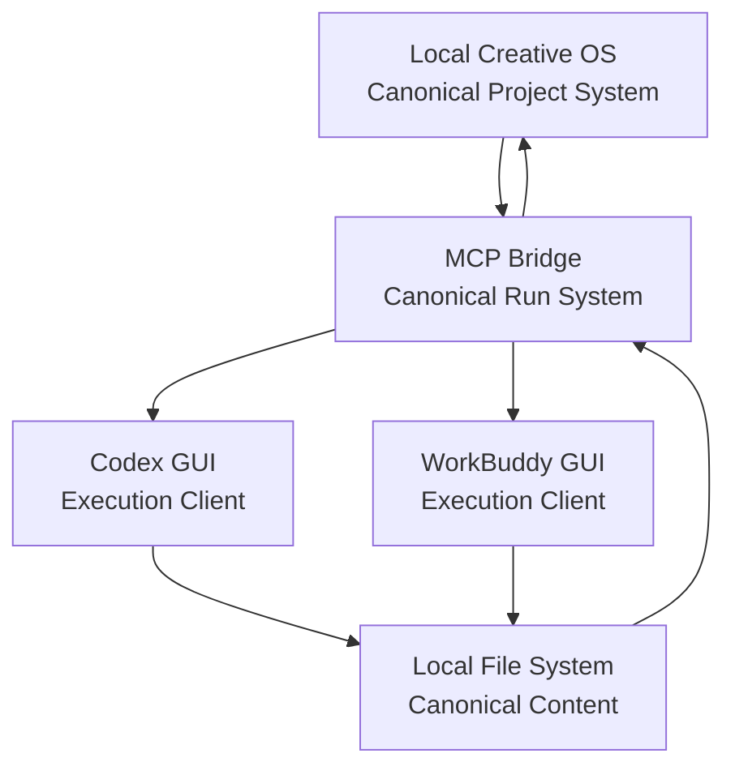
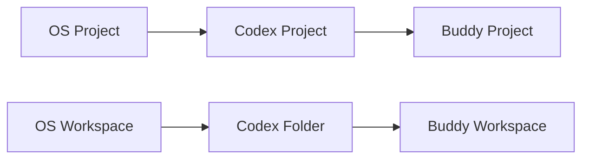
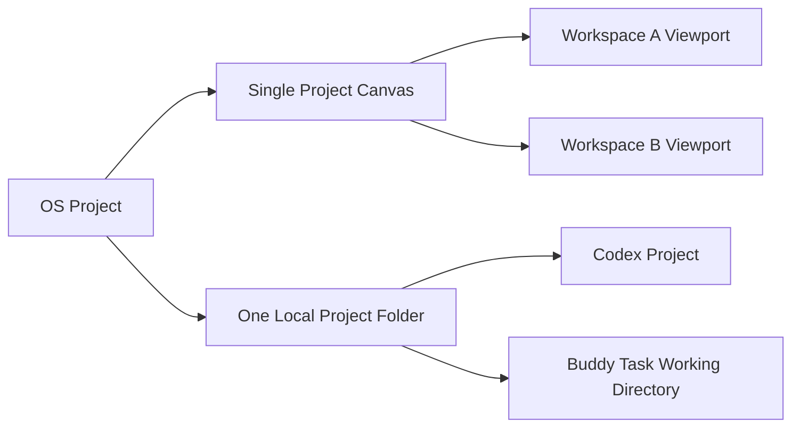
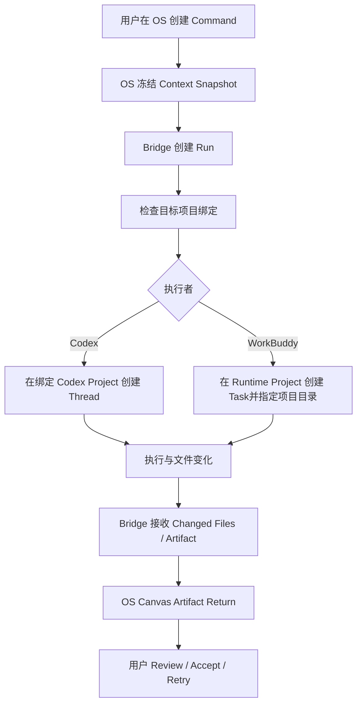
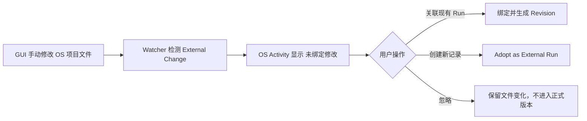
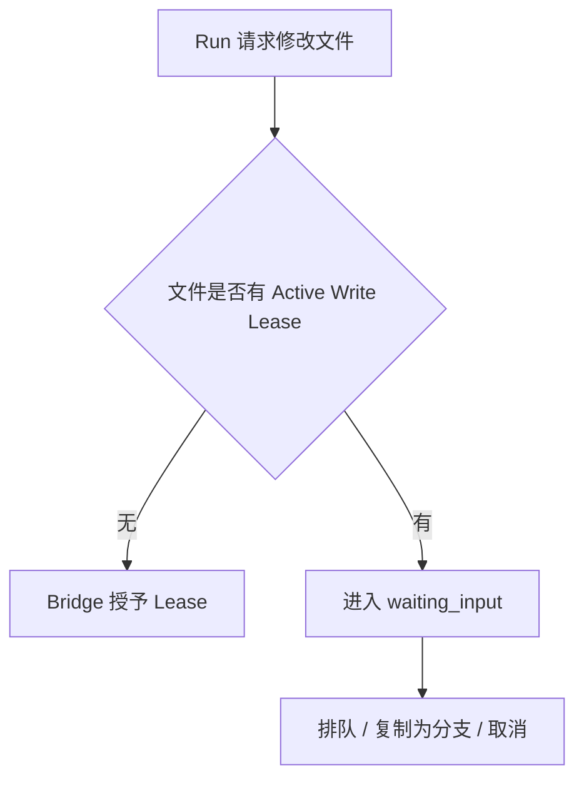

# Local Creative OS 与 Codex / WorkBuddy GUI 项目协同规范

> 文档类型：架构决策记录（ADR）  
> 决策目标：让 Local Creative OS、Codex GUI 与 WorkBuddy GUI 能共同使用本地文件和任务，同时避免项目分类、上下文、状态和文件归属互相干扰。  
> 核心原则：**OS 管项目，Bridge 管执行，GUI 管会话，文件系统管内容。**

---

## 1. 最终结论

不要让 Local Creative OS、Codex 和 WorkBuddy 各自建立一套平级的“项目管理系统”。

采用以下关系：



职责必须固定：

| 系统 | 负责 | 不负责 |
|---|---|---|
| Local Creative OS | Project、Workspace、Artifact、关系、Context、版本、交付 | 不依赖 GUI 分类保存项目状态 |
| MCP Bridge | Run、状态、事件、执行者、Changed Files、Artifact Return | 不管理 Canvas 和视觉布局 |
| Codex GUI | 针对代码仓库或项目目录执行具体任务、查看 Diff、继续会话 | 不成为 Creative OS 的项目数据库 |
| WorkBuddy GUI | 针对文档、PPT、文件整理等任务执行和交付 | 不复制 OS 的 Workspace 分类 |
| 文件系统 | 保存真实文件与项目目录 | 不保存 Canvas 语义和任务状态 |

---

# 2. 为什么不能一比一复制所有分类

错误做法：



这种一比一复制会产生：

- 项目重命名不同步；
- Workspace 被误解为实体目录；
- GUI 会话与 OS Run 无法对应；
- 同一个文件在多个工具中出现不同归属；
- 用户不知道哪个系统才是状态源；
- GUI 内部分类变化反向污染 OS；
- 删除 GUI 项目时产生“是否删除真实项目”的恐慌。

因此，GUI 分类只能是 **OS 项目的执行投影或快捷入口**，不能成为第二套项目结构。

---

# 3. 正式映射规则

## 3.1 Project 映射

### Local Creative OS

`Project Package` 是唯一正式项目身份。

示例：

```text
PortaSplit
Local Creative OS
华新集团 VI
```

### Codex GUI

一个 Codex Project 绑定一个实际工作目录或 Git 仓库。

推荐：

```text
[OS] PortaSplit
→ E:\CreativeOS\projects\portasplit

[DEV] Local Creative OS
→ E:\Codex 项目\演示demo
```

Codex Project 是目录入口，不承担 Workspace 和版本语义。

### WorkBuddy GUI

默认不要为每个 Workspace 创建项目。

推荐两种方式：

#### 默认模式：一个长期执行项目

```text
[OS Runtime] Creative Production
```

其内部保存：

- 通用工作规则；
- 通用连接器；
- 通用 Skill；
- Bridge 接入说明。

每个具体 Creative OS Run 作为独立任务，并指定对应项目目录。

#### 例外模式：长期大型项目单独建立 Buddy Project

仅当一个 OS Project 长期存在、需要稳定专属 Skill / Connector / Instructions 时，才建立：

```text
[OS] PortaSplit
```

但仍由 OS Project ID 绑定，不能人工再发明新的分类。

---

## 3.2 Workspace 映射

**OS Workspace 不映射为 Codex Project、Buddy Project 或真实文件夹。**

Workspace 只是：

- Semantic Viewport；
- Focused Node Set；
- Visible Layers；
- Context Policy；
- Canvas Layout Snapshot。



GUI 不需要知道用户当前在“理解”“探索”还是“决策” Workspace。

执行时，OS 只把当前 Workspace 生成的 Context Snapshot 交给 Bridge。

---

## 3.3 Run 与 GUI 会话映射

一次 OS Command 创建一个 Run。

一个 Run 默认对应：

- 一个 Bridge Task；
- 一个 Executor；
- 一个 Codex Thread 或 WorkBuddy Task；
- 一个 Context Snapshot；
- 一组 Changed Files；
- 零个或多个 Artifact。


正式关系：

```text
OS Run ID
↔ Bridge Task ID
↔ External Thread / Task ID
```

GUI 会话标题建议：

```text
RUN-7F2A · 修改 Thinker 脚本
RUN-91BC · 整理客户反馈
```

标题只用于人类识别，真正绑定依赖 ID，不依赖名称。

---

# 4. GUI 项目分类建议

## Codex GUI

只保留三类：

```text
[DEV] 产品代码仓库
[OS] Creative OS 管理的真实项目
[LAB] 临时实验与技术 Spike
```

示例：

```text
[DEV] Local Creative OS
[DEV] MCP Bridge
[OS] PortaSplit
[OS] 华新集团 VI
[LAB] React Flow Performance
```

规则：

- `[DEV]`：代码仓库，允许 Git、Branch、Worktree；
- `[OS]`：Creative OS 绑定的创意项目目录；
- `[LAB]`：实验目录，可随时归档，不进入正式项目；
- 不按 Brief、Direction、Script、Review 建 Codex Project；
- 不按每次任务建 Codex Project；
- 一个任务使用 Thread，不创建新 Project。

## WorkBuddy GUI

只保留两类：

```text
[OS Runtime] 通用创意执行环境
[OS] 少量长期专属项目
```

示例：

```text
[OS Runtime] Creative Production
[OS] PortaSplit
```

普通任务不要创建新 Buddy Project，只创建 Task 并指定目录。

---

# 5. 目录结构建议

```text
E:\CreativeOS\
├── projects\
│   ├── portasplit\
│   │   ├── project.json
│   │   ├── sources\
│   │   ├── documents\
│   │   ├── assets\
│   │   ├── runs\
│   │   ├── artifacts\
│   │   └── .creative-os\
│   │       ├── bindings.json
│   │       ├── index.sqlite
│   │       └── cache\
│   │
│   └── huaxin-vi\
│
├── development\
│   ├── local-creative-os\
│   └── mcp-bridge\
│
└── labs\
    ├── react-flow-spike\
    └── ppt-preview-spike\
```

分类原则：

- `projects`：真实创意项目；
- `development`：产品与 Bridge 代码；
- `labs`：技术实验；
- GUI 只绑定以上目录；
- OS Workspace 不创建物理目录。

---

# 6. 项目绑定清单

每个 OS Project 保存：

```json
{
  "projectId": "prj_portasplit",
  "name": "PortaSplit",
  "rootPath": "E:\\CreativeOS\\projects\\portasplit",
  "managedBy": "local-creative-os",
  "runtimeBindings": {
    "codex": {
      "projectFolder": "E:\\CreativeOS\\projects\\portasplit"
    },
    "workBuddy": {
      "projectName": "[OS Runtime] Creative Production"
    }
  },
  "bridgeNamespace": "prj_portasplit"
}
```

保存位置：

```text
.creative-os/bindings.json
```

作用：

- 避免依靠 GUI 项目名称绑定；
- GUI 改名不影响 OS；
- OS Project 重命名不移动真实目录；
- Bridge 根据 `projectId` 和 `rootPath` 执行；
- 后续可以增加 externalThreadId、deepLink 和权限信息。

---

# 7. 从 OS 发起任务的标准流程



GUI 只是执行界面。

项目归属、Context、Run、Artifact 和 Review 始终由 OS / Bridge 保存。

---

# 8. 从 GUI 手动发起任务的处理

用户可能直接打开 Codex 或 WorkBuddy 开工，不能禁止，也不应假装这种事不会发生。

分两种：

## 8.1 GUI 任务在 OS 项目目录内

Watcher 发现文件变化，但没有 Run ID：



默认不得自动归因给最近一次 Run。

## 8.2 GUI 任务在 Sandbox / LAB 目录

不进入 OS。

用户需要时执行：

```text
导入到项目
```

OS 创建新的 Source / Generated Artifact，并保留外部来源。

---

# 9. 并发与文件冲突规则

## 9.1 同一个文件只允许一个写入 Run



## 9.2 Codex 与 Buddy 不同时修改同一目标

允许同时运行：

- Codex 修改代码；
- Buddy 生成独立 PPT；
- 另一个任务只读分析。

不允许同时运行：

- Codex 和 Buddy 覆盖同一个 Markdown；
- 两个 Run 重命名同一目录；
- GUI 手动编辑与 Agent 覆盖同一文件而无确认。

## 9.3 外部修改

Watcher 检测到文件被 GUI 或原生工具修改时：

- 生成 External Change；
- 标记关联 Run 可能 Stale；
- 覆盖前重新检查哈希；
- 不静默覆盖。

---

# 10. GUI 不干扰 OS 的硬规则

1. OS Project ID 是唯一正式项目身份。
2. GUI 项目名称只是标签，不用于数据关联。
3. Workspace 不映射到 GUI Project。
4. GUI Thread / Task 映射到 Run。
5. GUI 历史不是状态源。
6. GUI 不移动或重命名 OS Project 根目录。
7. GUI 直接修改产生 External Change，不自动归因。
8. 同一文件写操作必须有 Bridge Lease。
9. GUI-only Sandbox 与 OS-managed Project 目录分开。
10. OS 删除 Project 时不自动删除 Codex / Buddy 历史。
11. GUI 删除 Project Shortcut 时不删除 OS Project。
12. GUI 工具不可直接写 `.creative-os` 内部目录。

---

# 11. 第一阶段最简实现

Alpha 不需要自动控制 Codex / Buddy GUI 的全部分类。

先完成：

1. OS Project 保存 `rootPath`；
2. Codex Project 手动绑定同一目录；
3. WorkBuddy Task 每次选择该目录；
4. OS Run 保存 `executor` 和 `externalThreadId`；
5. Bridge 保存 Run 状态；
6. Watcher 识别无 Run ID 的 External Change；
7. 所有 GUI 项目使用统一名称前缀；
8. OS Workspace 完全不进入 GUI 分类。

Alpha 命名：

```text
Codex:
[DEV] Local Creative OS
[DEV] MCP Bridge
[OS] PortaSplit
[LAB] React Flow Spike

WorkBuddy:
[OS Runtime] Creative Production
```

---

# 12. 后续增强

P1：

- OS 内“Open in Codex / Open in Buddy”；
- 自动写入 Run Manifest；
- 保存 externalThreadId 和 deepLink；
- GUI 任务返回结构化 Result Manifest；
- Project Binding 检查；
- Write Lease；
- External Change Adoption。

P2：

- Codex App Server / GUI 深度链接；
- WorkBuddy API / Connector 自动创建任务；
- 自动恢复对应 Thread；
- 多 Executor 路由；
- GUI 会话同步摘要，但不复制完整 GUI 状态。

---

# 13. 最终一句话

> Local Creative OS 的 Project 是正式项目，Workspace 是语义视角，Bridge Run 是正式任务；Codex Project 和 WorkBuddy Project 只是执行入口，Codex Thread 与 WorkBuddy Task 才对应一次 Run。GUI 可以独立存在，但不能拥有项目真相。
