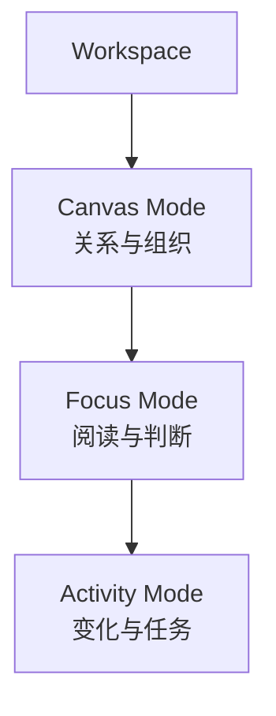
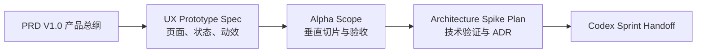

# Local Creative OS PRD V1.0 — 资深开发 PM 评审

> 评审对象：`Local_Creative_OS_PRD_V1.0_PM评审版.docx`  
> 评审结论：**战略层通过，设计阶段通过，工程立项有条件通过；不建议直接按当前 P0 清单进入完整开发。**

---

## 1. 总体判断

这份 PRD 不是普通的“功能清单”，而是一份完整的产品宪章、领域模型和初步技术方案。

它已经较好回答：

- 为什么要做；
- 解决谁的问题；
- 不做什么；
- Workspace、Canvas、Artifact、Run、Checkpoint 等对象如何关联；
- 用户如何边看文件边判断；
- AI 如何接收可追溯上下文；
- Codex 如何执行真实任务；
- 文件、版本和交付如何回到项目。

从产品经理工作质量看，属于明显高于平均水平的文档。

评分：

| 维度 | 评分 | 判断 |
|---|---:|---|
| 产品定位 | 9/10 | 清晰、有差异化 |
| 问题定义 | 8.5/10 | 基于真实工作痛点 |
| 产品边界 | 9/10 | “不做原生编辑器”写得好 |
| 对象模型 | 9/10 | Artifact 三层模型尤其成熟 |
| 核心交互 | 8.5/10 | Command Node 有产品识别度 |
| 上下文与执行 | 8.5/10 | 可解释、可追溯、状态统一 |
| MVP 范围控制 | 5.5/10 | P0 明显过宽 |
| 用户验证 | 6.5/10 | 场景真实，但尚未通过原型验证 |
| 工程可执行性 | 7/10 | 架构方向合理，尚未拆成可交付切片 |
| 文档可读性 | 8/10 | 清晰完整，但术语和表格密度较高 |

综合评价：**8.3/10**

---

## 2. 最值得肯定的部分

### 2.1 产品边界清楚

文档明确：

- 不做 PPT、图片、视频和富文本编辑器；
- 不重做 Figma、Canva、飞书和 Notion；
- 不做企业级项目管理；
- 不强制 Brief → Direction → Script → Review；
- Canvas 负责关系、判断、派活和回收，不负责内容制作。

这避免了产品继续无限膨胀。

### 2.2 Workspace 的定义正确

Workspace 被定义为长期保存的浏览器式工作环境，而不是固定业务阶段。

这解决了早期 Brief / Direction / Script / Review 标签过死的问题，也符合真实创意工作的非线性特征。

### 2.3 Artifact 三层模型成熟


这个模型能支持：

- 同一个文件出现在多个 Workspace；
- 不复制实体文件；
- 不同 Canvas 保存不同位置和备注；
- 内容变化统一形成 Revision；
- 交付或分支时才创建真实副本。

这是整份 PRD 里最有架构价值的部分之一。

### 2.4 Command Node 是核心交互亮点

Command Node 将用户真正编辑的对象定义为：

- 判断；
- 意图；
- 修改要求；
- Context；
- Skill；
- Executor；
- Output。

这与“系统不重做文件编辑器”的边界一致，也能成为 Local Creative OS 的主要产品识别点。

### 2.5 上下文可解释

Context Engine 并非简单“自动带入全部资料”，而是：

- 默认隐藏；
- 发送前展示摘要；
- 可查看来源；
- 可排除对象；
- 记录使用快照；
- 关联 Run、Conversation 和 Changed Files。

这比普通聊天式产品更专业。

### 2.6 版本语义拆分合理

文档将变化拆为：

```text
Activity：自动记录发生了什么
Revision：单个 Artifact 的内容变化
Checkpoint：用户确认的正式版本
Delivery Bundle：对外交付集合
```

这种层级能避免“每次 AI 修改都创建一个正式版本”的版本灾难。

### 2.7 执行状态源设计正确

PRD 明确：

> Creative OS / Bridge 是统一状态源，不能依赖 Codex 或 Buddy GUI 是否打开。

这和已有 Bridge 架构一致，是可持续扩展的正确原则。

---

## 3. 最主要的问题

## 3.1 当前 P0 不是 MVP，而是完整平台地基

当前 P0 同时包含：

- 项目包；
- 自定义 Workspace；
- Canvas 基础操作；
- 时间、思维导图、自由布局三种视图；
- MD、图片、PPT、本地目录导入；
- 飞书导入；
- Preview Inspector；
- 页面级备注；
- Command Node；
- Skill；
- Context；
- 真实 Codex Run；
- Conversation；
- Changed Files 回收；
- Activity；
- Revision；
- Checkpoint；
- Delivery Bundle；
- SQLite；
- 凭证与权限设置。

这不是一个 MVP，而是多个技术子系统同时开工。

### 当前 P0 流程


任何一段失败，主流程都无法完整展示。

### 建议 Alpha 流程


Alpha 只验证一句话：

> 用户能否在一个真实项目里，看资料、写判断、派给 Codex，并把修改结果正确收回来。

---

## 3.2 三种 Canvas 视图不应全部进入 P0

文档要求：

- 时间模式；
- 思维导图；
- 自由布局；

并且三种视图共享 Project Graph，自由布局又不能破坏思维导图层级。

这会带来：

- 同一对象多套布局状态；
- 自动布局和手工布局冲突；
- 关系语义与坐标分离；
- 视图切换后的节点可见性；
- 大量交互和性能测试；
- Figma 原型复杂度翻倍。

建议：

- Alpha 只做一种主视图；
- 优先验证自由布局或思维导图二选一；
- 时间视图先作为 Activity 列表，而不是完整 Canvas；
- 另一种 Canvas 视图进入 Beta。

---

## 3.3 Canvas 被当成了答案，但仍需验证

PRD 将 Workspace + Canvas 作为产品核心，这是合理方向，但还不能视为已被验证的事实。

需要在 Figma 中重点比较：

```text
场景 A：项目关系、来源、版本和分支
适合 Canvas

场景 B：阅读一份 PPT、PDF 或脚本
更适合 Focus / Reader View

场景 C：查看 Activity、Run 和同步错误
更适合列表 / 时间线

场景 D：创建 Delivery Bundle
更适合选择器 / 文件集合
```

建议产品结构不是“所有功能都在 Canvas 上”，而是：



Canvas 是核心工作面，但不是每个任务的唯一表现。

---

## 3.4 Command Node 可能成为“万能节点”

目前 Command Node 同时承载：

- 指令；
- Context；
- Skill；
- Executor；
- Channel；
- Output。

如果全部直接暴露，用户会面对一个配置面板，而不是轻松输入判断。

建议采用渐进披露：

```text
默认：
输入指令 + 当前 Context + Run

展开高级选项：
Skill / Executor / Output / Channel / Context 调整
```

用户不应每次都理解 MCP、API、Deep Link 或 Clipboard。

---

## 3.5 用户术语过多

内部模型术语包括：

- Project Package
- Workspace
- Workspace Intent
- Canvas
- Artifact
- Artifact View
- Artifact Revision
- Command Node
- Conversation Node
- Run
- Skill
- Checkpoint
- Delivery Bundle
- Context Pack
- Connector

内部架构可以保留，但前端不宜全部直接暴露。

建议区分：

| 内部模型 | 用户界面语言 |
|---|---|
| Artifact | 文件 / 内容 |
| Artifact View | Canvas 卡片 |
| Artifact Revision | 修改记录 |
| Checkpoint | 版本 |
| Delivery Bundle | 交付包 |
| Context Pack | 本次引用 |
| Execution Router | 系统自动执行 |
| Connector | 连接 |

产品语言越多，学习成本越高。人类用户并不渴望参加术语考试。

---

## 3.6 成功指标需要变成可验证实验

当前指标方向正确，但：

- 自动归位成功率 ≥ 90%；
- 关键修改 100% 可追溯；
- 打开项目 60 秒内恢复；
- 派活不超过 4 步；

这些适合中后期目标，不适合第一轮原型。

建议 Alpha 指标：

1. 5 次真实 Codex Run 中，至少 4 次结果能正确回到项目；
2. 用户在 30 秒内找到当前项目资料和最近一次结果；
3. 从选中文件到创建 Run，不超过 3 个主要动作；
4. 用户能明确回答“这次修改用了哪些资料”；
5. 用户能在不查看文件系统的情况下找到 Changed File；
6. 关闭重开后，Workspace 和待确认 Run 可以恢复。

---

## 3.7 飞书 P0 需要降级定义

用户确实重视飞书，因此不能简单移出。

但建议 P0 只承诺：

- 绑定飞书文档链接；
- 导入快照；
- 显示同步状态；
- 从快照加入 Context。

飞书写回、事件监听和复杂权限放入 P1。

否则 OAuth、企业策略、权限、云文档格式和同步冲突会成为第一阶段最大阻塞。

---

## 3.8 PRD 混合了三种文档

当前文件同时包含：

1. 战略 PRD；
2. UX 交互说明；
3. 技术架构方案。

这让它很完整，但不能直接成为 Sprint Backlog。

建议保留当前文件作为：

> **Product Constitution / 产品总纲**

再拆出三份执行文档：



---

## 4. 建议保留、修改与暂缓

### 4.1 直接保留

- 产品定位；
- 非目标；
- Workspace 容器；
- Canvas 工作面；
- Artifact 三层模型；
- Command Node；
- Context Lens；
- Bridge / OS 统一状态源；
- Activity / Revision / Checkpoint / Delivery；
- Adapter 接口；
- Local Core 绑定 127.0.0.1；
- 原生工具优先；
- 高风险操作确认和回滚。

### 4.2 需要修改

- P0 范围；
- 三种 Canvas 视图优先级；
- Command Node 信息密度；
- 用户界面术语；
- 飞书 P0 边界；
- 北极星指标的第一阶段口径；
- MVP 技术里程碑；
- Figma 验证问题。

### 4.3 暂缓

- 三视图完整互通；
- 自动分类并整理本地文件；
- 飞书写回与变化监听；
- 完整 Delivery Bundle；
- Notion；
- Buddy；
- 跨项目搜索；
- 自动版本建议；
- Figma / Canva 执行；
- 复杂 Connector 设置中心。

---

## 5. 推荐的开发阶段

### Phase 0：视觉与交互验证

验证：

- Workspace 切换；
- 单一 Canvas；
- Preview；
- Command Node；
- Run 状态；
- Artifact Return；
- Checkpoint。

### Phase 1：Local Alpha


只跑一个真实项目。

### Phase 2：飞书 Source

增加：

- 飞书绑定；
- Snapshot；
- Context；
- 同步状态。

### Phase 3：项目图谱与第二视图

增加：

- 关系语义；
- 自动布局；
- 第二 Canvas 视图；
- Process Layer。

### Phase 4：交付与知识连接

增加：

- Delivery Bundle；
- 飞书写回；
- Notion；
- 搜索；
- Buddy。

---

## 6. 进入 Figma 前必须确认的 8 个问题

1. 新项目默认是自由布局还是思维导图？
2. Preview 是右侧面板、浮层，还是 Focus Mode？
3. Command Node 默认只展示哪些字段？
4. Process Layer 默认完全隐藏，还是挂摘要？
5. 一个 Run 完成后，Artifact 自动放在哪里？
6. Changed File 与原文件在 Canvas 上如何区分？
7. Checkpoint 是 Workspace 级还是 Project 级入口？
8. 用户界面是否真的需要显示 Artifact、Run、Checkpoint 等术语？

---

## 7. 最终评审结论

### 战略评审

**通过。**

产品定位、边界、对象模型和核心交互方向已经足够成熟。

### 视觉原型评审

**通过，可以进入高保真探索。**

但必须围绕一个真实项目和一条主流程，不要直接设计全部 34 条功能。

### 工程立项评审

**有条件通过。**

通过条件：

1. 将当前 P0 拆成 Alpha / Beta；
2. Alpha 只保留一种 Canvas 主视图；
3. 飞书 P0 只做读取 / 快照；
4. Command Node 使用渐进披露；
5. 形成单独的 Alpha Scope 与验收文档；
6. 先完成 Bridge + Codex 的真实垂直切片；
7. 在 Figma 验证 Canvas、Preview 和 Artifact Return。

### 是否可以直接交给 Codex 开发

**不可以直接按当前 PRD 全量开发。**

Codex 可以先做：

- 本地文件整理；
- 技术 Spike；
- 已确认视觉原型的前端封装；
- Bridge / Codex 最小闭环。

不能让 Codex自己从 34 条需求中决定先后，否则它会很勤奋地建造一座没人敢住的城市。

---

## 8. 对产品经理的评价

这位产品经理已经理解了项目的核心，不是简单整理聊天记录。

尤其值得肯定：

- 没有把产品重新限制成 Brief / Script 流程；
- 没有把 Canvas 做成万能编辑器；
- 理解了本地状态源；
- 理解了 Context 的可解释性；
- 理解了 Bridge 必须成为状态源；
- 理解了版本、修改和交付不是一回事；
- 对风险和非目标有明确意识。

主要问题不是“产品理解不足”，而是：

> 产品理解太充分，导致想在 MVP 一次把整个世界观全部实现。

下一步需要的不是继续补 PRD，而是把这份总纲压缩成一个能在 3–6 周内验证的垂直切片。
