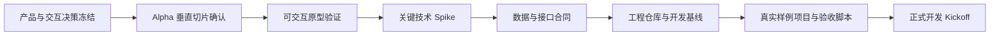
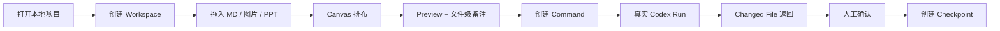
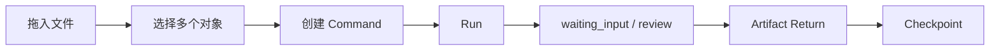
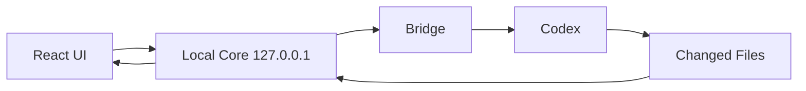
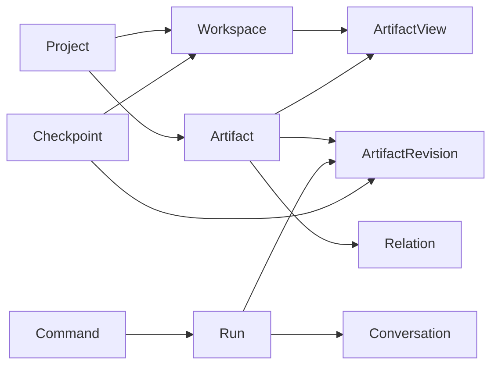

# Local Creative OS 正式开发前准备清单

> 目标：在正式编码前，完成范围冻结、关键交互验证、技术风险验证、工程基线与验收脚本，避免再次出现“代码先长，产品后纠偏”。

---

## 0. 总体推进流程



正式开发不是“页面开始写 React”，而是以上七项均达到进入条件。

---

# 1. 冻结产品基线

## 必须产出

1. `PRD V1.1`
2. `UI & Interaction Spec v0.2`
3. `Decision Log`
4. `Open Questions List`
5. `Alpha Scope`

## 必须回写的已确认决策

- 一个 Project 对应一张持续存在的大 Canvas。
- Workspace 是 Semantic Viewport，不是页面和独立 Graph。
- Project Tab 只代表项目。
- Inspector 默认关闭，按需 Overlay。
- 单击节点看状态，双击节点看一度关联。
- 原始文件、AI 派生文件、Context、Run、Decision 使用不同视觉语法。
- 当前内容留在 Canvas。
- 辅助文件进入 Stack。
- 非当前 Workspace 区域允许折叠。
- 旧 Run 进入 Activity。
- 稳定历史通过 Checkpoint 收拢。
- 独立分支才进入 Sub-canvas。
- 同一 Artifact 可以有多个 Artifact View。
- 飞书 P0 优先读取、绑定与本地 Snapshot，写回与监听后置。

## 冻结规则

进入开发后，新增或修改下列内容必须走变更流程：

- 用户主流程；
- Workspace / Canvas 语义；
- 节点类型；
- Run 状态；
- 数据实体；
- 文件覆盖与版本规则；
- MCP / Codex 执行路径；
- 飞书与 Notion 边界。

---

# 2. 锁定 Alpha 垂直切片

Alpha 不实现完整 PRD，只验证一条真实闭环。



## Alpha 必做

- 一个 Project；
- 一个持续 Canvas；
- 2–3 个 Workspace；
- 一种主布局模式；
- MD、图片、PPT 三类输入；
- Artifact / Artifact View；
- Preview；
- 文件级备注；
- Command；
- Context Lens 最小版；
- Codex / Bridge 真实 Run；
- running / waiting_input / review / completed / failed；
- Changed Files；
- Artifact Return；
- 手动 Checkpoint；
- 项目恢复。

## Alpha 明确不做

- 三种 Canvas 视图全部实现；
- 飞书写回和变化监听；
- Notion；
- Buddy；
- Delivery Bundle 完整系统；
- 跨项目搜索；
- 自动整理本地目录；
- 自动版本建议；
- Figma / Canva 执行；
- 多人协作；
- Electron / Tauri；
- 插件市场；
- 多 Agent 编排。

---

# 3. 完成可交互原型验证

工具不限，Figma 只是可选实现方式。必须验证的不是“漂亮默认态”，而是完整操作状态。

## 四轮验证

### Round 1：标准默认态

- 新标签页；
- Project Tabs；
- Workspace Dock；
- Canvas 总览；
- Mini-map；
- Inspector 关闭；
- Workspace 镜头切换。

### Round 2：节点系统

- Source；
- Working；
- Generated Draft；
- Context；
- Process；
- Decision；
- Hover；
- 单击状态详情。

### Round 3：关系与 Inspector

- 双击节点；
- 一度关联；
- Relation → Preview；
- Context；
- Activity；
- Compare；
- Esc 返回。

### Round 4：真实闭环



## 原型通过标准

- 用户不看说明也能区分 Source、AI Draft、Run 和 Decision；
- Workspace 切换明显是镜头移动，不像页面跳转；
- Command 默认操作不超过 3 个核心动作；
- Inspector 不会同时堆开关联、预览、Context 与 Activity；
- Artifact Return 的来源和落位清晰；
- 1366×768 仍能正常使用；
- 关闭颜色后，节点仍可通过结构区分；
- Reduced Motion 状态有定义。

---

# 4. 进行四项关键技术 Spike

技术 Spike 必须在正式功能开发前完成，并形成 ADR。

## Spike A：Canvas 性能与交互

验证：

- React Flow / @xyflow/react；
- 20 / 80 / 150 / 300 节点；
- 语义缩放；
- non-scaling stroke；
- 相机移动；
- 单击附着浮层；
- 双击一度关系；
- Stack；
- 折叠 Workspace Region；
- 多 Artifact View。

输出：

- FPS；
- 内存；
- 拖动延迟；
- 缩放延迟；
- 降级策略；
- 可接受节点阈值。

## Spike B：文件导入与预览

验证：

- MD 原生预览；
- 图片缩略图与原图；
- PPT 页面缩略图；
- PPT 转 PDF / 图片的方案；
- 打开原生工具；
- 哈希与重复检测；
- 文件 Watcher；
- 本地路径和权限。

## Spike C：Local Core + Bridge / Codex

验证：



必须真实跑通：

- createRun；
- queued；
- running；
- waiting_input；
- review；
- completed；
- failed；
- SSE / WebSocket；
- Changed Files；
- Artifact Return；
- 取消与重试；
- 断线恢复。

## Spike D：飞书最小连接

只验证：

- 单用户授权；
- 绑定飞书文档；
- 读取或导出本地 Snapshot；
- source_id / source_url / permission / syncedAt；
- 无权限与过期状态；
- Snapshot 进入 Context。

写回和监听暂不进入 Alpha。

---

# 5. 冻结数据模型与接口合同

正式开发前必须有：

1. ERD / 领域关系图；
2. SQLite 初始 Schema；
3. TypeScript Domain Types；
4. REST / SSE 合同；
5. Runtime Adapter 合同；
6. Connector 合同；
7. 文件目录规范；
8. schemaVersion 与迁移策略。

## Alpha 最小实体

- Project
- Workspace
- Artifact
- ArtifactView
- ArtifactRevision
- Relation
- Note
- Command
- Conversation
- Run
- SkillRef
- Checkpoint
- SourceSnapshot

## 关键关系



## 必须提前定义

- 删除 Artifact View 是否影响 Artifact；
- 同一 Artifact 多 View 的同步；
- Run 与 Conversation 的一对一或一对多；
- Changed File 如何映射 Artifact；
- AI Draft 何时变为 Current；
- Checkpoint 是 Project 级还是 Workspace 级；
- 覆盖失败和回滚规则；
- 外部 Source 更新后的 Stale 状态。

---

# 6. 建立工程基线

## 仓库结构

```text
apps/
  web/
  local-core/

packages/
  domain/
  contracts/
  ui/
  skills/

projects/
docs/
scripts/
```

## 必须完成

- Git 稳定 Tag；
- 开发分支策略；
- `AGENTS.md`；
- `.env.example`；
- 密钥不进入前端和 Git；
- lint；
- typecheck；
- build；
- unit test；
- smoke test；
- commit 规范；
- migration 规范；
- log 规范；
- error code 规范；
- dev / test / demo 三套数据模式。

## CI 最小门槛

```text
lint
→ typecheck
→ unit test
→ build
→ smoke test
```

任何结构变更必须能回滚。

---

# 7. 准备真实样例项目

不要再使用纯 UI seed 假装产品已经理解业务。

准备一个可重复重置的 PortaSplit 项目包：

```text
PortaSplit/
  sources/
    original_brief.pdf
    client_feedback.docx
    references/
  documents/
    thinker_concept_v1.md
  assets/
    moodboard/
  runs/
  versions/
```

## 样例必须包含

- 真实 Brief；
- 客户反馈；
- PPT 或图片；
- 一个当前文件；
- 一个历史版本；
- 一个需要修改的问题；
- 一次 waiting_input；
- 一次失败 Run；
- 一次成功 Artifact Return；
- 一个 Checkpoint。

样例数据必须可 Reset，且不包含客户敏感信息。

---

# 8. 写清验收脚本

正式开发前先写验收，不要等开发后才研究“什么算完成”。

## Alpha Golden Path

```text
1. 打开 PortaSplit 项目
2. 恢复上次 Workspace 和视口
3. 拖入一个参考图片
4. 图片生成 Artifact 和 View
5. 点击文件查看状态
6. 双击查看一度关联
7. Preview 查看 PPT 页面
8. 选择 PPT + 客户反馈
9. 创建 Command
10. 检查 Context Lens
11. Run with Codex
12. 查看 queued / running
13. 处理 waiting_input
14. 查看 Changed Files
15. 预览返回 Artifact
16. 接受为 Current
17. 创建 Checkpoint
18. 关闭并重新打开项目
19. 状态、视口和待处理结果恢复
```

## 失败路径

- 文件缺失；
- PPT 预览失败；
- Codex 不可用；
- Bridge 断线；
- 没有执行通道；
- 文件覆盖冲突；
- 无权限；
- Artifact 自动归位失败；
- SQLite 迁移失败；
- 本地路径被移动。

---

# 9. 建立变更与评审机制

正式开发后，每项重大改动必须包含：

- 变更原因；
- 变更前流程图；
- 变更后流程图；
- 影响模块；
- 数据迁移；
- 用户操作变化；
- 风险；
- 验收；
- 回滚。

评审结论只允许：

```text
通过
有条件通过
退回修改
暂停开发，重新确认流程
```

---

# 10. 推荐准备周期

## 7–10 个工作日

### Day 1–2

- PRD / UI Spec 回写；
- Decision Log；
- Alpha Scope；
- Open Questions 清零。

### Day 3–5

- 四轮可交互原型；
- PortaSplit Golden Path；
- 用户自测与流程修正。

### Day 4–7

- Canvas Spike；
- 文件预览 Spike；
- Bridge / Codex Spike；
- 飞书最小 Spike。

### Day 7–8

- 数据模型；
- API / SSE 合同；
- SQLite Schema；
- 本地目录规范。

### Day 9–10

- 工程基线；
- 样例项目；
- 验收脚本；
- Sprint 1 Backlog；
- Kickoff Review。

---

# 11. 正式开发启动条件

以下全部满足才进入 Sprint 1：

- [ ] PRD 与 UI Spec 无核心冲突；
- [ ] Alpha Scope 已冻结；
- [ ] Workspace / Artifact View 规则已确认；
- [ ] 快捷键冲突已解决；
- [ ] 单 Canvas 边界已确认；
- [ ] 标准默认态高保真通过；
- [ ] Command → Run → Return 原型通过；
- [ ] Canvas 性能 Spike 通过；
- [ ] 文件预览 Spike 通过；
- [ ] Bridge / Codex 真实闭环通过；
- [ ] 数据模型和接口合同冻结；
- [ ] PortaSplit 样例项目准备完成；
- [ ] Golden Path 与失败路径完成；
- [ ] Repo、CI、密钥与回滚规则完成；
- [ ] Sprint 1 只包含已确认能力。

---

# 12. 最终建议

正式开发前最重要的不是继续补功能清单，而是完成三件硬事：

1. 把完整世界观压缩成一个 Alpha 垂直切片；
2. 用真实交互原型验证用户操作；
3. 用技术 Spike 证明 Canvas、文件和 Codex 闭环能够跑通。

完成这些以后，正式开发才是在建设产品，而不是拿 React 为产品讨论支付利息。
