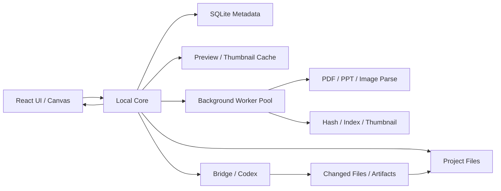
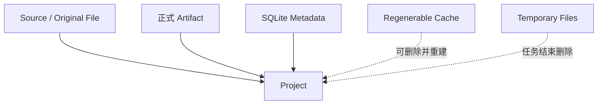
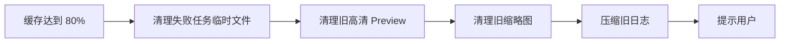
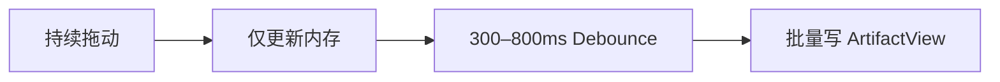
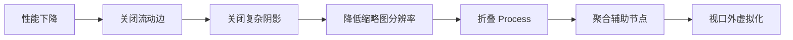
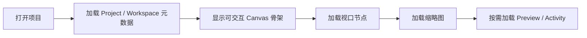

# Local Creative OS 存储、缓存与运行压力预算

> 文档性质：正式开发前的容量规划与性能基线  
> 适用架构：React Web UI + Local Core（Node.js）+ SQLite + 本地项目目录 + Bridge / Codex + 飞书等 Connector  
> 说明：以下数字是**开发预算与容量假设**，不是当前代码的实测值。正式数值必须通过 Canvas、文件解析和 Codex Runtime Spike 校准。

---

# 1. 结论摘要

这个项目本身不是典型的“高算力 AI 应用”。

如果 DeepSeek 等模型走 API、Codex 作为外部本地进程执行，主要压力来自：

1. Canvas 节点和连线渲染；
2. PDF / PPT / 图片的缩略图与预览生成；
3. 文件哈希、Watcher、索引与文本提取；
4. Run 日志、Context Snapshot 和版本信息增长；
5. Codex、Bridge、转换工具同时运行时的瞬时内存和 CPU；
6. 图片、PPT、视频等真实 Artifact 占用磁盘。

最危险的并不是 SQLite 数据库，而是：

- 把所有源文件复制进项目；
- 给所有页面永久生成高清预览；
- 在 Canvas 同时渲染大量复杂节点与动画连线；
- 多个解析、生成和 Codex 任务并发执行；
- 将缓存与正式 Artifact 混为一谈，导致不敢清理。

采用本文策略后，一个普通的 16GB 内存、SSD 的 Windows 笔记本可以承担个人 Alpha 和中等规模项目，但必须限制重任务并发，并对大型视频采用“链接而非复制”。

---

# 2. 运行架构与压力来源



## 2.1 前端压力

- 节点 DOM；
- React 状态更新；
- Canvas 平移与缩放；
- SVG 连线；
- 阴影、滤镜、流动高光；
- Inspector Preview；
- 缩略图解码；
- 大量节点选择与布局动画。

## 2.2 Local Core 压力

- 文件扫描与 Watcher；
- 路径、哈希与重复检测；
- SQLite 读写；
- PDF / PPT 转换；
- 缩略图与页面预览；
- Context Pack 组装；
- SSE / WebSocket；
- Bridge / Codex 子进程管理。

## 2.3 磁盘压力

- 原始文件；
- 可回滚 Revision；
- Generated Artifact；
- PPT / PDF 页面预览；
- 图片缩略图；
- Run 日志；
- Context Snapshot；
- Checkpoint Snapshot；
- 临时转换文件。

---

# 3. 项目规模分级

| 级别 | 典型对象规模 | 同屏节点 | 项目缓存 | 运行压力 | 建议 |
|---|---:|---:|---:|---|---|
| S 小型 | 50–150 Artifact | 20–40 | 100MB–1GB | 低 | Alpha 默认目标 |
| M 中型 | 150–600 Artifact | 40–80 | 1–5GB | 中 | 个人长期项目目标 |
| L 大型 | 600–2,000 Artifact | 80–150 简化节点 | 5–15GB | 中高 | 必须折叠、Stack、归档 |
| XL 超大 | 2,000+ Artifact 或大量视频 | 不应全量同屏 | 15GB+ | 高 | 分项目、Sub-canvas 或外部资产库 |

这里的 Artifact 数量包含来源、版本、AI 结果和过程索引，但不代表所有对象同时渲染。

---

# 4. 磁盘存储估算

## 4.1 轻量链接模式

源文件保持原位置，项目只保存：

- 路径；
- 哈希；
- Snapshot；
- 缩略图；
- 文本提取；
- 关系和运行记录；
- 新生成 Artifact。

### 预计单项目

| 内容 | 典型范围 |
|---|---:|
| SQLite + 元数据 | 5–100MB |
| 文本提取与 Context | 10–300MB |
| 缩略图 | 50–500MB |
| 页面预览 | 100MB–2GB |
| Run 日志与快照 | 20–500MB |
| 新生成文件 | 视项目而定 |
| 合计，不含原始文件 | 200MB–5GB |

普通广告项目应尽量控制在 **500MB–3GB 的项目管理与缓存数据**。

## 4.2 托管副本模式

若用户选择“复制进项目”，磁盘占用接近：

```text
项目占用
≈ 原始文件总量
+ Generated Artifact
+ Revision
+ Preview Cache
+ 运行记录
```

典型范围：

- PPT / PDF / 图片项目：1–20GB；
- 含大量 PSD、视频或高分辨率素材：20–200GB 以上；
- 视频不应默认复制和生成全量代理文件。

## 4.3 主要空间风险

1. PPT 每页生成高清 PNG；
2. PDF 同时保留原文件、页面图片和 OCR 中间文件；
3. AI 修改每次复制整个大文件；
4. Checkpoint 保存完整物理副本；
5. 视频自动生成代理和逐帧缩略图；
6. 转换失败留下临时文件。

---

# 5. 内存与 CPU 预算

以下是**设计预算**，需要通过 Spike 验证。

## 5.1 空闲与常规使用

| 进程 | 目标预算 |
|---|---:|
| Web UI 空闲 | 200–450MB |
| Web UI 中型 Canvas | 350–700MB |
| Local Core 空闲 | 80–250MB |
| Local Core 常规任务 | 150–500MB |
| 合计常规使用 | 600MB–1.5GB |

## 5.2 峰值使用

当 PPT 转换、图片解码、Codex 和浏览器同时运行：

| 场景 | 目标峰值 |
|---|---:|
| 单个 PDF / PPT 解析 | 500MB–1.5GB |
| 100–150 Canvas 节点 + Preview | 600MB–1.2GB |
| Codex / Bridge 执行 | 取决于外部进程，预留 0.5–2GB |
| 综合峰值 | 2.5–5GB |

因此：

- 16GB 内存可以开发和运行个人版本；
- 不应同时运行多个重型解析和多个 Codex 任务；
- 8GB 内存只适合轻量项目和低并发；
- 32GB 会明显改善大型 PPT、图片和多工具并行。

## 5.3 CPU 模型

| 场景 | CPU 压力 |
|---|---|
| Canvas 浏览 | 低到中，交互时突发 |
| SQLite / 元数据 | 低 |
| 文件 Watcher | 低 |
| 哈希 | 中，读取磁盘 |
| PDF / PPT 转换 | 中到高 |
| 缩略图 | 中到高 |
| OCR | 高 |
| API 模型调用 | 本地 CPU 低 |
| Codex 本地执行 | 任务相关，可高 |
| 动画边与复杂滤镜 | GPU / 主线程压力 |

---

# 6. 正式存储与缓存必须分开



## 6.1 永远不能自动清理

- 原始项目文件；
- 用户确认的 Generated Artifact；
- Current Revision；
- Checkpoint；
- Decision；
- Note；
- Run 结果索引；
- Source Snapshot 的必要追溯信息。

## 6.2 可以自动清理

- 缩略图；
- 页面预览；
- 转换中间文件；
- 下载缓存；
- 失败任务临时目录；
- 已重新生成的解析缓存；
- 旧的非必要调试日志。

## 6.3 只保留摘要

- 完整 AI 流式事件；
- 过旧 Run 调试日志；
- 长 Conversation 原始事件；
- 重复 Context 内容。

保留最终摘要、错误和可追溯 ID。

---

# 7. 推荐三级缓存

## L1：内存缓存

保存：

- 当前 Workspace；
- 当前视口节点；
- 选中与 Hover；
- 当前缩略图；
- 最近 Inspector 内容；
- 当前 Run 状态。

规则：

- 不保存完整项目 Graph 副本；
- Workspace 切换时复用；
- 设置对象数量和图片解码上限；
- 页面隐藏后释放高清预览。

## L2：本地磁盘缓存

保存：

- 缩略图；
- PDF / PPT 页面预览；
- 文本提取；
- 哈希；
- Connector Snapshot；
- 临时代理。

目录：

```text
.cache/
  thumbnails/
  previews/
  extraction/
  connectors/
  temp/
```

必须使用内容哈希命名，避免重复生成。

## L3：正式项目数据

```text
project/
  sources/
  documents/
  revisions/
  runs/
  checkpoints/
  artifacts/
```

缓存被清空后，L3 仍然能恢复完整项目。

---

# 8. 建议缓存预算

## 默认配置

| 项目 | 默认预算 |
|---|---:|
| 全局缓存上限 | 5GB |
| 单项目软上限 | 2GB |
| 缩略图缓存 | 500MB |
| 页面预览 | 3GB 全局共享 |
| 文本提取 | 500MB |
| Connector Snapshot | 500MB |
| 临时目录 | 任务结束清理，最多 1GB |
| 原始调试日志 | 30 天或 500MB |

提供三档：

```text
节省空间：2GB
平衡：5GB
大型项目：10GB
```

## 清理顺序



建议：

- 可用磁盘低于 10GB 时警告；
- 低于 5GB 时暂停生成大型 Preview；
- 永不自动删除正式 Artifact。

这些阈值是产品建议值，应允许用户配置。

---

# 9. 浏览器不能作为状态源

浏览器侧只适合保存：

- UI 偏好；
- 最近打开项目；
- Dock 状态；
- 临时草稿；
- 非关键会话状态。

不要使用 localStorage 保存项目 Graph、文件内容或 Run 数据。

原因：

- Web Storage 是同步 API，会阻塞 JavaScript；
- localStorage 和 sessionStorage 容量有限；
- 浏览器存储在空间压力下可能被清理；
- 浏览器缓存不应成为本地项目的唯一副本。

正式状态应写入：

```text
Local Core
→ SQLite
→ Project Directory
```

浏览器存储只做可丢失的界面缓存。

---

# 10. SQLite 策略

## 推荐

- SQLite 只保存元数据和关系；
- 大文件不放 BLOB；
- 使用 WAL；
- 单写者；
- 批量事务；
- 高频布局变化节流写入；
- 关闭应用前 checkpoint；
- 定期备份数据库和 Schema Version。

## 不要存入 SQLite

- 原始 PPT；
- PDF；
- 图片；
- 视频；
- 高分辨率 Preview；
- 大段二进制 Artifact。

## 布局保存

拖动节点时：



不要每个 Pointer Move 都写 SQLite。

## WAL 管理

- 不手动删除 `-wal`；
- 应用正常关闭；
- 在空闲或关闭时主动 checkpoint；
- 监控 WAL 异常增长；
- 备份时确保数据库与 WAL 状态一致。

---

# 11. Canvas 优化策略

React Flow 官方建议重点避免无关重渲染、折叠大型节点树，并简化动画、阴影和渐变。

## 节点预算

| 场景 | 策略 |
|---|---|
| 0–80 可见节点 | 完整节点 |
| 80–150 | 简化阴影、缩略图和关系 |
| 150–300 | 聚合、Stack、折叠 Process、视口外简化 |
| 300+ | 不允许全量完整渲染 |

## 边预算

- 同屏流动边最多 8–12 条；
- 只有选中关系和 active Run 使用流动高光；
- Zoom out 停止全部边动画；
- 非焦点边不使用 blur filter；
- 边宽使用 non-scaling stroke；
- Workspace 切换时先停动画，再移动相机。

## React 状态

- Node 组件 `memo`；
- 回调 `useCallback`；
- 配置对象 `useMemo`；
- Selection、Run 状态与全 nodes 数组分离；
- Inspector 不直接订阅全部 nodes；
- 高频 viewport 状态留在 Canvas store；
- 业务 Graph 由 Local Core Query 管理。

## 视觉降级顺序



---

# 12. 文件处理优化

## 原则

- 流式读取，避免整文件一次进入内存；
- 文件复制尊重 backpressure；
- CPU 密集转换放 Worker Pool 或子进程；
- I/O 使用异步流，不为普通文件 I/O 滥用 Worker；
- 每次只运行一个重任务；
- 轻任务并发最多 2–3 个；
- 每个任务有临时目录和取消信号。

## 并发限制

```text
Heavy Queue：1
- PPT / PDF 转换
- OCR
- 大图处理
- Codex 重型执行

Light Queue：2–3
- 哈希
- 缩略图
- 文本索引
- Connector Snapshot
```

不要让文件解析、Codex 和 50 张图片缩略图一起争夺笔记本风扇的尊严。

---

# 13. 预览策略

## 图片

- 缩略图：最长边 320–480px；
- Inspector Preview：最长边 1600–2048px；
- 原图只在用户打开时加载；
- 使用 Blob URL 后及时 revoke；
- 切换 Preview 后释放旧解码图。

## PDF / PPT

三级预览：

```text
Thumbnail：导航
Page Preview：Inspector
Original：原生工具
```

不要默认生成所有页面的高清 Preview。

生成顺序：

1. 首屏页面；
2. 可见页附近；
3. 用户停留时后台补齐；
4. 旧页面由 LRU 回收。

## 视频

Alpha：

- 只保存路径、封面和元数据；
- 不做完整代理；
- 不做逐帧索引；
- 使用原生播放器或外部工具；
- 视频能力后置。

---

# 14. Run、Context 与日志控制

## Run

Canvas 只显示：

- running；
- waiting_input；
- review；
- 最新 completed。

旧 Run 进入 Activity。

## Context

- 使用内容哈希去重；
- Snapshot 保存 ID、版本和必要摘要；
- 不重复复制完整源文件；
- Conversation 默认保存摘要；
- Debug 模式才保留完整请求和响应。

## 日志

建议：

```text
最近 30 天：原始日志
30–180 天：压缩日志
长期：Run 摘要、错误、Changed Files、Context IDs
```

敏感 Context 不应永久写入普通日志。

---

# 15. 启动与恢复策略

## 项目打开时



不要启动时加载：

- 所有文件预览；
- 所有历史 Run；
- 所有关系详情；
- 全部 Conversation；
- 所有 Checkpoint Snapshot。

## 目标预算

- 1 秒内显示 App Shell；
- 3 秒内 Canvas 可交互；
- 当前 Workspace 先恢复；
- Preview 渐进加载；
- 后台索引不阻塞操作。

---

# 16. 性能预算建议

## UI

| 指标 | Alpha 目标 |
|---|---:|
| App Shell 可见 | ≤1s |
| Canvas 可交互 | ≤3s |
| 单击反馈 | ≤100ms |
| Workspace Camera | 320–520ms |
| 常规可见节点 | ≤80 |
| 简化可见节点 | ≤150 |
| 流动边 | ≤12 |
| UI 常规内存 | ≤700MB |

## Local Core

| 指标 | Alpha 目标 |
|---|---:|
| 空闲内存 | ≤250MB |
| 普通任务内存 | ≤500MB |
| 同时 Heavy Task | 1 |
| 同时 Light Task | 2–3 |
| 搜索常规响应 | <500ms |
| Run 状态延迟 | 秒级 |
| 日志 / SQLite 写入 | 批量、非高频 |

## 磁盘

| 指标 | 默认 |
|---|---:|
| 全局 Cache | 5GB |
| Cache 警告 | 80% |
| 磁盘警告 | 剩余 <10GB |
| 暂停大型缓存 | 剩余 <5GB |
| 临时目录 | 任务结束清理 |

---

# 17. 开发前必须做的容量 Spike

## Canvas Spike

测试：

- 20 / 80 / 150 / 300 节点；
- 20 / 100 / 300 边；
- 无动画 / 12 条动画 / 全动画；
- 关闭 / 开启阴影；
- 单击、双击、拖动、Workspace 切换。

## File Spike

测试：

- 100MB PDF；
- 100 页 PPT；
- 50 张高分图；
- 同目录 1,000 文件；
- 哈希、Watcher、缩略图和 Preview。

## Runtime Spike

测试：

- UI + Local Core；
- Bridge + Codex；
- 同时运行缩略图任务；
- waiting_input；
- 取消；
- 断线恢复；
- 内存峰值和临时文件清理。

## Long-running Spike

连续运行 4–8 小时：

- 反复切 Workspace；
- 执行 20 次 Run；
- 导入 / 删除 / 恢复；
- 检查内存泄漏；
- 检查 WAL；
- 检查临时目录；
- 检查 Blob URL 和子进程残留。

---

# 18. 最终建议

## 可以在开发前锁定

- 三级缓存模型；
- 5GB 默认缓存预算；
- 正式数据与缓存分离；
- 原始文件默认链接；
- SQLite 只存元数据；
- Heavy 任务并发为 1；
- 80 个完整可见节点预算；
- 150 个简化节点上限；
- 持续动画边不超过 12；
- 视频只链接和封面；
- 旧 Run 与历史按摘要归档；
- 低磁盘警告和自动清理顺序。

## 不能仅靠文档锁死

- 300 节点是否流畅；
- 单个 PPT 解析峰值；
- Codex 实际进程内存；
- React Flow 复杂滤镜表现；
- 飞书 Snapshot 大小；
- Windows 不同机器上的文件 Watcher 成本。

这些必须通过 Spike 得到实测基线。

---

# 19. 一句话判断

> Local Creative OS 在个人项目范围内不是“算力怪兽”，但它很容易变成“缓存和并发怪兽”。开发前把正式数据、可再生缓存、临时文件和外部原始资产彻底分开，再限制 Canvas 同屏复杂度和重任务并发，16GB 内存的小型本地设备就能稳定承担 Alpha 与中等项目。
