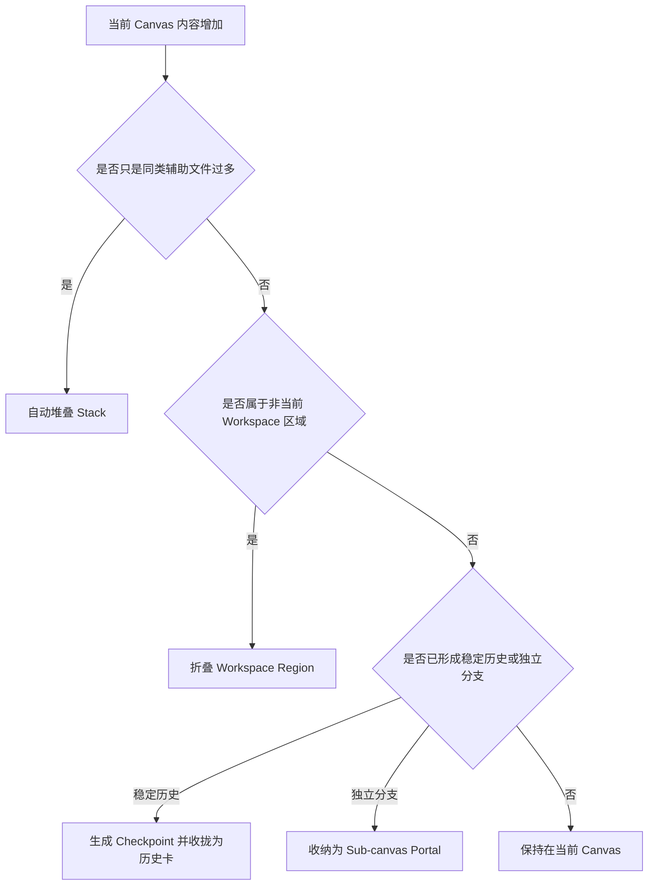
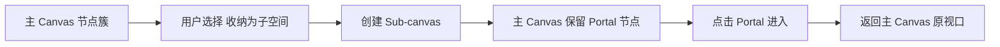
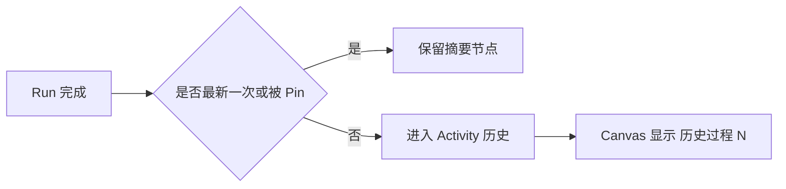
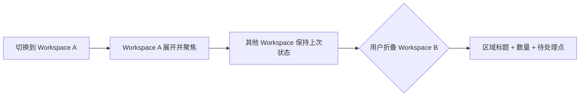
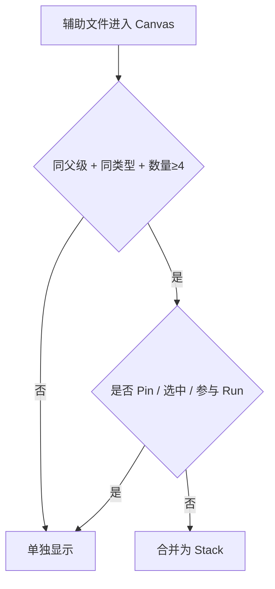
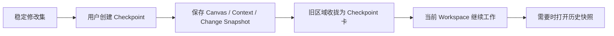
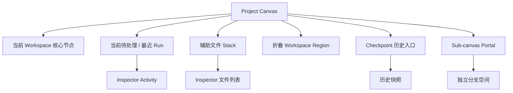

# Local Creative OS UI 信息密度补充决策

> 适用文档：`Local Creative OS UI & Interaction Spec v0.1`  
> 目标：用最少的界面元素控制单张 Project Canvas 的长期膨胀，同时保留来源、过程、历史与分支的可追溯性。

---

## 1. 总原则

采用一套统一的三级压缩机制：



界面默认只展示：

- 当前 Workspace 的核心内容；
- 最近或待处理的 Process；
- 当前任务相关关系；
- 尚未确认的 AI Artifact；
- 需要用户决策的内容。

---

# 2. 五项正式决策

## 2.1 Sub-canvas：保留，但不作为常驻结构

### 结论

**保留 Sub-canvas，但只作为“用户主动创建的分支收纳空间”。**

不自动生成，不进入永久导航，不在 MVP 默认态出现。

### 创建条件

满足任一条件时，系统才建议：

- 一个节点簇形成独立方向或长期专题；
- 节点簇超过 12–16 个且关系相对独立；
- 用户明确执行“收纳为子空间”；
- 当前分支不再需要与主 Canvas 高频并排比较。

### 前端表现

主 Canvas 只保留一个 `Sub-canvas Portal`：

```text
Thinker 视觉探索
12 个对象 · 3 个 Run · 1 个版本
```

点击进入该分支空间；返回后恢复主 Canvas 镜头。

### 流程



---

## 2.2 旧 Run：自动归档为“过程摘要”

### 结论

Canvas 只保留：

- 正在运行；
- 等待输入；
- 等待 Review；
- 最近一次 Completed Run。

更旧 Run 自动进入关联对象或 Workspace 的过程历史。

### 默认表现

在相关 Artifact 下方显示一条摘要：

```text
历史过程 · 8 次 Run
最近完成：脚本修改 V4
```

点击后在 Inspector 的 Activity 模式中展开。

### 归档规则

- `running / waiting_input / review` 永远可见；
- 最新一条 `completed` 保留；
- 更早的 `completed / failed / cancelled` 自动归档；
- 用户 Pin 的 Run 不归档；
- Checkpoint 引用的 Run 永久可追溯，但不常驻 Canvas。

### 流程



---

## 2.3 Workspace 区域：允许折叠

### 结论

**允许折叠非当前 Workspace 区域；当前 Workspace 不折叠。**

折叠不是删除节点，也不是移动文件，只是隐藏该区域的 Artifact View。

### 折叠后表现

区域收拢为一个轻量区域标题：

```text
第二轮客户反馈
18 个对象 · 2 个待处理 · 1 个新 Artifact
```

保留：

- Workspace 名称；
- 对象数；
- 待处理点；
- 最近变化提示；
- 展开按钮。

不显示内部节点名和缩略图。

### 自动行为

- 切换 Workspace 时，当前区域自动展开；
- 其他区域保持用户上次折叠状态；
- Project Overview 可显示所有区域轮廓；
- Mini-map 保留折叠区域的低饱和位置块。

### 流程



---

## 2.4 辅助文件：满足条件后自动堆叠

### 结论

同类辅助文件在默认视图中使用 `Stack`，避免缩略图铺满 Canvas。

### 自动堆叠条件

同时满足：

- 同一父对象或同一关系来源；
- 同一文件类型或同一语义类别；
- 数量达到 4 个及以上；
- 当前未被选中、Pin 或单独参与 Run。

### 示例

```text
视觉参考 · 9
PPT 页面 · 14
客户反馈附件 · 6
历史脚本 · 5
```

Stack 显示：

- 顶部代表缩略图；
- 数量；
- 类型；
- 最近更新；
- 是否有待处理内容。

### 展开方式

- 单击：展开轻量扇形 / 网格预览；
- 双击：Inspector 打开完整列表；
- Pin：将单个文件从 Stack 中拆出；
- 参与 Run 的文件自动暂时拆出。

### 流程



---

## 2.5 历史区域：允许冻结，但必须通过 Checkpoint

### 结论

**不提供任意“冻结 Canvas 区域”功能。**

历史冻结统一通过 `Checkpoint` 完成，避免同时出现“冻结区、版本区、历史区”三套相似概念。

### 行为

用户创建 Checkpoint 后：

- 保存 Canvas Snapshot；
- 保存 Context Snapshot；
- 保存 Change Set；
- 保存关联 Run；
- 当前稳定区域可收拢为一个 Checkpoint 卡；
- 原始节点仍可从版本视图恢复查看。

### Canvas 表现

```text
Checkpoint · Client Review V2
2026-07-18
21 个对象 · 5 项变化 · 3 个交付文件
```

Checkpoint 卡默认只作为历史入口，不和当前工作节点混排。

### 流程



---

# 3. 最终界面层级



---

# 4. 信息密度优先级

默认 Canvas 从高到低展示：

1. 当前正在处理的 Artifact；
2. 尚未确认的 Generated Artifact；
3. waiting_input / review 状态；
4. 当前任务的 Source 与 Context；
5. 最近一次 Completed Run；
6. Decision / Locked；
7. 辅助文件 Stack；
8. 折叠 Workspace；
9. Checkpoint；
10. 旧 Run 与完整历史。

---

# 5. 一句话规则

> 当前内容留在 Canvas，辅助内容堆叠，非当前区域折叠，旧过程进入 Activity，稳定历史收拢为 Checkpoint，独立分支才进入 Sub-canvas。
