# Local Creative OS UI & Interaction Spec v0.1 — 开发 PM 评审

> 评审对象：`Local_Creative_OS_UI_Visual_Interaction_Spec_v0.1`  
> 评审角色：资深项目开发 PM  
> 评审结论：**通过进入高保真验证；工程实现有条件通过。**

---

## 1. 总体判断

这份前端规范比上一版 PRD 更进一步，因为它把抽象产品模型真正压进了一套可以被设计和工程讨论的 UI 语法：

- 一个 Project 对应一张持续存在的大 Canvas；
- Project Tabs 只负责切换项目；
- Workspace 不再是页面，而是同一 Canvas 上的 Semantic Viewport；
- Inspector 默认关闭，只在需要解释关系、预览、Context 或 Activity 时打开；
- Mini-map 只负责物理定位；
- 文件、AI 结果、Context、Run 和 Decision 使用不同节点语法；
- 单击看状态，双击看关系，原生编辑通过显式入口；
- Command Node 使用渐进披露；
- Artifact Return、Run、Checkpoint 和 Delivery 有明确状态与落位。

这说明前端讨论已经从“页面长什么样”进入“产品如何被理解和操作”。

综合评分：

| 维度 | 评分 |
|---|---:|
| 产品模型一致性 | 9.2 / 10 |
| 信息架构 | 9 / 10 |
| 交互语义 | 9 / 10 |
| 视觉方向 | 8.5 / 10 |
| 状态完整性 | 9 / 10 |
| 工程可实现性 | 7.5 / 10 |
| 首版范围控制 | 7 / 10 |
| 当前可进入高保真程度 | 8.8 / 10 |

---

## 2. 这次已经解决的问题

### 2.1 解决永久三栏问题

旧 Demo：


新方案：

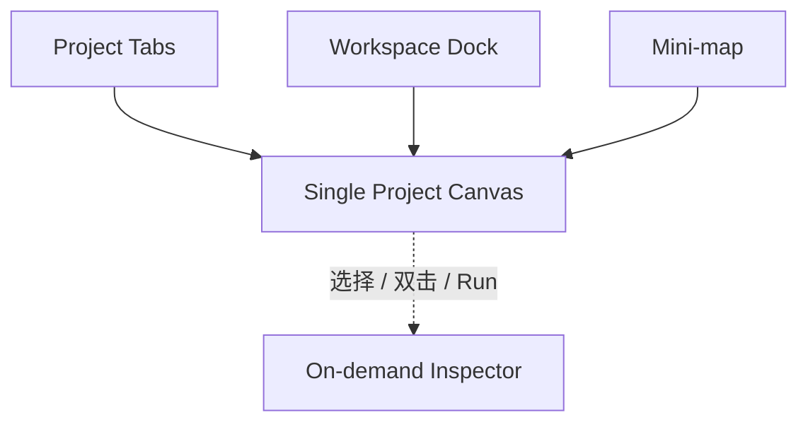

默认只常驻 Tabs、Dock、Canvas 和 Mini-map，Inspector 关闭，Canvas 保留 80% 以上面积。

### 2.2 Workspace 定义终于稳定

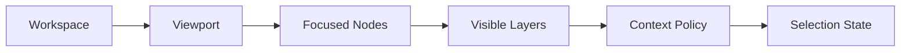

Workspace 不再跳转页面，也不再创建新的 Project Graph。

### 2.3 节点来源与过程分开

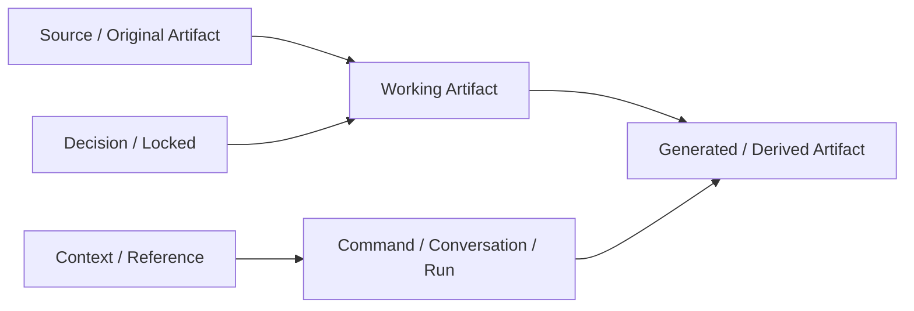

这与 Local Creative OS 的核心原则一致：

- 原始来源不能和 AI 结果混淆；
- AI 结果在确认前保持 Draft；
- Process 默认折叠；
- 人工 Decision 拥有独立视觉语义。

### 2.4 节点交互不再互相争夺

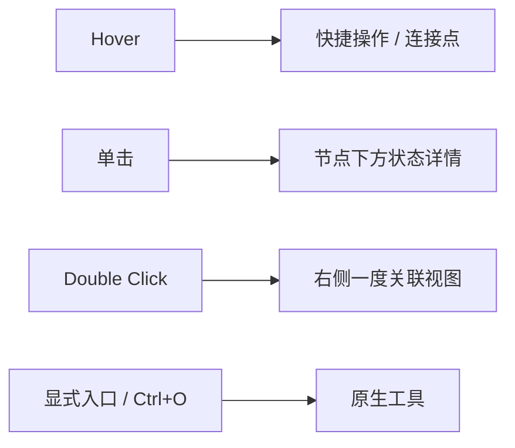

这是一个清晰、可记忆、符合渐进披露的交互系统。

---

## 3. 最值得保留的设计决定

1. **Project Tab 只代表项目。**
2. **Workspace = Semantic Viewport。**
3. **一张 Project Canvas，而非每个 Workspace 一张独立 Canvas。**
4. **默认态安静，Inspector 默认关闭。**
5. **Source、Generated、Context、Process、Decision 使用不同结构。**
6. **Workspace 色与节点分类色分离。**
7. **单击状态、双击关系、原生工具显式打开。**
8. **一度关系默认，二度关系显式展开。**
9. **Command 默认只显示一句指令、Context 摘要和 Run。**
10. **Artifact Return 有明确父节点、Run 和版本来源。**
11. **Activity、Revision、Checkpoint、Delivery 分层。**
12. **Liquid Chrome 只用于极少数关键操作。**

---

# 4. 必须在高保真前解决的关键问题

## 4.1 同一 Artifact 被多个 Workspace 引用的空间语义

当前定义同时包含：

- 一个 Project 一张 Canvas；
- Workspace 只切镜头；
- 同一 Artifact 可被多个 Workspace 引用。

必须明确到底是哪一种：

### 方案 A：同一个 Artifact View 被多个 Workspace 聚焦

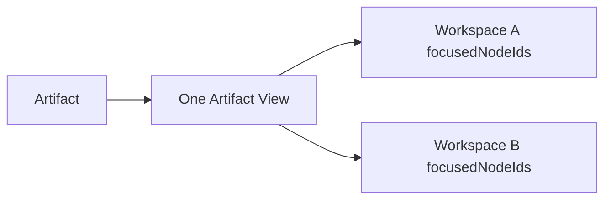

优点：不重复节点。  
问题：一个节点只能有一个物理位置，可能无法同时符合多个 Workspace 的空间组织。

### 方案 B：同一个 Artifact 有多个 Artifact View

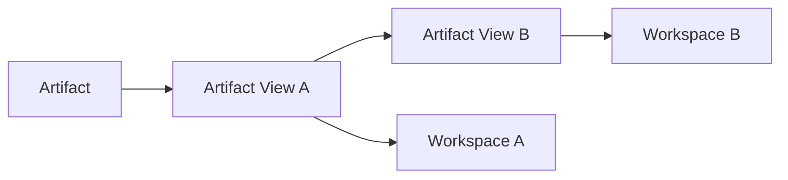

优点：每个 Workspace 可独立组织。  
问题：同一张 Canvas 上会出现多个看起来相似的节点，需要明确“这是引用，不是副本”。

### 建议

正式采用方案 B，但必须：

- 节点显示引用标记；
- 双击关系时归并到同一 Artifact；
- 内容更新同步所有 View；
- 删除 View 不删除 Artifact；
- Mini-map 可将多个 View 视为不同位置。

---

## 4.2 快捷键冲突

当前文档中：

- `Space` 用于快速 Preview；
- `Space + Drag` 用于 Canvas 平移；
- `Cmd/Ctrl + Enter` 既可能创建 Command，又可能打开关联。

必须消除冲突。

建议：

| 操作 | 建议 |
|---|---|
| 快速 Preview | 按住 Space，节点已 Hover / Selected 时生效 |
| Canvas 平移 | Space + Pointer Down 后优先进入 Pan |
| 创建 Command | `C` 或 `Cmd/Ctrl + Shift + Enter` |
| 打开关联 | `Enter` 或双击 |
| 执行 Run | Command 内 `Cmd/Ctrl + Enter` |
| 打开原生工具 | `Cmd/Ctrl + O` |

优先级流程：

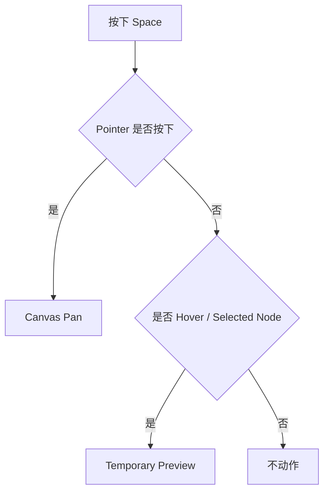

---

## 4.3 一张大 Canvas 的失控边界

单 Canvas 是正确方向，但必须定义何时不再继续扩张。

建议建立三个阈值：

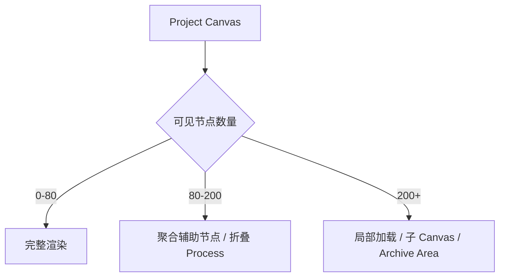

需要在高保真阶段确定：

- Sub-canvas 是否保留；
- Archive Area 如何表现；
- Workspace 区域是否可以折叠；
- 同类辅助文件何时叠放；
- 旧 Run 和 Conversation 何时归档。

---

## 4.4 视觉编码维度过多

当前同时存在：

- Workspace Intent 色；
- 节点分类色；
- Run 状态色；
- Warning 色；
- 关系类型线型；
- Liquid Chrome；
- Iridescent Token；
- 文件缩略图真实色彩。

如果不排序，会让“克制”只停留在文档里。

建议视觉优先级：

```text
1. 文件缩略图 / 内容本身
2. 节点结构与图标
3. 节点分类细边或小标
4. Workspace 环境光
5. 状态色只用于异常或待处理
6. 虹彩只用于激活点
7. 液态铬只用于唯一主操作
```

Figma 高保真必须至少做一个“关闭所有语义色”的灰度检查，确认结构仍然能区分对象。

---

## 4.5 过早精确的性能和动效指标

以下参数适合作为假设，不应在高保真前成为硬承诺：

- 100–300 个可见节点保持流畅；
- 所有流动银线 8–12 秒持续循环；
- 复杂 SVG filter；
- Rich shadow + inset + iridescent + animated edges 同时存在。

建议先做工程 Spike：

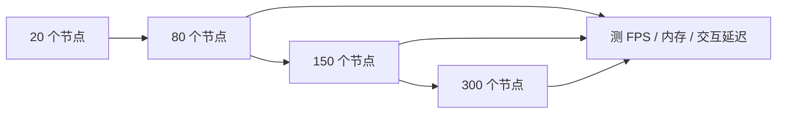

高保真稿可以展示动效意图，但 React 工程需有性能降级：

- Zoom out 关闭复杂阴影；
- 非选中边停止流动；
- 过程节点折叠；
- 视口外节点简化；
- reduced-motion 关闭所有持续动画。

---

## 4.6 Command Node 仍需一轮真实任务测试

默认结构已经比 PRD 收敛很多，但需要用三个真实任务验证：

1. 单文件修改；
2. 多文件 Context 生成；
3. waiting_input 补充与继续。

理想默认流程：

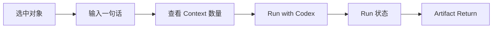

高级设置不应成为每次任务必经步骤。

---

# 5. 与 PRD 的一致性判断

## 完全一致

- Workspace 不是固定业务阶段；
- Canvas 不承担内容编辑；
- Context 可解释；
- Bridge / OS 保存状态；
- AI 不覆盖人工判断；
- Artifact Return 可追溯；
- 原生工具优先；
- 默认界面低密度。

## 这次比 PRD 更清楚

- Workspace 被正式定义为 Semantic Viewport；
- 项目与 Workspace 的层级不再混淆；
- 单击 / 双击 / 原生打开职责分开；
- Inspector 的触发规则明确；
- 节点正面信息被限制；
- Liquid Chrome 使用范围受控；
- 默认态不靠打开所有边栏展示能力。

## 仍需回写 PRD

- “一个 Project 一张 Canvas”的正式决定；
- Workspace 不再是独立 Canvas；
- 三种主视图是否取消或推迟；
- Artifact 与 Artifact View 的多 Workspace 规则；
- 单击状态 / 双击关联的正式交互；
- 创建项目后不设独立上传页；
- Inspector 默认 Overlay；
- Command 的渐进披露。

---

# 6. 高保真验证顺序

不要一口气画完 32 页所有状态。

## Round 1：标准默认态

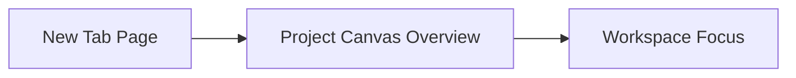

验证：

- 视觉气质；
- Project Tabs；
- Workspace Dock；
- 5–8 个内容节点；
- Mini-map；
- Inspector 关闭状态。

## Round 2：节点语法

验证：

- Source；
- Working；
- Generated Draft；
- Context；
- Run；
- Decision；
- 单击详情。

## Round 3：关系与 Inspector

验证：

- 双击节点；
- 一度关联；
- Relation → Preview；
- Context；
- Activity；
- Compare。

## Round 4：真实闭环

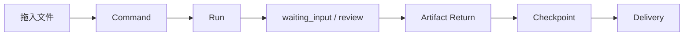

---

# 7. 工程开始条件

前端工程只能在以下条件满足后进入正式封装：

1. Workspace 与 Artifact View 规则确认；
2. 快捷键冲突解决；
3. 单 Canvas 扩张边界确认；
4. 默认态高保真通过；
5. 六类节点灰度仍可区分；
6. Inspector 五种模式完成；
7. Command 三类真实任务完成交互验证；
8. Artifact Return 落位规则确认；
9. 性能 Spike 有基线；
10. PRD 回写完成。

---

# 8. 最终评审结论

## 产品模型

**通过。**

## 前端信息架构

**通过。**

## 视觉方向

**有条件通过。**

条件是减少视觉编码叠加，并通过灰度与低动效版本验证。

## 高保真阶段

**可以立即进入。**

但先做四轮核心状态，不做所有边角状态。

## React 工程实现

**有条件进入。**

可以先搭：

- App Shell；
- Project Tabs；
- Workspace Dock；
- Canvas 基础；
- Mini-map；
- 节点基础语法。

暂不应直接实现：

- 全部复杂 Inspector；
- 全状态 Command；
- 全量动态边；
- 300 节点性能承诺；
- Checkpoint / Delivery 完整系统。

---

# 9. 一句话结论

> 这份前端规范已经把 Local Creative OS 从“产品概念”推进到了“可验证的交互系统”。下一步不是继续补文档，而是用真实 PortaSplit 项目验证 Workspace 镜头切换、节点语法、关系视图和 Command → Run → Artifact Return 是否真的顺手。
