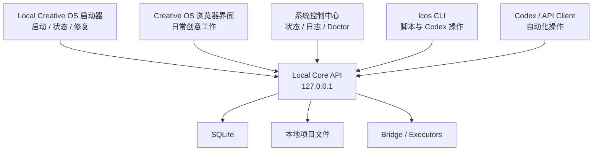

# Local Creative OS：启动器、Local Core 页面、API 与 CLI 的关系

## 先说人话

可以，而且这个方向很合理。

现在的 Local Core Diagnostics 页面，未来可以演变成 Local Creative OS 的“系统控制中心”。

但要注意：

> 页面不是 API 本身。  
> Local Core 才是真正入口，启动器、浏览器页面、CLI、Codex 都只是它的不同操作方式。

## 推荐最终结构



## 1. 启动器应该做什么

启动器保持简单，不要再造一个完整后台管理系统。

启动器只显示：

- Local Core 是否在线；
- Bridge 是否在线；
- 当前版本；
- 当前项目；
- 启动 / 停止 / 重启；
- 打开 Local Creative OS；
- 打开系统诊断；
- 运行 Doctor；
- 查看日志；
- 检查更新。

理想体验：

```text
双击启动器
→ 自动启动 Local Core
→ 自动检查 Bridge
→ 显示“系统正常”
→ 打开浏览器工作界面
```

启动器里可以嵌入一个简化版状态面板，但不要把现在整张 Diagnostics 页面原样塞进去。

## 2. 当前 Local Core 页面怎么演变

现在的 `/dev/runtime` 保留为开发诊断页。

后面可以增加一个更简洁的正式入口：

```text
/system
```

普通用户看到：

- 系统正常 / 异常；
- 当前项目；
- 数据库状态；
- 最近一次保存；
- Bridge 状态；
- 快速修复；
- 打开日志。

开发者模式展开后才看到：

- Endpoint；
- latency；
- error code；
- test report；
- migration；
- request log；
- fixture / runtime origin。

也就是：

```text
普通模式：只告诉用户能不能用
开发模式：告诉开发者哪里坏了
```

## 3. Codex 和 API 怎么接入

Codex 不应该操作这个网页，也不应该靠点击按钮控制 OS。

正确方式是：

```text
Codex
→ CLI 或 Local Core API
→ Local Creative OS
```

例如：

```text
Codex
→ lcos projects list
→ lcos project open <id>
→ lcos workspace inspect <id>
→ lcos health
```

或者直接调用版本化 API：

```text
GET /api/v1/health
GET /api/v1/projects
GET /api/v1/projects/:id
POST /api/v1/projects/:id/checkpoints
```

浏览器、CLI 和 Codex 使用同一套 Contracts，避免三套系统各自发明一种“项目”的含义。

## 4. 是否需要自己的 CLI

需要，但先做小，不要现在顺手造一个完整终端产品。

建议名称：

```text
lcos
```

第一批命令只做系统管理：

```text
lcos status
lcos start
lcos stop
lcos restart
lcos doctor
lcos logs
lcos open
lcos projects list
lcos project inspect <id>
```

后续再增加：

```text
lcos workspace list
lcos artifact inspect
lcos checkpoint create
lcos run create
lcos run cancel
```

CLI 的价值：

- Codex 更容易调用；
- 自动化脚本更稳定；
- 不需要操作网页；
- 可以留下清晰日志；
- 用户排错更容易；
- 启动器也可以复用同一套命令。

## 5. 启动器、CLI 和 API 的分工

### 启动器

给普通用户。

```text
点一下就启动
看状态
打开网页
修复常见问题
```

### 浏览器

给创意工作。

```text
Project
Workspace
Canvas
Command
Review
Artifact
```

### 系统诊断页

给排错和维护。

```text
Health
Database
Bridge
Logs
Migration
Tests
```

### CLI

给 Codex、开发者和自动化脚本。

```text
精确命令
结构化输出
可重复执行
```

### Local Core API

所有入口背后的统一能力。

```text
唯一真实后端
统一 Contract
统一权限
统一日志
```

## 6. 当前阶段怎么处理

现在不要立刻把启动器和 CLI 塞进 Phase 2。

Phase 2 仍然只负责：

```text
项目数据写入 SQLite
→ 关闭
→ 重启
→ 恢复
```

但现在就应该冻结一个原则：

> Local Core API 是统一入口，未来 Launcher、Browser、CLI、Codex 都通过它操作系统。

推荐安排：

```text
Phase 2
先完成持久化

Phase 2.5
做 CLI 最小骨架
status / doctor / open / projects list

Phase 3 之后
做启动器 MVP
启动 / 停止 / 状态 / 打开网页 / 日志

Phase 5
CLI 接入 Bridge Run
```

## 7. 最终建议

当前 Diagnostics 页面不要废弃。

它应该拆成两层：

```text
/dev/runtime
开发者完整诊断

/system
普通用户简化控制中心
```

启动器只展示 `/system` 的摘要状态，并提供打开完整诊断的入口。

Codex 默认走 CLI，复杂集成走 Local Core API，不走网页自动点击。

## 一句话结论

> 现在的 Local Core 页面，可以发展成未来启动器背后的系统控制中心；同时建立自己的 `lcos` CLI，让 Codex、脚本和 API 客户端通过统一 Local Core Contract 操作 Local Creative OS。
