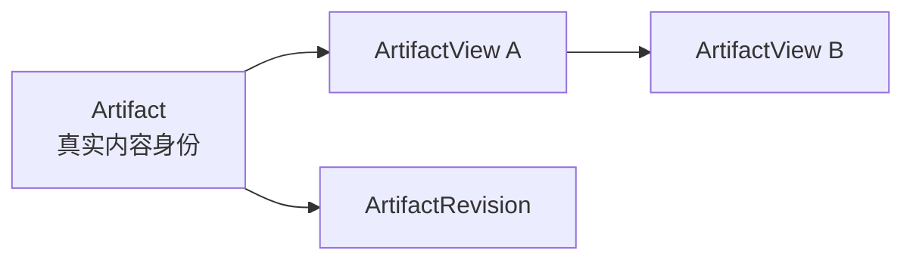
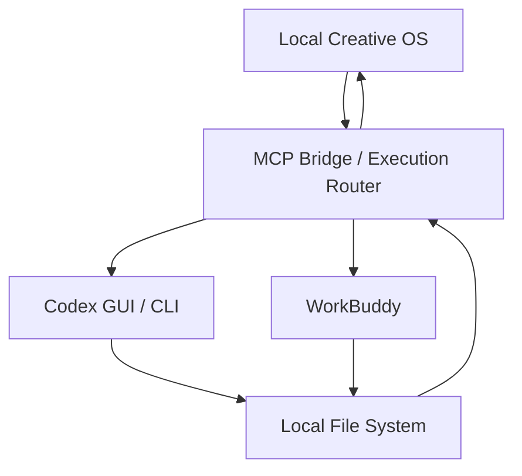
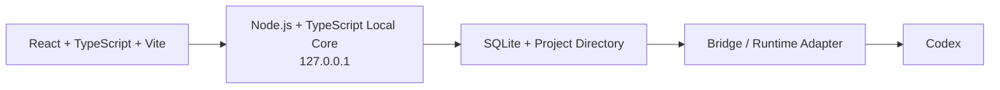

# Local Creative OS

> Canvas 型个人创意项目操作系统
> 当前阶段：正式开发前基线冻结、技术 Spike 与 Sprint 0
> 当前原则：先验证真实闭环，再扩展完整平台。

## 当前 MVP V1 执行入口

`codex/mvp-fast-build` 必须先阅读并遵循：

- [`MVP_V1_EXECUTION_README.md`](./MVP_V1_EXECUTION_README.md)

当前开发按“真实输入 → 项目理解 → 文件演化 → AI 执行 → 结果回收”五个纵向
Slice 推进，不再按旧 Stage 编号回退或以 Fixture 能力代替 Runtime 真相。

## 1. 项目定位

Local Creative OS 是一个以 **Project + 单张持续 Canvas** 为工作容器、以 **Workspace** 为语义视角、以本地项目上下文为核心、由 Codex / Buddy 等执行者完成真实任务的个人 Creative OS。

它不替代 PowerPoint、Figma、Canva、飞书、Notion、图片编辑器或视频编辑器。

它负责：

- 看资料；
- 形成判断；
- 组织可追溯 Context；
- 创建 Command；
- 派发真实 Run；
- 追踪执行状态；
- 回收 Changed Files / Artifact；
- 管理 Revision、Checkpoint 与交付。

一句话：

> Local Creative OS 不直接制作内容，而是让用户在一个持续项目空间中看懂内容、形成判断、派发任务，并把过程与结果重新归位。

---

## 2. Alpha 要证明什么

Alpha 只验证一条真实闭环：


Alpha 成功口径：

- 5 次真实 Codex Run 中至少 4 次结果正确回到项目；
- 从选中文件到创建 Run 不超过 3 个核心动作；
- 用户能查看本次 Run 使用了哪些资料；
- 不打开文件系统也能找到 Changed File；
- 关闭重开后恢复 Workspace、视口和待确认 Run；
- 用户无需说明即可区分 Source、AI Draft、Run 与 Decision。

---

## 3. Alpha 范围

### 必做

- 一个本地 Project；
- 一张持续存在的 Project Canvas；
- 2–3 个 Workspace，作为同一 Canvas 的 Semantic Viewport；
- MD、图片、PPT 输入；
- Artifact、ArtifactView、ArtifactRevision；
- 基础 Relation；
- Preview；
- 文件级备注；
- PPT / PDF 当前页级备注；
- 在原生工具中打开；
- Command 最小版；
- Context Lens；
- Bridge / Codex 真实 Run；
- `queued / running / waiting_input / review / completed / failed`；
- Changed Files；
- Artifact Return；
- 人工 Accept / Retry；
- 手动 Checkpoint；
- 项目关闭与恢复。

### Alpha 不做

- 三视图完整实现；
- 飞书写回和变化监听；
- Notion；
- Buddy 深度集成；
- Delivery Bundle 完整系统；
- 跨项目搜索；
- 自动整理本地目录；
- 自动版本建议；
- Figma / Canva 直接执行；
- 多人协作；
- Electron / Tauri；
- 插件市场；
- 多 Agent 自由编排；
- 视频逐帧、完整代理与画面级 Diff。

---

## 4. 冻结产品模型

### 4.1 Project

Project 是唯一正式项目身份。

一个 Project 对应：

- 一个本地根目录；
- 一张持续存在的 Project Canvas；
- 一套 Project Graph；
- 多个 Workspace；
- 多个 Artifact、Run、Revision 与 Checkpoint。

### 4.2 Workspace

```text
Workspace = Semantic Viewport
```

Workspace 不是页面、路由、独立 Canvas、独立 Graph、真实文件夹或 Codex / Buddy GUI Project。

Workspace 保存：

- viewport；
- zoom；
- focusedNodeIds；
- visibleLayers；
- layoutPreset；
- contextPolicy；
- selectionState；
- 可选 intent。

`intent` 为可选元数据，可为空、修改和移除，只影响推荐与环境，不限制能力。

### 4.3 Artifact 与 ArtifactView



规则：

- 一个 Artifact 可以拥有多个 ArtifactView；
- 默认一个 Artifact 在同一 Workspace 中只有一个 View；
- 重复拖入时定位已有 View；
- 用户明确“创建额外引用”时才增加第二个 View；
- View 保存独立位置、尺寸、展示状态和可选锁定 Revision；
- 删除 View 不删除 Artifact；
- Artifact Note 对所有 View 可见；
- ArtifactView Note 只在当前引用位置可见。

### 4.4 Run 与 Conversation

Alpha 关系：

```text
Conversation : Run = 1 : N
Run : External Thread = 1 : 1
```

OS / Bridge 保存 Run 真相。Codex GUI Thread 或 Buddy Task 只是执行会话，不是项目状态源。

### 4.5 Checkpoint

Checkpoint 属于 Project，可记录：

- 当前 Workspace；
- Canvas Snapshot；
- Context Snapshot；
- Change Set；
- 关联 Run；
- 选中对象；
- 可选 Delivery Snapshot。

稳定历史统一收拢为 Checkpoint，不再创建另一套“冻结区域”。

---

## 5. UI 与交互冻结决策

### 5.1 App Shell

默认常驻：

- Project Tabs；
- Workspace Dock；
- Canvas；
- Mini-map。

Inspector 默认关闭，按需 Overlay。Canvas 保持主要可用面积。

### 5.2 节点交互

- Hover：少量快捷操作与连接锚点；
- 单击：打开屏幕坐标状态 Overlay；
- Enter：打开 / 收起选中节点状态；
- 双击：打开一度关系；
- `C`：创建 Command；
- Command 内 `Cmd/Ctrl + Enter`：执行 Run；
- `Cmd/Ctrl + O`：打开原生工具；
- `Esc`：按优先级逐级退出；
- 低于 40% Zoom 时，单击默认只选中，Enter 可强制打开紧凑详情。

状态 Overlay 必须通过 Portal 渲染，不进入 React Flow / ELK / Mini-map 布局。

### 5.3 Inspector

Inspector：

- 单实例；
- 默认关闭；
- 局部导航栈；
- 模式包括 Relation、Preview、Context、Activity、Compare；
- 一次只呈现一个主要模式；
- Compare 只扩展当前 Inspector；
- Workspace 切换时关闭或重置；
- Esc 按局部栈逐级退出。

### 5.4 Artifact Return

正式落位顺序：

```text
Target → Working → Run → Pending Return Zone
```

Target 与 Context 必须分离。返回 Artifact 在用户确认前保持 Draft / Pending，不自动成为 Current。

### 5.5 信息密度

> 当前内容留在 Canvas，辅助内容堆叠，非当前区域折叠，旧过程进入 Activity，稳定历史收拢为 Checkpoint，独立分支才进入 Sub-canvas。

- 同类辅助对象数量达到 4 个且未被选中、Pin 或参与 Run 时进入 Stack；
- 当前 Workspace Region 展开；
- 非当前 Region 可折叠；
- Canvas 只保留 active Run 与最近 completed；
- 更旧 Run 进入 Activity；
- Sub-canvas 仅用户主动创建，Alpha 默认不出现。

---

## 6. 系统职责



- OS 管项目、Workspace、Artifact、Context、关系、版本和 UI；
- Bridge 管 Run、状态、事件、执行者、Changed Files 与 Artifact Return；
- Codex / Buddy GUI 管执行会话；
- 文件系统保存真实内容；
- GUI 项目名称不能成为数据主键；
- Workspace 不映射为 GUI Project 或真实目录。

---

## 7. 建议技术架构



建议组件：

- Canvas：`@xyflow/react`；
- 自动布局 Spike：ELK.js，只计算坐标；
- UI 本地交互：Zustand；
- Local Core 数据：TanStack Query；
- 实时状态：SSE 优先，必要时 WebSocket；
- 预览：图片 / Markdown / PDF.js；PPT 通过本地转换生成缩略图或 PDF；
- 数据库：SQLite，WAL，元数据与关系，不存大 BLOB；
- Bridge：复用现有任务闭环，逐步补充 Project、Context、waiting_input 与结构化 Artifact Return。

以上是架构基线，不代表允许一次引入全部依赖。新增依赖必须在获批 Sprint 中说明理由。

---

## 8. 目标仓库结构

```text
apps/
├── web/
└── local-core/

packages/
├── domain/
├── contracts/
├── ui/
└── skills/

projects/
docs/
├── product/
├── architecture/
├── design/
├── handoffs/
├── audit/
├── qa/
└── archive/

scripts/
AGENTS.md
README.md
.env.example
package.json
```

现有 AdFrame Review Prototype 作为可复用模块保留，未来归入：

```text
apps/web/src/features/review/
```

不要继续把旧三栏 Demo 扩展成主 App Shell。

---

## 9. 核心领域对象

Alpha 最小实体：

- Project
- Workspace
- Artifact
- ArtifactView
- ArtifactRevision
- Relation
- Note
- Command
- Conversation
- Run
- ContextSnapshot
- SkillRef
- Checkpoint
- SourceSnapshot

正式开发前必须冻结：

- TypeScript Domain Types；
- SQLite Schema；
- REST / SSE 合同；
- Runtime Adapter；
- Connector Adapter；
- schemaVersion；
- migration 策略；
- 文件冲突与回滚规则。

---

## 10. 存储与性能预算

### Canvas LOD

- 0–80：完整节点；
- 81–150：简化节点；
- 151–300：聚合、Stack、折叠 Process；
- 300+：总览，不承诺完整节点同屏；
- 持续流动关系线最多 2 条；
- Workspace Camera 移动时暂停复杂动画。

### 缓存

- 默认全局可再生缓存预算：5GB；
- 正式数据、缓存和临时文件必须分开；
- 原始文件默认链接，不默认复制；
- SQLite 只保存元数据和关系；
- 缩略图、Preview、提取文本使用内容哈希缓存；
- Heavy Task 同时 1 个；
- Light Task 同时 2–3 个。

### Preview

- 图片节点缩略图最长边 320–480px；
- Inspector 图片预览最长边 1600–2048px；
- PPT / PDF：Thumbnail → Page Preview → Original；
- 优先当前页与可见页；
- 不预生成全部高清页面；
- 视频 Alpha 只保存路径、封面和元数据。

---

## 11. 安全与文件规则

- Local Core 只绑定 `127.0.0.1`；
- API Key、OAuth Token 和凭证不得进入前端、项目目录或 Git；
- GUI / 外部工具不得直接写 `.creative-os`；
- 高风险移动、重命名、覆盖、删除、上传和写回必须预览、确认、记录并可恢复；
- Run 开始记录目标文件哈希，写入前重新校验；
- 发生外部修改时进入 stale / waiting_input，不静默覆盖；
- Alpha 采用单写 Run；
- 未绑定 GUI 修改记录为 External Change，不自动归因给最近 Run。

---

## 12. 开发阶段

### Sprint 0：基线与 Spike

- 仓库审计；
- 保护旧 Prototype；
- 目录与领域边界；
- Canvas 性能 Spike；
- 文件 Preview Spike；
- Local Core / Bridge / Codex Runtime Spike；
- 飞书读取 / Snapshot Spike；
- ERD、Schema、接口合同；
- PortaSplit 可 Reset 样例；
- Golden Path 与失败路径。

### Sprint 1 及以后

只开发经批准的 Sprint Scope。不得根据完整 PRD 自行展开全部功能。

---

## 13. 启动门槛

正式 Alpha 开发前必须满足：

- PRD 与 UI Spec 无核心冲突；
- Alpha Scope 冻结；
- Workspace / ArtifactView 规则确认；
- Command → Run → Return 原型通过；
- Canvas 与文件 Preview Spike 有基线；
- Bridge / Codex 真实闭环通过；
- 数据模型与接口合同冻结；
- PortaSplit 样例与验收脚本完成；
- Repo、CI、密钥与回滚规则完成；
- Sprint 只包含已确认能力。

---

## 14. 文档优先级

发生冲突时，按以下顺序执行：

1. 用户当前明确指令；
2. 当前获批 Sprint / Handoff；
3. `AGENTS.md`；
4. 最新 PRD 冻结决策稿；
5. 最新 UI & Interaction Spec 冻结决策稿；
6. 本 README；
7. 已批准 ADR；
8. 旧 PRD、旧 UI Spec 与 AdFrame 历史文档。

旧文档只用于追溯，不得覆盖最新冻结结论。

---

## 15. 当前默认动作

Codex 首次进入仓库时：

1. 阅读 `README.md`、`AGENTS.md` 和当前 Handoff；
2. 检查 Git 状态、目录、依赖、脚本与现有文档；
3. 确认旧 Prototype 可运行；
4. 输出当前架构与差距报告；
5. 提交 Sprint 0 实施计划；
6. 在未获确认前，不进行大范围迁移或产品功能开发。

详细执行规则见 `AGENTS.md` 和 `CODEX_START_HERE.md`。
