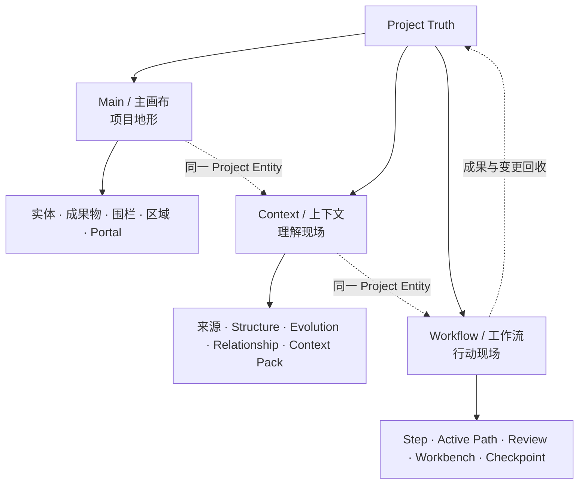
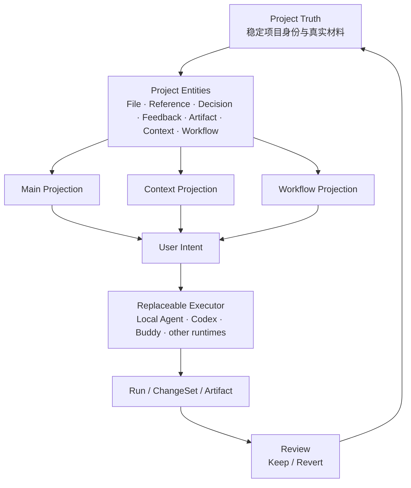
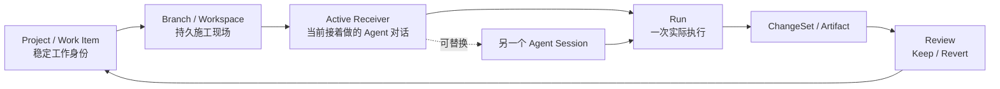
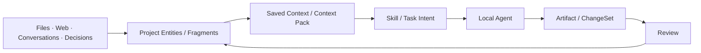
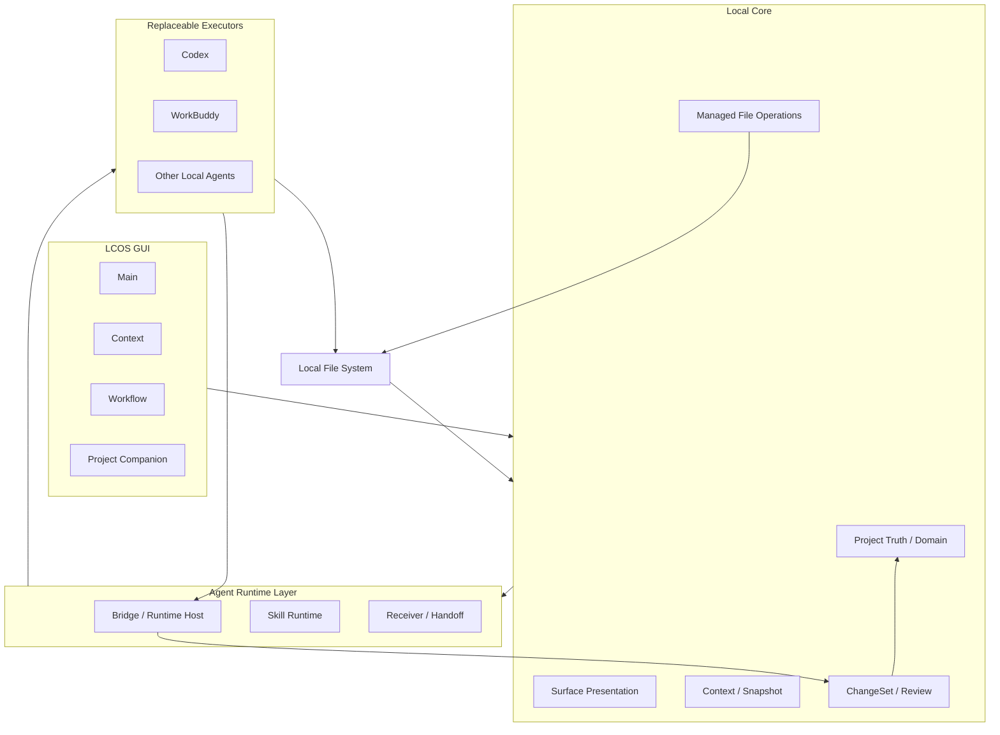
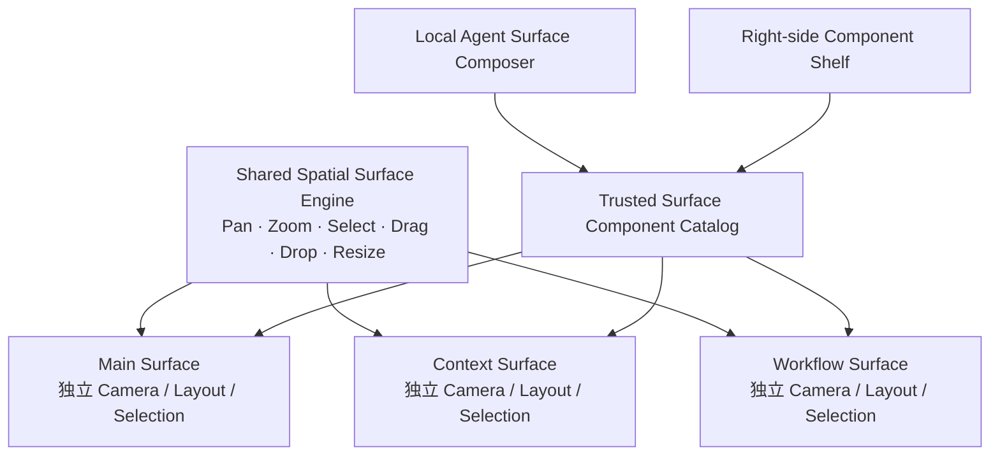

# LCOS — Local Creative OS

> **An open context canvas for the local-agent era.**  
> 面向本地 Agent 时代的开放式项目上下文画布。

LCOS 试图回答一个越来越普遍的问题：

**当文件、网页、对话、项目判断、工作流和 Agent 分散在不同工具里时，怎样让一个项目本身持续存在？**

LCOS 把这些材料重新组织到一个稳定的 **Project Truth** 周围。  
Agent 可以更换，Session 可以结束，执行工具可以变化，但项目上下文、工作现场、决策和成果继续存在。

对于品牌、创意、营销、研究以及其他以浏览器为主要工作环境的人，可以把 LCOS 理解为一种：

> **非代码工作的 Git-like project layer。**

这里借用的不是 Git 的界面，而是它更根本的思想：

> **项目应该拥有比某一次工具会话更长的生命。**

---

## 0.1：LCOS 在做什么

LCOS 0.1 先从真实的浏览器 + 本地文件 + 本地 Agent 项目工作开始：

- 把本地文件、网页参考、图片、PDF / PPT、对话沉淀和项目对象放回同一个 Project；
- 让同一个对象可以在不同工作现场被使用，而不是复制成多份孤立材料；
- 把 Context 从“聊天附件”升级成可保存、可组织、可继续交给 Agent 的项目资产；
- 让 Workflow 从项目上下文自然长出来，而不是强迫用户先画自动化流程图；
- 让本地 Agent / Codex / Buddy 等执行者成为可替换的施工者，而不是项目状态的主人；
- 将 Agent 的修改、产物和 Run 收回项目，并通过 Review / Keep / Revert 形成闭环。

---

## 三个独立工作现场

LCOS 不是“一张 Canvas 的三个模式”。

Main、Context、Workflow 是同一 Project 下三个**独立的一级工作现场**。  
它们共用空间操作底座和组件语言，但各自拥有自己的布局、镜头、选择状态和工作重点。



### Main / 主画布

回答：

> **这个项目现在有什么，东西都在哪里？**

它是三张桌子里最开放、最松散的一张。  
真实材料、成果、参考、区域和人工摆放优先。

### Context / 上下文

回答：

> **这个项目现在应该怎么理解？**

它不是详情页。  
它是一张完整自由画布，可以同时放：

- 来源和摘录；
- Structure；
- Evolution；
- Relationship；
- 当前 Focus；
- Context Pack；
- Prompt / Skill Workbench。

Structure、Evolution、Relationship 是可移动、可缩放的理解组件，而不是三个独立页面。

### Workflow / 工作流

回答：

> **这个项目接下来怎么继续？**

它仍然是一张自由工作桌面，只是默认更强调：

- 顺序和方向；
- 输入 / 输出；
- Active Path；
- Branch；
- Review；
- Checkpoint；
- Workbench。

LCOS Workflow 不以“自动化流程图”为第一目标。  
0.1 更关心的是把真实项目步骤、判断、Skill、材料和 Agent 执行串成一条可复查的工作链。

---

## 核心范式：Project Truth > Surface > Executor



核心规则：

> **Entity First, Surface Second, Executor Replaceable.**

同一个项目对象可以出现在多个工作现场。

- 移动一个投影，不改变真实对象；
- 从一个 Surface 移除投影，不删除 Project Entity；
- Agent 换 Session，不重置项目；
- GUI 换视图，不重新上传材料。

一句内部原则：

> **同一个东西不换脸，只在不同地方换一句说明。**

---

## Local Agent 时代的项目承接

LCOS 不把 Project 和某个 Agent Session 绑定在一起。



这里的关系更接近：

```text
Project / Work Item
= 稳定工作身份

Branch / Workspace
= 持久施工现场

Agent Conversation / Session
= 当前进入施工现场的人

Run
= 一次实际执行
```

因此：

> **branch ≠ session**

Session 可以结束，施工现场和项目继续存在。

---

## Active Receiver：谁接着做

每个 Project 可以连接多个可继续工作的 Agent Conversation，但只有一个默认 **Active Receiver**。

例如：

```text
现在：Codex · GUI 收口
```

用户下一次发送默认交给它。

同时支持：

- 切换“谁接着做”；
- `发送到...` 某个其他已连接对话，但不改变默认 Receiver；
- `新开对话接着做`，通过 Handoff Pack 接管当前项目；
- Session 掉线后创建 successor，而不重置三张工作现场。

对话历史和 Active Receiver 是两回事：

```text
Conversation Archive
= 以前聊过什么

Connected Conversations
= 哪些对话现在还能承接项目

Active Receiver
= 下一步默认谁来接着做
```

---

## Context 不是 Prompt 附件

LCOS 的 Context 是项目资产。



Context 可以：

- 来源可追溯；
- 被保存；
- 被重新组合；
- 被 Structure / Evolution / Relationship 理解；
- 被 Workflow 和 Workbench 重用；
- 跨 Agent Session 继续传递。

LCOS 不要求所有对象先完成标签、分类、向量化之后才能使用。

> **Raw context must remain directly usable. Enrichment is a cache, not an ownership gate.**

---

## Skill First

LCOS 将 Skill 看成“这类任务应该如何正确完成”的可复用知识，而不是某个 Agent 的私有 Prompt。

```text
Project State
= 项目现在是什么

Skill
= 这类任务应该怎么做

Executor
= 这次由谁来做

Run
= 这一次实际发生了什么

Validation / Review
= 怎么证明它做对了
```

执行者可以替换，Skill 和项目判断继续保留。

---

## 系统架构

LCOS 0.1 采用 local-first 架构。



职责边界：

### GUI

负责：

- 三个独立空间工作现场；
- Search / Focus；
- Reader / Lens；
- Selection / Drop；
- Inspector / Component Shelf；
- Agent 返回的可见 Review。

### Local Core

负责 Project Truth：

- Entity identity；
- Context；
- Workflow；
- Presentation persistence；
- file records；
- managed move / rename；
- ChangeSet；
- revision / checkpoint。

### Runtime / Bridge

负责：

- Agent 连接；
- Run；
- 状态；
- receiver / handoff；
- structured result return；
- Skill / runtime dispatch。

### Executor

Codex、Buddy 或其他 Agent 是可替换执行者。

它们可以读项目、调用 Skill、修改允许修改的内容并返回结果，但不拥有 Project Truth。

---

## GUI：同一套引擎，三个独立 Surface

三个工作现场共享实现，但不是同一个 Canvas 实例。



共享的是：

- Spatial interaction engine；
- Surface Component Catalog；
- Drop contract；
- Presentation rules；
- visual primitives；
- Agent SurfaceOp contract。

独立的是：

- Surface identity；
- camera；
- selection；
- layout；
- history；
- current Context / Workflow；
- project-specific composition。

---

## Surface Component Catalog

LCOS 不让 Agent 为核心 GUI 任意生成 HTML。

用户和 Agent 使用同一套可信组件目录：

```text
Main
├─ Entity / Artifact
├─ Fence
├─ Region
└─ Portal

Context
├─ Fragment / Entity
├─ Structure
├─ Evolution
├─ Relationship
├─ Context Pack
└─ Workbench

Workflow
├─ Workflow Step
├─ Input / Output
├─ Active Path
├─ Checkpoint
├─ Review
└─ Workbench
```

用户从组件架拖进 Surface。

Agent 则通过声明式 Surface Operations 使用同一 Catalog：

```text
create
move
resize
bind
group
remove projection
```

Agent 改动先形成 Proposal / ChangeSet，再由用户 Keep / Revert。

---

## Visual Language

LCOS 正在形成自己的空间视觉语言，而不是把所有内容画成同一种节点。

```text
Functional / Spatial Components
= 真正的内容和工作区域

Light Segments / Bars / Arcs
= 结构、边界、路径、进度

Matrix Activity
= 工作、流动、聚散、处理状态

Glyph
= 小型语义焦点
```

视觉参考吸收 ROG AniMe Matrix 的离散活性和 Nothing Glyph Interface 的分段光语言，但不复制具体产品造型。

---

## File Organization

LCOS 允许 Project Context 逐步投影到真实本地文件结构，但文件操作必须由 Local Core 管理。

```text
Agent
= 理解“应该怎么整理”

Local Core
= 唯一执行 managed move / rename 的地方
```

0.1 的安全边界优先：

- trusted project root 内 mkdir / move / rename；
- stable FileRecord identity；
- path 改变不等于 Entity 改变；
- dependency risk 检查；
- journal；
- 不默认做 delete / dedupe / destructive content edit。

---

## Search 与 Focus

LCOS 不暴露底层搜索引擎模式。

只保留两种用户心智：

**Search**

> 我不知道它在哪，甚至不确定叫什么。

底层可以融合标题、全文和语义候选。

**Focus**

> 我已经知道这个对象，告诉我它在哪里出现。

Focus 只定位它在：

- Main；
- Context；
- Workflow；
- Workspace；
- Project View

中的投影。

---

## 0.1 当前边界

LCOS 0.1 的重点是证明：

> Project Truth、自由空间工作现场、Context、Workflow、本地 Agent 和真实文件可以形成稳定闭环。

它目前不是：

- 一个通用白板；
- 一个飞书 / Notion 替代品；
- 一个 n8n 式自动化工具；
- 一个聊天客户端；
- 一个多 Agent 调度仪表盘；
- 一个任意 UI 生成平台。

后续阶段会继续探索浏览器工作和结构化工作组件，例如 Worktable、Page Stack、飞书文档链接与投影，但这些不作为 0.1 已完成能力宣传。

---

## Repository

主要目录：

```text
apps/
├── web/
└── local-core/

packages/
├── domain/
├── contracts/
├── ui/
└── skills/

docs/
scripts/
AGENTS.md
README.md
```

当前主 GUI 位于：

```text
apps/web/src/
```

---

## Development discipline

LCOS 避免“语义上好像完成了”的开发方式。

每个施工包进入下一阶段前必须：

- 对照 Scope；
- 对照 Acceptance；
- 跑自动测试；
- 做真实交互验证；
- 明确未完成项；
- 不在 Handoff 里隐藏欠账。

推荐 Git 工作流：

```text
main 拉最新
↓
新 branch
↓
实现
↓
test
↓
commit
↓
push
↓
review branch / commit
↓
Gate
↓
手测
↓
PR
↓
merge main
```

---

## Why LCOS

我们正在进入一个 Agent 越来越强、Session 越来越廉价的时代。

但大部分知识工作仍然缺少一个稳定的项目层。

聊天窗口知道这次说过什么。  
文件夹知道文件放在哪里。  
浏览器知道你开了哪些页面。  
Agent 知道它这一轮要做什么。

**却没有一个地方持续知道：这个项目是什么、为什么走到今天、现在正在做什么，以及下一个 Agent 应该从哪里接着做。**

LCOS 想成为这一层。

> **An open context canvas for the local-agent era.**
