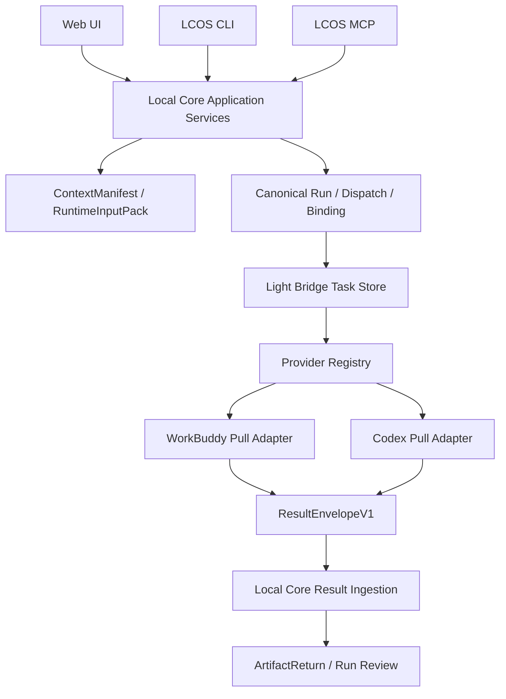

# Architecture



## 分层

### Local Core

拥有：

```text
Output Intent
Active Context
ContextManifest
Canonical Run
ArtifactReturn
Artifact / Revision / Current
```

### Light Bridge

拥有：

```text
Provider Task Identity
Idempotent Create
Claim / Start / Cancel / Finalize
Provider Status
ResultEnvelope
Restart Recovery
```

### Provider

只读取 RuntimeInputPack，只写 outputRoot，报告实际 changedFiles。

## 重要边界

Bridge 不解释 Target，不创建 Artifact，不切换 Current，也不把 Provider 建议改成新的 Output Intent。
