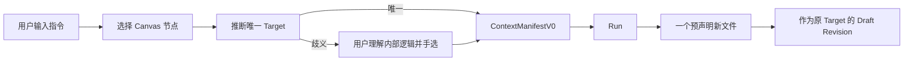
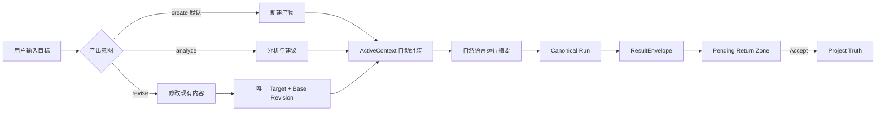

# LCOS Run 输出意图与上下文编排改造方案

> 状态：跨端评审稿
> 基线：`codex/mvp-fast-build @ b2b2633`
> 范围：产品语义、Canonical Contract、Local Core、Light Bridge、Web UI
> 本稿不授权 Schema Migration 或代码实施。

## 1. 决策摘要

当前 Run 把“修改一个已有 Artifact”当成唯一入口，真实代码要求 `targetArtifactId`，Runtime Adapter 固定声明一个 `create_new_file` 输出，Result Ingestion 又要求“恰好一个 created changed file”。这与真实创作任务不符：新建多个文件、先分析再决定产物、由系统基于项目上下文推断工作对象，都是高频场景。

建议将 Run 的首要语义从“修改目标文件”改为“表达产出意图”：

```text
outputIntent = create | revise | analyze
```

- `create`：默认。新建一个或多个产物，不要求已有 Target。
- `revise`：修改已有 Artifact，必须绑定唯一 Target 和 Base Revision。
- `analyze`：只要求结构化结论；可以零文件返回，也可以在执行中建议新产物，但不得自动写入 Project Truth。

用户只需要确认“要做什么、参考什么、预计得到什么”。Target、ContextManifest、ExpectedOutput 等专业字段进入渐进披露。

## 2. 当前证据与问题

### 2.1 当前前端

- `apps/web/src/features/create/RunConfirmDialog.tsx`：`ready` 要求恰好一个 Target，歧义时让用户在候选文件中选择。
- `apps/web/src/state/workContext.ts`：由选择集推断 Target/Context，并维护 `ambiguousTargetIds`。
- `apps/web/src/App.tsx`：创建 Runtime Run 时提交单一 `targetArtifactId`。

### 2.2 当前 Local Core

- `apps/local-core/src/server.ts`：`POST /projects/:id/runs` 要求 `instruction + targetArtifactId`。
- `apps/local-core/src/runtime-application-service.ts`：Run 直接继承 Manifest 的唯一 Target。
- `apps/local-core/src/runtime-adapter.ts`：固定生成一个 staging Markdown，`expectedOutputs` 只有 `create_new_file`。
- `apps/local-core/src/runtime-result-ingestion.ts`：要求 `changedFiles.length === 1` 且 action 为 `created`。
- `apps/local-core/src/metadata-repository.ts`：v6 `runs.target_artifact_id`、`artifact_returns.target_artifact_id` 为当前生命周期核心字段。

### 2.3 用户影响

1. 用户必须理解内部 Target/Context 逻辑。
2. 用户明明想“做一个新东西”，却必须先选一个旧文件。
3. 多文件交付被合同拒绝。
4. 分析任务被迫伪装成文件修改。
5. UI 的“智能推断”实际上把最终消歧责任交回用户。

## 3. 变更前后流程

### 3.1 变更前



### 3.2 变更后



## 4. 用户操作设计

### 4.1 默认 Composer

只展示：

1. 任务描述；
2. 产出方式：新建 / 修改 / 分析；
3. 系统将参考的内容摘要；
4. 预计产物摘要；
5. 运行。

默认选中“新建产物”。用户不需要先选节点。

### 4.2 自然语言确认

示例：

```text
将参考当前 Workspace 的 5 项内容，
新建一份 Markdown 脚本和一份镜头清单。
所有结果先进入待确认区，不覆盖现有文件。
```

### 4.3 高级设置

展开后才能看到：

- Target；
- Included Context / Excluded Context；
- 输出类型和数量；
- 文件名建议；
- 执行器；
- ContextManifest 摘要。

### 4.4 系统不确定时

- 对 `create/analyze`：允许带 warning 继续，不要求用户理解 Artifact 分类。
- 对 `revise`：没有唯一 Target 时阻止 Run，并用“请选择要修改的内容”表达，不显示内部 ID。
- 涉及覆盖、路径冲突、外部修改：进入 `waiting_input`。

## 5. Canonical Contract 建议

### 5.1 RunCreateInputV1

```ts
type OutputIntent = "create" | "revise" | "analyze";

interface RunCreateInputV1 {
  instruction: string;
  outputIntent: OutputIntent;
  workspaceId?: string;
  activeContextId?: string;
  target?: {
    artifactId: string;
    baseRevisionId: string;
  };
  outputRequest?: {
    deliverables?: Array<{
      role: string;
      mediaType?: string;
      suggestedName?: string;
      required: boolean;
    }>;
    allowAdditionalFiles: boolean;
  };
}
```

约束：

- `revise` 必须有 `target`。
- `create/analyze` 禁止把旧 Artifact 偷塞为 Target。
- `analyze` 默认允许零文件结果。
- `create` 默认允许 1–N 个新文件。

### 5.2 ContextManifestV1

保留不可变、稳定 ID、canonical JSON 和 hash。新增：

```ts
outputIntent
target?: { artifactId; revisionId; contentHash }
contextItems[]
requestedDeliverables[]
decisionTrace: {
  source: "selection" | "workspace" | "explicit" | "system";
  warnings: string[];
}
```

Manifest 仍不得包含 Provider、Bridge Task ID、Runtime Root、绝对路径或 staging path。

### 5.3 TaskEnvelopeV1

Bridge 接收的是已经冻结的执行包：

```ts
interface TaskEnvelopeV1 {
  lcosRunId: string;
  manifestId: string;
  manifestHash: string;
  outputIntent: OutputIntent;
  instructions: string;
  expectedOutputs: ExpectedOutputV1[];
  outputPolicy: {
    allowZeroFiles: boolean;
    allowAdditionalFiles: boolean;
    maxFiles: number;
  };
}
```

Bridge 不负责重新判断 Project Target，也不拥有 Artifact Truth。

### 5.4 ResultEnvelopeV1

```ts
interface ResultEnvelopeV1 {
  taskId: string;
  lcosRunId: string;
  summary: string;
  changedFiles: ChangedFileV1[];
  warnings: string[];
  suggestedNextActions?: string[];
}

type ChangedFileAction = "created" | "modified" | "deleted";
```

MVP 建议：

- `create`：仅允许 `created`。
- `revise`：Provider 仍写隔离副本，Result 语义标为 `modified`；不得直接覆盖源文件。
- `analyze`：允许 `changedFiles=[]`。
- `deleted` 暂不进入 MVP。

## 6. Artifact Return 与 Accept

### 6.1 Create

```text
Result changed_files[]
→ 每个文件创建 Pending ArtifactReturn
→ 同一 Run 组成 Return Group
→ Accept 单项或整组
→ 新 Artifact + Initial Revision + FileRecord
```

### 6.2 Revise

```text
Result changed_file
→ 校验 Target / Base Revision / Hash
→ Pending ArtifactReturn
→ Compare
→ Accept
→ 原 Artifact 新 Revision
→ currentRevisionId 切换
```

### 6.3 Analyze

```text
结构化 summary
→ Run Activity / Review
→ 可人工“转为新任务”
→ 不自动创建空 Artifact
```

## 7. 状态与 Truth Ownership

| 对象 | Truth Owner | 说明 |
|---|---|---|
| Output Intent | LCOS Run | 用户意图，不由 Bridge 重写 |
| ActiveContext | Local Core | 选择与工作区投影 |
| ContextManifest | Local Core | 不可变执行快照 |
| Provider Task | Light Bridge | 调度与执行状态 |
| ResultEnvelope | Light Bridge | 执行结果记录 |
| ArtifactReturn | Local Core | 待接纳项目结果 |
| Artifact / Revision | Local Core | 唯一 Project Truth |
| UI 推断状态 | Web | 可丢失，不成为项目真相 |

## 8. 数据库影响建议

这是红区，需要单独批准 Migration v7。建议：

- `runs`：
  - 新增 `output_intent TEXT NOT NULL`；
  - `target_artifact_id`、`target_revision_id` 改为 nullable；
  - 增加 CHECK：`revise` 时 Target 不为空。
- `context_manifests`：继续保存 canonical JSON，无需拆字段。
- `artifact_returns`：
  - `target_artifact_id` 对 create 可空；
  - 新增 `return_group_id`；
  - `action` 扩为 `created | modified`；
  - 唯一键继续覆盖 run + path + hash + action。
- 建议新增 `run_output_requests` 只在需要结构化查询时再做；MVP 可先放 Manifest canonical JSON，避免过早建表。

不要把 Provider Task 状态塞进 `runs`，继续由 `runtime_bindings.provider_status` 保存。

## 9. 前端拆分

1. `RunComposer`：指令与 Output Intent。
2. `RunSummary`：自然语言确认。
3. `ContextDisclosure`：参考项展开/排除。
4. `ReviseTargetPicker`：只在 revise 模式出现。
5. `ExpectedDeliverablesEditor`：可选高级设置。
6. `ReturnGroupReview`：多结果统一查看、逐项接纳。

现有 `RunConfirmDialog` 不应继续承担推断、选择、合同映射和 Review 四种职责。

## 10. 后端与 Bridge 分工

### Local Core

- 推断并冻结 ActiveContext；
- 构建 Manifest；
- 验证 outputIntent/target 组合；
- 分配隔离输出根；
- 创建 Canonical Run；
- 映射 ResultEnvelope；
- 创建 ArtifactReturn；
- 执行 Accept 事务。

### Light Bridge

- 幂等创建 Provider Task；
- claim/start/cancel/finalize；
- 保存 Provider 状态；
- 回传 ResultEnvelope；
- 不读取 LCOS 数据库；
- 不创建 Artifact/Revision；
- 不决定 Current。

### WorkBuddy / Provider

- 只读取 Runtime Input Pack；
- 只写允许的隔离输出范围；
- 报告实际 changed files；
- 不直接覆盖 Project Source。

## 11. 迁移切片

### Slice R0：合同冻结

- ADR；
- OutputIntent、RunCreateInputV1、ManifestV1、EnvelopeV1；
- 兼容矩阵；
- 不改数据库。

### Slice R1：Migration v7 与 Repository

- nullable Target；
- output_intent；
- Return Group；
- 约束、升级、重启、幂等测试。

### Slice R2：Local Core create/analyze

- 新建多文件；
- 零文件分析结果；
- 新 Artifact Accept。

### Slice R3：revise 生命周期

- Base Revision、Hash Guard、Compare、Accept；
- Generic Mutation Guard 必须在此之前生效。

### Slice R4：Web 渐进披露

- 默认 create；
- 自然语言摘要；
- 高级设置；
- 多 Return Review。

### Slice R5：Bridge 联调

- TaskEnvelopeV1/ResultEnvelopeV1；
- 旧合同只读兼容窗口；
- 真实 WorkBuddy E2E。

## 12. 验收标准

- 不选择任何节点，也能创建“新建产物”Run。
- create Run 能接纳 2 个新文件并生成两个 Artifact。
- analyze Run 可以零文件完成。
- revise Run 缺少唯一 Target 时明确阻止。
- Agent 不得把输出写到声明范围外。
- 新结果在 Accept 前不成为 Current。
- 重试始终创建 New Run，并保留 `retryOfRunId`。
- Bridge 重启后按 `lcosRunId` 找回同一 Task。
- 前端默认界面不暴露内部 Artifact ID、Manifest ID、Provider 状态。

## 13. 风险与回滚

- 风险：Migration v7 改变 Target 非空假设，影响 Repository 与测试面较广。
- 风险：多 Return Accept 的事务边界需要明确“整组原子”还是“逐项原子”。
- 风险：analyze 的结构化结果若没有正式存储，可能退化成 UI 临时文本。
- 风险：旧 Bridge 只理解单 expected output。

回滚：

- v7 前保留 v6 数据库备份；
- 新 UI 可通过 Feature Flag 回到 `revise-only`；
- Adapter 按 capabilities 选择 V1 或拒绝，不允许失败后静默重发 Legacy；
- 已创建的新 Artifact/Revision 不反向删除，通过 Checkpoint 或显式 Revert 处理。

## 14. 待三方确认

1. create 是否允许一次最多 5 个文件（推荐 MVP 上限 5）。
2. 多 Return Accept 是逐项还是整组（推荐逐项，提供“全部接纳”批量命令）。
3. analyze 结果存入 Run Event 还是独立 Analysis Artifact（推荐先 Run Event，用户明确保存时转 Artifact）。
4. outputIntent 是否允许 Provider 建议变更但不能自行改变（推荐）。
5. Legacy Bridge 的兼容窗口长度（推荐一个迁移 Slice，随后删除写路径）。
