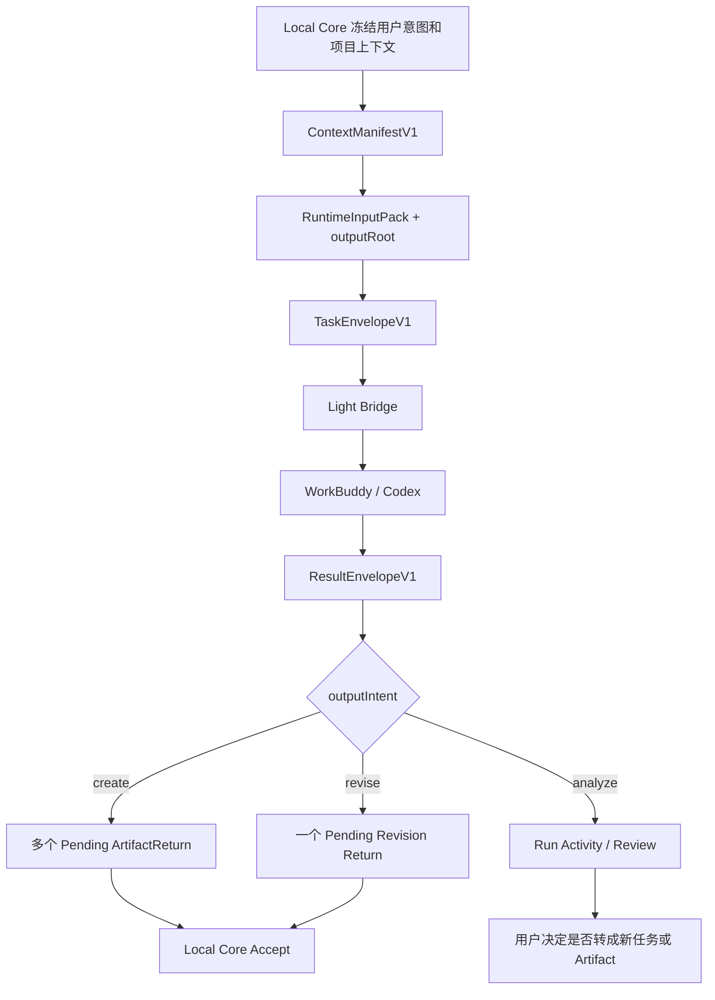

# LCOS Light Bridge Kernel v0.2.0
## Output Intent 改造审查与交付说明

> 输入评审稿：`LCOS_RUN_OUTPUT_INTENT_REDESIGN_PROPOSAL_20260730.md`  
> 修改基线：`LCOS Light Bridge Kernel v0.1.0`  
> 本次交付：`LCOS Light Bridge Kernel v0.2.0`

---

# 0. 审查结论

方案判断正确，当前 OS 的核心问题确实不是“Target 推断不够聪明”，而是 Run 被错误地定义成了“修改一个已有文件”。

正确主语应当是：

```text
用户想得到什么结果
```

因此 Bridge 合同已改为：

```text
outputIntent = create | revise | analyze
```

但原方案需要补一个安全字段：

```text
outputRoot
```

因为 `allowAdditionalFiles=true` 时，如果没有可信隔离输出根，Bridge 无法判断动态文件是否越界。现在 Bridge 做第一层输出根检查，Local Core 仍做最终 realpath、junction、Hash 和 Project Path Guard。

---

# 1. 改造后的流程



Bridge 只负责 Task 与 Result，不负责 Return Group、Artifact、Revision 或 Current。

---

# 2. 已实现的合同

## TaskEnvelopeV1

新增：

```text
manifestId
manifestHash
outputIntent
instructions
outputRoot
expectedOutputs[]
outputPolicy
```

`outputPolicy`：

```text
allowZeroFiles
allowAdditionalFiles
maxFiles
```

MVP 最大文件数冻结为：

```text
5
```

## ResultEnvelopeV1

新增：

```text
summary
changedFiles[]
warnings[]
suggestedNextActions[]
```

支持：

```text
created
modified
```

不支持：

```text
deleted
```

---

# 3. 三种意图的 Bridge 规则

## create

```text
Target：不需要
文件数：1–5
action：created
零文件：禁止
动态额外文件：按 outputPolicy 决定
```

每个输出必须在 `outputRoot` 内。

## revise

```text
Target：由 Local Core 冻结，Bridge 不判断
文件数：恰好 1
动作：modified
实际写法：隔离副本
覆盖源文件：禁止
```

Bridge 只表达“这是对旧内容的修改结果”，真正的 Base Revision、Hash Guard、Compare 和 Accept 仍由 Local Core 完成。

## analyze

```text
Target：不需要
零文件：允许
主要结果：summary
可选：warnings / suggestedNextActions
```

即使 Provider 返回分析附件，Bridge 也不会决定它是否成为 Artifact。

---

# 4. V0 兼容策略

没有保留危险的自动回退：

```text
V1 create 失败
→ 自动再发 V0 create
```

这种逻辑已明确禁止。

当前策略：

```text
新任务只允许 bridge-task-v1
旧数据库中的 V0 Task 可继续读取和完成
V0 Task 必须提交 bridge-result-v0
V1 Task 必须提交 bridge-result-v1
```

Bridge SQLite Schema：

```text
v1 → v2
```

新增：

```text
bridge_tasks.output_intent
```

旧任务迁移为：

```text
revise
```

并生成备份：

```text
bridge.sqlite3.v1.bak
```

---

# 5. 保持不变的可靠能力

```text
确定性 Task ID
requestFingerprint + payloadFingerprint
并发幂等
SQLite 重启恢复
Provider Registry
Loopback Only
Runtime Root 显式配置
Retry 不复活旧 Task
REST / CLI / MCP
```

---

# 6. 本次测试

```text
pytest：26 / 26 PASS
compileall：PASS
Wheel build：PASS
Wheel import smoke：PASS
敏感字段扫描：未发现凭证
```

覆盖：

```text
create 多文件
create 动态额外文件
最大 5 文件限制
required output 缺失
outputRoot 越界拒绝
revise modified
revise 错误 created 拒绝
analyze 零文件
V0 SQLite 升级
V0 旧任务完成
并发幂等
MCP V1 create / lookup
V0 新建拒绝
```

---

# 7. Local Core 还需要配合修改

本包只修改 Bridge。要完成 OS 方案，还需 Local Core 后续完成：

```text
Migration v7
runs.output_intent
target nullable
ArtifactReturn target nullable
Return Group
ContextManifestV1
RuntimeInputPack.outputRoot
create 多 Artifact Accept
analyze Run Activity
revise Base Revision / Hash Guard
Generic Mutation Current Guard
Web RunComposer
```

最重要的接线要求：

```text
Local Core 先 health / capabilities handshake
确认 bridge-task-v1
再创建任务
```

不允许 V1 失败后静默重发 V0。

---

# 8. 建议的联调顺序

```text
1. analyze：零文件结果
2. create：两个 Markdown 文件
3. revise：一个 modified 隔离副本
4. Bridge 重启恢复
5. create 额外文件越界拒绝
6. Local Core 多 Return 映射
7. Accept 单项与全部接纳
```

先跑 analyze，因为它最容易证明 Run 已经不再依赖 Target。然后跑 create 多文件，最后再接 revise 的版本生命周期。

---

# 9. 最终判断

v0.1.0 是“可靠的单文件修改任务桥”。

v0.2.0 才开始接近真正适合创意 OS 的轻量执行层：

```text
用户表达产出意图
→ Local Core 冻结上下文
→ Bridge 可靠执行
→ Provider 返回真实结果
→ Local Core 决定如何进入项目真相
```

这次改造没有让 Bridge 变重，反而把 Target 推断、Artifact 创建和 Revision 决策彻底留在 Local Core，Bridge 只保留它该负责的任务身份、输出边界与结果记录。
