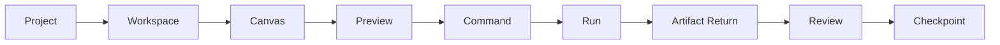

# Development Requirements

本文件是开发验收摘要，适合放入 `docs/DEVELOPMENT_REQUIREMENTS.md`。

## Product Contract



任何开发必须直接服务于以上 Alpha 主链，或属于已批准的技术 Spike。

## Required Architecture

- React + TypeScript + Vite Web UI；
- Node.js + TypeScript Local Core；
- SQLite + Project Directory；
- Bridge / Runtime Adapter；
- SSE 优先的 Run Event；
- Domain / Contracts / UI / Infra 分层；
- OS / Bridge / GUI / FS 职责分离。

## Frozen Decisions

- One Project, one persistent Canvas；
- Workspace = Semantic Viewport；
- Artifact can own multiple ArtifactViews；
- Workspace intent nullable；
- `C` creates Command；
- Command `Cmd/Ctrl + Enter` executes Run；
- Node single-click status via Portal Overlay；
- Double-click opens direct relations；
- Inspector is single-instance local navigation stack；
- Notes: artifact and current PPT/PDF page in Alpha；
- Artifact Return: Target → Working → Run → Pending Return Zone；
- LOD: 80 full / 150 simplified / 300 aggregated / 300+ overview；
- max 2 continuously animated edges；
- old Run → Activity；
- history → Checkpoint；
- independent branch → user-created Sub-canvas。

## Quality Gate

```text
lint
typecheck
unit test
build
smoke test
```

No task is complete without real command results.

## Performance Gate

- App Shell visible target: ≤1s；
- Canvas interactive target: ≤3s；
- click feedback target: ≤100ms；
- full visible nodes: ≤80；
- simplified visible nodes: ≤150；
- Heavy Task concurrency: 1；
- Light Task concurrency: 2–3；
- default regenerable cache: 5GB。

这些是预算，不是已完成事实。技术 Spike 必须提供实测基线。

## Security Gate

- Local Core only on 127.0.0.1；
- no secrets in Git or frontend；
- no direct external writes to `.creative-os`；
- hash recheck before write；
- risky file operation requires preview, confirmation, log and recovery；
- external change must not be silently attributed to a Run。

## Scope Gate

Do not implement Alpha-excluded features without a new approved handoff.

## Reporting Gate

Every major change must include before / after flowcharts, impact, tests, risks and rollback.
