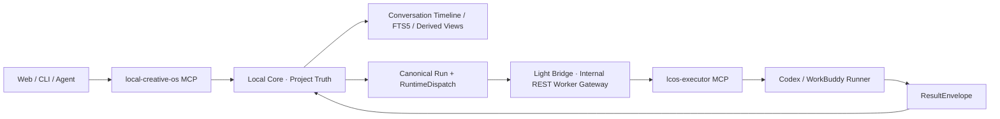

# ADR：Gate F Plus MCP、Bridge 与上下文导入收口

> 日期：2026-08-05  
> 状态：Accepted for Windows evidence candidate  
> 适用范围：Local Core、LCOS MCP、Executor MCP、Light Bridge、Codex Runner、Conversation Import

## 1. 决策摘要



LCOS 保持一个 Project Truth，但拆分两个面向不同角色的 MCP：

```text
local-creative-os
= 项目、画布、上下文、资源、Run、对话管理

lcos-executor
= claim、start、heartbeat、waiting_input、submit、cancel
```

Light Bridge 退回纯执行网关，只暴露内部 REST，不公开 MCP，也不拥有 Project、Artifact、Revision、ActiveContext 或 Conversation。

上下文导入使用统一 `ContextImportSourceV0` 合同。本轮真实落地 Conversation Adapter：Codex JSONL 和手动时间线。

## 2. Truth Owner

### Local Core owns

- Project、Workspace、Artifact、Revision、View、Relation、Note；
- ActiveContext、ContextManifest、Run、Return、Accept；
- Conversation Session、Message、Section、Annotation、Pin；
- Session Affinity 与用户可见恢复状态；
- 路径、版本、Hash、权限、幂等与 Migration。

### Light Bridge owns

- Provider Task；
- claim / lease / heartbeat；
- Provider 状态适配；
- ResultEnvelope 暂存与恢复。

Bridge 数据是 operational state。Bridge 不修改 Current，不读取项目 SQLite，也不成为对话历史或项目上下文的真相。

## 3. MCP 角色隔离

Agent MCP 不暴露 executor 工具；Executor MCP 不暴露画布、资源、对话和项目管理工具。二者复用 Local Core HTTP/Application Service，不各自重写业务逻辑。

当前机器检查结果：

```text
Agent MCP：65 tools
Executor MCP：12 tools
工具名重叠：0
Bridge /mcp：404
```

旧工具名可以保留一个兼容窗口，但新 Skill、文档和 E2E 只使用当前合同。

### Transport 说明

MCP 协议生命周期已经与业务 Tool Handler 分离到 `mcp-stdio-runtime.mjs`。当前离线依赖环境无法可靠取得官方 MCP SDK，因此本候选包没有虚构 SDK 已接入。未来替换 transport adapter 时，不改变两个 MCP 名称、工具合同或 Local Core API。

## 4. Conversation L0–L3

### L0 原始时间线

- JSONL 分片上传、流式逐行解析；
- Message、Tool、Event、File Reference 按 `seq` 入 SQLite；
- FTS5 trigger 维护全文索引；
- 导入零模型调用；
- 普通消息不自动铺满 Canvas；
- 文件引用只匹配已有 Artifact，不自动复制陌生路径；
- 导入保存解析行数、无效行、忽略事件、重复事件和命中文件诊断。

### L1 派生章节

章节只保存边界、标题和用户锁定状态，不复制正文。规则派生使用流式消息游标与批量读取，时间线、大纲、关系图和 Canvas 节点读取同一份原始数据。

### L2 按需小标注

只有用户或 Agent 明确请求时才生成：

```text
短标题
最多 3 条决策
最多 3 条待办
涉及文件
```

标注绑定 `sourceContentHash`。用户编辑的标注和锁定章节优先，自动重建不得覆盖。

### L3 语义索引

- Ollama `/api/embed`；
- 固定版本 sqlite-vec 可选扩展；
- 无 native extension 时使用 SQLite BLOB 兼容存储；
- FTS5 永远可用；
- Embedding Job 持久化、可恢复、有限重试；
- 内容 Hash 或索引版本变化后自动 stale；
- 只重建变化消息；
- FTS5 + Vector 混合检索；
- 向量是可删除、可重建的 derived index；
- 导入不等待 embedding；
- `.lcosproj` 默认不携带向量。

## 5. Canvas Agent Context

结构化 `ActiveContextV2` 是真相入口，包含：

```text
Project / Workspace / version
选择顺序
Target / Pinned / Excluded
Viewport / Visible View IDs
节点坐标与受控摘要
一度关系
视口外 Cluster 摘要
最近选择、Context、Target、Viewport 变化
```

`CanvasObservationV1` 是按需生成的 SVG 视觉补充，使用 `lcos-canvas://` 引用和 contentHash。它是 untrusted observation，不替代结构化 Snapshot。

Agent 几何与上下文写操作只通过 Core：

```text
select / focus / move_view / set_viewport
add/remove context / set target
create relation / add workspace / open preview
```

## 6. Schema

Local Core Schema：`v18`。

主要表：

```text
conversation_import_sessions
conversation_import_chunks
conversation_sessions
conversation_messages
conversation_file_references
conversation_sections
conversation_section_annotations
conversation_messages_fts
conversation_embedding_jobs
conversation_embeddings
```

v17 → v18 带升级备份；中断的 embedding job 启动时恢复为 pending。

## 7. Watchdog

同一 `projectId + provider` 严格串行；不同 Project 默认并发 2。Runner 运行有超时护栏、有限重试、持久 cooldown 和 Project Session Binding。一个 Runner 卡死不会阻塞其他 Project。

`run.started` 的正式语义是：Local Core 观察到 Canonical Run 从非 running 进入 running 时写一次。通过 Executor MCP 的真实 start 路径会立即触发；绕过 Core 直接操作 Bridge 的极短测试任务必须显式 sync，UI 不依赖 `run.started` 判断任务正确性。

## 8. `.lcosproj`

默认包含：

- Conversation metadata；
- Sections；
- Annotations；
- Pinned Decisions / 被提升消息；
- 这些节点相关的 Project Truth。

默认排除：

- 完整普通消息时间线；
- 向量；
- Runtime 日志；
- 临时上传路径。

当前 `.lcosproj` 仍保留本地 Project Root / FileRecord 路径元数据，以支持同机恢复。跨机器打开需要用户重新绑定 Project Root；本包不虚构“完全无绝对路径的可移植工程”。完整原始时间线使用显式 Conversation Export。

## 9. 安全边界

- 导入内容统一视为 untrusted data；
- Conversation 内容不能提升工具权限；
- Agent 仍通过 Core Guard；
- Agent 不直接写 SQLite；
- Bridge 不直接读项目数据库；
- Result 只能写 outputRoot，Accept 才改变 Current；
- sqlite-vec/Ollama 不可用时，L0/L1/FTS5 继续工作。

## 10. 本轮不冒充完成

- 正式 Windows 安装器；
- 真实 Windows Codex 连续五次 Session resume；
- Windows Runner 进程树 Cancel；
- Windows native sqlite-vec DLL + 真实 Ollama 模型；
- ChatGPT / Claude Parser，没有真实样本前不猜格式；
- 多用户；
- 通过 DOM 抓取对话或 Canvas。
