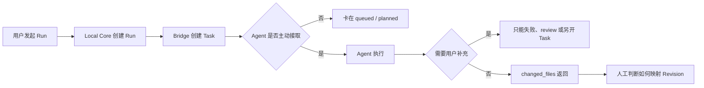
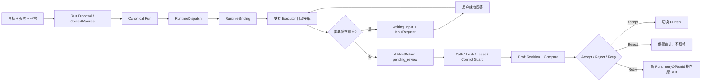

# ADR 提案：LCOS Runtime 红区闭环与生产安全边界

> 日期：2026-08-04  
> 状态：Proposed，等待 Dz 分片批准  
> 范围：`waiting_input`、自动接单、断线恢复、Safe Write、Artifact Return、Accept / Reject / Retry  
> 原则：本文件只冻结方案，不授权实现。

## 1. 变更原因

当前 LCOS 已能创建 Canonical Run、通过 Bridge 派发并记录 Artifact Return，但仍存在四个决定其能否成为真实 OS 的缺口：

1. Agent 需要补充信息时没有正式 `waiting_input` 协议；
2. Bridge 常驻不等于 Agent 自动接单，仍可能卡在第一层；
3. Bridge 或 Agent 中断后，Run、Dispatch、Binding 可能失配；
4. Agent 返回文件后，缺少统一的路径、哈希、冲突与写入租约防线。

目标不是增加更多按钮，而是让用户只需要：选择目标和参考 → 输入要求 → 确认结果。其余路由、恢复和安全判断由 LCOS 完成。

## 2. 变更前流程



## 3. 变更后流程



## 4. 用户操作变化

- 用户不再选择 Bridge Task、Runtime Root、Staging Path 或内部状态。
- `waiting_input` 直接出现在原节点 Composer / Run Activity 中，回答后继续同一个 Run。
- 修改目标由 LCOS 根据选中 Target、意图和受管 Revision 推断；只有歧义时才询问。
- Agent 生成新文件是合法结果，不再被当作修改失败；LCOS 根据返回动作分别创建新 Artifact 或目标 Draft Revision。
- Accept 是唯一允许改变 `currentRevisionId` 的入口。

## 5. 数据流与 Contract 变化

### 5.1 Canonical Run

状态保持：

```text
created → queued → running → waiting_input → running → completed
                              └────────────→ failed / cancelled
```

Provider 的 `assigned`、`review`、`retrying`、`timeout` 只写入 `RuntimeBinding.providerStatus`，不得进入 Canonical Run 状态。

### 5.2 InputRequest

建议新增独立不可变请求实体，不把问题正文塞进 `runs`：

```ts
interface RuntimeInputRequest {
  id: string
  runId: string
  externalRequestId?: string
  prompt: string
  choices?: readonly { id: string; label: string; description?: string }[]
  requestedAt: string
  answeredAt?: string
  answer?: { text?: string; choiceIds?: readonly string[] }
  status: 'open' | 'answered' | 'superseded' | 'cancelled'
}
```

约束：同一 Run 同时最多一个 `open` 请求；回答幂等；已回答内容不可覆盖。

### 5.3 Executor Lease

Bridge 提供 Pull Executor 租约：

- `claim_next(provider, workerId, leaseSeconds)`；
- `start_task` 必须验证租约所有者；
- Heartbeat 延长租约；
- 租约过期只进入恢复判断，不直接重复执行写任务；
- 同一 `externalTaskId` 同时只有一个有效 Worker。

### 5.4 Safe Write

每个文件返回必须携带：

```text
canonicalPath
action = create | revise | delete_proposal
baseContentHash（revise 必填）
contentHash
stagingPath
mediaType
```

Local Core 验证顺序：

```text
Project Path Guard
→ Staging Root Guard
→ symlink / junction containment
→ base hash conflict
→ write lease
→ content hash
→ MIME / extension consistency
→ Draft Revision
```

任何失败进入 `waiting_input` 或 `failed`，不得覆盖 Current，也不得静默改写用户文件。

## 6. 影响模块

- `packages/domain`：Run 状态转换、Accept Guard、Retry lineage；
- `packages/contracts`：InputRequest、Executor Lease、Artifact Return V2、结构化错误；
- `apps/local-core`：Migration、Repository、Recovery Coordinator、Safe Write、Accept Service；
- `tools/light-bridge-kernel`：claim/lease/heartbeat/input/result 协议；
- `tools/lcos-agent`：`run next`、`run inspect`、`run answer`、`run submit`、`run heartbeat`；
- `apps/web`：waiting_input 就地回答、Activity、Compare、Accept / Reject / Retry；
- `scripts/dev-launcher.mjs`：只负责进程健康，不参与 Run Truth。

## 7. Schema 与迁移

建议新增 Migration v14，候选表：

- `runtime_input_requests`；
- `runtime_executor_leases`；
- `runtime_recovery_events`；
- `file_write_leases`。

现有 `runs`、`runtime_dispatches`、`runtime_bindings`、`artifact_returns`、`artifact_revisions` 继续复用，不重建现有 Truth。

迁移必须满足：事务执行、失败回滚、原数据库字节级备份、v13 → v14 重启恢复、FK 与唯一约束测试。具体 DDL 在 Slice R1 审计后单独冻结。

## 8. 分片施工顺序

### R0：Contract 与威胁模型

- 冻结 InputRequest、Lease、ArtifactReturnV2、错误码；
- 输出路径穿越、重复执行、陈旧 Hash、双 Worker、断电恢复威胁表；
- 不迁移、不接 UI。

### R1：Schema 与 Repository

- Migration v14；
- Repository、FK、唯一键、不可变性和 Restart Recovery；
- 不接 Bridge。

### R2：Bridge Lease 与自动接单

- Pull Worker 认领、Heartbeat、租约过期；
- Launcher 只保持 Bridge 在线；Agent 自己通过 Skill/CLI 主动拉取；
- 禁止 Launcher 直接启动或操控 Codex/WorkBuddy 会话。

### R3：waiting_input 闭环

- Bridge InputRequest ↔ Local Core Canonical Run；
- 同 Run 回答并恢复，不创建伪 Retry；
- Web 节点下方就地回答。

### R4：Safe Write 与 Artifact Return

- Staging、Path Guard、Hash、Lease、冲突；
- create 映射新 Artifact，revise 映射 Draft Revision；
- delete 只能是 Proposal。

### R5：Accept / Reject / Retry

- Accept Domain Service 是切换 Current 的唯一入口；
- Reject 保留 Return 与 Draft 审计；
- Retry 创建新 Run 并保存 `retryOfRunId`；
- Generic Mutation 加运行时 Guard，不只依赖测试。

### R6：Recovery 与 Golden Path

- Core/Bridge/Agent 分别中断和重启；
- reconcile Dispatch、Binding、Lease、InputRequest、Return；
- 全量失败路径和真实文件沙箱验收。

每个 Slice 单独提交、单独批准；R0 不自动授权 R1–R6。

## 9. 测试与验收条件

最低必须覆盖：

- 同一 Task 双 Worker 只能一个成功认领；
- Heartbeat 停止后不会静默重复写入；
- waiting_input 刷新、Core 重启、Bridge 重启后仍可回答；
- 同一 answer / result 重放保持幂等；
- 文件移出 Project Root、symlink/junction 穿越均拒绝；
- base hash 变化进入冲突，不覆盖；
- create 新文件与 revise 目标文件均正确建模；
- Accept 前 Current 不变；Accept 后只变一次；
- Reject 不删除审计；Retry 不复用 Run ID；
- SQLite migration 失败不破坏 v13 原数据；
- Bridge 离线、Agent 不可用、无权限、磁盘写失败均有可恢复错误。

最终 Golden Path：

```text
选择目标与参考
→ 输入要求
→ 自动接单
→ waiting_input（可选）
→ 结果回收
→ Compare
→ Accept / Reject / Retry
→ 重启恢复
```

## 10. 开发成本

按当前代码基础、集中测试节奏估算：

- R0：0.5–1 天；
- R1：1–1.5 天；
- R2：1.5–2 天；
- R3：1–1.5 天；
- R4：2–3 天；
- R5：1.5–2 天；
- R6：1.5–2 天。

总计约 9–13 个专注开发日。若 WorkBuddy 无稳定的原生 Resume / Input API，R3 只能先对支持该协议的 Executor 开放，不能伪造全 Provider 能力。

## 11. 风险

- 最大风险是把“Bridge 在线”误写成“Agent 自动执行”；必须用真实 claim/start/result E2E 证明。
- Safe Write 错误可能造成用户文件损坏，因此必须先 Staging 后 Review，不允许直接覆盖。
- Lease 恢复不当会导致任务重复执行；写任务恢复默认人工确认。
- Provider 不支持原生 Resume 时，waiting_input 能力必须明确降级。
- Schema、文件写入、Accept 都必须可回滚并留审计。

## 12. 回滚方案

- Contract 使用版本号并保留旧读取；
- Migration 前创建备份，失败原子回滚；
- Bridge Adapter 可切回只派发、不自动接单；
- Safe Write 可通过 Feature Flag 回退为只生成 Staging + Handoff；
- UI 隐藏未启用能力，不用 Fixture 冒充；
- 已产生的 Run、InputRequest、Return 和 Revision 只追加，不物理删除。

## 13. 批准门

建议下一次只批准 **R0：Contract 与威胁模型**。R0 交付后，再由 Dz 决定是否批准 Migration v14。未经明确批准，不进入 Schema、真实文件写入、自动接单或 Accept 实现。
