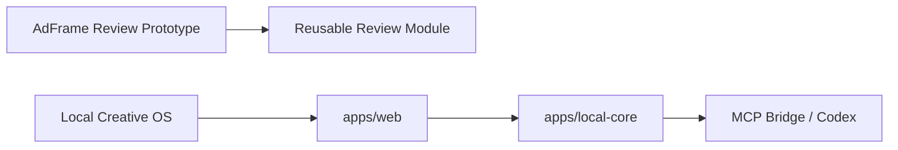
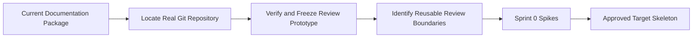
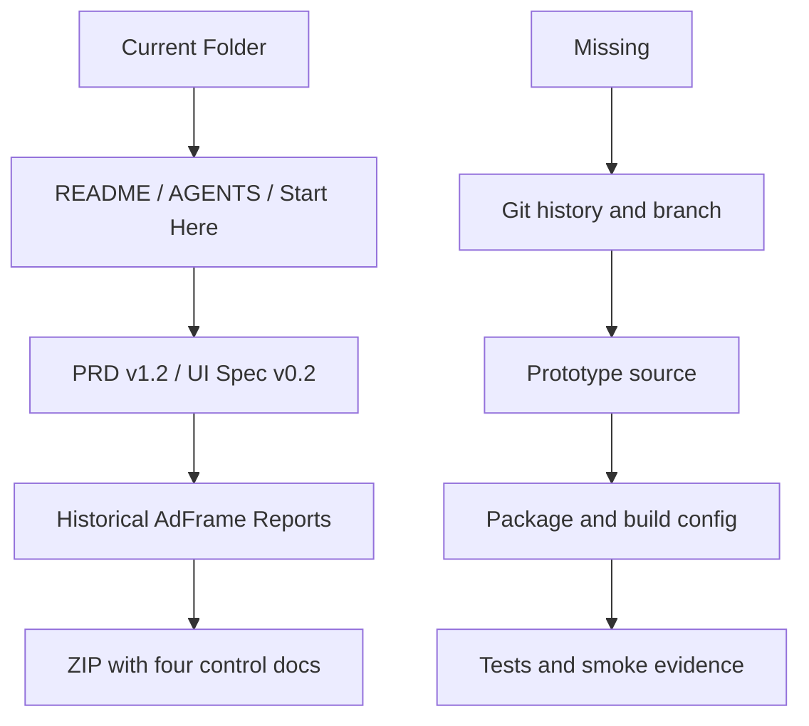
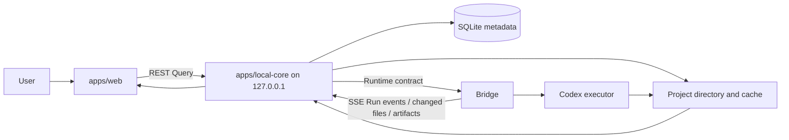

# Current to Target Architecture

> 日期：2026-07-19  
> 状态：分析与决策提案，不授权实现或迁移。

## 1. 架构判断

当前新目录是冻结决策文档集合；旧 AdFrame Review Prototype 的完整 Git 仓库已定位于 `E:\Codex 项目\演示demo`。它是 React/TypeScript/Vite 一页式三栏 Demo，类型、存储、导出和 seed 已有初步分层，但没有正式 Repository/Evaluator/Runtime 合同。文件级迁移仍须单独审计和批准。

目标架构已经在 PRD、UI Spec、README 与 ADR 中基本一致：Web 负责交互与语义视图，Local Core 负责本地项目真相，Bridge 负责 Run 真相，文件系统负责内容，Domain/Contracts 保持纯边界。

当前真正的迁移前置关系是：

## 2. 当前架构（证据边界）

已证实 React 组件、localStorage schema/migration、导出 Builder 与 Reset seed 存在；未发现正式 Repository、Evaluator 或 Runtime Adapter 接口，Codex Handoff 仍为复制/下载。

## 3. 目标职责与数据流

职责边界：

- `apps/web`：App Shell、Project Tabs、Workspace Dock、Canvas、Node、Overlay/Inspector、Command、UI Store 与 Local Core Query；
- `apps/local-core`：Project/Workspace、导入、哈希、Watcher、Preview、SQLite、Context、Runtime、Version、安全文件操作；仅绑定 `127.0.0.1`；
- `packages/domain`：纯领域类型与规则，不依赖 React、文件系统或网络框架；
- `packages/contracts`：Repository、Runtime、Connector、Preview、Context、Version 边界；
- `packages/ui`：通用组件与 Token，不保存业务真相；
- `packages/skills`：Skill 规范与加载边界，Alpha 不做市场；
- Bridge：Run、状态、事件、Executor、changed files、Artifact Return、Retry、Cancel、`waiting_input`；
- 文件系统：真实内容；SQLite 只存元数据、关系、布局与状态，不存大 BLOB。

## 4. 当前到目标的核心差距

| 能力 | 当前证据 | 目标 | 差距 |
|---|---|---|---|
| Git/回滚 | 旧仓库干净，HEAD `2a526f8`；新目录无 Git | 统一且可审查 | 承载策略未决 |
| Web App | React 19 + TS 6 + Vite 8 三栏 Demo | React + TS + Vite App Shell | 壳需重建，不能扩旧三栏 |
| Review Module | 组件/类型/存储/导出已存在但未 feature 化 | `apps/web/src/features/review` | 可抽取，需文件级计划 |
| Canvas | 无实现 | 单 Project 单 Canvas + Workspace Viewport | 需 Spike |
| Local Core | 无实现 | Node/TS，127.0.0.1 | 需边界与 Spike，不能直接产品化 |
| Persistence | schemaVersion localStorage envelope | SQLite + project directory | Demo 数据与正式数据必须分离 |
| Preview | 无实现 | MD/图片/PPT 渐进预览 | 需 Windows 实测 Spike |
| Runtime | Handoff 复制/JSON 下载 | Bridge/Codex 真实 Run | 无正式 Runtime 接口，需 Spike |
| Event | 无实现 | SSE 优先 | 需合同 Spike |
| Artifact Return | 仅规则 | Draft/Pending → Accept/Retry | 需合同和端到端样例 |
| QA | lint/build 当前通过，历史双视口截图 | lint→typecheck→unit→build→smoke | typecheck/test/smoke 独立门缺失 |

## 5. 保留、移动、归档、新建、暂缓、停止扩展

以下是类别级决策；真实仓库虽已定位，本轮仍不形成或执行具体 `git mv` 清单。

### 保留

- 旧 Review 的领域判断：Review、Decision、Locked Elements、Compare；
- 历史报告作为追溯证据；
- 当前冻结 PRD/UI Spec、ADR、性能预算、准备清单；
- Mock/CopyOnly 实现仅作为明确标识的 Demo Adapter（若源码真实存在）。

### 移动（待真实仓库审计后批准）

- Review feature → `apps/web/src/features/review/`；
- 纯领域类型 → `packages/domain/`；
- Repository/Evaluator/Runtime 等接口 → `packages/contracts/`；
- 旧 Day 报告 → `docs/archive/`；
- 产品/架构/设计/QA 文档 → 对应 `docs/*` 分类。

### 归档

- 旧三栏 Demo 的产品壳定位；
- 旧 PRD/UI Spec 的非冻结版本；
- 仅为作品集演示服务且不参与 Alpha Golden Path 的说明与素材。

### 新建（只能在获批 Sprint 内）

- `apps/web`、`apps/local-core`；
- `packages/domain`、`packages/contracts`、`packages/ui`、`packages/skills`；
- 数据/REST/SSE/Runtime/Preview/Version 合同；
- Canvas、Preview、Runtime 三类隔离 Spike；
- 可 Reset 的 PortaSplit 样例和验收脚本。

### 暂缓

- SQLite 产品化接入（先 schema/contract 与最小 persistence Spike）；
- 飞书读取/Snapshot（PRD 提及，但本轮 `CODEX_START_HERE` 的 Sprint 0 允许清单未列入，需单独确认）；
- Buddy 深度集成、Notion、Figma/Canva 执行；
- Electron/Tauri、多人协作、跨项目搜索、插件市场、多 Agent 编排；
- 完整 Delivery Bundle 与复杂页面/区域批注。

### 不应继续扩展

- 旧三栏 Review Demo 作为主 App Shell；
- localStorage 保存 Project Graph、Run、Revision、Checkpoint；
- UI 直接读写任意本地文件或管理 Codex 子进程；
- CopyOnly Handoff 冒充真实 Runtime；
- Mock AI 冒充真实执行结果；
- Workspace 映射为页面、独立 Graph、真实目录或 GUI Project；
- AI 结果自动覆盖人工 Current。

## 6. 冻结对象与交互对架构的约束

- 一个 Project 只有一张持续 Canvas；
- Workspace 仅保存 Semantic Viewport/语义镜头；`intent` nullable；
- Artifact 与 ArtifactView 分离，一个 Artifact 可有多个 View；
- Overlay 通过 Portal，不进入 React Flow/ELK/Mini-map 布局；
- Inspector 单实例、局部导航栈、默认关闭；
- Artifact Return 按 Target → Working → Run → Pending Return Zone；
- `C` 创建 Command，Command 内 `Cmd/Ctrl+Enter` 执行；
- Run 至少支持 `queued/running/waiting_input/review/completed/failed`；
- AI 结果接受前为 Draft/Pending，覆盖需哈希校验、Revision 与人工确认。

## 7. 迁移原则

1. 不从文档重新手写旧 Prototype；先定位真实仓库。
2. 不在无 Git 历史目录里创建“看起来完整”的新架构。
3. 真实仓库先冻结、跑通现有 Prototype，再做文件级审计。
4. Spike 与产品代码隔离，明确 Fake/Mock/Placeholder。
5. 每个边界先合同与验收，后接真实基础设施。
6. 任何用户主流程、对象模型、存储或 Runtime 变化先走变更协议。

## 8. 架构验收门

- 真实 Git 仓库和稳定 Prototype 已确认；
- PRD/UI Spec 无核心冲突；
- Domain Types、Schema、REST/SSE、Runtime/Preview 合同冻结；
- Canvas/Preview/Runtime Spike 提供可重复实测；
- PortaSplit Reset、Golden Path 与 Failure Path 有脚本；
- `lint → typecheck → unit test → build → smoke` 全部存在并有真实结果；
- 不存在秘密、绝对路径运行时依赖或不可回滚迁移。

## 9. 回滚

本文件只记录分析，无架构实现。后续每个 Spike 必须能整目录移除且不影响冻结 Prototype；后续迁移必须以 Git 可审查 move/revert 为回滚方式。
