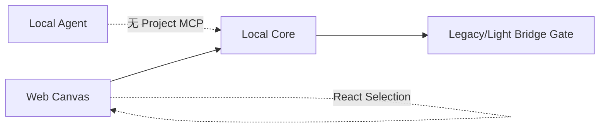
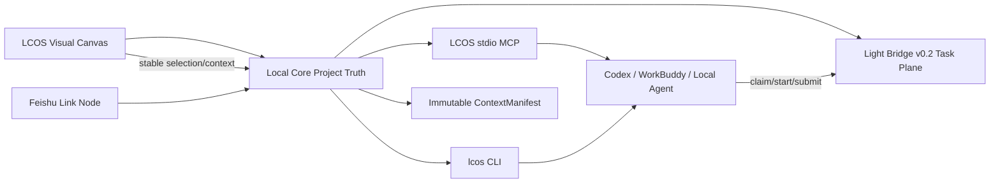

# LCOS MVP 主线合并门：Agent Pull、Project MCP 与视觉上下文实施方案

> 获批目标：推进到可并回主线的 MVP 标准。  
> 基线：`codex/mvp-fast-build @ d233dd9`。  
> 输入：Light Bridge v0.2.0、Frontend v0.7.1、Cowart、Codex Storyboard、Opal Bridge。

## 1. 变更原因

现有 MVP 已有 Project Truth、Canonical Run、Artifact Return 和 v0.7.1 UI，但缺少本地 Agent 的正式入口。Agent 不能通过 LCOS 自己的 MCP/CLI 读取项目与当前视觉上下文，Light Bridge 也尚未以 v0.2 pull 模式成为干净的任务平面。飞书链接只能作为普通 URL，不能形成可注入 Context。

## 2. 变更前

## 3. 变更后

## 4. 用户操作变化

- 用户在 Agent 内置浏览器打开 LCOS，不需要复制项目上下文。
- Canvas 稳定选择、Workspace、Pin/Exclude 和飞书链接形成 ActiveContext。
- Agent 通过 MCP/CLI 读取 Project、ActiveContext、Manifest、Run、Pending Return。
- Agent 通过 Bridge CLI/MCP 主动领取任务并提交 ResultEnvelope。
- Run 开始后继续使用不可变 Manifest；画布后续变化不会静默改变运行中任务。

## 5. 数据流与合同

- 新增 ActiveContext 投影，不成为第二套 Graph。
- ActiveContext 保存稳定选择和链接引用；高频 hover/pointer 不持久化。
- MCP/CLI 复用 Local Core HTTP/Application Service，不直接读取 SQLite。
- 飞书链接只保存 URL、标题、类型和用户提供的摘要；不在本轮获取凭证或抓取私有正文。
- Bridge v0.2 使用 `bridge-task-v1/result-v1`，禁止 V1 创建失败后 Legacy 双发。

## 6. 影响模块

- `apps/local-core`：ActiveContext API、Agent-safe Context projection。
- `apps/web`：ActiveContext 同步、Agent Browser route、Feishu Link Node。
- `tools/lcos-agent`：stdio MCP、CLI、Skill。
- `tools/light-bridge-kernel`：升级 v0.2.0。
- `scripts`：本地安装/启动入口。

## 7. Schema

本轮优先使用 Workspace `focusedViewIds/contextPolicy` 和现有 Graph/Artifact 数据构建 ActiveContext，避免立即扩大 SQLite Migration。若需要跨重启保存显式 selection，再单独评审 v7；当前只把可恢复的 Workspace Focus 作为稳定上下文。

## 8. 成本与风险

- MCP Widget 直接复用 Cowart 需要引入 SDK/tldraw，风险高；MVP 采用“Agent 内置浏览器打开 LCOS + stdio MCP 读取同一 Project Truth”，先成立能力，再评估原生 Widget。
- 私有飞书正文需要 OAuth/身份边界，本轮只做链接节点和用户提供摘要。
- 旧 Bridge 与 v0.2 并存期间只允许 capability-selected 单写。

## 9. 验收

1. `lcos project list/show` 可读取 Local Core。
2. `lcos context get` 返回当前 Workspace/选择投影。
3. MCP 提供等价只读工具及受控 Run/Return 操作。
4. Agent Skill 明确“先读 Context，再 claim Bridge Task”。
5. Light Bridge v0.2 可由 Agent pull claim/start/submit。
6. Agent 浏览器 route 显示当前上下文版本、选择、链接和运行状态。
7. 飞书 URL 可创建 Link Node 并进入 Manifest Context。
8. 不开放非 loopback，不把凭证写进 Project/Git。

## 10. 回滚

- `tools/lcos-agent` 与 Agent route 可独立移除。
- ActiveContext API 为新增只读/轻写接口，不改现有 Graph Truth。
- Bridge v0.2 保留 v0 数据库读取升级与备份；源码可回退到 v0.1。
- 飞书 Link Node 退化为普通 Context Artifact，不影响其他 Artifact。
