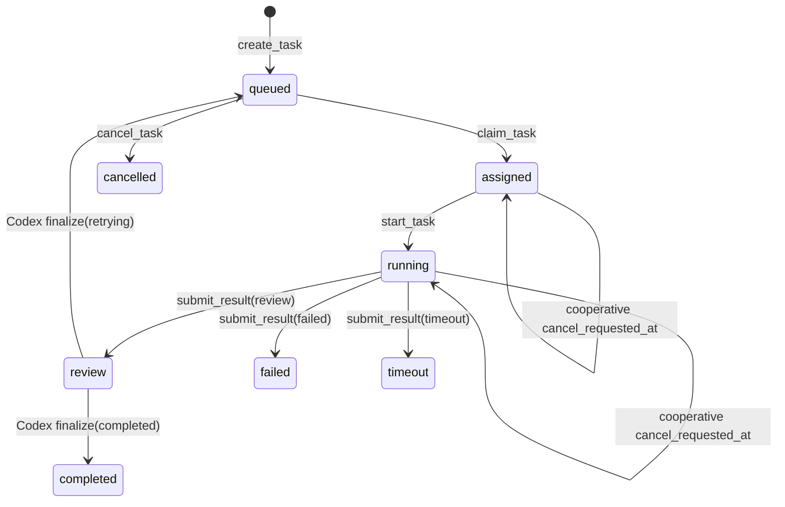
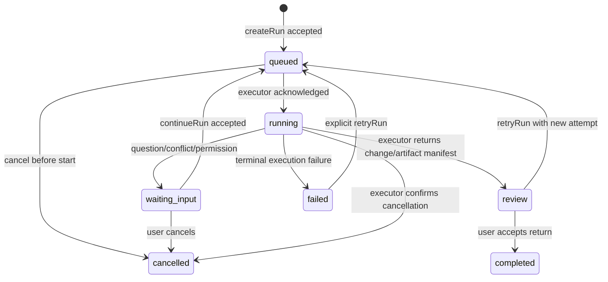

# Bridge Alpha Runtime Spine Audit Return

> status: `completed_read_only_audit`  
> handoff_id: `OS-BRIDGE-RUNTIME-SPINE-001`  
> project_id: `local-creative-os`  
> coordination_task_id: `os-bridge-runtime-spine-audit-20260719-001`  
> Bridge queue task: `not_created_by_design`  
> audited_at: `2026-07-19`  
> scope: read-only audit; no Bridge/OS runtime, schema, service, dependency, listener, Git history, branch, tag, or commit was changed.

## 0. Executive Decision

AI Bridge has a **real local task lifecycle** and has proven WorkBuddy routing/return evidence. It is suitable as a source for Alpha Runtime work, but it is **not yet an OS Alpha Runtime Spine**.

The smallest honest conclusion is:

```text
Current Bridge = task-oriented local execution bridge
Alpha target    = project-bound Run runtime with events, conflict control, recovery and return contract
```

Do not connect Local Creative OS to the current Bridge implementation yet. First freeze and implement a narrow Runtime Contract that adds a canonical `runId`, `waiting_input`, structured events, immutable context references, write leases/hash checks, structured errors, and recovery/idempotency. Preserve the existing Task API as a compatibility adapter during the transition.

## 1. Audit Scope and Evidence Boundary

### 1.1 Sources examined

- Handoff: `E:\Codex 项目\OS开发\docs\handoffs\TO_BRIDGE_ALPHA_RUNTIME_SPINE.md`
- OS baseline: `README.md`, `AGENTS.md`, `docs\DEVELOPMENT_REQUIREMENTS.md`, `docs\coordination\CROSS_PROJECT_HANDOFF_PROTOCOL.md`, `docs\coordination\PROJECT_BINDINGS.md`.
- OS frozen product/UI sources: `OS项目文档\Local_Creative_OS_PRD_V1.2_UI冻结决策回写版.docx`, `OS项目文档\Local_Creative_OS_UI_Visual_Interaction_Spec_v0.2_冻结决策稿.docx`, and `OS项目文档\01_Current_Core\Local_Creative_OS_GUI_Project_Coordination_ADR.md`.
- Bridge source identified by code/import/runtime evidence: `E:\Buddy项目\ai-bridge`.
- Existing Bridge context report: `E:\Codex 项目\buddy协同测试\AI_Bridge_当前技术进展与ContextPack评估稿.md`.
- Existing runtime state: `C:\Users\1\.ai_bridge\*.json`.

### 1.2 Important provenance finding

The handoff names `E:\Codex 项目\buddy协同测试` as the Bridge working directory. It is a non-Git coordination workspace containing the Bridge assessment, not the inspected Bridge source tree. The executable source, runtime scripts, tests and local runtime evidence are under `E:\Buddy项目\ai-bridge` and `C:\Users\1\.ai_bridge`.

This path split must be made explicit in any future OS binding. OS must bind a canonical Runtime endpoint/adapter identity, not infer source ownership from a Codex workspace path.

## 2. Current Real Capability Matrix

Legend:

- **Real**: implemented in source and supported by current test/runtime evidence.
- **Partial**: implemented in part, or present without the Alpha semantics/guarantees.
- **Mock**: no Mock capability was used to establish a positive conclusion in this audit.
- **Missing**: not found in source, runtime schema, or evidence.

| Capability | Rating | Current evidence | Alpha gap / consequence |
|---|---|---|---|
| Create task identity | Partial | `TaskService.create_task()` generates `task_<uuid8>` and persists it; `new_task()` creates a task record. | No canonical `runId`, no OS command identity, no caller idempotency key, no `externalThreadId` binding. |
| Project and Session binding | Partial | Tasks contain `project_id` and `session_id`; `SessionService.resolve_session()` reuses active project/agent sessions. | No required project root, no binding manifest, no immutable Context Snapshot identity/hash. |
| Queued / assigned / running / review / completed | Real | Services implement `queued -> assigned -> running -> review -> completed`; `test_core_lifecycle` passed. | `created` exists in enum but normal task creation directly creates `queued`; OS should not rely on `created` as an emitted lifecycle event. |
| Failed / timeout / cancelled | Partial | WorkBuddy may submit `failed`/`timeout`; queued task cancellation becomes `cancelled`; running cancellation is cooperative. | No executor acknowledgement/forced stop contract, no cancellation completion event, no resume semantics. |
| `waiting_input` | Missing | No `waiting_input` in `_V3_STATES`, task schema, services, watcher, dashboard or tests. | Required Alpha user-input pause cannot be represented. |
| Retry / Continue | Partial | Codex final review can choose `retrying`; implementation re-queues same task and increments `retry_count`. | No distinct `retrying` persisted state after the call, no continuation payload/version, no input-resume endpoint or lineage model. |
| Changed Files | Partial | Validator requires absolute paths and allowed actions; result stores `changed_files`; real historical tasks contain returned paths. | No before/after hash, project-root containment, write-set policy, conflict decision, revision identity or return disposition. |
| Artifact Return | Partial | Structured artifact normalization and persistence include `artifact_id`, type, name, path, summary, task/project/session/creator/timestamp. | No return zone/pending acceptance contract, content hash, target mapping, revision policy, MIME/availability check, or OS-facing return event. |
| Events / SSE | Partial | MCP server is built with `streamable_http_app()`; companion POC consumes worker SSE; dashboard is read-only JSON polling. | No Bridge domain event stream, event IDs, sequence, replay, `Last-Event-ID`, or OS subscription contract. |
| Watcher routing | Real for WorkBuddy inbox | 5-second polling, project inbox map, single-instance watcher lock, claim/start, inbox/status mirror implemented. | It routes WorkBuddy tasks; it is not a general OS Runtime dispatcher and does not auto-deliver a generic headless executor Run. |
| Headless executor evidence | Real but POC-limited | Existing E2E report records Bridge -> watcher -> companion -> WorkBuddy headless -> submit_result; a second skill update task completed. | Companion script remains proof-oriented/hard-coded and is not a generic production adapter. |
| `externalThreadId` / GUI link | Missing | Session has optional `conversation_id`; Task has no external thread/task/run field. | OS cannot meet `Conversation : Run = 1:N`, `Run : External Thread = 1:1` with durable IDs. |
| Context Snapshot | Missing | Task has mutable generic JSON `context`; report proposes Context Pack only. | No snapshot ID, source list, hash, frozen time, redaction or reproducibility guarantee. |
| Write lease / pre-write hash / conflict -> `waiting_input` | Missing | No lease, target write set, hash, conflict or stale code found. | Cannot safely allow OS-managed file writes or external change handling. |
| Restart recovery | Partial | JSON runtime persists tasks/sessions/artifacts; watcher has a PID singleton lock and stored state. | No executor reconciliation, event replay, orphan Run recovery, lease expiry, idempotent re-dispatch or transactional multi-record recovery. |
| Idempotency | Missing | Task ID is always newly generated; no caller key/deduplication map found. | OS retry after a transport failure can create duplicate execution. |
| Structured error contract | Missing | MCP tools mostly return display strings such as `❌ <text>`; task `error` is a string. | OS cannot safely branch on stable error codes/retryability/details. |
| Log redaction | Missing | Runtime logs exist; no redaction/sensitive-field policy found in source. | Context or credentials could enter ordinary diagnostic output. |
| Loopback default | Partial | Bridge CLI default and starter use `127.0.0.1`; dashboard uses `127.0.0.1`. | Bridge accepts arbitrary `--host`, including `0.0.0.0`; no policy guard enforces loopback. |
| Token file Git exclusion | Partial | Companion private token is ignored by `companion/.gitignore`. | This is POC-local, not a general credential boundary or log-redaction policy. |

## 3. Existing State Machine vs Alpha State Machine

### 3.1 Observed implementation state machine



Notes:

- `created` and `retrying` are accepted enum values but not the normal persisted path for `create_task`/retry.
- A running cancellation only records `cancel_requested_at`; it does not prove that the executor stopped.
- `waiting_input` does not exist.

### 3.2 Required Alpha Run state machine



### 3.3 Illegal transitions to enforce

- `completed`, `failed`, or `cancelled` must never transition without an explicit new attempt/Run.
- `review -> completed` must be owned by OS/user acceptance, not executor.
- `waiting_input -> running` must not occur silently; it requires a `continueRun` payload and a new event.
- `running -> completed` is illegal; executor returns `review` only.
- A Run with an active conflicting write lease must not enter `running`; it enters `waiting_input` or remains `queued` with a structured reason.
- A retry must create an auditable `attempt`/lineage record rather than overwriting the previous result.

## 4. Minimum Alpha Runtime Contract

The following is a **proposed contract**, not an implemented Bridge API. It is the minimum compatible surface for OS Sprint 1. Keep it local and small; do not introduce a general agent platform.

### 4.1 Identity and `createRun`

```ts
type CreateRunRequest = {
  idempotencyKey: string;
  projectId: string;
  projectRoot: string;
  commandId: string;
  conversationId?: string;
  executor: "codex" | "workbuddy";
  externalThreadId?: string;
  instruction: string;
  contextSnapshot: {
    snapshotId: string;
    manifestPath: string;
    contentHash: string;
    sourceRefs: Array<{ artifactId?: string; path?: string; revisionId?: string }>;
    createdAt: string;
  };
  requestedWriteSet: Array<{ path: string; expectedHash?: string }>;
  outputMode: "modify_in_place" | "new_revision" | "new_artifact" | "note";
  reportMode: "full" | "short" | "silent";
};

type CreateRunResponse = {
  runId: string;
  bridgeTaskId?: string; // compatibility mapping only
  status: "queued";
  createdAt: string;
};
```

Rules:

1. `runId` is the canonical Bridge/OS execution identity. Existing Bridge `task_id` may be retained as an internal compatibility field during migration.
2. `idempotencyKey` is unique within `projectId`; same valid request returns the same `runId`, incompatible replay returns a structured conflict error.
3. `projectRoot` is canonical and must be normalized locally before a worker can write.
4. `externalThreadId` is optional at creation but required once a GUI/headless executor binds. It must never be inferred from a UI title.
5. `contextSnapshot` is immutable after queueing. New context creates a new snapshot reference, not an in-place mutation of old Run context.

### 4.2 Event / SSE contract

```ts
type RunEvent = {
  eventId: string;
  sequence: number;
  runId: string;
  type:
    | "run.queued"
    | "run.started"
    | "run.waiting_input"
    | "run.review_ready"
    | "run.completed"
    | "run.failed"
    | "run.cancel_requested"
    | "run.cancelled"
    | "run.retry_queued";
  occurredAt: string;
  payload: Record<string, unknown>;
};
```

Required transport behavior:

- `GET /runs/:runId/events` as local SSE or an equivalent MCP subscription adapter.
- Replay by `Last-Event-ID` or `afterSequence`.
- Monotonic sequence per Run; reconnect must not lose `waiting_input`, review, cancellation or return events.
- Dashboard polling may remain as a fallback, but polling is not the Alpha event contract.

### 4.3 Changed Files and Artifact Return

```ts
type ChangedFile = {
  path: string;
  action: "created" | "modified" | "deleted" | "moved";
  beforeHash?: string;
  afterHash?: string;
  projectRelativePath: string;
};

type ArtifactReturn = {
  artifactReturnId: string;
  artifactId?: string;
  runId: string;
  type: "document" | "presentation" | "image" | "video" | "code" | "spreadsheet" | "report";
  path: string;
  contentHash: string;
  name: string;
  summary: string;
  source: "created" | "modified" | "external";
  targetArtifactId?: string;
  targetRevisionId?: string;
  disposition: "pending_return" | "new_artifact" | "new_revision" | "conflict";
  createdAt: string;
};

type ReviewReadyPayload = {
  changedFiles: ChangedFile[];
  artifacts: ArtifactReturn[];
  warnings: Array<{ code: string; message: string }>;
};
```

Bridge validates absolute paths and allowed changed-file actions today. Alpha adds project containment, hashes, target/revision mapping and pending-return disposition so OS can implement `Target -> Working -> Run -> Pending Return Zone` without guessing.

### 4.4 Structured error

```ts
type RuntimeError = {
  code:
    | "IDEMPOTENCY_CONFLICT"
    | "PROJECT_ROOT_INVALID"
    | "EXECUTOR_UNAVAILABLE"
    | "WRITE_LEASE_CONFLICT"
    | "SOURCE_STALE"
    | "INPUT_REQUIRED"
    | "CANCELLED"
    | "RECOVERY_REQUIRED";
  message: string;
  retryable: boolean;
  runId?: string;
  details?: Record<string, unknown>;
};
```

Do not return presentation strings such as `❌ ...` as the machine contract. UI/localization can render these errors later.

## 5. File Conflict, Cancel, Retry and Recovery Strategy

### 5.1 Write lease and hash rule

```text
createRun
  -> normalize projectRoot and requestedWriteSet
  -> acquire one local write lease per target path
  -> record beforeHash
  -> execute
  -> re-read hash before each write
  -> if changed externally or lease unavailable: waiting_input
  -> user chooses new revision / overwrite with recovery point / cancel
```

Minimum lease record:

```ts
type WriteLease = {
  leaseId: string;
  runId: string;
  projectId: string;
  path: string;
  beforeHash?: string;
  acquiredAt: string;
  expiresAt: string;
  status: "active" | "released" | "expired";
};
```

Rules:

- Alpha permits one active writer per file.
- Read-only Runs may execute concurrently if they declare no write set.
- An external file change after `beforeHash` makes the Run stale and moves it to `waiting_input`; it must not silently overwrite.
- Local Core owns file watch and canonical hash evaluation. Bridge owns the Run transition and lease reference. GUI never writes `.creative-os` directly.

### 5.2 Cancel

- `queued`: cancel immediately, release no lease or all pre-acquired leases, emit `run.cancelled`.
- `running`: emit `run.cancel_requested`, signal executor, keep Run non-terminal until executor confirms cancellation or timeout/recovery policy fires.
- `waiting_input`: cancel immediately, retain audit record, release leases.
- Cancellation is not complete merely because a field such as `cancel_requested_at` exists.

### 5.3 Retry and continue

- `retryRun(runId, reason)` creates a new attempt under the same logical Run lineage or a linked Run, retaining old evidence.
- `continueRun(runId, input)` is only valid from `waiting_input`; it creates an immutable continuation input event and returns the Run to `queued`.
- Do not overload retry to mean user input continuation.

### 5.4 Restart recovery

At startup, Runtime must scan non-terminal Runs:

1. validate lease expiry and project path availability;
2. reconcile executor/worker state by `externalThreadId` or worker run ID;
3. replay persisted events to rebuild current state;
4. move unrecoverable active Runs to `waiting_input` or `failed` with `RECOVERY_REQUIRED`, never silently mark complete;
5. make recovery idempotent.

## 6. Ownership Boundary

| Owner | Owns | Must not own |
|---|---|---|
| Local Creative OS | Project, Workspace, Canvas, Artifact/View/Revision, Command, Context Snapshot, user acceptance, Checkpoint, UI. | Executor lifecycle implementation, Canvas coordinates inside Bridge. |
| Bridge Runtime | Run identity/state, executor binding, event stream, retry/cancel/continue, write lease references, Changed Files, Artifact Return. | Canvas/UI/Preview layout, GUI project naming as primary data. |
| Local Core | Project root normalization, SQLite/project persistence, file watches, hashes, safe file operations, secrets boundary, loopback API. | GUI conversation history as project truth. |
| Codex / WorkBuddy GUI or headless worker | Execute a bound Run, report result/worker state, use allowed tools. | Project truth, user acceptance, silent overwrite of protected target. |
| File system | Actual file bytes and external modifications. | Run/Canvas semantics. |

## 7. Minimal Upgrade Slices

No slice below is authorized by this audit. They are ordered recommendations and each must receive a separate approved Sprint/Handoff.

### Slice 0: Source and runtime provenance gate

- Establish a real Git baseline for `E:\Buddy项目\ai-bridge` before functional work.
- Document canonical source root, runtime storage root, endpoint and ownership.
- Add no runtime feature.

Dependency: Dz decision on whether the current uncommitted Bridge tree is the authoritative source.

Tests/evidence: clean/known Git status, initial commit or approved alternative provenance record, source-to-runtime mapping.

Rollback: no code/runtime change.

### Slice 1: Domain Contract and Run identity

- Define `Run`, `ContextSnapshotRef`, `WriteLeaseRef`, `ArtifactReturn`, `RuntimeError`, event types.
- Add `runId`, `idempotencyKey`, `projectRoot`, `externalThreadId` and attempt lineage without removing legacy task fields.
- Keep existing MCP Task methods as compatibility adapters.

Dependency: OS freezes TypeScript contract and Local Core project binding format.

Tests: duplicate idempotency request, malformed project root, legacy task compatibility, Run/Task mapping.

Rollback: feature flag or adapter-only path; no automatic migration of old runtime records.

### Slice 2: State and event spine

- Implement `waiting_input`, `continueRun`, terminal cancellation confirmation and explicit retry attempts.
- Persist ordered Run events and expose local SSE replay.
- Add structured errors.

Dependency: Slice 1.

Tests: every allowed/illegal transition, SSE reconnect/replay, cancel race, retry lineage, waiting-input continuation.

Rollback: retain polling dashboard and legacy task status reader.

### Slice 3: Safe file return

- Implement project-root containment, write leases, before/after hashes, stale conflict -> `waiting_input`.
- Emit structured `ChangedFile` and `ArtifactReturn` with pending disposition.

Dependency: Slice 2 plus OS/Local Core hash and revision policy.

Tests: same-file concurrency, external modification, path escape, deleted/moved file, artifact missing after return.

Rollback: disable write-capable executor route; preserve read-only Run route.

### Slice 4: Executor adapter and recovery

- Generalize the companion POC into a project-gated executor adapter.
- Bind worker run IDs/external thread IDs to canonical Run.
- Add startup reconciliation, lease expiry handling and safe orphan recovery.

Dependency: Slices 1-3; explicit user enablement per project.

Tests: worker unavailable, duplicate dispatch, process restart, stale worker, cancelled worker, interrupted SSE.

Rollback: return to current watcher inbox/manual trigger mode; do not remove existing WorkBuddy UI path.

### Slice 5: OS integration Spike

- OS Local Core calls only the frozen Runtime Contract.
- OS renders events and pending returns read-only first.
- Run a five-Run Golden Path against one disposable project root.

Dependency: all prior slices and OS Sprint approval.

Tests: OS Golden Path including `waiting_input`, review/accept/retry, changed file discovery, restart recovery and external change.

Rollback: disconnect OS adapter; Bridge continues independently.

## 8. Evidence Index

| Conclusion | Code / document path | Read-only command or evidence |
|---|---|---|
| Task/session/result services exist | `E:\Buddy项目\ai-bridge\app\services\tasks.py`, `results.py`, `sessions.py` | Source inspection. |
| State enum lacks `waiting_input` | `E:\Buddy项目\ai-bridge\app\validators\__init__.py` | Source inspection of `_V3_STATES`. |
| Existing lifecycle and cancel behavior | `app\services\tasks.py`, `app\services\results.py` | Source inspection; core tests. |
| Changed Files absolute path validator | `app\validators\__init__.py` | Source inspection of `validate_changed_files`. |
| Artifact schema/persistence | `app\models\__init__.py`, `app\schemas\__init__.py`, `app\services\artifacts.py` | Source inspection. |
| MCP transport but no domain event API | `bridge_server.py`, `scripts\run_dashboard.py` | Source inspection: `streamable_http_app()`; dashboard has JSON routes only. |
| Watcher and singleton lock | `workbuddy_watcher.py` | Source inspection: `watcher.lock.json`, polling/claim/start/inbox routing. |
| Headless POC is not generic | `companion\dispatch_one.sh` | Source inspection: hard-coded Route C proof text despite task read attempt. |
| Loopback defaults | `bridge_server.py`, `scripts\start_runtime.py`, `scripts\run_dashboard.py` | Source inspection: `127.0.0.1`; Bridge CLI still accepts arbitrary `--host`. |
| Runtime persistence and counts | `C:\Users\1\.ai_bridge\*.json` | `venv\Scripts\python.exe scripts\health_check.py`: storage files present; 42 tasks, 13 sessions, 17 artifacts, 23 metrics. |
| Core task tests | `tests\test_core_flow.py` | `venv\Scripts\python.exe scripts\run_core_tests.py`: 6 tests passed. |
| Existing headless evidence | `E:\Codex 项目\buddy协同测试\Headless_E2E_Test_Report.md`, `Headless_E2E_Proof.md` | Existing report reviewed; no new Run created. |
| OS target requirements | `README.md`, `AGENTS.md`, PRD V1.2, UI Spec v0.2, GUI coordination ADR | Read-only inspection. |
| Git/provenance concern | `E:\Buddy项目\ai-bridge\.git` | `git status --short` lists all files untracked; `git log --oneline -10` reports no commits. |
| OS baseline clean | `E:\Codex 项目\OS开发` | `git status --short` empty; branch `refactor/reusable-review-core`; handoff commit `da69567`. |

## 9. Blocking Items and Dz Decisions

### Blockers

1. **Bridge source provenance is not production-safe.** The inspected Bridge Git repository has no commits and every source file is untracked. OS cannot rely on file-level history, controlled rollback or code-version evidence until this is resolved.
2. **No `waiting_input`/event/Run contract exists.** This blocks OS Alpha's required user-input pause, pending Run restoration and reliable UI state.
3. **No safe write contract exists.** Without project-root containment, hashes and leases, OS must not allow Bridge-controlled modifications to OS-managed project files.
4. **No idempotency/recovery contract exists.** Transport failures or restarts can duplicate or orphan execution.

### Decisions requested from Dz / OS coordinator

1. Confirm whether `E:\Buddy项目\ai-bridge` is the authoritative Bridge source and authorize establishing its Git baseline in a separate task.
2. Freeze whether canonical execution identity is a new `runId` with legacy `task_id` mapping (recommended), rather than reusing the current Task identity as OS Run identity.
3. Freeze `waiting_input` as a first-class Runtime state and confirm that only OS/user may continue it.
4. Freeze Local Core as the hash/file-watch authority and Bridge as lease/state authority (recommended).
5. Decide whether Sprint 1 is Codex-only as the PRD states, with WorkBuddy/headless retained as a later adapter. Recommended: yes; do not make Buddy integration a Sprint 1 dependency.
6. Confirm that Bridge must reject non-loopback hosts for OS mode, rather than merely defaulting to loopback.

## 10. Final Recommendation

Approve a separate, tightly scoped **Slice 0 + Slice 1 contract/provenance Sprint** only after the above decisions. Do not implement watcher automation, GUI control, Canvas integration, preview behavior or multi-agent orchestration in that Sprint.

The first OS-facing proof should be one disposable local Project with a Codex executor, one explicit Context Snapshot, one declared write target, one `waiting_input` path, one review/accept path, and restart/replay verification. WorkBuddy headless integration should remain an adapter candidate until the core Run contract is stable.

## 11. Audit Closure Note

At the start of this audit, `E:\Codex 项目\OS开发` reported a clean Git status. At closure, it contains two untracked audit returns:

- `docs/audit/BRIDGE_ALPHA_RUNTIME_SPINE_AUDIT_RETURN.md` - this audit's only write.
- `docs/audit/ADFRAME_REUSABLE_REVIEW_AUDIT_RETURN.md` - appeared during the audit and was not created, read, modified, or validated by this Bridge audit task.

This is a concurrent handoff artifact, not a Bridge/OS code change. OS coordinator should review both returns before committing any audit results.
