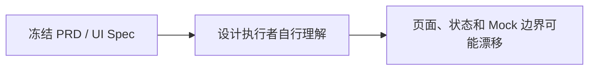
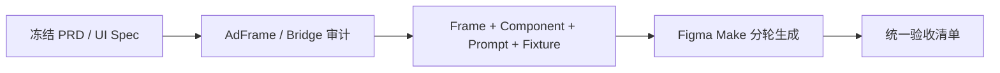

# Figma Make 高保真原型包阶段审核报告

> 日期：2026-07-19  
> 截止目标：22:00 Asia/Shanghai 之前  
> 实际状态：阶段交付已提前形成，可交给 Figma Make 开始高保真原型  
> 代码实现状态：未开发；本阶段仅冻结原型输入、交互状态与验收

Figma Make 首轮已于 2026-07-19 提交：

`https://www.figma.com/make/FPiaXr4SrWJYecq3uUR080/Untitled?t=JmUnQmGl5JE6GkPa-0`

自动审查值守：`local-creative-os-figma-make`，每 20 分钟低频检查，至 22:00 停止新增。

## 1. 阶段目标

把 Local Creative OS 的冻结 PRD、UI Spec、仓库基线和两个历史项目审计，压缩成 Figma Make 无需猜测即可使用的高保真原型开发包。

成功标准：设计执行者能清楚知道产品是什么、要画哪些 Frame、组件有哪些状态、主链如何点击、哪些能力只是 Prototype Target，以及绝对不能自行加入什么。

## 2. 实际范围

完成：

- 8 个高保真 Frame 的目标、内容和点击关系；
- App Shell、Canvas、Workspace、Overlay、Inspector、Command、Context、Run、Return、Checkpoint；
- Porcelain Canvas、Liquid Chrome 与节点视觉语法；
- 5 轮可分步投喂 Figma Make 的 Prompt；
- PortaSplit 一致性 Fixture；
- 视觉、交互、诚实性和交付验收清单；
- AdFrame 与 Bridge 两份只读审计的验收整合。

未进入：

- React 或 Figma 文件开发；
- 后端、数据库、真实 API、Runtime 接入；
- AdFrame 代码迁移；
- Bridge 升级或 Git 基线建立；
- 新依赖、完整 App Shell 实现、真实文件修改。

## 3. 流程影响

本阶段没有改变冻结用户流程，只把它转译为可原型化的 8 个画板。

### 变更前

### 变更后

用户主流程仍是：恢复 Project → Workspace 聚焦 → Preview / Note → Command / Context → Run → waiting_input → review → Artifact Return → Accept / Retry → Checkpoint。

## 4. 审计分工与结果

### AdFrame

- task_id：`os-adframe-review-audit-20260719-001`；
- 状态：complete，OS 已接受；
- 旧仓库审计前后保持干净；lint 与 diff check 通过；
- 结论：可保留 Review / Decision / Locked Elements 的业务词汇和纯 builder 思路；旧三栏、localStorage、Mock AI、CopyOnly Codex Handoff 不迁移；Repository、Evaluator、Runtime 都需要按 OS 边界重写。

### Bridge

- task_id：`os-bridge-runtime-spine-audit-20260719-001`；
- 状态：completed_read_only_audit，OS 已接受；
- 真实证据：核心测试 6/6；42 个任务、13 个 Session、17 个 Artifact；存在 WorkBuddy Headless POC；
- 缺口：没有 canonical Run ID、`waiting_input`、领域事件回放、文件写租约/哈希冲突、幂等、结构化错误和完整恢复；
- 阻塞：`E:\Buddy项目\ai-bridge` 尚无 Git 提交，源码未跟踪，不适合作为可追溯升级基线。

本阶段没有 AI Bridge / Buddy 队列任务；上述编号为 Codex 跨任务协调编号。

## 5. 交付文件

- `docs/design/FIGMA_MAKE_ALPHA_PROTOTYPE_PACKAGE.md`；
- `docs/design/FIGMA_MAKE_MASTER_PROMPT.md`；
- `docs/design/FIGMA_MAKE_FIXTURE_AND_ACCEPTANCE.md`；
- `docs/audit/ADFRAME_REUSABLE_REVIEW_AUDIT_RETURN.md`；
- `docs/audit/BRIDGE_ALPHA_RUNTIME_SPINE_AUDIT_RETURN.md`；
- 本报告。

## 6. 验收结果

文档一致性：

- 一个 Project / 一张 Canvas：通过；
- Workspace = Semantic Viewport：通过；
- Inspector 默认关闭、单实例：通过；
- 单击 Overlay / 双击 Relations：通过；
- `C` 与 Command `Cmd/Ctrl + Enter`：通过；
- Target 与 Context 分离：通过；
- Artifact Return 落位顺序：通过；
- Draft 不自动覆盖 Current：通过；
- 旧 AdFrame 三栏未进入目标 Shell：通过；
- Prototype Target 与 Live Capability 区分：通过。

质量门真实结果：

- `npm run lint`：通过；
- `npm run typecheck`：通过；
- `npm run test`：2 个测试文件、5 项测试全部通过；
- `npm run build`：通过，Vite 转换 1782 个模块；
- `npm run smoke`：通过，Preview 与 2 个构建资源可访问；
- `git diff --check`：通过（格式修正后复核）。

由于没有开发 UI，本阶段不存在浏览器高保真验证或 Figma 文件截图；这属于下一执行环节，不能以旧 Demo 截图冒充。

## 7. 已知问题与风险

1. Figma Make 可能一次性扩写登录、Dashboard、聊天或文件管理器；已通过分轮 Prompt 和禁止清单约束；
2. Material 风格容易过度彩虹化；验收要求文件内容优先，Chrome / Iridescence 只用于稀缺强调；
3. Run 状态容易被误解为已接通；所有 Frame 必须显示 Prototype Data，Runtime 仍是目标合同；
4. Bridge 源码缺少 Git 基线，不能开始正式升级；
5. Decision、Locked Elements、Review Target 仍需要 Sprint 1 合同决策，本原型只展示用户语义；
6. 1366×768 需要 Figma Make 生成后进行真实视觉复核。

## 8. 回滚

本阶段只增加 Markdown 和更新 Handoff 状态。可通过 revert 本阶段独立 Commit 完整撤销，不影响旧 AdFrame、Bridge 或现有 Prototype 代码。

## 9. 下一步建议

可以立即进入“Figma Make 生成与视觉验收”阶段，顺序为：默认 Canvas → Overlay / Inspector → Command / Context → Run / Return → 响应式与失败态。

不建议同时进入 Runtime 开发。Bridge 应先单独批准并完成：

1. 权威源码路径与 Git 基线；
2. Run / ContextSnapshot / ArtifactReturn / RuntimeError 合同；
3. `waiting_input` 与事件回放；
4. 文件哈希、写租约和恢复策略。

阶段判断：**可以交给 Figma Make；不可以据此宣称 Alpha Runtime 已完成，也不适合直接迁移旧 AdFrame UI。**
