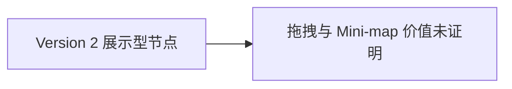
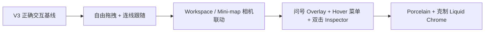
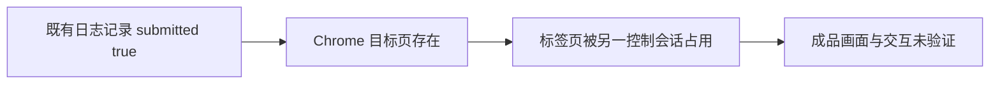

# Figma Make 夜间设计值守阶段报告

> 自动化：`creative-os-figma-make-overnight`
> 截止：2026-07-20 07:00 Asia/Shanghai
> 收口时间：2026-07-20 07:02 Asia/Shanghai
> 结论：已按时停止新增修改；修改请求提交有记录，但当前最佳 Make 成品未完成真实交互验收。

## 1. 任务摘要

本轮目标是在正确交互版本基础上增量精修 Local Creative OS 的 Figma Make 高保真原型，优先保留 V3 的节点自由拖拽、Mini-map 相机联动、`?` 状态 Overlay、Hover 二级菜单和 Workspace 相机逻辑，并以 UI V0.1 为主标准核对布局、节点、Dock、Inspector、Mini-map、材质、色彩、动效与快捷键。

截止后严格停止新增 Ask for changes，只进行只读验收、证据整理、Git 检查、质量门和报告。

## 2. 实际范围与结果

已完成：

- 读取并核对仓库根 `README.md`、`AGENTS.md`、`CODEX_START_HERE.md`；
- 读取三份 Figma Make 设计输入；
- 从 UI V0.1 DOCX 中定向抽取并核对指定主题；
- 检查 Git 分支、最近提交、diff、未跟踪文件、环境文件名和脚本配置；
- 核对既有 Make 提交记录并建立迭代日志；
- 运行完整 `lint → typecheck → unit test → build → smoke`；
- 确认自动化配置已为 `PAUSED`。

未完成：

- 未取得当前最佳 Make 版本的新截图；
- 未对 V3 六项核心交互做真实操作验证；
- 未复制 Make 代码，未建立独立原型精修稿；
- 未对代码副本做响应式、可访问性或材质级精修。

## 3. 基准核对

UI V0.1 与本阶段冻结要求一致的关键点：

- Workspace 是同一 Canvas 的 Semantic Viewport，只移动相机、恢复 zoom、聚焦与筛选，不路由或复制 Artifact；
- 默认只常驻 Project Tabs、Workspace Dock、Canvas 与 Mini-map，Inspector 默认关闭并以 Overlay 打开；
- Canvas 占 80% 以上可用面积，当前 Workspace 默认 5–8 个主内容节点；
- 节点允许拖动并保存稳定锚点，自动排布不得覆盖；
- Mini-map 视口框可拖动，不显示文件名，主 Canvas 与视口框应双向同步；
- Hover 只暴露少量快捷操作，单击打开不推动布局的状态 Overlay，双击打开一度关系 Inspector；
- 材质以暖瓷白、内凹槽和柔和扩散阴影为主，Liquid Chrome 仅用于关键操作；
- 分类色只用于图标、细边、状态、环境光与关系线辉光；
- Workspace 切换表现为相机移动，Inspector 和状态 Overlay 不挤压 Canvas；
- reduced motion、清晰焦点环与非纯颜色状态编码必须保留。

快捷键以当前冻结仓库规则为准：`C` 创建 Command；Command 内 `Cmd/Ctrl + Enter` 执行 Run；`Enter` 打开/收起状态；双击打开一度关系；`Cmd/Ctrl + O` 打开原生工具；`Esc` 逐级退出。UI V0.1 中与此冲突的早期快捷键建议不覆盖当前冻结规则。

## 4. 变更流程

### 变更前

### 目标变更后

### 本轮实际证据链

## 5. Git 与文件保护

- 分支：`refactor/reusable-review-core`；
- 工作区在本轮开始时已不干净：
  - `docs/design/FIGMA_MAKE_ALPHA_PROTOTYPE_PACKAGE.md` 已修改；
  - `docs/design/FIGMA_MAKE_FIXTURE_AND_ACCEPTANCE.md` 已修改；
  - `docs/design/CREATIVE_OS_MATERIAL_VISUAL_SYSTEM.md` 未跟踪；
- 这些既有改动全部保留，未覆盖、未提交、未 Push；
- 本轮只新增本迭代日志与本审计报告；
- 未修改正式 Alpha 产品代码；
- `git diff --check` 通过，仅出现 Git 的 LF/CRLF 提示；
- 未发现 `.env*`、密钥、Token 或 Secret 命名候选文件。

工作区不干净触发仓库停止条件，因此本轮没有继续任何产品或设计内容修改。

## 6. 测试结果

2026-07-20 07:02 执行 `npm run check`：

- lint：通过；
- typecheck：通过；
- unit test：通过，2 个测试文件、5 项测试；
- build：通过，Vite 8.1.5，1782 modules transformed；
- smoke：通过，Preview 与 2 个构建资源可访问。

这些结果验证的是当前仓库旧 Prototype/代码基线，不代表 Figma Make 当前最佳版本通过交互验收。

## 7. 证据与诚实性分级

已证实：

- 2026-07-19 23:18 有一条明确的 V2→V3 Ask for changes；
- 既有日志记录蓝色 Send 提交返回 `submitted: true`；
- Chrome 中目标编辑页与全屏预览页存在；
- 本地质量门全部通过；
- 自动化当前为 `PAUSED`。

未证实：

- Make 是否已完整生成并保留全部 V3 行为；
- 任意节点拖拽后是否留在新位置；
- 连线是否实时跟随；
- Mini-map 是否可拖视口框、点击定位并双向同步；
- Workspace 是否只移动相机；
- `?`、Hover 二级菜单与双击 Inspector 是否真实可用；
- Porcelain Canvas 与 restrained Liquid Chrome 是否达到视觉门。

阻塞：目标 Figma 标签页属于另一浏览器控制会话，本轮不能安全认领。未遇到登录、验证码、权限或 Make 限额提示。

## 8. 风险、回滚与下一步

风险：如果在未验收时复制代码，会把 Make 自述或半成品误当作当前正确基线；因此本轮主动未复制。

回滚：本轮新增的两个 Markdown 文件可单独删除或通过可审查的 revert 撤销；既有三份未提交设计文档未被改写。

下一步只需一次人工连续验收：释放目标 Chrome 标签页的控制占用，先截图，再逐项操作验证拖拽、连线、Mini-map、Workspace、`?`/Hover 和双击 Inspector。全部通过后才打开代码界面复制最佳版本，并保存为独立、可审查的原型副本。
