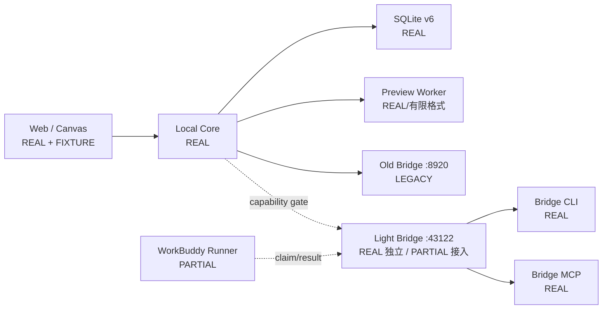
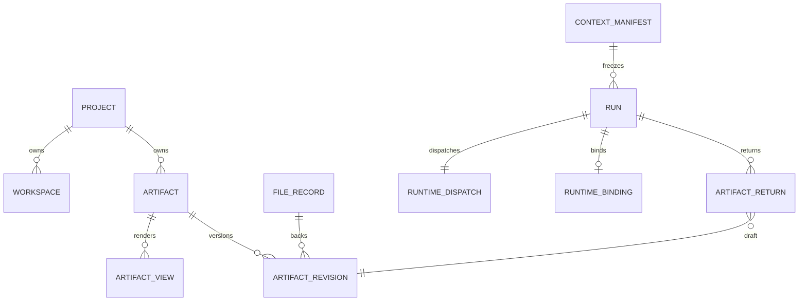
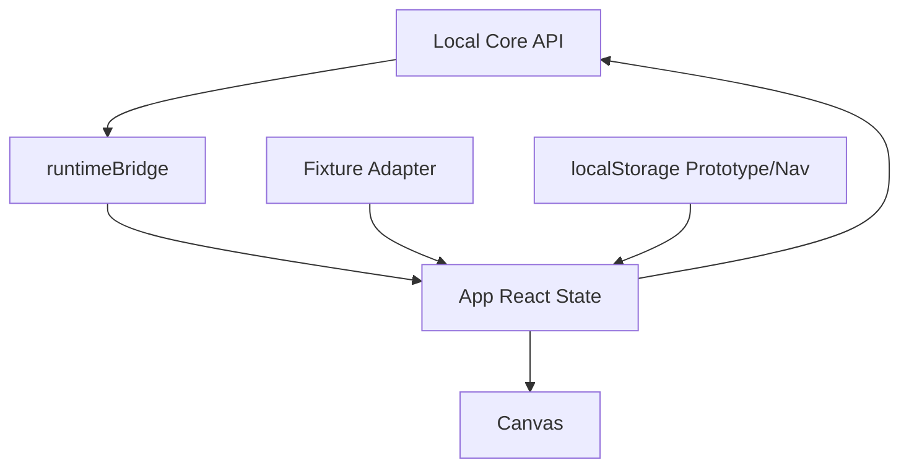
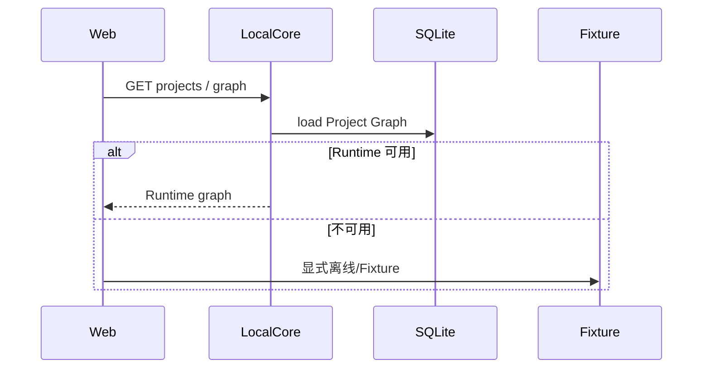
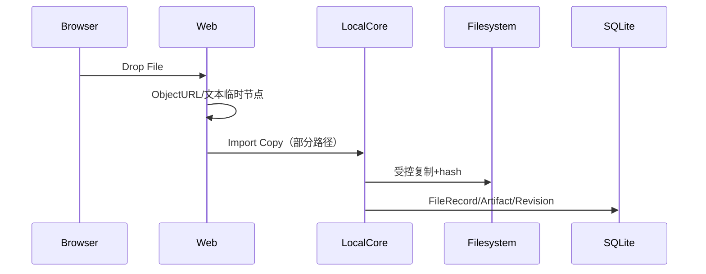
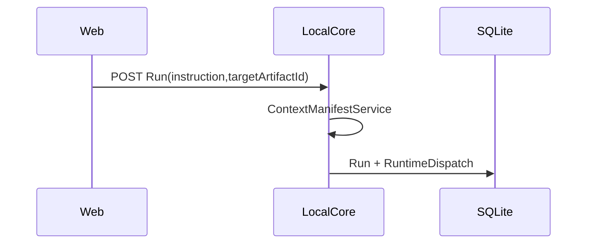
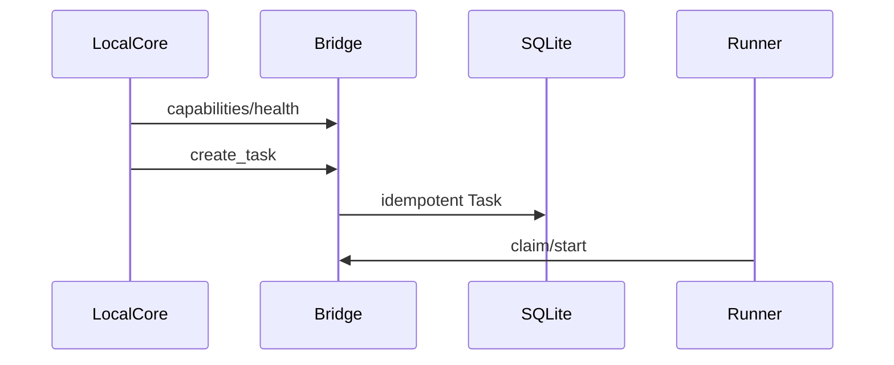
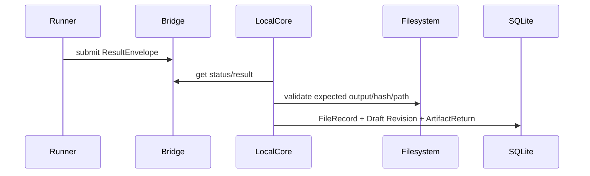
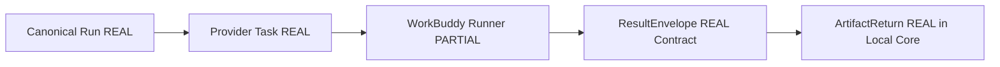
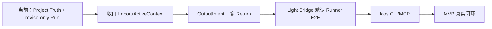

# Local Creative OS 当前真实架构审核

> 审计基线：`codex/mvp-fast-build @ b2b2633`
> 目标对照：《Local Creative OS 统一产品与架构规划 v3.0｜架构师评审版》
> 状态标签：REAL / PARTIAL / FIXTURE / MISSING / LEGACY

# 1. Executive Summary

**总体结论：CONDITIONAL GO。**

当前 LCOS 已经不是纯前端 Demo。Local Core 具备 SQLite v6、Project Graph、Import Copy、FileRecord、Preview、不可变 ContextManifest、Canonical Run、RuntimeDispatch、RuntimeBinding、ArtifactReturn、Draft Revision 与 Accept/Reject/Retry 的真实代码路径。Web 已能调用这些 API。Light Bridge Kernel 也具有独立 SQLite Task Plane、REST/MCP、幂等创建和 ResultEnvelope。

但“完整 Agent 闭环”仍是 PARTIAL：默认 Local Core 仍指向旧 Bridge `127.0.0.1:8920`；Light Bridge 源码已进入仓库并通过 canary，真实 WorkBuddy Runner 仍未成为可复现默认执行器。前端同时保留 React 本地状态、localStorage Prototype State、Fixture Adapter 与 Runtime Server State，形成明显双重真相。Browser Drop 仍先创建临时前端节点，真实 Import Copy 没有成为唯一入口。Run 又被限制为“唯一 Target + 单个 created 文件”，不符合高频新建产物场景。

最成熟：SQLite Project/Revision/Runtime 生命周期和文件安全边界。
最大风险：前端看起来完整，但部分操作仍可能停留在本地状态；Light Bridge 与旧 Bridge 并存；Run 语义过窄。

# 2. Repository Identity

- Repo Root：`E:\Codex 项目\OS开发`
- Worktree：`E:\Codex 项目\OS开发\.worktrees\mvp-fast-build`
- Branch：`codex/mvp-fast-build`
- HEAD：`b2b2633ece9d465d71d40c56d52d35fcb35b8e84`
- 审计开始状态：clean
- Node：`v22.22.3`
- npm：`10.9.8`
- 启动：`npm run dev:open`
- Web：`127.0.0.1:5173`
- Local Core：`127.0.0.1:43121`
- Light Bridge 默认：`127.0.0.1:43122`
- 旧 Bridge 默认：`127.0.0.1:8920/mcp`
- Local Core DB：由 `LOCAL_CORE_DB_PATH` 或 `apps/local-core/.data/phase2.sqlite` 决定。
- Light Bridge DB：由其 Settings/CLI 指定的 SQLite Runtime Root 决定。
- 并行 worktree：主目录、`mvp-fast-build`、`phase3-react-flow-spike`、`phase3-stage1-4`。

最近提交：`b2b2633` UI/Light Bridge Gate；`02b7ef1` MVP Runtime Loop；`d374628` v0.7 Shell；`7d7f00e` Return Review；`c0e2b75` Result Ingestion；`bb6103b` Dispatch Adapter；`5eddaea` Schema v6。

# 3. Current System Context



# 4. Repository Structure

```text
apps/web/                  # REAL UI；含 FIXTURE/localStorage 兼容
apps/local-core/           # REAL Project Truth、Runtime、文件服务
packages/domain/           # REAL 纯类型与状态规则
packages/contracts/        # REAL Web/Core/Runtime 边界
tests/architecture/        # REAL 架构静态约束
tests/integration/         # REAL 跨模块测试
scripts/                   # Launcher、E2E、canary
tools/light-bridge-kernel/ # REAL 独立 Bridge Kernel；尚非默认 Runtime
docs/audit/                # 审计
docs/handoffs/             # 交付事实
```

# 5. Runtime Components

| 组件 | 入口/端口 | 状态存储 | 当前判断 |
|---|---|---|---|
| Web | Vite / 5173 | React + localStorage + Local Core | REAL，存在双重状态源 |
| Local Core | `apps/local-core/src/index.ts` / 43121 | SQLite + 文件系统 | REAL |
| SQLite | `SqliteMetadataRepository` | schema v6 | REAL |
| Preview | `PreviewWorkerService` | hash cache + PreviewRecord | REAL，格式有限 |
| Old Bridge | MCP / 8920 | 外部 Runtime | LEGACY，仍是默认 |
| Light Bridge | `python -m lcos_bridge` / 43122 | 独立 SQLite | REAL 独立，PARTIAL 接入 |
| WorkBuddy Runner | 外部执行器 | 外部会话 | PARTIAL，默认 E2E 未冻结 |
| Bridge CLI | `tools/.../cli.py` | 复用 BridgeService | REAL |
| MCP | Light Bridge `/mcp` | 复用 BridgeService | REAL |

# 6. Domain Model

| 对象 | 状态 | 定义/持久化证据 | Truth Owner / 主要缺口 |
|---|---|---|---|
| Project | REAL | domain + `projects` | Local Core |
| Scope | REAL | domain + `scopes` | Local Core |
| Workspace | REAL | `workspaces.viewport` | Local Core；Web 仍有 navigation localStorage |
| Artifact | REAL | `artifacts` | Local Core |
| ArtifactView | REAL | `artifact_views` | Local Core |
| Relation | REAL | `relations` | Local Core |
| FileRecord | REAL | `file_records`、FileRegistryService | Local Core |
| ArtifactRevision | REAL | `artifact_revisions`、唯一 Current 索引 | Local Core |
| Note | REAL | `notes` | Local Core |
| Feedback | PARTIAL | 主要以 Artifact/Note 表达 | 缺少独立生命周期 |
| Decision | PARTIAL | UI/Checkpoint 表达 | Domain 独立能力不足 |
| Checkpoint | REAL | `checkpoints` | Local Core |
| PreviewRecord | REAL | `preview_records` | 可删除缓存 |
| ActiveContext | PARTIAL | Web selection/pinned/excluded | 未形成统一持久化对象 |
| ContextManifest | REAL | `context_manifests`、hash、不可变校验 | Local Core |
| Run | REAL | `runs` | Local Core Canonical Truth |
| RunEvent | PARTIAL | Domain type存在，独立事件存储不足 | 审计/恢复能力有限 |
| RuntimeBinding | REAL | `runtime_bindings` | Local Core 映射 |
| ArtifactReturn | REAL | `artifact_returns` | Local Core |

# 7. Database Architecture

- Schema Version：6，证据：`PRAGMA user_version` 与 `SqliteMetadataRepository.schemaVersion`。
- Migration：v1→v6 串行升级，Fresh DB 直接建完整 v6。
- 关键约束：Run canonical 状态 CHECK；Dispatch 独立状态；Binding 保存 Provider 状态；Return 状态 CHECK；`retry_of_run_id` 自引用；Current Revision 唯一索引；FK 开启。
- 事务：Run+Dispatch、Draft+Return、Accept、Reject/Retry 在 Repository 方法中形成事务边界。



主要缺口：`runs.target_artifact_id` 和 Return 模型隐含 revise-only；RunEvent 没有正式事件表；ActiveContext 没有明确持久化策略。

# 8. API Surface

Local Core 关键真实 API（`apps/local-core/src/server.ts`）：

- `GET /health`、`GET /projects`、`GET /metadata/status`
- Project Root validate
- Project Graph get/mutate
- Context Manifest build/read
- Run list/create、dispatch、sync、finalize
- Artifact Return review/accept/reject/retry
- Import Copy
- FileRecord read/refresh
- Preview generate/read
- Handoff Pack

Light Bridge（`transport/http_api.py`）：

- `/health`、`/v1/capabilities`
- `/v1/tasks`、by-run、status
- claim-next、running、result、cancel、finalize
- `/mcp` tools：health/create/lookup/status/claim/start/submit/cancel/finalize

PARTIAL：Local Core Capability Gate 已能选择 canonical/legacy，但默认 endpoint 仍为旧 Bridge。

# 9. Frontend Architecture

| 状态 | 当前 Owner | 恢复来源 | 风险 |
|---|---|---|---|
| Domain/Server | Local Core | SQLite | 正确 |
| Working Graph | `App.tsx` React State | Runtime 或 Fixture | 双重真相 |
| Selection | React State | 刷新丢失 | ActiveContext 未统一 |
| Navigation | React + localStorage | localStorage | 与 Workspace viewport 可能漂移 |
| Inspector/Popover | React State | 不恢复 | 合理临时状态 |
| Prototype State | `prototypeStorage.ts` | localStorage | 可能冒充 Project Truth |
| Fixture | qa-fixtures/runtime fallback | 静态数据 | 必须持续显式标识 |



# 10. Current User Flows

## 10.1 打开项目



## 10.2 Browser Drop / Import



判断：PARTIAL。临时前端节点仍存在，真实 Import Copy 尚未成为唯一创建路径。

## 10.3 Canvas Selection

选择主要保存在 React State，并参与 `inferTargetContext`；没有稳定 ActiveContext 实体写入 Local Core。刷新后不保证恢复。

## 10.4 创建 Run



判断：REAL，但只支持唯一 Target。

## 10.5 Bridge Dispatch



判断：Local Core 与旧 Bridge REAL；Light Bridge canary REAL；正式默认替换 PARTIAL。

## 10.6 Result Return



判断：REAL，但只接受一个 created 文件。

## 10.7 Accept / Retry / Reject

Accept 真实更新 Current Revision；Reject 更新 Return；Retry 创建带 `retryOfRunId` 的新 Run。证据：`RuntimeReviewService` 与 Repository 事务方法。

# 11. Light Bridge Architecture

Light Bridge Kernel 可独立运行。Task Plane、SQLite Store、REST、MCP、CLI、TaskEnvelope、ResultEnvelope、fingerprint/idempotency、claim/start/result/cancel/finalize 均有源码和测试。



风险：

- 与旧 Bridge 共存；
- 当前 Provider Registry 仍轻量；
- Session Continuity 是 Optional Plane，不等于原生对话恢复；
- 正式 Runner 的安装、唤醒、恢复仍未冻结；
- Light Bridge 不应合并进 Local Core DB。

# 12. CLI / MCP Architecture

Light Bridge CLI 复用 BridgeService，支持 init/capabilities/create/get/lookup/claim/start/submit/cancel/finalize 等操作。MCP 同样复用 Service。

当前缺口：尚未发现一个正式 `lcos` Project Truth CLI/MCP，让 Codex 只读获取 Project、Selection、ActiveContext 和 Manifest。Codex 目前不能通过统一正式接口完整进入 LCOS Project Truth。结论：MISSING/PARTIAL。

# 13. Truth Ownership Matrix

| 对象 | 当前 Truth Owner | 第二状态源 | 风险 |
|---|---|---|---|
| Project | Local Core | Fixture/catalog localStorage | HIGH |
| Canvas Layout | Local Core | React/localStorage | HIGH |
| Artifact | Local Core | 临时 Drop node | HIGH |
| Current Revision | Local Core | UI ActiveRun 投影 | MEDIUM |
| Active Selection | Web | 无 | 刷新丢失 |
| Context | Manifest=Core；Working=Web | pinned/excluded local state | HIGH |
| Run | Local Core | Web ActiveRun | MEDIUM |
| Provider Task | Bridge | RuntimeBinding 投影 | 可控 |
| Result | Bridge ResultEnvelope | Web changedFiles | MEDIUM |
| Review Decision | Local Core | UI 状态 | MEDIUM |
| Feishu Projection | MISSING | 无 | 不阻断 Core MVP |

# 14. State Machines

- Import：PARTIAL，临时 Drop 与 Import Copy 并存。
- Preview：REAL，missing/stale/unsupported/failed 有状态。
- Canonical Run：REAL，`created→queued→running→waiting_input/completed/failed/cancelled`。
- Provider Task：REAL in Bridge，但状态是 Provider Truth。
- Artifact Return：REAL，`pending_review→adopted|rejected`。
- Revision Review：REAL Accept/Reject/Retry；复杂 Diff 仍 PARTIAL。

# 15. Persistence and Restart Recovery

| 状态 | Browser Refresh | Core Restart | Bridge Restart | 证据 |
|---|---:|---:|---:|---|
| Project/Artifact/Revision | 是 | 是 | 不相关 | SQLite |
| Canvas Layout | 部分 | 是 | 不相关 | Workspace + local state |
| Imported Files | 是（正式导入） | 是 | 不相关 | FileRecord |
| Selection | 否/部分 | 不相关 | 不相关 | React/localStorage |
| ContextManifest | 是 | 是 | 不相关 | immutable table |
| Run/Binding/Return | 是 | 是 | 按 run lookup | v6 + canary |
| Bridge Task | 不相关 | 不相关 | 是 | Bridge SQLite |
| Preview | 可重建 | 可重建 | 不相关 | cache registry |

# 16. Idempotency and Concurrency

- Run Create：Dispatch `idempotencyKey` 唯一。
- Bridge Task：fingerprint + `lcosRunId` lookup。
- Binding：provider + externalTaskId 唯一。
- ArtifactReturn：run + canonicalPath + contentHash + action 唯一。
- Accept/Retry：事务与状态前置条件。
- Mutation：graph version stale guard。
- Canonical create 失败后不再自动 Legacy 双发；证据：`bridge-mcp-client.ts` capability lock 与测试。

缺口：真实并发 Runner、网络不确定响应、批量 Return 的系统级压力测试不足。

# 17. Security Boundaries

已实现：loopback、Project Path Guard、Import Copy 禁止浏览器路径字段、expectedOutputs、hash、隔离 staging、Accept 前不覆盖 Current、凭证不进 Web。

部分实现：Provider Runner 写权限最小化、Prompt Injection 内容隔离、Bridge 身份认证、飞书凭证边界。

阻断项：任何恢复旧 Route C 的行为必须重新建立签发端凭证；不得复用历史泄露包。

# 18. Test Architecture

现有命令：

- `npm run check:fast`
- `npm run test:integration`
- `npm run test:architecture`
- `npm run test:e2e:golden`
- Light Bridge：`pytest`
- Canary：`scripts/light-bridge-canary.mjs`

覆盖：单元、集成、架构、Restart Recovery、FK、Unique、Manifest Immutability、Run 状态、Provider 分离、Retry、自定义 Path Guard、Artifact Return。

缺口：真实 WorkBuddy 默认 Runner E2E、浏览器完整 Golden Path、并发和失败注入矩阵尚未成为每次发布门。

# 19. Legacy, Fixture and Technical Debt

| 项目 | 是否在路径 | 建议 |
|---|---|---|
| Old Bridge 8920 | 是，默认 | 能力握手后切 Light Bridge，再删除写路径 |
| Legacy MCP Contract | 是，显式/auto | 设置截止窗口 |
| Fixture Adapter | 是，离线 | 强标识，禁止静默接管 |
| Project Fixtures | 是 | 仅 QA |
| Browser Temporary Drop | 是 | Import Copy 成功前标 temporary |
| localStorage Prototype Graph | 是 | 迁移为只存 UI 偏好 |
| ActiveRun UI 状态 | 是 | 改为 Server Query projection |
| 单 Target/单文件 Return | 是 | Run Output Intent 改造 |
| 硬编码端口 | 是 | Launcher/env 统一 |
| RunEvent 存储 | 不完整 | MVP 需要最小事件/审计链 |

# 20. Current vs Target Gap Matrix

| 目标能力 | 当前 | 主要缺口 | 建议阶段 |
|---|---|---|---|
| Import Copy | PARTIAL | 临时 Drop 并存 | 立即 |
| ActiveContext | PARTIAL | 无统一对象/恢复 | 立即 |
| ContextManifest | REAL | V0 revise-only | Run 改造 |
| lcos CLI | MISSING | 无 Project Truth CLI | 1 周 |
| Canonical Run | REAL | 单 Target | Run 改造 |
| Light Bridge Binding | PARTIAL | 非默认 Runner | 立即 |
| ArtifactReturn | REAL | 单 created 文件 | Run 改造 |
| Draft Revision | REAL | create 新 Artifact 不完整 | Run 改造 |
| Accept/Retry/Reject | REAL | 多 Return/Compare 有限 | 1 周 |
| Session Binding | PARTIAL | 不等于原生 Resume | MVP 后 |
| Skill Registry | MISSING | 不应抢先 | MVP 后 |
| Feishu Provider | MISSING | 只规划投影 | MVP 后 |



# 21. Architecture Risks

## BLOCKER

1. Light Bridge 尚未替换默认旧 Bridge，真实执行路径不唯一。
2. Browser Drop/Fixture/localStorage 与 Local Core Project Truth 并存。

## HIGH

3. Run 强制唯一 Target 和单文件，产品模型偏离真实任务。
4. ActiveContext 没有统一持久化与读取接口。
5. WorkBuddy Runner 的可复现安装、唤醒和恢复未冻结。
6. Generic Mutation 曾可绕过 Current/Accept；Runtime 路径未使用它，但正式 Guard 仍应审计。

## MEDIUM

7. RunEvent/Activity 审计链不完整。
8. 多文件 Return 事务语义未定义。
9. Web `App.tsx` 聚合过多业务和状态职责。
10. 端口与 Adapter 配置仍偏开发态。

# 22. Recommended Migration Plan

## 立即阻断修复

- 将 Drop 的 temporary/runtime 状态做强区分，禁止显示为已保存。
- 冻结 ActiveContext 最小合同。
- 完成 Light Bridge + WorkBuddy 默认 Runner 的可复现 E2E。
- 为 Generic Mutation 增加 Revision Current Domain Guard。

## 1 周内

- 实施 OutputIntent Migration/Contract。
- 支持 create/analyze/revise。
- 支持多 ArtifactReturn 与新 Artifact Accept。
- Web Server State 替代 ActiveRun 本地模拟。
- 增加只读 `lcos` CLI：project/context/manifest/run status。

## 2 周内

- 删除旧 Bridge 写路径。
- 删除 Prototype Graph 的 Project Truth 职责。
- 完整 Restart/Failure/Concurrency E2E。
- 收口 Compare 与 Return Group Review。

## MVP 后

- Session Federation；
- Skill Registry；
- 飞书投影与选择性回写；
- 第二 Provider；
- 复杂媒体 Diff。

# 23. Architecture Decision Requests

1. ActiveContext：推荐短期持久化、带 TTL/版本，不把 hover 等临时态写库。
2. Manifest：推荐永久不可变，新 Run 新 Manifest。
3. Run/Task：推荐 1 Run 对 1 当前 Provider Task，Retry 为新 Run。
4. Dispatch/Outbox：已有 RuntimeDispatch；MVP 不另建通用 Outbox，先补恢复扫描。
5. Retry：推荐永远 New Run。
6. Return/Revision：推荐同一事务创建 Draft+Return；Accept 单 Return 原子。
7. CLI/MCP/HTTP：推荐共用 Application Service。
8. Bridge 迁移：推荐一个双读单写窗口，禁止双写。
9. Session Continuity：保持 Optional Plane。
10. 飞书：MVP 只做投影/通知；回写必须显式且经过 Local Core。

# 24. Final Verdict

**总体结论：CONDITIONAL GO。**

- 当前最可信能力：Local Core 的 SQLite Project/Revision/Runtime/Return 生命周期。
- 当前最危险双重真相：Web 本地状态/Fixture 与 Local Core；旧 Bridge 与 Light Bridge。
- MVP 最短真实路径：Import Copy → ActiveContext → OutputIntent Run → Light Bridge 默认 Runner → ResultEnvelope → ArtifactReturn → Accept → Restart。
- 必须暂停：更多节点类型、复杂 Workflow、第二 Provider、飞书双向写回、完整 Session Federation。
- 下次复审触发条件：真实 WorkBuddy E2E、OutputIntent 合同冻结、旧 Bridge 写路径退出、Browser Drop 只剩正式 Import Truth。
