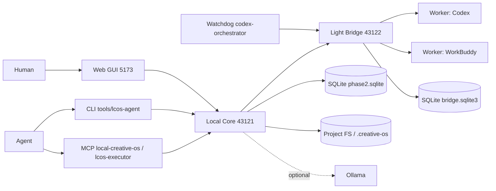
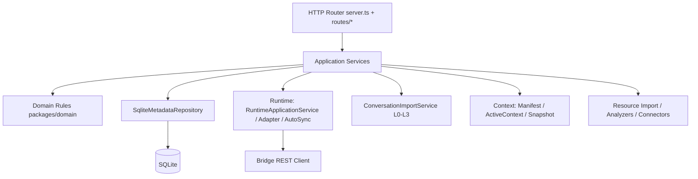
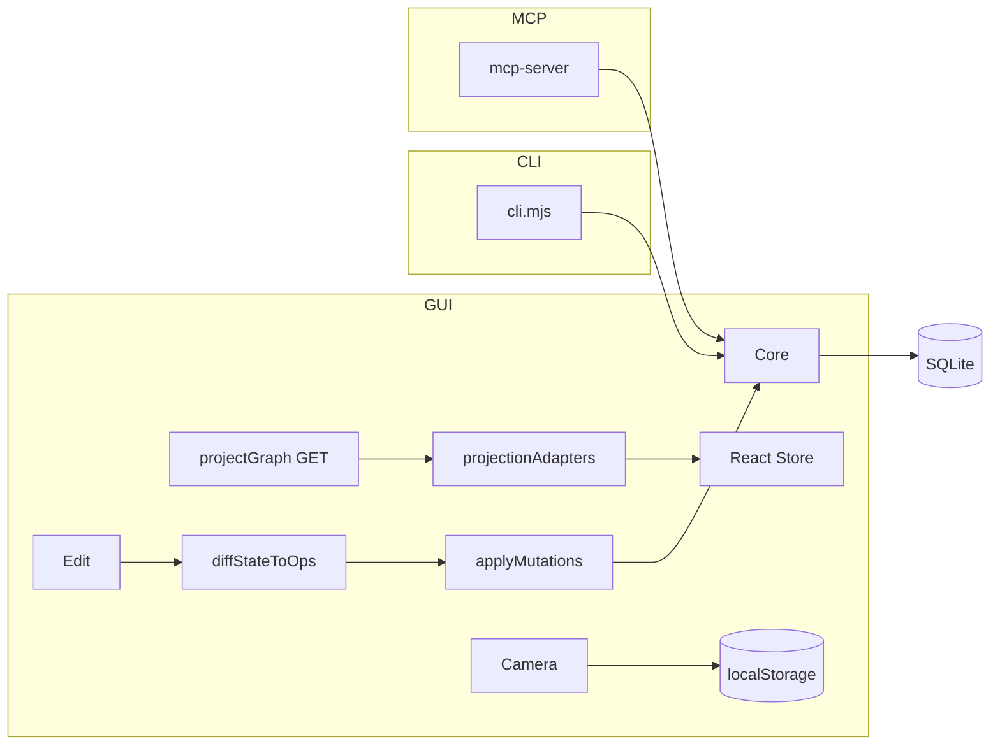
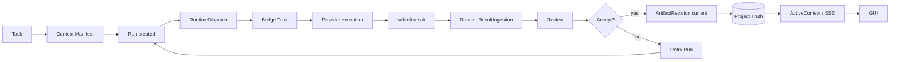

# LCOS Current Architecture Census（AS-IS 盘点）

日期：2026-08-10
性质：只读现状盘点（未改任何业务代码）
基线：worktree `E:\Codex 项目\OS开发\.worktrees\mvp-fast-build` @ `codex/backend-hardening-20260802`（HEAD f1c1153）
依据：`LCOS_CURRENT_ARCHITECTURE_CENSUS_BRIEF_FOR_CODEX_20260810.md`

---

## 00 Executive Summary

1. **Local Core 已经是唯一 Project Truth**：`apps/local-core` 用单文件 SQLite（`phase2.sqlite`，43 张业务表）持有 Project/Workspace/Artifact/Revision/Relation/Conversation/Run/Checkpoint/ContextManifest/ActiveContext/Handoff/Resource 全套状态。GUI、CLI、MCP 均通过同一 HTTP 面访问它。
2. **GUI 存在两条数据路径**：runtime 模式走 Core mutations（`applyMutations`），fixture/原型模式走 `localStorage`（`prototypeStorage` v9/v10）。相机与导航状态**始终**写 localStorage（`projectNavigation`），与 Core 的 ActiveContext viewport 并存但不同源。
3. **Presentation 层没有 Core 契约**：Strands 位置/剪开/临时边、大纲层级/折叠、思维导图状态都是**内存级**（`presentationDraftState`、`presentationHierarchyState`，代码注释明确等 PresentationView 契约）；Context 来源（`contextPresentationIds`）也是 React 内存。重启即丢。
4. **Bridge 是执行租约层，不是第二个 Core**：`light-bridge-kernel`（Python/FastAPI）只有 `bridge_tasks` + `bridge_meta` 两张表，负责 claim/lease/heartbeat/result/finalize；Project Truth 仍在 Core。但 Run 状态存在**三份**：Core `runs.status`、Bridge `bridge_tasks.status`、Core `runtime_bindings.provider_status`（自动同步 10s 轮询）。
5. **会话能力 L0/L1 ACTIVE、L2 PARTIAL、L3 代码存在但运行时未激活**：Codex JSONL 流式导入 + FTS5 可用（真实导入 713 条消息/91 章节已验证）；章节注解（decisions/todos）有表+API+MCP，无端到端测试；Ollama embedding + sqlite-vec 代码完整，但 `.runtime/` 目录为空（vec0.dll 未安装），当前走 `sqlite-blob-fallback`，且 L3 无测试。
6. **Project Memory Graph 不存在**：没有 `memory_nodes`/`memory_edges`/Episode/Stage 表或服务。现有 `relations` 是 Domain Relation（artifact↔artifact/workspace），会话章节实体化后复用同一张表；「GraphRAG」属于 PROPOSED ONLY。
7. **Context Pack 不含 Conversation**：`ContextManifestService` 只组装 target + context artifacts + resource refs + locked elements（单条 32k / 总 128k 字符上限）；会话内容必须 pin 成 decision artifact 才能进入 Run 上下文。
8. **Import Adapter 只有 Codex + Manual**：ChatGPT/Claude/Gemini/Aider 在枚举/常量里有名字，无解析器、无生产路径、无测试。

---

## 01 Repository Topology

| Component | Path | Runtime | Entry Point | Purpose |
|---|---|---|---|---|
| Web / GUI | `apps/web` | Node/Vite | `src/main.tsx` → `App.tsx` | Human Projection / Interaction |
| Local Core | `apps/local-core` | Node（内置 `node:sqlite`） | `src/index.ts` → `dist/index.js` | Project Truth Authority |
| CLI | `tools/lcos-agent` | Node | `cli.mjs` | Local Agent / Power-user Access |
| MCP（local-creative-os） | `tools/lcos-agent` | Node stdio | `mcp-server.mjs` | Agent 会话内工具面 |
| MCP（lcos-executor） | `tools/lcos-agent` | Node stdio | `mcp-executor-server.mjs` + `executor-tools.mjs` | 执行器 claim/start/heartbeat/submit |
| Bridge | `tools/light-bridge-kernel` | Python 3.11 / FastAPI | `src/lcos_bridge/__main__.py`（`cli.py` 启动 uvicorn） | 执行租约 / worker 网关 |
| Watchdog | `tools/codex-orchestrator` | Node | `watch.mjs` | 轮询 Bridge 待办、派 Codex 会话 |
| Runtime capabilities 声明 | `tools/lcos-runtime` | JSON | `capabilities.json` | Bridge capabilities 快照（与 Python `capabilities()` 并存） |
| Contracts | `packages/contracts` | TS | `src/index.ts` + conversations/resources/connectors | 边界接口 |
| Domain | `packages/domain` | TS | `src/index.ts` | 纯领域类型/规则 |
| UI tokens | `packages/ui` | TS | `src/index.ts` | 颜色/动效 token（仅此） |
| Skills 包 | `packages/skills` | Markdown | 21 文件（5 个 skill + spec + index） | Agent 行为协议 |
| Scripts / Tests | `scripts`、`apps/*/tests`、`tests/` | Node/PW | 见 §Evidence | smoke / 验证链 |

注：`apps/web` 顶部还有根级 `vite.config.ts` / `src/` / `tests/`（v0.7 遗留单仓形态），与 `apps/web` 并存；`packages/ui` 几乎未使用（GUI 自带 CSS 体系）。

---

## 02 Runtime Processes（实测，2026-08-10）

| 进程 | PID | 端口/入口 | 状态 |
|---|---|---|---|
| Local Core | 21668（`node dist/index.js`，父 npm 29272） | 127.0.0.1:43121 | 运行中（health OK，`phase_2_lite`） |
| Web/Vite | 7484 | 127.0.0.1:5173 | 运行中 |
| Watchdog | 26448（`tools/codex-orchestrator/watch.mjs`） | — | 运行中 |
| MCP server | 42596（`tools/lcos-agent/mcp-server.mjs`） | stdio | 运行中 |
| Light Bridge | — | 127.0.0.1:43122 | **NOT PRESENT（当前未监听）** |
| Ollama | — | — | NOT PRESENT（本机未装） |
| sqlite-vec（vec0.dll） | — | `.runtime/` | NOT PRESENT（目录为空） |
| WorkBuddy weixinpay MCP / Blender MCP | 18740/42252/17060/44796 | 外部插件 | 与本仓库无关，未计入 |

Bridge 代码存在（`tools/light-bridge-kernel` + 测试），但本盘点时刻 dev 栈未拉起它；Core 的 `RuntimeAutoSyncService` 每 10s 探测 Bridge，未运行时会进入降级路径。

---

## 03 Core Boundary

判定标准：移除后 Project Truth 无法正确存在或更新 → 属于 Core。

| 模块 | Path | Responsibility | Owned tables | Public services |
|---|---|---|---|---|
| SQLite Repository | `src/metadata-repository.ts`（~2900 行） | 全部实体持久化、版本 CAS、Run 事件回调 | 43 张业务表 | `upsert* / get* / applyMutations / saveProjectGraph` |
| Project / Workspace | `src/routes/projects.ts`、`entity.ts`、`workspace-state-service.ts`、`workbench-service.ts` | 项目注册、工作空间、现场集合 | projects/scopes/workspaces/workspace_memberships | `createProject / saveWorkspaceState / mergeWorkbench` |
| Artifact / Revision / File | `src/file-*`、`text-artifact-service.ts`、`import-copy-service.ts`、`file-format-registry.ts` | 受管文件、哈希、预览、导入副本 | artifacts/artifact_views/artifact_revisions/file_records/preview_records | `createTextArtifact / importCopy / generatePreview` |
| Relation | `src/routes/entity.ts` | Domain Relation 唯一写入点 | relations | `upsertRelation / deleteRelation` |
| Conversation / Evidence | `src/conversation-import-service.ts`（~1400 行） | Codex JSONL 导入、FTS5、章节派生、注解、决策 pin、embedding 任务 | conversation_*（12 张 + FTS shadow） | `importSession / complete / sections / annotate / pin / semanticIndex / search` |
| Run / Runtime | `src/runtime-application-service.ts`、`runtime-result-ingestion.ts`、`runtime-review-service.ts`、`runtime-proposal-service.ts`、`runtime-revision-compare-service.ts`、`runtime-auto-sync-service.ts` | Run 生命周期、dispatch、ingestion、review、retry、自动同步 | runs/run_events/run_input_requests/runtime_dispatches/runtime_bindings/artifact_returns/context_manifests/command_drafts/provider_session_bindings/context_proposals | `create / dispatch / cancel / sync / finalize / accept / reject / retry` |
| Context / ActiveContext | `src/active-context-store.ts`、`context-manifest-service.ts`、`context-snapshot-service.ts`、`context-proposal-store.ts`、`process-projection-service.ts` | Agent 视口快照（CAS）、Run 上下文打包、Checkpoint、提案 | active_contexts/context_manifests/checkpoints/context_proposals | `updateActiveContext / buildManifest / createSnapshot / proposeContextChange` |
| Handoff | `src/routes/handoffs.ts` | 交接记录 | handoffs/session_summaries | `createHandoff` |
| Resource / Connector | `src/resources/*`、`src/connectors/*` | 通用资源导入、分析器、Obsidian 只读 | resource_descriptors/resource_analysis_jobs/resource_policies | `importResource* / analyze / match / obsidianScan` |
| Lcosproj | `src/lcosproj-service.ts` | 工程文件导入导出 | （复用） | `export / open` |

Inbound callers：GUI（HTTP）、CLI（HTTP）、MCP（HTTP）、Bridge（HTTP 回写 executor 面）、外部脚本。Outbound：Bridge REST（`bridge-rest-client.ts`）、文件系统（受管根目录内）、Ollama（可选）。

---

## 04 Outside-Core Components

| 组件 | Path | 适配什么 | Core API 消费 | 能改 Core？ | 私有持久状态？ | 重复业务逻辑？ |
|---|---|---|---|---|---|---|
| GUI | `apps/web/src` | 人 | `localCoreClient` 全量（graph/mutations/active-context/SSE/runs/conversations） | 是（runtime 模式） | localStorage（prototype v10、projectNavigation、catalog） | 是（见 §17） |
| CLI | `tools/lcos-agent/cli.mjs` | 本地 Agent/脚本 | Core HTTP + Bridge `/executor/*` | 是 | 无 | 少量（project resolve） |
| MCP | `mcp-server.mjs` | Codex 会话 | Core HTTP | 是（relation/active-context/run/pin） | 无 | 部分语义映射 |
| Bridge | `tools/light-bridge-kernel` | 执行 worker 网关 | 被 Core 调用（executor 路由代理）+ 主动回写 | 通过 executor 面（submit/answer） | `bridge.sqlite3`（bridge_tasks） | Run 状态机副本（见 §17） |
| Watchdog | `tools/codex-orchestrator` | Codex 接单轮询 | Bridge HTTP（claim） | 通过 Bridge | 无 | 无 |
| Codex Dispatch | `src/codex-dispatch-service.ts`（Core 内） | 生成 Codex 执行计划 | Core 内部 | — | — | — |
| Runtime Adapter | `src/runtime-adapter.ts`、`adapter-registry.ts`、`bridge-rest-client.ts` | Bridge 信封 v0/v1 | Core 内部 | — | — | 无 |
| Import Adapter | `conversation-import-service.ts` | Codex JSONL / manual | Core 内部 | — | — | — |
| External Infra | Ollama / sqlite-vec / FS / Feishu URL | — | — | — | — | — |

---

## 05 GUI Architecture

### Read Path（代码追踪）

```
App.tsx → bridgeRef.current.client.projectGraph() → GET /projects/:id/graph
→ SqliteMetadataRepository（SQLite）→ projectionAdapters.ts → CanvasNode[]
→ React state（setNodes/setEdges）→ ProjectCanvas / surfaces
```

- Project 列表：`GET /projects`（Core）→ `prototypeStorage` 另存一份 catalog（localStorage）。
- Workspace/Scopes/Artifacts/Relations：全部来自 `projectGraph` 快照（Core）。
- Conversation：`conversations / projection / messages / search`（Core）。
- Run：`projectRunReviews / runEvents / getRunInputRequest`（Core）。
- ActiveContext：`GET active-context` + **SSE**（`streamActiveContext`，`canvas.ts` 路由 `text/event-stream`），GUI 用它做实时上下文（版本 CAS）。
- 相机：首次从 ActiveContext 或 localStorage 恢复，之后写 `projectNavigation`（localStorage）+ ActiveContext viewport（Core，仅 MCP/跨端同步）。

### Write Path（逐项标记）

| 动作 | 路径 | 标记 |
|---|---|---|
| move/arrange node | `diffStateToOps` → `applyMutations(move_artifact_view)`（runtime 模式，280ms debounce）；非 runtime 模式 → `savePrototypeState` | runtime: CORE WRITE；fixture: LOCALSTORAGE |
| create Relation | `upsert_relation`（applyMutations） | CORE WRITE |
| edit Artifact / create Revision | 受管文件走 `importCopy`/Run 产物；文本节点走 `createTextArtifact` | CORE WRITE |
| Run / Review / Accept / Retry | `createRuntimeRun / finalize / acceptArtifactReturn / retryArtifactReturn` | CORE WRITE |
| Drop to Context / Workflow | 仅改变 `contextPresentationIds`/`workflowPresentationIds`（React 内存）+ `activeContext` 部分字段（selected/pinned） | FRONTEND MEMORY ONLY（+ active_contexts 部分同步） |
| Context presentation edit（Strand 移动/剪开/临时边） | `presentationDraftState`（内存 Map） | FRONTEND MEMORY ONLY（注释：等 PresentationView 契约） |
| 大纲层级/折叠 | `presentationHierarchyState`（内存 Map） | FRONTEND MEMORY ONLY |
| 相机 | `projectNavigation` localStorage（3s debounce + flush） | LOCALSTORAGE |
| Selection | React `selectedIds` + `updateActiveContext`（CAS 写 Core active_contexts） | CORE WRITE（ActiveContext）+ 内存 |

### 派生逻辑位置

- `projectionAdapters.ts`：graph → CanvasNode（kind 映射、preview 解码、runtimeRole 判定）——GUI 派生。
- `capabilityViewResolver.ts`：Context/Workflow 投影来源解析（explicit/workspace/history 优先级）——GUI 派生，Core 无对应服务。
- `runtimeBridge.diffStateToOps`：GUI 状态 diff → Core mutation——适配层派生（双写风险点）。

---

## 06 CLI Architecture

入口：`tools/lcos-agent/cli.mjs`（`group` + `action` 双级），直接调 Core HTTP（`lib/client.mjs`），doctor 面同时探 Bridge `/executor/*`。

Groups（23）：`doctor capabilities project artifact revision relation canvas context conversation manifest open preview process provider-session providers resource run selection session target task workspace connector`

能力代表：`project open/create/show/export`、`run create/dispatch/cancel/retry/events/input/answer`、`conversation import/import-manual/sections/annotate/pin/search/index-build`、`context watch/viewport/select/proposals`、`resource match/read/import`、`connector obsidian-scan/obsidian-import`、`lcosproj open/export-all`。

调用链：

```
Agent / User → cli.mjs → HTTP → Local Core routes → service → repository → SQLite
```

判断：**CLI 是 Core 的一等入口**。直接读写文件/JSON/runtime storage 的路径：`project open/create`（root 校验在 Core）、`conversation import`（分片上传经 Core staging，文件不经 CLI 手写）、`export-lcosproj`（Core 写目标路径）。CLI 自身无旁路写库。

---

## 07 MCP / Bridge Architecture

### MCP Tool Inventory（实现即清单）

- `mcp-server.mjs`（local-creative-os）：39 个 tool()。面：project（list/summary/bind）、active-context（get/watch/apply/select/focus）、relation（create）、preview（open）、plan（validate）、proposal（propose/accept/reject/list）、run（create/dispatch/cancel/get/input/answer）、return（accept/reject/retry）、conversation（import/list/get/search/read/sections/annotate/pin）、resource（read/match）、obsidian（scan/import）。
- `mcp-executor-server.mjs` + `executor-tools.mjs`（lcos-executor）：8 个工具——`claim_lcos_run / start_lcos_run / heartbeat_lcos_run / fail_lcos_run / get_lcos_task / get_lcos_run_context / request_lcos_user_input / submit_lcos_result`。

判定：**当前是 thin adapter + 少量编排**。工具实现主体是 Core HTTP 直调；`run` 面的 create→dispatch 是两步显式调用（编排在 Agent/Skill 侧，不在 MCP server 内）。没有第二套状态管理或 Graph Engine。

### Bridge 承担什么

| 职能 | 位置 | 说明 |
|---|---|---|
| Protocol Bridge | `transport/http_api.py`（12 路由） | `/v1/tasks`、claim、running、heartbeat、result、input-response、cancel、finalize |
| Runtime Dispatch 出口 | Core `runtime-adapter.ts` → `bridge-rest-client.ts` | Core 是调度发起方 |
| Task State | `core/store.py` `bridge_tasks` | lease/claim/heartbeat/final_disposition |
| Worker 协调 | `store.claim_next / claim_task_by_id / direct_task` | 租约 120s |
| Artifact Return 信封 | `result_json / envelope_json` | 结果落 Bridge DB，随后 Core ingestion 消费 |
| 会话/绑定 | Core `provider_session_bindings` | Bridge 不持 |
| Notification | 无 SSE；Core 轮询同步 | — |

### Core state vs Bridge state

| 状态 | Core | Bridge |
|---|---|---|
| Run 生命周期 | `runs.status`（权威） | `bridge_tasks.status`（任务租约） |
| Provider 状态 | `runtime_bindings.provider_status` | `bridge_tasks.provider_status` |
| 结果 | `artifact_returns` + revision | `result_json` 副本 |
| 用户输入 | `run_input_requests` | `input_request_json/input_response_json` 副本 |

结论：Bridge 未形成第二个 Core，但形成**执行态副本**；Core 通过 `RuntimeAutoSyncService`（10s）收敛。

---

## 08 Shared Application Services 矩阵

| Capability | GUI | CLI | MCP | Core Service | Same Mutation Path? |
|---|---|---|---|---|---|
| Project | YES | YES | list/bind | `routes/projects.ts` | YES（HTTP→同服务） |
| Workspace | YES | YES | 部分（active-context） | `entity.ts`/`workbench.ts` | YES |
| Artifact | YES | artifact show/read | 部分 | `entity.ts` | YES |
| Revision | YES（显示/对比） | revision compare | — | `artifacts.ts` | YES |
| Relation | YES | relation add | create_lcos_relation | `entity.ts` | YES（三种入口同表） |
| Conversation import | YES | YES | YES | `conversations.ts` | YES |
| Context search | GUI 对话内搜索 | conversation search | search_lcos_conversations | `conversations.ts` | YES |
| Context pack | Run 内隐式 | manifest build | — | `context-manifest-service.ts` | PARTIAL（GUI 无显式 UI） |
| Run | YES | YES | create/dispatch | `runtime-application-service.ts` | YES |
| Cancel Run | YES | run cancel | cancel_lcos_run | 同上 | YES |
| Review | YES | run get | get_lcos_run | `runtime-review-service.ts` | YES |
| Artifact Return | YES | task get | accept/reject/retry | 同上 | YES |
| Checkpoint | YES | — | — | `context-snapshot-service.ts` | PARTIAL（CLI/MCP 无） |
| Metrics | NO | NO | NO | NOT IMPLEMENTED | — |
| Presentation membership | GUI 内存 | context select | select/focus | active_contexts（部分） | NO（语义不统一，见 §17） |

---

## 09 Truth Ownership Matrix

| State / Entity | Owner | Persistence | GUI Copy | CLI Copy | Bridge Copy |
|---|---|---|---|---|---|
| Project | CORE | projects | catalog localStorage 副本 | 查询 | 无 |
| Workspace | CORE | workspaces | React + prototypeStorage 副本 | 查询 | 无 |
| Artifact | CORE | artifacts | React 派生节点 | 查询 | 无 |
| ArtifactRevision | CORE | artifact_revisions | 派生 revisionLabel | 查询 | 无 |
| Relation | CORE | relations | edges | 写/查 | 无 |
| Decision | CORE | notes + conversation pin（decision_artifact_id） | 节点 | 查询 | 无 |
| Conversation | CORE | conversation_sessions | 投影 | 查询 | 无 |
| Conversation Section | CORE | conversation_sections | 投影 | 查询 | 无 |
| Run | CORE | runs | 派生 runStatus | 写/查 | **副本（bridge_tasks.status）** |
| RuntimeDispatch | CORE | runtime_dispatches | — | — | 对应 task |
| Outbox | CORE（近似） | runtime_dispatches（无独立 outbox 表） | — | — | — |
| Checkpoint | CORE | checkpoints | 列表 | 无 | 无 |
| Context Manifest | CORE | context_manifests | 无 UI | manifest build | 信封内引用 |
| Context Digest | CORE（部分） | context_proposals/active_contexts | 提案面板 | context proposals | 无 |
| Presentation | **AMBIGUOUS** | 无 Core 契约 | 内存/本地存储 | active_contexts 部分字段 | 无 |
| Canvas Position | CORE（runtime） | artifact_views.position | 内存 + localStorage | 查询 | 无 |
| Selection | CORE（ActiveContext）+ GUI | active_contexts | React selectedIds | select/focus | 无 |
| Agent Session | CORE | provider_session_bindings | 无 UI | provider-session | 无 |
| Provider Status | **AMBIGUOUS** | runtime_bindings + bridge_tasks | 派生 | doctor | 副本 |
| Metrics | NOT PRESENT | — | — | — | — |
| Memory Graph | ABSENT | — | — | — | — |
| Embedding | CORE | conversation_embeddings（blob fallback） | — | index-build/status | 无 |

---

## 10 SQLite Schema Census

数据源：`apps/local-core/.data/phase2.sqlite`（8MB + WAL），`node:sqlite` 直读 43 张业务表。

### Project Truth
- `projects`（PK id；graph_version/last_opened_at）
- `scopes`（kind: root/collection/context/delivery/temporary-workbench；container_view_id）
- `workspaces`（intent/viewport/focused_node_ids/visible_layers/context_policy/frame_bounds/preferred_surface/version）
- `artifacts`（kind/availability/current_revision_id/managed）
- `artifact_views`（scope_id/position/size/display_mode/collapsed）
- `artifact_revisions`（file_record_id/parent/source/run_id/status）
- `file_records`（hash/size/mime/availability）
- `relations`（source/target entity type+id/kind）
- `notes`（anchor: scope/artifact/view/page）
- `checkpoints`（snapshot_json）
- `workspace_memberships`（workspace×view）

### Conversation / Evidence
- `conversation_sessions`（origin_meta/diagnostics/conversation_artifact_id/view_id）
- `conversation_messages` + `conversation_messages_fts*`（FTS5 shadow 5 张）
- `conversation_sections` / `conversation_section_annotations`（decisions/todos/involved_files/source_hash）
- `conversation_import_sessions` / `conversation_import_chunks`（staging/chunk hash）
- `conversation_file_references`（raw/normalized/artifact_id/relation_id）
- `conversation_embeddings`（embedding_blob/model/dimensions/input_hash）— **BLOB 落库**
- `conversation_embedding_jobs`（lease/attempt/stale 检测）

### Run / Runtime
- `runs`（status/retry_of_run_id/output_intent/return_group_id/result_policy）
- `run_events`（sequence/payload_json）
- `run_input_requests`（question/options/free_text/status/answer）
- `runtime_dispatches`（provider/idempotency_key/attempt/last_error）
- `runtime_bindings`（external_task/session/provider_status/finalize_pending）
- `artifact_returns`（action/status/draft_revision_id/canonical_path）
- `provider_session_bindings`（lease_owner/expiry/failure_count）
- `command_drafts`（composer_anchor/prompt/context_view_ids/provider）
- `context_manifests`（target/revision/canonical_json/manifest_hash）
- `context_proposals`（proposal_json/status）
- `active_contexts`（project×workspace_key/version/projection_json）

### Handoff / Resource / Preview
- `handoffs` / `session_summaries`
- `resource_descriptors` / `resource_analysis_jobs` / `resource_policies`
- `preview_records`（cache_path/mime/status）

**缺席**：metrics 表、memory_nodes/memory_edges、outbox 独立表、presentation 表、vector 专用表（vec0 未建，embeddings 为 BLOB）。

---

## 11 Conversation L0–L3 实际状态

| Layer | 代码 | 测试 | 运行时依赖 | Active Path | Production-ready? |
|---|---|---|---|---|---|
| L0 Codex JSONL streaming / 规范化 / FTS5-BM25 | ACTIVE（`conversation-import-service.ts`：分片导入、事件过滤、去重、content_hash、FTS5 external content） | 有（`conversation-import-service.test.ts`：import+FTS5；`conversation-import-smoke.mjs`/`large`/`recovery`） | 无 | 是（真实导入 713 消息已验证） | 是（中文检索质量未基准化） |
| L1 sections / timeline / outline / basic relation graph | ACTIVE（零 token 规则派生章节：instruction/turn/tool_cluster/long_message；dialog timeline/outline；会话→章节画布实体化） | 有（import/锁标题/compact export） | 无 | 是 | 是（章节标题含解析噪音） |
| L2 Agent annotations / decision/todo/file / sourceHash | PARTIAL（表+API+MCP 工具齐全，`annotate_lcos_conversation_section` sourceHash 守卫；`pin` 生成 decision artifact） | 无端到端注解测试 | 无 | 是（API 可用） | 否（无测试、无 UI 主导入） |
| L3 Ollama embedding / sqlite-vec / hybrid / incremental | IMPLEMENTED BUT NOT ACTIVE（`#ollamaEmbed`、vec0 加载探测、增量 stale 检测、jobs 租约；无 vec0 时 BLOB fallback） | 无 | Ollama + `.runtime/sqlite-vec` DLL（**均未安装**） | 否（fallback 路径存在但无语义检索收益） | 否 |

---

## 12 Relation / Project Memory Graph Census

| 概念 | 状态 |
|---|---|
| memory_nodes / memory_edges | ABSENT |
| graph traversal（Core 服务） | ABSENT（GUI `relationGraphModel` 是前端局部遍历） |
| state resolution / supersession | PARTIAL（revision status/current 在 Core；无图级解析） |
| graph-aware retrieval | ABSENT（resource matcher 是关键词+描述匹配，不是图检索） |
| context budget compiler | PARTIAL（manifest 有 32k/128k 截断预算，无语义压缩） |
| Stage / Episode / Decision / Constraint / OpenLoop | ABSENT（无表；Decision 近似 = pinned message/note） |

当前实际存在的 Relation 语义：

| 套 | 载体 | 同源？ |
|---|---|---|
| Domain Relation | `relations` 表（artifact/workspace/scope/note） | 是（唯一权威） |
| Canvas Relation（GUI edges） | 由 Domain Relation 投影 + 前端临时边（presentation-draft） | 投影同源；临时边不同源 |
| Conversation-derived Relation | 导入时生成 `conversation_file_references` + 会话→章节 `reference` 关系 | 与 Domain Relation 共表，语义标注为 `conversation_file_reference` |
| Presentation Relation | `presentationDraftState` 内存（Strands 临时边） | 不同源、不落库 |

结论：不存在第二套 Project Truth；但 Presentation 临时关系是纯内存，重启丢失。

---

## 13 Presentation Layer Census

| 项 | Core | SQLite | frontend store | memory-only | localStorage | no formal model |
|---|---|---|---|---|---|---|
| Arrange presentation（画布位置/尺寸） | 部分 | artifact_views.position | YES | — | prototype 副本 | — |
| Context membership（来源） | 部分 | active_contexts（selected/pinned/excluded） | YES（contextPresentationIds） | YES | — | — |
| Context hierarchy（大纲层级/深度/顺序） | — | — | — | YES（presentationHierarchyState） | — | — |
| Mind Map | — | — | — | 同 hierarchy | — | — |
| Strands（位置/剪开/临时边） | — | — | — | YES（presentationDraftState） | — | — |
| Local Relation（图中心/2hop/筛选） | — | — | projectionLayoutState | YES | — | — |
| Workflow presentation | — | — | workflowPresentationIds | YES | — | — |
| Canvas position（相机） | 部分 | active_contexts.viewport | — | — | projectNavigation | — |
| manual anchor（拖拽钉住） | — | — | — | YES | — | — |
| collapsed state（大纲折叠） | — | — | — | YES | — | — |
| renderer preference | 部分 | workspaces.preferred_surface | — | — | — | — |

---

## 14 Context Pack / Retrieval

```
Run create
↓
ContextManifestService.build（Core）
输入：target artifact+revision / contextArtifactIds / resource matcher（descriptor 匹配，limit 8）
→ 每条 32k 字符、总 128k；locked elements 正则提取；render markdown
→ 落库 context_manifests + RuntimeInputPackV0（含 resourceRefs/resourceFiles）
↓
Bridge task → Provider（Codex/WorkBuddy）
```

参与方：Project（间接，通过 artifacts/workspace）、Artifact（是）、Resource（是）、Relation（否，仅 manifest 引用 artifact）、Conversation（**否**，除非 pin 成 artifact）、Vector Search（否）、GUI（否，无显式打包 UI）、Token budget（字符截断 + 后续模型窗口，无 token 计量）。

判断：**当前 Context Pack 表达的是“选定 Artifact + 匹配资源”的 Run 输入，不是“Current Project State”**。会话、开放问题、最近决策、strand 关系都不在包里。

---

## 15 Run / Execution 闭环

```
GUI/CLI/MCP → RuntimeApplicationService.create（校验 intent/target/resultPolicy）
→ ContextManifestService.build → runs(status=queued) + runtime_dispatches
→ RuntimeAdapterService（bridge-rest-client）→ Bridge create_task（envelope v1）
→ worker claim/start/heartbeat（lease 120s）
→ submit_result → Core RuntimeResultIngestionService（result → staging → artifact_returns + draft revision）
→ review（RuntimeReviewService）→ accept → revision.status=current（Core 唯一权威切换）
→ retry → 新 Run（retry_of_run_id）
```

回答：
- Run 与 provider status 分离：是（runs / runtime_bindings / bridge_tasks 三表，auto-sync 10s 收敛）。
- Retry 是否新 Run：是（retry_of_run_id 链接）。
- RuntimeDispatch：Core 表，Bridge 对应 task；无独立 outbox（dispatches 兼任）。
- Worker claim：Bridge `claim_next`（通用）或 `claim_task_by_id`/`direct`（定向）。
- submit_result 写哪：先 Bridge `result_json`，Core 同步后写 artifact_returns + revision + run_events。
- Artifact Return 进 GUI：`projectRunReviews` 轮询 + run_events 派生 pending。
- Review 改变状态：Core accept/reject → revision status + artifact_returns.action（GUI 触发、Core 落库）。
- 回写 Project Truth 的步骤：ingestion（draft revision）、accept（current revision）、create/retry（run 记录）。

---

## 16 Import / Provider Adapter Census

| Provider | contract exists | parser exists | production path | tests | version detection | normalization |
|---|---|---|---|---|---|---|
| Codex | YES（conversations.ts + sourceKind 'codex'） | YES（JSONL 事件流解析） | YES | YES | originMeta.cli_version 记录 | 消息/工具/事件/文件引用规范化 |
| Manual | YES（sourceKind 'manual'） | YES（简单角色条目） | YES | 部分 | — | 有 |
| ChatGPT | 枚举提及 | NO | NO | NO | NO | NO |
| Claude | 枚举提及 | NO | NO | NO | NO | NO |
| Gemini | 枚举提及 | NO | NO | NO | NO | NO |
| Aider | 枚举提及 | NO | NO | NO | NO | NO |

---

## 17 Duplication / Drift 清单

| 业务判断 | Core | GUI | CLI | MCP/Bridge | 风险 |
|---|---|---|---|---|---|
| Run 状态机 | `isTerminalRunStatus` + runs.status | `runStatusLabel` + runtimeBridge 状态映射 | run get 直读 | bridge_tasks.status + finalize 决策集合 | 中（三处枚举漂移） |
| Context membership 语义 | active_contexts（selected/pinned/excluded） | resolveContextView（explicit/workspace/history）+ contextPresentationIds | context select/viewport | select/focus 工具 | 高（GUI 内存来源 ≠ Core ActiveContext 语义） |
| Relation 创建 | entity.ts（唯一写入） | linkDialog → upsert_relation | relation add | create_lcos_relation | 低（同表，但校验规则分散） |
| Retry | retry_of_run_id | retryRun | run retry | retry_lcos_return / finalize(retrying) | 中 |
| Artifact selection/current revision | Core currentRevisionId 唯一 | projectionAdapters 派生 | artifact show | — | 低 |
| Project resolve | catalog | runtimeProjectSelection | project current | bind_lcos_project | 低 |
| Context building | ContextManifestService | 无 UI | manifest build | run 内隐式 | 中（无共享检索服务） |
| 相机/视口 | active_contexts.viewport | projectNavigation（localStorage） | context viewport | — | 高（双写、可能互相覆盖） |
| Provider status | runtime_bindings | GUI 派生 | doctor | bridge_tasks.provider_status | 中 |

---

## 18 Architecture Diagrams

### A. Process / Component Topology



### B. Core Internal Layers



### C. Read / Write Paths



### D. Execution Feedback Loop



---

## 19 AS-IS Findings

- [AS-IS] Core 是唯一 Project Truth：43 张表单文件 SQLite，实体生命周期与 CAS 都在 `metadata-repository.ts`。
- [AS-IS] GUI/CLI/MCP 都通过 HTTP 访问同一 Core；SSE 实时上下文（active-context）真实存在（`canvas.ts` text/event-stream）。
- [AS-IS] Bridge 是执行租约层（2 张表），不拥有 Project Truth。
- [AS-IS] L0/L1 会话管线 ACTIVE，真实导入已验证；FTS5 检索可用。
- [AS-IS] Conversation 章节实体化为画布节点（reference 关系）已可用，大纲/Strands/思维导图/关系四视图一致。
- [AS-IS] ActiveContext（version CAS、selected/pinned/excluded、viewport）是 Core 内唯一的跨端上下文契约，SSE 推送它。
- [AS-IS] Resource matcher + Context Manifest 已接入 Run 输入（descriptor 匹配 + 32k/128k 预算）。
- [AS-IS] 工程文件（lcosproj）导入导出、Handoff、Checkpoint、Preview、Obsidian 只读连接器均落 Core。

## 20 GAP List

- [GAP] Presentation（Strand 位置/剪开/临时边、大纲层级/折叠、Context/Workflow 来源、manual anchor）无 Core 契约：内存/本地存储，重启丢失，GUI 与 ActiveContext 语义不一致。
- [GAP] Context Pack 不含 Conversation/Section/Decision/OpenLoop；「Current Project State」未完整表达。
- [GAP] L2 注解无测试、无 GUI 主导入；L3（Ollama + sqlite-vec）运行时未激活、无测试、无安装状态检测 UI。
- [GAP] Provider 导入只有 Codex+Manual；其余枚举占位。
- [GAP] Run 状态三份副本（runs/bridge_tasks/runtime_bindings），靠 10s 轮询收敛，无事件式同步。
- [GAP] 相机双写（localStorage + active_contexts.viewport），存在互相覆盖风险。
- [GAP] Metrics / Memory Graph / Episode / OpenLoop / Outbox 独立表 ABSENT。
- [GAP] GUI 非 runtime 模式仍写 localStorage prototype v10（fixture 路径与 runtime 路径并存，契约测试只拦 selection 提升，未拦位置/相机双写）。
- [GAP] Bridge 未运行时刻，Core auto-sync 持续失败重试；无明确降级提示（CLI doctor 可报，GUI 无）。

## 21 Decision Questions（供架构师/产品经理，不代答）

1. **Core Boundary**：Presentation（hierarchy/strands/来源）应进 Core（如 PresentationView 契约）还是明确属于 Session？进 Core 的字段边界是什么？
2. **Project Memory**：现有 Artifact/Revision/Relation/Conversation 能否直接组成 Memory Graph（如会话→章节→决策已部分成形），还是需要 derived memory layer（memory_nodes/edges）？若需要，谁写、谁读、如何避免第二套 Truth？
3. **GUI/CLI/MCP 统一 Application Service**：目前三者都打 HTTP 路由，但业务校验分散（如 relation 规则、context 语义）；是否收敛为一个显式 Application Service 层并让路由变薄？
4. **Bridge 定位**：接受“执行租约 + 状态副本 + 10s 轮询”，还是改为事件式（Core 订阅 Bridge 事件）？Bridge 是否应保留 result_json 副本？
5. **Context 语义**：ActiveContext（Core）与 resolveContextView（GUI 内存）谁是权威？`contextPresentationIds` 是否应落 Core？
6. **Context Pack**：是否让 Conversation/Section/Decision 参与打包（预算如何算：token vs 字符）？是否需要 shared retrieval service（FTS + 未来向量统一入口）？
7. **Runtime**：runs / runtime_dispatches / runtime_bindings / bridge_tasks 的 ownership 是否要合并或明确时序（如 dispatch 表作为 outbox）？
8. **Provider Import**：ChatGPT/Claude/Gemini/Aider 是否立项？解析器与规范化边界放 Core 还是 adapter 包？
9. **GraphRAG**：如果做 Project Memory Graph，如何复用 relations/artifact_revisions，而不是新建第二套图？章节→决策→Run 的现有结构是否已是雏形？
10. **L3 投资**：Ollama+sqlite-vec 对“当前有效状态 + 低成本接手”是否必须？还是 L0/L1 + 结构化章节注解已覆盖多数场景？BLOB fallback 是否保留？

## 22 Evidence Appendix

- 进程：`Get-NetTCPConnection` 43121/5173 监听；43122 未监听；`.runtime/` 空。
- Schema：`apps/local-core/.data/phase2.sqlite` 直读 43 表（§10 列表）；`bridge.sqlite3` 直读 2 表。
- 核心符号：`metadata-repository.ts`、`conversation-import-service.ts`（#ollamaEmbed/#ensureEmbeddingJob）、`runtime-application-service.ts`、`context-manifest-service.ts`、`active-context-store.ts`、`compose.ts`、`server.ts`（路由分发 + SSE）。
- GUI：`App.tsx`（保存双路径 925-957、ActiveContext CAS 543-572、SSE 669）、`runtimeBridge.ts`（diffStateToOps 573-707、#executeMutations 168-190）、`prototypeStorage.ts`、`projectNavigation`、`presentationDraftState.ts`、`presentationHierarchyState.ts`、`capabilityViewResolver.ts`。
- CLI：`tools/lcos-agent/cli.mjs`（23 group / 60+ action）。
- MCP：`mcp-server.mjs`（39 tool）、`mcp-executor-server.mjs` + `executor-tools.mjs`（8 tool）。
- Bridge：`tools/light-bridge-kernel/src/lcos_bridge/{core/service.py, core/store.py, transport/http_api.py}`。
- 测试：`apps/local-core/tests/conversation-import-service.test.ts`（2 it，L0/L1）、web 50 文件 251 用例、`tests/e2e`（golden-path/interaction-foundation/vnext-phase4 等）。
- 审计基线：`docs/audit/BUDDY_UI_PACKAGE_INTEGRATION_AUDIT_20260731.md`（UI 接入事故链）、`docs/handoffs/HANDOFF_REAL_CONVERSATION_CANVAS_20260810.md`（会话实体化验证）、`docs/handoffs/PHASE_E_ACCEPTANCE_20260810.md`。
