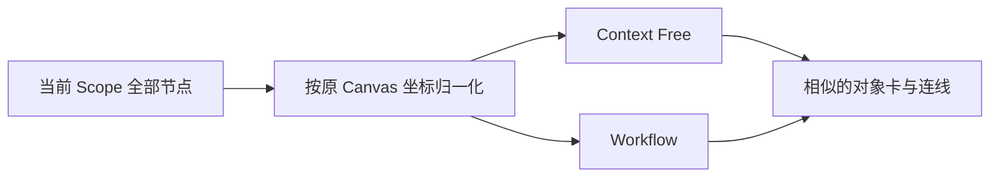
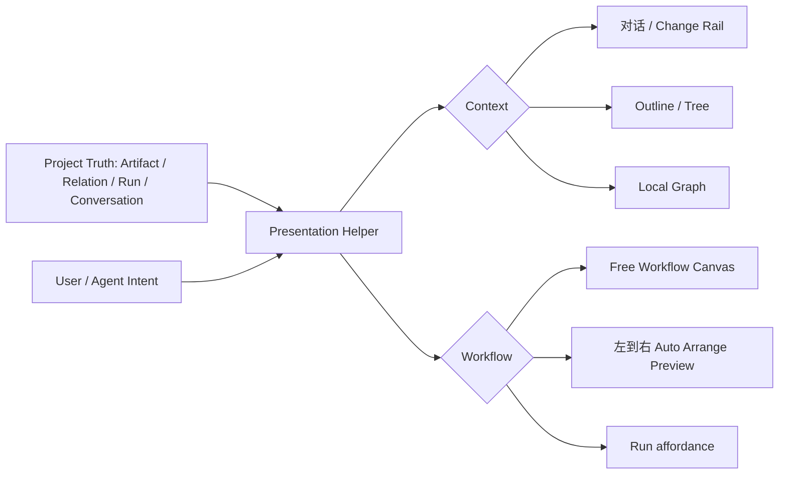
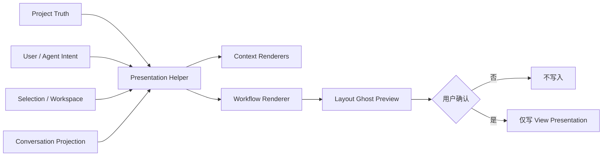

# LCOS GUI Context / Workflow 差异化重构协议

日期：2026-08-09
状态：方案 C 已按用户复审修订为 Intent 驱动；软化实现待本轮复验

复审原则：`Default ≠ Rule`。Resolver 只帮助当前 Presentation 推荐“先看什么”，不裁决对象依法属于哪个 View。

## 1. 变更原因

当前“上下文”和“工作流”虽然使用不同入口，但主要渲染器都把当前 Scope 的全部节点按 Canvas 坐标压缩到屏幕百分比位置，因此二者看起来像同一张画布换标题：

- 上下文没有明确回答“这次对话发生了什么、重要变化在哪里、来源如何找回”；
- 工作流没有明确回答“项目有哪些 Skill / Agent / Trigger / Gate，以及从哪里开始、执行到哪里”；
- 两者共用普通对象卡，内容节点、Session、Skill、Agent、Run 的阅读优先级不清；
- 当前 Flow / Workflow 自动布局只是视觉投影，没有可靠的视图成员语义；
- Context History 容易被误解为 Project History，而不是单条导入对话的 Change Navigation。

## 2. Brief 冻结边界

本次必须遵守：

1. Context History 只属于一条导入对话，不自动扩张成整个 Project History。
2. Tree / Outline / Local Graph / Free Layout 是可选 Renderer，不是 Context 固定 Schema。
3. Workflow 不新增 `Input → Skill → Executor → Review → Output` 强制 Schema；这只能作为模板。
4. Workflow 允许左到右 Auto Arrange，但用户仍可自由拖动、分支、合并与混排。
5. Core 只记录事实；项目结构和 View 语义由用户 / Agent 定义。
6. 不改变 Project Canvas、Workspace、ArtifactView、Relation、Run 的冻结对象模型。

## 3. 变更前流程

## 4. 候选方案

### 方案 A：只做视觉分化

- Context 改背景、标题、时间引导线；
- Workflow 改网格、虚线与紫色 Process 卡；
- 数据与布局算法不变。

优点：成本低、风险小。

缺点：仍然把同一批节点用近似方式投影，无法解决“为什么进这个能力、该看什么”的根问题。

结论：不推荐。

### 方案 B：为 Context / Workflow 建立固定业务 Schema

- Context 固定 Session → Section → Decision → File；
- Workflow 固定 Input → Skill → Agent → Gate → Output；
- 为节点增加固定角色类型。

优点：布局清晰、开发直接。

缺点：违反 Brief 与 Core 边界，会把模板写成产品真相，限制 Agent 按项目实际结构建 View。

结论：禁止。

### 方案 C（修订）：Intent + Presentation Helper + 专用 Renderer

Context 和 Workflow 分别拥有自己的阅读目的与推荐 Renderer，但只投影现有事实和用户 / Agent 此刻的 Intent，不引入强制业务 Schema。Default 是建议，不是规则。

优点：两种能力明显不同，同时不侵入 Core 语义；可逐步增强 Renderer。

代价：需要明确当前 Presentation 的来源、空状态与 Renderer 推荐，不能继续把全部 Scope 节点无差别塞入。

## 5. 推荐产品结构

### 5.1 Context：以“找回一次协作”为中心

默认进入 Context 时显示：

1. 轻量 Source Capsule：收起时只显示来源摘要；点击后才显示时间、对象数量、定位与换来源；
2. Renderer：结合 Capability preset、内容特征、上次偏好与 Agent 建议给出推荐，用户随时可换。

推荐启发式：

- Conversation 通常推荐 Outline / Free Reading，并显示这条对话专属 Change Rail；
- Selection with relations 通常推荐 Local Graph；具有层级或内容结构时可推荐 Outline；
- 什么都没有：显示 Context 入口空状态，允许选择对话、使用当前 Selection，或让 Agent 组织临时 Context View；
- Change Rail 不在无对话时出现；
- Tree / Graph 的选择只保存为可丢失的 View 偏好，不改变 Project Truth。

视觉倾向可以是纵向阅读、来源清楚、变化点突出、细节按需展开，但这只是 Context Preset，不是固定形态。Context 与 Arrange / Workflow 共享同一套 Spatial Canvas substrate；用户或 Agent 可以把它组织成纵向轨迹、树、大纲、脑图、局部关系网或自由混排。

### 5.2 Workflow：以“搭建和执行项目方法”为中心

默认是自由 Spatial Canvas，并可推荐可撤销的左到右 Auto Arrange Preview：

- 节点可混合文件、Context、Skill、Agent、Run 与 Note；Trigger / Gate / Input / Output 只作为 Agent 定义的软语义、metadata、presentation tag 或模板约定；
- 没有显式工作流 View 时不自动展示整个 Project；
- 初次进入提供三个入口：从 Selection 开始、从项目 Skill 开始、让 Agent 按当前项目搭建；
- Auto Arrange 只按已有 Relation 计算层级，不给节点发明业务角色；
- 自动排布先 Ghost Preview，再由用户确认，不覆盖稳定锚点；
- Workflow 提供 Run this step / Run selected branch / Run from here 等显式 affordance，但不要求先存在完整分支；框选任意对象或在空白处描述，也能在两次点击内交给 Agent 决定执行范围。

横向执行方向、分支与合并清楚只是 Workflow 的常用推荐，不是规范。Workflow 可以是横向链、纵向步骤、放射结构、松散对象群或 Agent 临时组织。Skill / Agent / Run 有真实系统身份，可固定视觉；Gate / Trigger 等项目业务角色只做软语义，不进入固定 Core Node Role。

## 6. Presentation 候选对象来源

Presentation Helper 可按以下顺序推荐候选集合：

1. Explicit View；
2. Explicit User / Agent Selection；
3. Workspace / local focus；
4. heuristic fallback；
5. 都不存在时显示空状态。

这只是当前 Presentation 的候选对象集合，不是 Core membership resolver，更不是 Project Truth。用户 / Agent 可以直接给出任意明确对象集合，随后继续加入或移除；明确集合必须覆盖启发式推荐。

禁止用标题关键字猜测 Skill / Agent / Gate；禁止默认把当前 Scope 所有节点视作 Workflow。

Alpha 阶段若 Saved View 持久化尚未接通，先使用当前 Workspace / Selection 派生投影，并明确标记为临时 View；不使用 Mock 冒充已保存能力。

## 7. 用户操作变化

- 点击“上下文”后先看到轻量 Source Capsule 和推荐 Renderer，而不是一团全部节点；
- Context Renderer 在自由 / 大纲 / 关系间切换，Selection 和 Source 保持；
- 点击“工作流”后进入专属自由画布，空状态提供明确的三条搭建路径；
- 自动排布成为可预览、可取消的操作；
- Workflow 内从节点、框选或空白处均可在两次点击内交给 Agent；完整 branch 不是启动门槛；
- 返回“整理”时 Canonical Canvas 坐标不变。

## 8. 数据流与影响模块

预计影响：

- `features/surfaces/ProjectionSurfaces.tsx`
- `features/surfaces/ContextFlowSurface.tsx`
- `features/surfaces/ContextTreeSurface.tsx`
- `features/surfaces/ContextGraphSurface.tsx`
- `features/surfaces/ContextHistoryRail.tsx`
- `features/surfaces/WorkflowSurface.tsx`
- 新增 Presentation Helper（文件可沿用 `capabilityViewResolver.ts`，但不得成为业务规则中心）/ 专用布局函数
- `features/shell/SurfaceDock.tsx`
- `App.tsx` 的 projection props 与 View 来源
- 对应 CSS、unit、contract 与真实浏览器 E2E

不修改 SQLite Schema、Artifact / Relation / Run Domain，也不把 Canvas 坐标写入 Bridge。

## 9. 当前未批准草案说明

在本协议建立前已经产生一个本地未提交草案：

- `surfaceLayouts.ts`：Context 简单顺序网格与 Workflow Relation rank；
- `ContextFlowSurface.tsx` / `WorkflowSurface.tsx`：接入草案布局；
- `product-interface.css`：初步视觉区分。

这些改动只视为方案探针，不视为定案。按推荐方案实施时会替换 Context 的简单网格，并把 Workflow rank 改为 Ghost Preview，而不是直接强制布局。

## 10. 风险

- Intent 与候选集合来源不清会继续让能力入口显得随机；
- 把临时 Selection 投影视作已保存 View 会制造错误预期；
- Context Source 与 Project History 混淆会重新引入被 Brief 否定的多轨时间线；
- Workflow 自动排布若直接写入会破坏用户稳定锚点；
- Sidecar 同时展开 Source Capsule、Renderer Switch 与 Dock 时仍需防止拥挤；
- 100+ 节点必须按既定密度降级，不能完整渲染全部卡片。

## 11. 验收条件

1. 首次进入 Context 与 Workflow，用户能在 5 秒内说出两者用途差异。
2. Context 无 Conversation Source 时不显示伪造 History；有 Source 时 Change Rail 只对应该对话。
3. Context Tree / Graph 保持同一 Selection 与 Source，切换不丢对象定位。
4. Workflow 默认不吞入整个 Project；空状态可从 Selection / Skill / Agent 三条路径开始。
5. Workflow Auto Arrange 先预览后确认，取消后 0 坐标写入。
6. 返回整理 Canvas 后 Canonical Object、Relation 和坐标不变。
7. Desktop 与 Sidecar 中标题、入口、Renderer Switch、Dock 不重叠。
8. 100 节点降级、键盘操作、双击定位、两次点击 Agent 接管通过。
9. typecheck、unit、architecture、build、smoke 与真实浏览器 Golden Path 通过。
10. Context / Workflow 绝不直接使用 `Scope.nodes` 全量作为默认成员。
11. Presentation Helper 可被明确 User / Agent 对象集合覆盖，不修改 Project Truth。

持续使用“必须”的硬边界只有：不得修改 Project Truth；不得伪造 Saved View；不得伪造 Conversation History；不得覆盖 Canonical Canvas 坐标；Ghost 未确认不得持久化；Run 不新建页面；两次点击内可交给 Agent；真实浏览器必须手操验收。

## 12. 回滚

- 恢复现有 ProjectionSurface 路由与旧 Renderer；
- 删除 Capability View Resolver 和专用布局；
- 不涉及 Schema / Project Truth，因此无需数据迁移；
- 未确认的 Ghost Layout 不产生持久化写入。

## 12A. 2026-08-09 二次批准扩展：Strand / Lane / Motion

### Context Strand

- Conversation、Selection、Agent 临时组织均可以成为可移动的 Source Object，不固定在 Shell 顶栏。
- 同一 Context Presentation 允许多条平行 Strand；Source Object、节点与跨 Strand 因果关联都可移动。
- 单击选择；Hover 以不参与布局的 Overlay 动态展开；双击固定进入详细阅读与一度关系。
- 剪断与拼接默认只修改临时 Context Presentation，不删除 Artifact、Conversation 或 Canonical Relation。
- Agent 因果建议先使用 Ghost Edge；用户确认前不得持久化。

### Workflow Spatial Presentation

- 共享拖动、框选、连线、剪断、插入和 Hover / Double-click 基础交互。
- Skill / Agent / Run 使用真实系统身份；Gate / Trigger / Input / Output 只作为软语义。
- 支持多条 Lane、节点级 Run、Selection Run 和空白处 Ask Agent；完整 DAG 不是启动门槛。
- 支持“移除节点但保持上下游连接”的非破坏性 Presentation 操作。

### 幕布式 Outline / Mind Map 同构 Renderer

参考幕布官方产品定位与帮助中心截图：Outline 与 Mind Map 是同一份层级内容的两种同构表达。它们不是两个数据集，也不是把缩进文档截图换皮：

- Outline 与 Mind Map 共用当前 Presentation hierarchy、同级顺序、折叠状态和富内容；任一侧的层级编辑立即反映到另一侧；
- Outline 负责连续阅读和快速写作，Mind Map 负责在可平移、可缩放的 Spatial Canvas 中理解与编辑同一结构；
- 图片、表格、备注、链接、文件预览与其他富内容不能在切换时被压扁成标题或复制成假节点；
- Relation Graph 使用相同对象集合投影更广泛的关系，但任意 Relation 不自动成为 Outline hierarchy；用户 / Agent 可以显式将关系组织成当前 Presentation hierarchy；
- Mind Map 相机、分支左右侧、布局风格属于 Presentation，不覆盖 Arrange 的 Canonical Canvas 坐标与相机。

- 中心主题 / 主根位于视觉起点，一级主题使用清晰主干，子级沿单侧或双侧分支展开；
- 节点以文字主题和分支底线为主体，不使用普通 Artifact 白卡矩阵；
- 连线使用连续曲线并继承分支色，父级折叠显示子节点数量；
- 单击选择，双击进入内容详情；Hover 才出现新增、折叠和重组控制；
- 键盘模型参考大纲编辑：`Enter` 同级、`Tab` 子级、`Shift+Tab` 提升、方向键导航；在未接通真实结构写入前必须明确为 Presentation 操作，不伪造保存成功；
- 关系和层级不清时由 Agent / 用户明确组织；不得把任意 Graph Relation 强制解释为文档父子关系；
- Mind Map 仍使用当前 Capability Presentation 候选集合，禁止回退到全量 `Scope.nodes`；但其空间交互必须是完整画板，不得实现成固定容器中的静态树。

### 统一 Spatial Canvas substrate

Arrange、Context 与 Workflow 都位于同一类空间画布之上，共享平移、缩放、框选、定位内容、对象拖动、Overlay 和相机边缘自动移动等基础能力；它们不共享全部成员，也不共享同一相机或强制布局。

- Arrange 倾向呈现 Workspace 当前工作对象；
- Context 倾向呈现用户 / Agent 此刻用于理解、追溯或比较的对象子集；
- Workflow 倾向呈现用户 / Agent 此刻用于行动与执行的对象子集；
- 三者的对象集合来自 Intent、Explicit View、Selection、Saved View、Workspace focus 或启发式推荐，绝不由 Capability 名称强制规定；
- Context Strand、Workflow chain、Mind Map tree、Outline 与 Relation Graph 都是可覆盖的 Presentation preset，不是 Core Schema；
- Capability 切换不暗示“换页面”，也不暗示三者必须拥有相同对象集合。

### 正式版原型2运动基准

参考：`C:\Users\1\Desktop\正式版原型2.zip`。

- 同一 Capability 内切换 Renderer：共享对象的位置 / 尺寸近似 spring `210 / 28 / .9`，呈现对象重新组织的连续感。
- Arrange / Context / Workflow 之间属于能力切换，不使用 shared-object travel；只做轻量退场 / 入场，避免暗示三者是同一对象集合换排版。
- AirDrop Shelf：从捕获边缘滑入，近似 spring `320 / 32`；载荷使用最多三张轻旋转对象缩略卡。
- Capability 子 Renderer：活动胶囊近似 spring `420 / 34`；组切换约 `180ms`、`6px` 横移。
- 拖向投送目标时先出现大面积边缘捕获光晕，不要求命中小图标。
- `prefers-reduced-motion` 下关闭位移弹簧、持续边动画与缩放，仅保留必要状态变化。

### 新增硬验收

1. Source Object 与 Strand 属于 Context Presentation，不固定在屏幕坐标，不写回 Canonical Canvas。
2. 至少两条 Context Strand 可同时存在并建立临时跨链关联。
3. Hover 展开不推动节点、不改变连线坐标；Double-click 才进入固定详情。
4. Workflow 节点可拆线、插入、保持链条移除；操作不得静默改写 Project Truth。
5. 同一 Capability 内切 Renderer 保持选择并呈现对象迁移感；跨 Capability 不做对象旅行，也不出现白屏或整层闪烁。
6. AirDrop 边缘捕获、载荷叠片、Shelf 进入/退出和投送完成动效均手操通过。

## 13. 审批建议

建议批准方案 C，并把实现分成同一个大批次中的两个连续切面：

1. Context Source + Renderer 行为收口；
2. Workflow 临时 View + Ghost Auto Arrange + Agent / Run 联动。

两者完成后再继续后续 Agent、Return、Shell 总收口。
