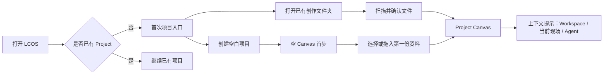
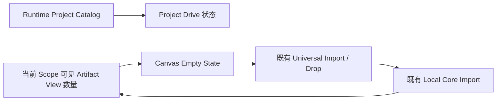

# LCOS GUI First-run & Empty State 变更协议

日期：2026-08-09
状态：实现完成，真实 Runtime 与桌面 / Sidecar 验收通过
桌面视觉基线：`C:\Users\1\Desktop\LCOS_VNext3_体验`（Project label：VNext3 体验）

稳定验收地址：`http://127.0.0.1:5173/?project=project-vnext3-%E4%BD%93%E9%AA%8C-4c818a78`。真实浏览器已验证导航后和冷刷新后均保持 `VNext3 体验 / project-vnext3-体验-4c818a78`，页面 console warning / error 为 0；宿主 Statsig 请求超时不属于页面日志。

## 1. 变更原因

当前 Project Drive、创建 / 打开目录、空 Canvas 与首次导入分别存在，但没有组成非 Codex 用户可以自行理解的连续流程：

- Project Drive 首屏使用“项目包、Canvas Scope”等内部语言；
- “创建新目录 / 打开已有目录”被放在二级弹窗中，用户必须先理解 LCOS 模型；
- 新项目进入空 Canvas 后没有明确的第一步；
- 顶部导入、Workspace、当前现场和 Agent 同时出现，但没有解释先后关系；
- Sample Fixture 不再作为视觉与文案判断基线，桌面验收改用 VNext3 体验。

现状代码审计还发现两个必须在实现阶段处理的确定性缺陷：

- Runtime 返回 `empty-catalog` 时只清空 projects 和切换 offline，没有执行 `setProjectOpen(false)`；初始 `projectOpen=true` 会让真正的首次用户留在无项目 Canvas，而不是进入 Project Drive。
- 未显式提供 `?project=` 时，Source Gate 当前优先打开 MVP Sample；这会让正常桌面启动反复回到 Sample，和用户主动选择的真实项目基线不一致。实现前必须明确把 Sample 降为开发 / 显式入口，而不是生产默认项目。

目标不是增加 onboarding carousel，而是让真实空状态本身完成引导。

## 2. 变更前流程

问题：B、C、E、F 之间缺少明确的动作连续性；用户需要预先理解 Project / Root Canvas / Workspace / Agent。

## 3. 变更后流程

## 4. 用户操作变化

1. 空 Catalog 时，Project Drive 明确显示两个主入口：
   - 打开已有创作文件夹（推荐）；
   - 创建空白项目。
2. 有 Project 时继续维持“最近打开 / 本地项目”，不强迫重新 onboarding。
3. 零内容 Project 的 Canvas 中央显示轻量空状态：
   - 选择文件或文件夹；
   - 也可直接拖入 Canvas；
   - 说明“原文件不会被移动或覆盖”。
4. 第一个真实 Artifact View 出现后，空状态自动消失。
5. Workspace / 当前现场 / Agent 只提供一次上下文提示，不遮挡 Canvas，不建立教学步骤锁。
6. 正常启动不再隐式优先打开 MVP Sample；显式 `?project=` 仍保持 Source Gate 的严格命中 / 失败语义。

## 5. 数据流变化

- First-run 与 Empty State 均由现有 Catalog / Graph 派生；
- 不新增 Project Truth，不用 localStorage 保存 Project / Graph / Run；
- 可丢失的“一次提示已看过”才允许使用版本化 UI preference。

## 6. 影响模块

- `features/project/ProjectDrive.tsx`：空 Catalog 与已有 Catalog 分流文案 / 操作层级；
- `features/create/ProjectCreateDialog.tsx`：降低内部术语，保留既有扫描与确认安全协议；
- `features/shell/CanvasSceneHost.tsx`：承载屏幕空间 Empty State；
- `App.tsx`：派生零内容状态并复用既有导入入口；
- `runtime/runtimeProjectSelection.ts`：退役“无请求时优先 Sample”的生产默认，仅保留显式项目与真实 Catalog 选择；
- `product-interface.css`：轻量空状态与响应式布局；
- tests：Project Drive、Empty State、导入消失条件和 Sidecar 合同。

## 7. 文件与 Schema 迁移

- 不新增或修改 SQLite Schema；
- 不迁移 Project、Workspace、Artifact、Run 或 Revision；
- 不移动源文件；
- 不修改 `.creative-os` 写入边界；
- 不引入新依赖。

## 8. 开发成本

- 组件与状态派生：中；
- 桌面 / Sidecar 视觉：中；
- Runtime 空 Catalog、空 Graph、首次导入回归：中；
- 不包含后端、Agent Skill、Windows / iOS 封装。

## 9. 风险

- 把真实空状态误做成营销页，继续挤占 Canvas；
- 把“打开目录”误表达成移动 / 接管用户文件；
- Fixture 与 Runtime 的空状态判断不一致；
- 第一次导入完成后 Empty State 未及时退出；
- Sidecar 中提示与 Mini-map / Dock 重叠。

控制：空状态只在真实零内容时出现；使用既有导入与目录扫描；不自动执行 Agent；不创建新的持久化真相。

## 10. 验收条件

1. 空 Catalog 用户无需理解 Codex 即可找到“打开已有创作文件夹 / 创建空白项目”。
2. 打开已有目录前明确只读扫描、不会移动或改写原文件。
3. 空 Project 进入 Canvas 后，首个操作在一个屏幕内可见。
4. 文件、文件夹或拖放任一成功后，Empty State 自动退出并出现真实 Artifact View。
5. 导入失败时保留可重试入口，不伪装成功。
6. 410×900 Sidecar、1366×768 Desktop 与较大桌面不遮挡 Mini-map / Dock。
7. Inspector 默认关闭；Workspace 仍是 Semantic Viewport；Agent 不在 Sidecar 强占空间。
8. typecheck、相关 unit / contract、build、smoke 与真实浏览器交互通过。
9. 冷启动不会自动回到 MVP Sample；显式请求不存在的项目仍不得静默 fallback。

## 11. 回滚方案

- 移除 Project Drive 空 Catalog 分流和 Canvas Empty State 渲染；
- 保留原有 ProjectCreateDialog、Universal Import、Drop 与 Runtime 路径；
- 因无 Schema / Domain / Local Core 变更，回滚不需要数据迁移。

## 推荐 Sprint Scope

本轮只实现：Project Drive 空 Catalog、Project Create 文案收口、零内容 Canvas Empty State、首次导入后退出、Desktop / Sidecar 验收。

不实现：多页 onboarding、模板市场、自动 Agent、示例内容自动注入、后端扩展、Skill 补全或软件封装。
