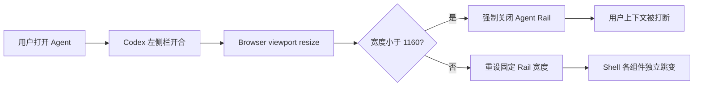
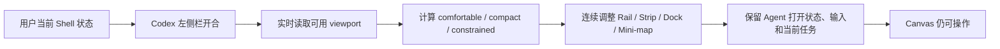

# LCOS GUI · Codex 内置浏览器动态 Reflow 变更协议

日期：2026-08-09
状态：已被 Sidecar Portrait 协作模式取代；本方案仅保留为错误方向与基线证据
范围：`apps/web` App Shell 响应式展示与 UI-only viewport 状态；不改变 Project Truth、对象模型、Runtime、Bridge、Schema 或冻结 Canvas 手势。

## 1. 变更原因

Codex 左侧侧边栏展开后，LCOS 内置浏览器当前实测 viewport 只有约 `855×742`。现有响应逻辑只有粗粒度 `max-width:1100px` 隐藏文案，并且 `App.tsx` 在任何 resize 后只要宽度小于 `1160px` 就强制关闭 Agent Rail。结果是：

- 侧边栏开合会替用户关闭正在使用的 Agent；
- 顶栏只是删文字，没有重新确定信息优先级；
- Agent Rail 覆盖 Bottom Dock，并遮住 Mini-map；
- Shell 组件各用不同断点与固定宽度，出现跳变而不是连续适配；
- Current Workbench / Canvas 的有效可操作面积不能被稳定预期。

## 2. 变更前流程

## 3. 变更后流程

## 4. 用户操作变化

- Codex 侧边栏展开或收起时，Agent Rail 不再自动消失。
- 组件只改变密度、宽度、标签优先级和避让位置；不会切换用户所在 Scope / Capability / Workbench。
- 顶栏在窄桌面优先保留项目身份、Agent 和真实待确认状态；低价值解释文字先收缩。
- Agent Rail 始终避开 Bottom Dock；Mini-map 在 Agent 打开时移到 Rail 左侧并缩小，而不是藏在 Rail 背后。
- 720px 以下进入 constrained 档，但仍是桌面 Canvas，不伪装成移动端页面。

## 5. 数据流变化

仅新增 `window.innerWidth → shell layout density / effective rail width` 的可丢失 UI 投影。Viewport 变化不写 Local Core、不进入 Project Graph、不改变用户已保存的 Canvas 坐标或 Workspace 语义。

## 6. 影响模块

- `App.tsx`：viewport 状态与 Rail 宽度推导；移除 resize 强制关闭。
- `AppShellView.tsx`：暴露 layout density data attribute。
- `product-interface.css`：Project Strip、WorkRail、Mini-map、Bottom Dock 连续响应与三档密度。
- Product Interface contract tests。

## 7. 文件与 Schema 迁移

- 无 Schema / migration。
- 不移动文件，不升级依赖。
- 不改变已有 WorkRail preference 存储格式；宽度在渲染时动态推导。

## 8. 开发成本

中等。核心不是增加一个 breakpoint，而是统一 React viewport 投影、CSS 几何变量、Overlay 避让和真实内置浏览器验证。

## 9. 风险

- 过度压缩会让目标尺寸虽不溢出但失去可读性。
- Rail 宽度变化若参与 Project state 保存，可能污染可丢失偏好；本次禁止写回动态宽度。
- `:has()` 用于 Overlay 避让；目标为 Codex 内置 Chromium，可用，但仍保留无 `:has()` 时的安全默认位置。
- Camera 不应因侧边栏开合频繁自动重排，避免抢用户视角。

## 10. 验收条件

1. 默认 IAB `855×742`：无水平溢出；Project Strip、Dock、Rail、Mini-map 无互相遮挡。
2. `720×742` constrained：所有主入口仍可触达，Agent 可打开，面板不覆盖 Dock。
3. `1280×720`、`1440×900`、`1920×1080`：不回退 Round 2 正式桌面层级。
4. viewport 在 720 ↔ 855 ↔ 1280 动态切换时，Agent 打开状态保持，composer 文本不丢失。
5. Current Workbench、Scope/Capability 状态、Canvas camera 与 Project Graph 不因 resize 改写。
6. 冷刷新 console 无相关 error / warning；完整检查链通过。

## 11. 回滚方案

- 回滚 `App.tsx` viewport 投影和 `AppShellView` density attribute；恢复旧固定 Rail 宽度。
- 删除 Product Interface 中 `iab compact/constrained` 区块即可恢复 Round 2 原响应行为。
- 无数据迁移、无 Project Truth 回滚。

## 12. 实施与验收结果

> 纠正：本节证明的是“横屏 Shell 可以缩放”，但没有满足用户要求的竖屏协作信息架构。后续正式实现与证据以 `LCOS_GUI_SIDECAR_PORTRAIT_CHANGE_PROTOCOL_20260809.md` 为准。

- `App.tsx` 新增 `comfortable / compact / constrained` 三档 UI 密度和连续 Rail 宽度推导；resize 只更新 viewport 投影，不再强制关闭 Agent。
- `AppShellView` 暴露 `data-layout-density`；`WorkRail` 通过 `--lcos-runtime-rail-width` 向 Shell 提供真实几何。
- Agent Rail 底部固定避开 72px Dock；Agent 打开时 Mini-map 左移并降到 82%，不再藏在 Rail 后面。
- 720px constrained 下压缩顶栏与 Dock 标签密度，但保留项目身份、Agent、Scope 和三项能力入口。
- 720 → 855 → 1280 → 1440 → 1920 连续变化中，Agent 始终保持展开，未发送 composer 文本完整保留；验收后已清空测试草稿。
- 五档 viewport 的 `document.body.scrollWidth - innerWidth` 均为 `0`，无水平溢出。
- 855px Current Workbench 单独通过：5 个视图、Mini-map、Dock 和退出入口均可见可用。
- 内置浏览器 console：`0 error / 0 warning`。

### 几何证据

| Viewport | Density | Agent 宽度 | Agent bottom / Dock top | Mini-map 结果 |
|---|---:|---:|---:|---|
| 720×742 | constrained | 300px | 660.4 / 670.4 | 左移，right 402px |
| 855×742 | compact | 333.45px | 660.4 / 670.4 | 左移，right 503.75px |
| 1280×720 | comfortable | 370px | 638 / 648 | 左移，right 892px |
| 1440×900 | comfortable | 370px | 818 / 828 | 左移，right 1052px |
| 1920×1080 | comfortable | 390px | 998 / 1008 | 左移，right 1512px |

### 截图证据

- `docs/audit/evidence/gui-round2/04-iab-sidebar-baseline-before.png`
- `docs/audit/evidence/gui-round2/05-iab-sidebar-agent-before.png`
- `docs/audit/evidence/gui-round2/06-iab-sidebar-720-before.png`
- `docs/audit/evidence/gui-round2/07-iab-sidebar-agent-after-855.png`
- `docs/audit/evidence/gui-round2/08-iab-constrained-agent-after-720.png`
- `docs/audit/evidence/gui-round2/09-iab-responsive-agent-1280.png`
- `docs/audit/evidence/gui-round2/10-iab-responsive-agent-1440.png`
- `docs/audit/evidence/gui-round2/11-iab-responsive-agent-1920.png`
- `docs/audit/evidence/gui-round2/12-iab-current-workbench-855.png`
