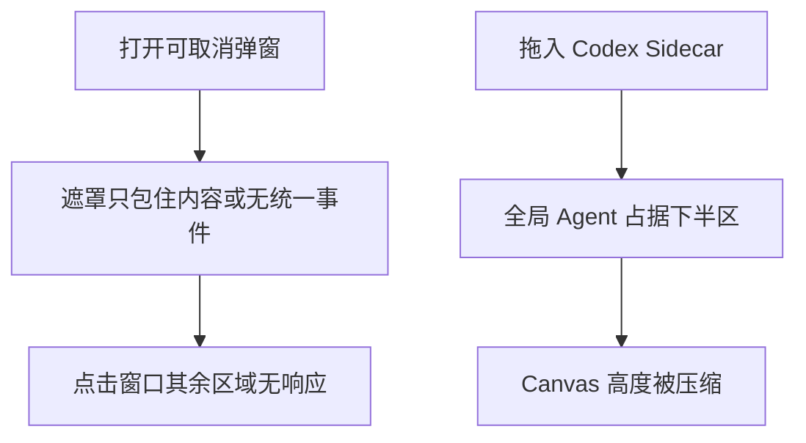
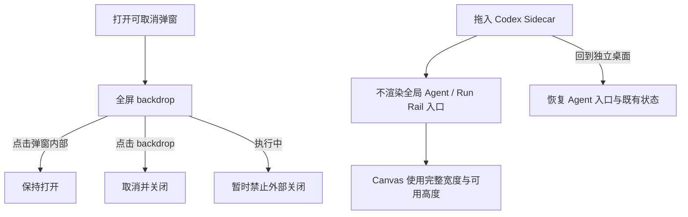

# LCOS GUI · 弹窗与 Canvas-first Sidecar 纠正协议

日期：2026-08-09
状态：已实现并完成真实浏览器验证

## 变更原因

1. 通用资源导入等弹窗的 `modal-backdrop` 没有覆盖视口，窗口其余区域不属于遮罩，外部点击无法关闭。
2. 各弹窗分别使用 `mousedown`、`pointerdown`、指针捕获或无事件处理，关闭协议不一致。
3. Sidecar 把全局 Agent 变成底部全宽面板，错误占用了 Codex 协作态最重要的 Canvas 空间。

## 变更前流程

## 变更后流程

## 用户操作与数据流变化

- 可取消弹窗支持点击窗口其余区域关闭；点击弹窗内容不会误关。
- 导入、重分析、目录扫描、恢复等执行中状态仍保护任务，不响应外部关闭。
- Sidecar 不显示全局 Agent 与依赖同一 Rail 的待确认入口，也不为 Rail 预留相机安全区。
- 只改变 UI 投影；Project、Workspace、Canvas 节点、Run 与 Agent 草稿数据均不迁移。

## 影响模块

- `features/ui/dismissibleLayer.ts` 与各类 Dialog / Modal backdrop。
- `foundation.css` 的通用全屏弹窗几何。
- `App.tsx`、`AppShellView.tsx`、`ProjectStripVNext.tsx` 与 Sidecar CSS。
- 交互契约与产品界面基础测试。

## 成本、风险与回滚

- 成本：中等，涉及 14 个弹窗入口和 Sidecar Shell 投影。
- 风险：执行中弹窗误关、弹窗内部点击误关、桌面 Agent 能力被误删、Sidecar 相机再次按旧 Rail 高度计算。
- 回滚：移除共享 backdrop handler 与 `.modal-backdrop` 全屏规则；恢复 Sidecar WorkRail 渲染及旧安全区。回滚不会涉及 Schema 或项目数据。

## 验收条件与结果

- 通用导入：打开后内部点击保持、外部真实指针点击关闭：通过。
- 855×742：`data-layout-mode=sidecar`，Agent 按钮=false，WorkRail=false，Canvas=855.2×506.4：通过。
- Agent 在桌面打开后动态拖回 855×742：Agent / Rail 退出、Canvas 恢复完整空间：通过。
- 1280×720：恢复 desktop，Agent 入口可见且可打开 Rail：通过。
- Browser Console：0 error / 0 warning。

## 证据

- `docs/audit/evidence/LCOS_GUI_SIDECAR_CANVAS_FIRST_855x742_20260809.png`
- `docs/audit/evidence/LCOS_GUI_DISMISSIBLE_MODAL_855x742_20260809.png`
- `docs/audit/evidence/LCOS_GUI_DESKTOP_AGENT_PRESERVED_1280x720_20260809.png`

## 单击节点回归纠正

- 问题：Sidecar 相机曾把 `selectedIds` 作为自动 `fitBounds` 目标，导致普通单击把节点放大到近乎占满画布。
- 修复：自动取景只允许在首次进入 Sidecar 时针对内容边界执行一次；选择变化不再进入相机 Effect。
- 同步收口：Revision 来源同步通过稳定 provider ref 读取，避免节点选择态触发重复对象写入。
- 实测：855×742 下单击 `view-brief`，Camera `x / y / zoom` 前后完全一致，节点只进入 selected，未打开 Dialog；单击后 800ms Console 0 error / 0 warning。
