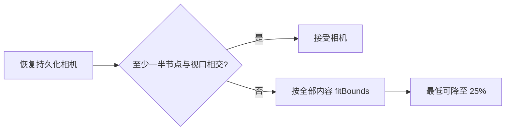
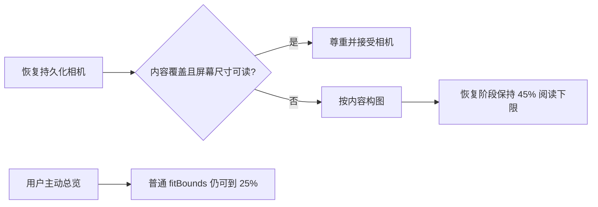

# LCOS GUI 正式软件化基线审计（2026-08-09）

## 任务摘要

本轮以 VNext3.1 Brief 与「正式版原型2」为产品和视觉基准，不做局部换皮，先建立可连续验收的 GUI 正式软件化基线。第一优先级是让不了解 Codex 的创意从业者安装后可以直接理解、操作并完成 Golden Path。

## 实际范围

- 校验独立干净 Worktree、当前分支与版本。
- 运行 `check:fast` 全基线。
- 启动 Web、Local Core、Bridge 与 orchestrator。
- 在真实浏览器中检查首次打开项目的构图、DOM 与控制台。
- 建立第一项 P0 修复：恢复相机的“可见”标准升级为“可读且有效”。

## Git 与运行基线

- Worktree：`E:/Codex 项目/OS开发/.worktrees/mvp-fast-build`
- Branch：`codex/backend-hardening-20260802`
- HEAD：`b02d2a64f99aa43ba2f1501e3e540b844564920b`
- Version：`0.9.0`
- 开工状态：clean；`git diff --check` 通过。
- Runtime：Web `5173`、Local Core `43121`、Bridge `43122` 均监听成功。

## 基线结果

`npm run check:fast` 通过：lint、typecheck、unit、architecture、build 均完成。当前仍有两类已知债务：`App.tsx` 体积过大且存在未使用导入警告；生产主包约 1.30 MB，超过 Vite 500 kB 提示线。它们进入后续架构与性能工作流，不在本次相机小切片中掩盖处理。

真实浏览器加载无 console error/warning，但项目恢复为 25% 缩放。9 个节点虽然落入视口，标准节点在屏幕上仅约 70×48 px，标题、状态和层级无法有效阅读。这说明原判断只统计“与视口相交的节点比例”，把总览缩略图误判成了可工作的现场。

## 变更流程

### 变更前

### 变更后

## 用户与数据流变化

- 用户首次进入失效或不可读现场时，会落到可阅读构图；主动缩放和“小地图定位内容”的总览能力不变。
- 不新增 Schema，不移动或覆盖 Project 数据，不改变 Local Core 的相机持久化协议。
- 变更仅作用于前端恢复校验和恢复阶段构图。

## 影响模块

- `apps/web/src/features/canvas/canvasGeometry.ts`
- `apps/web/src/App.tsx`
- `apps/web/tests/canvasGeometry.test.ts`

## 验收条件

- 25% 且节点仅呈缩略图的恢复相机被识别为不可用。
- 恢复构图优先落到最密集的内容邻域且不低于 45%，避免停在内容岛之间的空白中心；普通显式总览仍可到 25%。
- 几何单测、typecheck、build 通过。
- 真实浏览器重载后节点达到可辨认尺寸，且无新增控制台错误。

## 风险与回滚

风险是极度分散的项目首次恢复时不会同时展示全部节点；这是“可工作现场”优先于“全项目缩略总览”的明确取舍，小地图仍承担全局定位。内容邻域并列时按 Project 数据顺序选择，后续可再结合最近选择或 Workspace Intent 提升语义优先级。若真实项目验证出现聚焦错误，可回滚 `restorationFocusBounds`、`fitBoundsForReading` 与 `restoredCameraIsMeaningful` 的调用，恢复原 `fitBounds` 和覆盖率判断，不涉及数据迁移。

## 后续

继续完成第一轮 Interaction Foundation：选择/拖拽阈值、尾随 click 抑制、双击、画布平移、关系编辑、多选与删除、恢复边界和小地图定位；每个小切片用真实浏览器回归。

## Interaction Foundation 增量记录

### IF-02 拖拽后的双击状态隔离

检查确认节点拖拽采用 4px 启动阈值，并且只在越过阈值后捕获指针；该基础行为保留。发现双击识别缓存没有在拖拽成立时清空，导致“拖拽 → 松手 → 快速单击”可能被误判为双击并打开对象 Workbench。修复是在越过拖拽阈值的同一时刻清空最近按下记录，不改变正常双击时间窗、选择行为或拖拽持久化。

验收动作：普通单击保持选择；3px 内抖动不移动；超过 4px 成立拖拽；拖拽后立即单击不打开 Workbench；正常双击仍打开 Workbench。

### IF-03 框选与关系手柄的阈值后捕获

框选候选现在记录 pointerId，但按下时不立即捕获，也不渲染零尺寸框；移动超过统一的 4px 阈值后才显示框选区域并捕获指针，保证越过画布边界后仍能可靠收尾。关系创建和端点重连同样延迟到越过 4px 后捕获，短按手柄仍保留点击后再选目标的交互，不抢占普通点击。

### IF-04 Pointer Cancel 回滚边界

系统级 `pointercancel` 不再复用成功松手路径。取消节点拖动、节点缩放、Workspace 组拖动或 Workspace 框体缩放时恢复交互开始前的对象位置/尺寸，清除框选、关系、投送虚影和自动平移状态，并且不触发 presentation commit。相机平移属于可丢失 UI 导航，取消时停下但不强制跳回，避免视觉闪回。

同时修正 Workspace 框体缩放的累计偏移：此前每次 pointermove 都把“从起点算出的总位移”叠加到上一帧尺寸，移动事件越密集放大越严重；现在始终使用交互开始时的原始 bounds 加本次总位移，并保留原始 bounds 供取消回滚。

### IF-05 小地图安全工作区定位

小地图相机框现在表达 Shell 遮挡之外的真实可工作区域，不再把顶栏、左侧入口、右侧 Rail 和底部 Dock 覆盖区算作可见内容。点击小地图定位时也以同一安全区域中心为锚点，确保地图落点与用户实际看到的内容位置一致；“定位全部内容”继续通过带 Safe Insets 的 `fitBounds` 工作。

### IF-06 关系去重的真实选中态

重复建立同方向关系时继续保持“只存在一条关系”的领域约束，但不再预先选择一个未被创建的临时 edge ID。现在会定位并选中真实既有关系，使删除、重连和视觉反馈始终作用于实际对象。

### IF-07 双击确认与多选收缩延迟

双击不再在第二次 pointerdown 的瞬间打开 Workbench，而是在 pointerup 且手势没有越过拖拽阈值后确认；因此“小抖动点击后立刻拖拽”会正确进入拖拽。多选中的成员在 pointerdown 时继续保留整组选中，若成立拖拽则整组持续选中并移动；只有确认是普通单击时才收缩为该成员单选。

### IF-08 Active Context 恢复不覆盖新操作

Active Context 异步恢复现在记录请求发出时的 selection intent version，并为当前 Project/Workspace key 记录用户是否已经触碰过选择。无论用户操作发生在请求发出前还是等待期间，旧响应都只能更新 Context Projection，不能再覆盖较新的用户选择。这消除了项目刚打开时快速操作被后台恢复“抢回去”的竞态。

### IF-09 内部拖拽与文件 Drop 隔离

Canvas 仅在 `dataTransfer.types` 包含 `Files` 时接管原生 DragOver，并在 Drop 时再次要求至少一个真实文件。节点/多选组的内部指针拖动即使触发浏览器原生 Drop，也不会进入文件导入链，更不会以“0 文件导入结果”清空当前选择。

节点根部同时阻止内部图片、链接或预览元素发起浏览器原生 DragStart，确保拖动对象时 Pointer Move 始终由 LCOS Canvas 手势状态机拥有。

### IF-10 真鼠标 E2E 与持久化边界

新增独立临时 Runtime Project 的 Playwright 验收，不复用或污染用户 Sample：连续选择、3px 抖动、阈值后拖拽、尾随单击、双击、鼠标中键平移、框选、组拖、删除/撤销、关系创建/重连/删除、锚点拖到空白、小地图跳转均使用真实鼠标事件。持久化场景进一步直接读取 Local Core Graph 验证 ArtifactView 位置，并在页面重载后分别核验节点位置与可丢失相机导航偏好。
