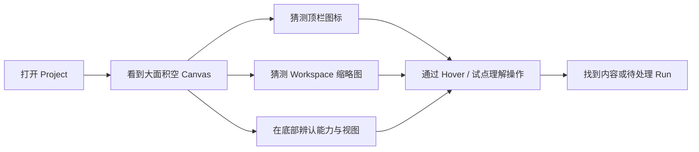
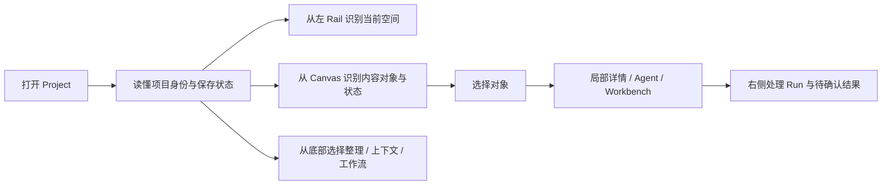

# LCOS GUI Product Interface Foundation · Round 2 变更协议与基线

日期：2026-08-09
状态：核心实现与 720 / 855 / 1280 / 1440 / 1920 内置浏览器验收完成
范围：`apps/web` 产品界面表达、`packages/ui` / OpenDesign 设计系统、浏览器验收；不改变 Domain、Local Core、Bridge 与冻结交互。

## 1. 变更原因

Round 1 已使 Canvas 的选择、拖拽、框选、关系、小地图和恢复行为达到可持续操作的基线，但当前界面仍更像“功能已接线的工程画布”，还不是一个不懂 Codex 的创意从业者可以安装后直接理解的软件。

本轮 1280×720 真实浏览器首屏显示 9 个 ArtifactView，但只有 2 个进入可视区；项目、Workspace、能力与待处理状态主要依赖极小图标和 hover 才能理解。样式同时叠加 `foundation.css`、`surface.css`、`porcelain-studio.css`、`vnext.css` 与 `reconstruction.css` 的多代 token，视觉真相不唯一。

## 2. 变更前流程

## 3. 变更后流程

## 4. 用户操作变化

- 不新增顶层页面，不改变 `C`、双击、Enter、Esc、关系与 Drop 手势。
- 项目身份、保存状态、待确认数量和 Agent 入口从“只认图标”升级为可扫读表达。
- Workspace Rail 仍保持窄轨，但 active、attention、定位和新增状态更明确。
- Bottom Dock 仍是 Scope 与能力两条独立轴；通过组名、文字、选中态和间距降低误读。
- 六类对象继续以内容本体为第一视觉层，同时用形态、图标、边框、文案和状态共同区分。
- Workbench / Drop Shelf 只优化目标、结果和反馈表达，不改变投送语义。

## 5. 数据流变化

无 Project Truth、Schema、Repository、Local Core API、Bridge 合同或持久化策略变化。新增内容仅为视觉 token、展示组件和可丢失 UI 表达；现有 Runtime 数据继续原样投影。

## 6. 影响模块

- App Shell：Project Strip、Workspace Rail、Bottom Dock、Run Rail。
- Canvas Presentation：Content Object、选择/状态反馈、Mini-map。
- Workbench / Drop：Artifact Workbench、Drop Shelf。
- 设计系统：颜色、字体、间距、圆角、阴影、动效、focus 与语义状态。
- QA：1280、1440、1920 桌面尺寸；键盘 focus、reduced motion、首屏可读性和基础性能。

## 7. 文件与 Schema 迁移

- 不进行 Schema 迁移。
- 不移动现有大文件，不删除旧兼容样式。
- 以新的产品 token 与最后加载的 Product Interface 层逐步收口当前 vNext Shell；旧样式待后续有独立清理批准后再退役。

## 8. 开发成本

中等偏高。视觉不是一次换色，而是先建立统一 token，再逐片改 Shell、对象、Workbench / Drop，并在真实 Runtime 下反复截图、交互与多尺寸验证。

## 9. 风险

- 多代 CSS 选择器优先级可能造成局部回退或 `!important` 继续扩散。
- 放大默认可读性可能减少同屏对象数量，需要在“读得清”和“看得全”间保持 Canvas 工具的缩放自由。
- Shell 控件增大后可能侵占 1366×768 的 Canvas 安全区。
- 视觉变化不能掩盖 Mock / Unsupported / Failed 等真实 Runtime 状态。

## 10. 验收条件

1. 1280、1440、1920 下无主控件重叠、裁切或不可读文字。
2. 第一次打开能从左 / 中 / 下 / 右理解“去哪、内容是什么、能做什么、现在执行到哪”。
3. Source / Working / Generated Draft / Context / Process / Decision 不只靠颜色区分。
4. hover、pressed、selected、focus-visible、disabled、waiting、review、failed 有一致反馈。
5. Inspector 默认关闭；Run 不成为底部页面；旧四阶段导航不回归。
6. reduced motion 生效；核心触点满足桌面可点尺寸；无相关 console error。
7. `lint → typecheck → unit → build → smoke` 与相关浏览器交互通过。

## 11. 回滚方案

- Product Interface 样式作为独立最后加载层，可单文件移除并恢复现有视觉。
- 组件变更保持展示层边界，可逐文件回退；不需回滚数据库或项目数据。
- OpenDesign 设计系统为新增文档资产，可独立移除，不影响 Runtime。

## 12. 本轮基线证据

- Browser：`http://127.0.0.1:5173/`，1280×720。
- Page identity：`Local Creative OS`，页面非空，无 framework overlay。
- Console：0 error / 0 warning。
- DOM：9 个 ArtifactView；首屏几何上仅 2 个可见，节点屏幕宽约 99–135px、Run 高约 37px。
- 结构性结论：交互能力存在，但默认现场、信息层级和视觉语义不足以支持非技术创意用户直接上手。

## 13. 实施结果

- 建立 `lcos-product` 设计系统包，统一颜色、字体、圆角、阴影、动效、focus 和品牌语气；Web 端只通过一个最后加载的 Product Interface 层接管当前 vNext Shell。
- 顶部 Project Strip 现在可直接读出 LCOS、项目、Scope、保存状态、Agent 与待确认，不再依赖纯图标猜测。
- Workspace Rail 与 Bottom Dock 仍保持窄轨和双轴结构，但补齐了可读标签、active / attention / focus 反馈。
- Content Object 补齐“图标 + 形态 + 状态点 + 状态文案”；修复 `0 &&` 造成的巨大 `00` 渲染。
- 默认恢复相机的最低缩放从 45% 调到 58%，并按真实 Shell 安全区重新定位内容。
- Workbench 进入后会在 Run 投影异步到达的短窗口内再次适配实际对象，当前 1280×720 可同时看到 2 个内容对象与 3 个 Run。
- Agent Rail 将 19 条记录压缩为 7 条高优先级记录，并明确总量；Context 范围改为中文产品语言。
- Drop Destination Sheet 补齐对话框标题、键盘焦点、真实图标、对象数量、目标空间和 Join / Move / Continue 的语义反馈。

## 14. 验收结果

- `npm run check:fast`：通过。覆盖 lint、全仓 typecheck、unit test、architecture test、production build。
- `npm run smoke`：通过；14 个构建资产，React root 存在。
- Product Interface 合同测试：5 / 5 通过，覆盖 token 加载顺序、小字与 focus 对比度、响应式、reduced motion、主要 accessible name / state 和节点 memo 边界。
- `git diff --check`：通过；仅报告仓库现有 Windows 行尾转换提示。
- 生产构建：通过；Vite 成功处理外部 canonical token 引用。
- 1280×720 Browser 冷刷新：0 error、0 warning；顶部、Rail、Canvas、Agent、Workbench、Dock 无主控件重叠。
- 键盘 focus：顶部 LCOS 入口可通过 Tab 获得 2px 实线高对比 focus ring；证据见 `03-keyboard-focus-1280.png`。
- 对比度：muted `#696673` / white 与 faint `#777381` / white 均达到 4.5:1；focus `#6758d8` / white 达到 3:1 以上。
- 性能边界：`ProjectCanvas` 与 `CanvasNodeVisual` 均 memo；对象 memo 忽略每次 render 重建的 `onDetails` 闭包，仅在节点引用或可见状态变化时重绘。
- 浏览器证据：
  - `docs/audit/evidence/gui-round2/01-agent-run-rail-1280.png`
  - `docs/audit/evidence/gui-round2/02-current-workbench-1280.png`
  - `docs/audit/evidence/gui-round2/03-keyboard-focus-1280.png`
- 设计对照：同轮检查了 Figma Make 原型 `image.png` / `image-1.png` 与上述实装截图。实装保留了窄 Shell、内容优先画布与右侧工作区骨架，同时避免照搬原型中与冻结 LCOS 对象模型冲突的旧导航和常开 Inspector。

## 15. 已知债务与未完成项

- 1440×900 与 1920×1080 已使用 Codex 内置浏览器 viewport capability 完成精确尺寸截图和 Agent / Shell 几何复核；未调用独立 Playwright CLI。
- Codex 左侧侧边栏真实展开宽度 855×742 与极限 720×742 已加入动态适配验收：Agent 不再因 resize 自动关闭，未发送输入不丢失，Rail / Dock / Mini-map 无遮挡。
- Build 仍报告主入口 chunk 约 1.3 MB（gzip 约 298 KB）；本轮没有为压体积改动架构，建议后续单列性能 Sprint。
- Lint 通过但保留仓库原有 warning；`App.tsx` 的历史兼容分支与未使用导入仍是结构债务。本轮没有借视觉优化之名做大拆分。
- 多代 CSS 仍共存；新 Product Interface 层已建立唯一活动 token，但旧样式退役需要单独审计和批准。
