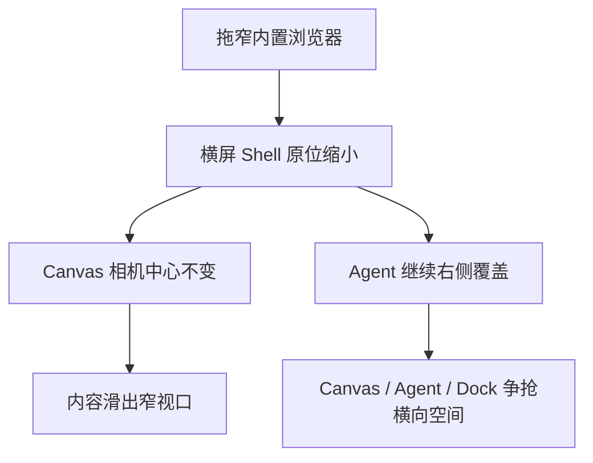
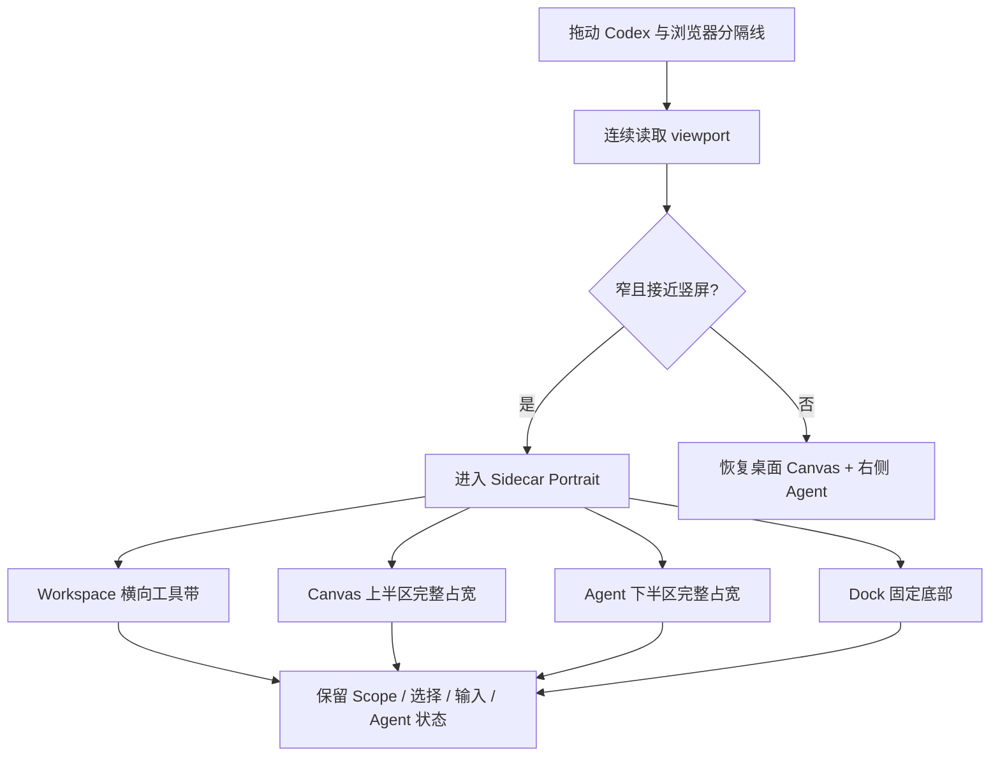

# LCOS GUI · Sidecar Portrait 协作模式变更协议

日期：2026-08-09
状态：已被 `LCOS_GUI_MODAL_AND_SIDECAR_CORRECTION_20260809.md` 纠正；以下保留为错误方案与历史证据
范围：Codex 内置浏览器窄侧栏中的 Shell 空间编排、Canvas viewport 投影与 Agent 展示；不改变 Project Truth、节点坐标、Workspace / Canvas 对象模型、Runtime、Bridge 或 Schema。

## 1. 变更原因

上一版把窄 viewport 当成“压缩的横屏桌面”，只缩小 Rail、Dock 和 Mini-map。实测 600×742 时 Canvas 内容仍按横屏相机停在右侧，Agent 仍是右侧浮层，既没有占满侧栏，也没有形成 Codex 对话与 LCOS 同时工作的竖屏协作关系。这与用户要求相反。

## 2. 变更前流程

## 3. 变更后流程

## 4. 用户操作变化

- 拖动内置浏览器宽度时，Shell 在桌面与 Sidecar Portrait 之间自动切换，不刷新、不跳 Scope。
- Portrait 模式不再把 Agent 作为右侧抽屉；Agent 改为下半区全宽协作面板，Canvas 保留在上半区。
- Workspace Rail 改为 Canvas 顶部横向工具带，释放窄屏横向空间。
- Bottom Dock 保持底部全宽主导航，并按可用宽度连续压缩。
- Canvas 相机在 resize 时保持当前世界中心；进入 Portrait 时只调整 viewport 投影，不改节点真实坐标。
- 未发送输入、Agent 展开状态、选择与当前现场在拖动过程中保持。

## 5. 数据流变化

新增可丢失 UI 投影：`viewport width + aspect ratio → desktop / sidecar`。Canvas resize 只更新 camera viewport，使当前世界中心保持在新可见区；不保存为自动布局，不修改 ArtifactView 坐标。

## 6. 影响模块

- `App.tsx`：layout mode 推导、Sidecar Rail 几何、resize camera continuity。
- `AppShellView.tsx`：暴露 `data-layout-mode`。
- `product-interface.css`：Sidecar 的纵向 Shell、Workspace 横向工具带、Agent 全宽下半区、Dock 与 Mini-map 避让。
- Product Interface contract tests。

## 7. 文件与 Schema 迁移

- 无 Schema / migration。
- 不移动文件，不新增依赖。
- 不改变 WorkRail preference 和 Project Graph 存储格式。

## 8. 开发成本

中等。需要同时处理 CSS 几何、Canvas camera continuity、Agent 状态保持和多个拖动中间宽度，不能用单一断点截图冒充完成。

## 9. 风险

- 自动重排不得改写用户稳定锚点；因此只改 viewport camera，不做节点自动排布。
- Agent 下半区会减少 Canvas 可见高度，需要 Mini-map 和相机安全区同步避让。
- 在桌面 / Sidecar 临界宽度附近快速拖动时，必须避免 React 重渲染抖动和反复关闭面板。
- 旧 CSS 层优先级较多，Sidecar 规则必须集中在最后活动 Product Interface 层。

## 10. 验收条件

1. 480 / 600 / 720 / 855px：进入 Sidecar Portrait，Workspace 横向、Canvas 占满宽度、Dock 占满底部。
2. Agent 打开时为下半区全宽面板，不是右侧窄抽屉；Canvas、Agent、Dock 无重叠。
3. 855 → 720 → 600 → 480 → 600 → 855 → 1280 连续切换时，Agent 状态和 composer 草稿保持。
4. Canvas 当前内容或当前焦点在 resize 后仍位于可见区；节点真实坐标不改变。
5. 1280 以上恢复桌面布局，右侧 Agent 与既有正式桌面层级不回退。
6. 全程无水平溢出、无相关 console error / warning；检查链通过。

## 11. 回滚方案

- 删除 `data-layout-mode` 与 Sidecar CSS 区块，恢复 Round 2 桌面布局。
- 回滚 resize camera continuity effect，恢复只记录 viewport 宽度。
- 无 Project Truth、节点坐标或 Schema 回滚。

## 12. 实施结果

- 新增 `desktop / sidecar` Shell 模式。Sidecar 由 viewport 宽高比和可用宽度推导，不依赖用户刷新或手动开关。
- Sidecar 顶部改为两行 Project Strip：项目身份与状态在第一行，搜索 / 导入 / Agent / 待确认 / 历史 / 更多在第二行。
- Workspace Rail 从左侧纵向轨道重排为 Canvas 顶部横向工具带，保留 Overview、Workspace、attention、定位和新增能力。
- Canvas 使用 Sidecar 实际可见高度重新投影相机；resize 只改 camera，不改节点坐标。Agent 开闭时会把当前选择或当前内容焦点重新放进上半区。
- Agent 在 Sidecar 中成为下半区全宽协作面板；回到桌面后恢复右侧 Rail。
- Bottom Dock 在 Sidecar 中成为 96px、两行、全宽底栏；Scope 与能力依旧是两条独立轴。
- Agent 打开时隐藏 Mini-map，为 Canvas / Agent 主任务让出空间；关闭 Agent 后 Mini-map 恢复为缩小的右下角地图。

## 13. 动态拖拽验收

| Viewport | 模式 | Agent 几何 | Canvas 可见区 | 结果 |
|---|---|---|---|---|
| 480×742 | sidecar | x8 / w464 / h281.95，下半区全宽 | x0 / w480 / h216.45 | 通过 |
| 600×742 | sidecar | x8 / w584 / h281.95，下半区全宽 | x0 / w600 / h216.45 | 通过 |
| 855×742 | sidecar | x8 / w839.2 / h281.95，下半区全宽 | x0 / w855.2 / h216.45 | 通过 |
| 1280×720 | desktop | x900 / w370 / h580，恢复右 Rail | x56 / w1224 / h600 | 通过 |

连续路径：`600 → 480 → 855 → 1280`。全程 Agent 保持打开、composer 草稿保持、水平溢出为 0；验收结束后测试草稿已清空。Sidecar Canvas 同屏可见当前内容节点，真实节点坐标未改变。

## 14. 截图证据

- 错误方向：`13-sidecar-portrait-before.png`、`14-sidecar-portrait-600-before.png`
- Sidecar 关闭 Agent：`16-sidecar-portrait-600-closed-fixed.png`
- Sidecar 600 全宽 Agent：`19-sidecar-portrait-600-agent-final.png`
- Sidecar 480 全宽 Agent：`20-sidecar-portrait-480-agent.png`
- Sidecar 855 全宽 Agent：`21-sidecar-portrait-855-agent.png`
- 恢复桌面 1280：`22-sidecar-to-desktop-1280-agent.png`
- 最终 855 Sidecar（清空测试草稿、console 0 error / 0 warning）：`23-sidecar-portrait-855-final-clean.png`
