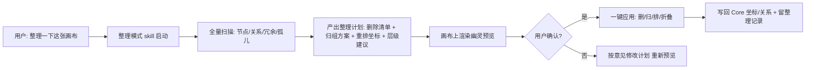

# LCOS GUI 面与 Skill 缺口全景盘点

> 日期：2026-08-11
> 目录：`docs/audit/`
> 性质：基于 2026-08-10 对话产出重建 + 代码/文档交叉验证的详细盘点

---

## 0. 文档说明与方法

### 0.1 为什么有这份文档

2026-08-10 的对话里完成过两件事，但结果只存在于对话流中，没有落成可复查的文档：

1. **GUI 全量功能盘点**：把当时 GUI 上所有按钮和功能按一级窗口/二级卡片分类，并做了评分（使用概率、看到概率、几步可用、可否 skill/CLI 替代、是否一次点击/拖拽可管理画布）。
2. **Skill 缺口分析**：按"LCOS 日常工作还会涉及哪些动作"和"用当前 skill 整理画布遇到的流程问题"两条线，列出缺哪些 skill。

本报告把这两件事完整落盘，并用 2026-08-10 的架构普查（Census）、能力台账（Capability Ledger）、Phase F/G 交接文档和 `apps/web/src/features/` 真实代码逐一交叉验证，保证不是凭对话印象写的。

### 0.2 验证方法

| 步骤 | 做了什么 | 证据 |
| --- | --- | --- |
| 1 | 遍历 `apps/web/src/features/` 全部 22 个功能目录、98 个文件 | 见 §1 全量表 |
| 2 | 通读架构普查 `LCOS_CURRENT_ARCHITECTURE_CENSUS_20260810.md` | Presentation 层内存态、Context Pack 不含 Conversation、相机双写等 |
| 3 | 核对 `LCOS_CAPABILITY_LEDGER.md` | UI-01~10、RUN/RT/CLI/MCP 矩阵（部分已过时，作 8/3 基线交叉引用） |
| 4 | 核对 Phase F/G 交接文档 | curator V1 硬规则、语义检索 schema v23 |
| 5 | 读 curator skill 实际安装副本 | `C:\Users\1\.codex\skills\lcos-project-curator\SKILL.md` |
| 6 | 读搜索/语义代码 | `project-search-service.ts`、`semantic-index-service.ts`、`metadata-repository.ts` |

### 0.3 状态标记约定

| 标记 | 含义 |
| --- | --- |
| ✅ | 线上可用（有真实入口且按预期工作） |
| 🟡 | 有入口但本轮/近期未做人工验收，或仅部分可用 |
| 🔵 | 内存态：功能存在，但状态不落 Core/SQLite，**重启丢失** |
| 🔶 | 部分实现（能用一半，另一半是占位/未接） |
| ⛔ | 缺失或入口不存在 |

### 0.4 一句话结论（给 Dz）

**界面和交互层已经长得很全，但"组织画布"这件事缺一个专门的 skill，而且有一批功能做了没有入口、一批入口做了没验收、一批状态没落库。** 评分表里最扎眼的不是"功能少"，而是"功能多但用户不知道该点哪里、Agent 不该碰的却碰不了"。

---

## 1. GUI 一级窗口与二级卡片全量表

以下按功能目录组织，每个组件标注当前状态。组件名与代码文件一一对应，方便开发/前端直接定位。

### 1.1 Shell —— 应用壳（10 个组件）

| 组件 | 职责 | 状态 | 备注 |
| --- | --- | --- | --- |
| `AppShellView` | 应用总装：项目条、工作区栏、画布宿主、工作栏宿主、弹窗宿主的编排 | ✅ | Phase 1-3 拆分后的总装宿主 |
| `CanvasSceneHost` | Dock/画布/小地图/面包屑/浮层宿主 | ✅ | 画布场景唯一宿主 |
| `WorkRailHost` | 工作栏宿主 | ✅ | 右侧工作栏总装 |
| `DialogsHost` | 14 类弹窗宿主（创建/资源/交接/工作区状态等） | ✅ | 弹窗统一 Portal |
| `AgentContextSurface` | Agent 上下文卡片（右侧） | 🟡 | **用户明确吐槽"像测试窗口、挡一大块画布"**；数据每 3 秒轮询，未并入 SSE |
| `CapabilityPopover` | 能力弹出层 | ✅ | 已重构为醒目小按钮形态 |
| `ProjectStripVNext` | 项目条（顶部项目切换） | ✅ | 与 V07TopBar 并存，有重复嫌疑 |
| `SurfaceDock` | 多形态视图 Dock | ✅ | 面（Surface）切换坞 |
| `V07TopBar` | 顶栏 | ✅ | 含项目/会话信息 |
| `WorkspaceRailVNext` | 工作区栏 | ✅ | 工作区切换 |

### 1.2 Canvas —— 画布核心（13 个组件/模块）

| 组件 | 职责 | 状态 | 备注 |
| --- | --- | --- | --- |
| `ProjectCanvas` | 旧画布入口（兼容/迁移层） | 🟡 | 与 SpatialCanvas 并存 |
| `SpatialCanvas` | 空间画布主组件 | ✅ | 当前主画布 |
| `SpatialViewport` | 视口（相机/缩放/平移） | ✅ | 缩放比例、小地图都存在 |
| `SpatialNodeLayer` | 节点渲染层 | ✅ | 含 LOD 简化 |
| `SpatialEdgeLayer` | 连线渲染层 | 🟡 | **用户多次反馈"连线看不到"**；层级逻辑呈现在 GUI 上仍乱 |
| `SpatialOverlayLayer` | 浮层渲染层 | ✅ | |
| `CanvasNodeVisual` | 节点视觉（形态/图标/边框） | 🟡 | 预览渲染未进节点（图片/文件封面）；节点信息"为加而加" |
| `CanvasMiniMap` | 小地图 | 🟡 | 曾被侧边栏厚边框盖住；用户对"无小地图"审美有疑问 |
| `NodeContextToolbar` | 节点上下文工具条 | ✅ | 单击/双击语义待进一步验证 |
| `NodeInfoPopover` | 节点信息浮层 | ✅ | 单击详情为屏幕坐标 Overlay（冻结交互规则） |
| `SelectionComposer` | 多选投送 | 🟡 | **多选后框架"全黏在一起"、drop 体验失败（与相机移动冲突）**；E2E 曾跳过真实种子 |
| `spatialInteractionMachine` | 拖拽/悬停/点击状态机 | ✅ | drop 暂停（顿一下）方案落地待验收 |
| `spatialCamera` / `spatialHitTest` / `spatialLod` / `spatialTypes` | 相机/命中测试/LOD/类型 | ✅ | 相机常量集中（A4）已做 |

### 1.3 Surfaces —— 多形态视图（17 个组件/模块）

| 组件 | 职责 | 状态 | 备注 |
| --- | --- | --- | --- |
| `ContextFlowSurface` | 上下文流式线性视图 | ✅ | 线性≠单链：支持多线分叉 |
| `ContextGraphSurface` | 上下文图视图 | ✅ | |
| `ContextTreeSurface` | 树状（幕布式）视图 | ✅ | |
| `ContextHistoryRail` | 上下文历史栏 | ✅ | |
| `DeliverSurface` | 交付视图 | ✅ | |
| `OutlineSurface` | 大纲视图 | ✅ | |
| `WorkflowSurface` | 工作流视图 | ✅ | |
| `WorkFreeSurface` | 自由工作视图 | ✅ | |
| `WorkSurface` | 工作视图 | ✅ | 与 WorkFree 的差异未做用户验收 |
| `ProjectionSurfaces` | 投影总装 | ✅ | |
| `SurfaceObject` | 面对象渲染 | ✅ | |
| `SurfaceComposerBar` | 面组合栏 | ✅ | |
| `capabilityViewResolver` | 能力→视图解析 | ✅ | |
| `historyProjection` | 历史投影 | 🔵 | 投影状态为内存态 |
| `surfaceContracts` / `surfaceModel` / `surfaceLayouts` | 契约/模型/布局 | ✅ | 布局是否落库见 Census §13 |

### 1.4 Create —— 创建类（4 个）

| 组件 | 职责 | 状态 | 备注 |
| --- | --- | --- | --- |
| `ProjectCreateDialog` | 新建项目 | ✅ | 曾出现 `workspaces.updated_at NOT NULL` 报错，已修 |
| `ScopeCreateDialog` | 新建工作区 | ✅ | |
| `CreateContentDialog` | 新建内容节点 | ✅ | |
| `LinkReferenceDialog` | 新建链接引用 | ✅ | |

### 1.5 Resources —— 资源导入/查看（3 个）

| 组件 | 职责 | 状态 | 备注 |
| --- | --- | --- | --- |
| `UniversalImportPanel` | 通用导入面板（文件/文件夹/URL） | ✅ | 已有文件夹导入；"导入已有文件夹创建项目"曾反复出问题 |
| `ResourceDetailDialog` | 资源详情 | 🟡 | 预览生成卡住问题（见 §3.4） |
| `ObsidianImportDialog` | Obsidian 连接器导入 | ✅ | 目前唯一只读连接器；Eagle/IMA/收藏夹未接（不急） |

### 1.6 Conversations —— 对话导入（1 个）

| 组件 | 职责 | 状态 | 备注 |
| --- | --- | --- | --- |
| `ConversationContextDialog` | 对话上下文导入 | ✅ | 章节实体化（reference 关系）已可用；**Context Pack 不含 Conversation 本体**，导入粒度仍偏粗 |

### 1.7 Workbench / WorkRail —— 工作台（3 个）

| 组件 | 职责 | 状态 | 备注 |
| --- | --- | --- | --- |
| `ArtifactWorkbench` | 产物工作台 | 🟡 | 与 WorkRail 职责重叠，未验收 |
| `WorkRail` | 工作栏 | 🟡 | 右侧工作栏，用户对右侧栏整体存疑 |
| `PreviewSurface` | 预览面 | 🟡 | 预览渲染策略见 §3.4 |

### 1.8 Workspace —— 工作区（3 个）

| 组件 | 职责 | 状态 | 备注 |
| --- | --- | --- | --- |
| `WorkspaceDock` | 工作区坞 | ✅ | |
| `WorkspaceDialog` | 工作区管理 | ✅ | |
| `WorkspaceStatesDialog` | 工作区状态管理 | ✅ | |

### 1.9 Viewer —— 沉浸预览（2 个）

| 组件 | 职责 | 状态 | 备注 |
| --- | --- | --- | --- |
| `ImmersiveViewer` | 沉浸式查看器（占满屏幕） | ✅ | 飞书式"占满屏幕"方向已落地 |
| `artifactViewerRegistry` | 产物查看器注册表 | ✅ | 按文件类型注册 |

### 1.10 Drop / Handoff —— 投送与交接（3 个）

| 组件 | 职责 | 状态 | 备注 |
| --- | --- | --- | --- |
| `dropIntentMachine` | drop 意图状态机 | ✅ | 已实现"顿一下触发 drop"机制（用户确认方向） |
| `DropShelf` | 投送架 | 🟡 | 投送目标空间多中心结构待验收 |
| `HandoffDialog` | 交接对话框 | 🟡 | 文件级 zip 交接有入口，手工验收未完整跑 |

### 1.11 Project —— 项目管理（2 个）

| 组件 | 职责 | 状态 | 备注 |
| --- | --- | --- | --- |
| `ProjectDrive` | 项目驱动器（文件树） | 🟡 | 与文件夹导入联动待验证 |
| `ProjectToolsDialog` | 项目工具 | 🟡 | 入口有，未验收 |

### 1.12 Layout —— 布局引擎（11 个）

| 组件 | 职责 | 状态 | 备注 |
| --- | --- | --- | --- |
| `layoutEngines` / `layoutService` | 布局引擎注册与调度 | ✅ | ELK / fcose / cytoscape-fcose 三个驱动 |
| `elkDriver` / `elkLayoutAdapter` | ELK 布局 | ✅ | |
| `fcoseLayoutAdapter` | fcose 布局 | ✅ | |
| `cytoscapeFcoseDriver` | cytoscape-fcose | ✅ | |
| `builtinLayoutEngines` | 内置布局 | ✅ | |
| `layoutGraph` / `layoutGeometry` / `layoutTypes` | 布局图/几何/类型 | ✅ | |

### 1.13 Presentation —— 投影层（5 个）

| 组件 | 职责 | 状态 | 备注 |
| --- | --- | --- | --- |
| `contextStrands` | Strand 位置/剪开/临时边 | 🔵 | **内存 Map（`presentationDraftState`），重启即丢** |
| `mindMapLayout` | 思维导图布局 | 🔵 | 导图状态无 Core 契约 |
| `presentationHierarchy` | 大纲层级/折叠 | 🔵 | **内存 Map（`presentationHierarchyState`），重启即丢** |
| `relationGraphModel` | 关系图模型 | ✅ | 底层关系是 Core 契约 |
| `visualFamily` | 视觉族 | 🟡 | 视觉一致性待验收 |

### 1.14 Onboarding / UI / Design / Diagnostics（5 个）

| 组件 | 职责 | 状态 | 备注 |
| --- | --- | --- | --- |
| `CanvasEmptyState` | 空画布引导 | ✅ | 首启引导 |
| `ConfirmDialog` | 通用确认 | ✅ | |
| `InlineNodeRename` | 节点行内改名 | ✅ | |
| `LcosGlyphs` | 图标库 | ✅ | 图标"不受缩放影响"的要求与此相关 |
| `RuntimeDiagnosticsPage` | 运行时诊断页 | 🟡 | 有入口，属测试用途，对普通用户应"居于幕后" |

---

## 2. 用户价值评分表

评分口径（1-5 分）：

- **使用概率**：普通用户日常使用该功能的频率（5=几乎每天，1=几乎不用）。
- **看到概率**：用户在界面上一眼能找到的概率（5=默认可见，1=藏得深）。
- **几步可用**：从打开项目到完成该功能需要的步数（5=一步到位，1=超过三步）。
- **skill/CLI 可替代**：该功能是否可以让本地 Agent（skill）或命令行完成（5=完全可以替代，1=必须人肉 GUI 操作）。
- **一次点击/拖拽可管理**：用户想自己管理画布时，该功能是否一次点击或一次拖拽就能实现（5=是，1=需要多步或多次操作）。

### 2.1 主功能评分

| 功能 | 使用概率 | 看到概率 | 几步可用 | skill/CLI 可替代 | 一次点击/拖拽可管理 | 一句话备注 |
| --- | --- | --- | --- | --- | --- | --- |
| 新建/打开项目 | 5 | 5 | 4 | 2（可替代但用户习惯手点） | 3 | 项目主页已做，删除/导出导入曾缺 |
| 拖文件/文件夹进画布 | 5 | 5 | 5 | 1 | 5 | 这是 LCOS 的核心手势 |
| 双击节点打开预览 | 4 | 4 | 4 | 2 | 4 | 预览卡住问题影响体验 |
| 单击节点详情浮层 | 4 | 4 | 4 | 1 | 4 | 冻结交互规则之一 |
| 节点改名 | 3 | 3 | 4 | 3 | 4 | 行内改名已做 |
| 多选 + 投送（drop） | 3 | 3 | 3 | 3 | 4 | 拖动冲突已修，需验收 |
| 画布缩放/平移 | 5 | 5 | 5 | 1 | 5 | 触控板/滚轮 |
| 小地图导航 | 2 | 2 | 3 | 1 | 3 | 被边框盖过；LCOS 需要导航，不建议照抄"无小地图" |
| 上下文流式/树状/图视图切换 | 3 | 3 | 3 | 3 | 2 | Surface 已有，语义未落库 |
| 大纲/思维导图 | 2 | 2 | 3 | 4 | 2 | 状态内存态，重启丢 |
| 新建文本节点 | 4 | 3 | 4 | 3 | 4 | |
| 节点间连线（手动建关系） | 3 | 3 | 3 | 4 | 3 | GUI 连线显示问题反复出现 |
| 对话导入 | 4 | 2 | 3 | 5 | 2 | 核心能力，但入口偏深 |
| 文件导入（PDF/图片/MD 等） | 5 | 4 | 4 | 3 | 4 | |
| 资源理解/预览生成 | 4 | 2 | 2 | 4 | 2 | **用户明确表示不知道这是啥、卡住** |
| 沉浸式预览（占满屏） | 3 | 3 | 4 | 1 | 3 | 方向对，需更多文件类型 |
| Run 执行/审核 | 3 | 3 | 3 | 4 | 1 | 属于 Agent 主流程 |
| 运行中取消/撤回 | 2 | 2 | 3 | 4 | 2 | 排队取消过，运行中取消待验 |
| 交接（Handoff） | 2 | 2 | 2 | 4 | 1 | 文件级 zip 有入口 |
| 导出项目/项目文件 | 2 | 2 | 3 | 3 | 2 | 曾缺失，补做后未完整验收 |
| 最近项目/排序 | 3 | 4 | 4 | 2 | 4 | 已补做 |
| 工作区切换（Workspace） | 3 | 3 | 3 | 3 | 2 | |
| Obsidian 连接器 | 2 | 2 | 3 | 4 | 2 | 唯一已接连接器 |
| 运行时诊断页 | 1 | 1 | 2 | 5 | 1 | 给测试/AI 看的，应"居于幕后" |
| Agent 上下文卡片（右侧） | 2 | 2 | 2 | 3 | 2 | **挡画布，建议收进浮层/小按钮** |

### 2.2 评分结论（客观版）

1. **使用概率高的功能（新建项目、拖文件、缩放平移、双击预览、文件导入）大多已有且操作步数合理** —— 这部分不是问题区。
2. **看到概率低但使用价值高的功能（对话导入、预览管理、交接）入口藏得太深**，用户不知道去哪点。这是"功能做了但被忘了"的典型。
3. **"一次点击/拖拽可管理画布"普遍在 3 分以下**：自己整理画布（归组、重排、删冗余）目前没有任何一次手势能完成，全部要进对话框或多步操作。这是用户最痛的点，也是 skill 最能补的点。
4. **Agent 上下文卡片和运行时诊断页属于"给 AI/测试看"的界面**，对普通用户是干扰，应降噪或后置。

---

## 3. Skill 缺口清单（重点）

### 3.1 【P0】画布整理 skill —— 缺失

**现状**：`lcos-project-curator` 的硬规则第 7 条原文：

> 7. 不自动重排用户整个项目；大范围整理走 Proposal（Ghost），不直接改现有手工布局。

这条规则把"整理"限制成了"只加不碰"：不删节点、不动坐标。用户原话：

> 这个整理思路就不对，一定是会删节点，动坐标的，否则怎么算得上整理归纳，skill 是不是只包括了上下文导入的要求，没有包括整理的要求。

**根因**：curator 是"上下文沉淀"视角（把一段对话/文件导进项目），不是"画布整理"视角（用户说"整理一下这张画布"）。两个意图共用了一个 skill，硬规则按沉淀视角写，导致整理动作被禁止。

**建议**：拆成双模式：

| 模式 | 触发词 | 允许动作 | 禁止动作 |
| --- | --- | --- | --- |
| 沉淀模式（现状） | 整理进 LCOS / 沉淀到 LCOS / 记录这几轮 | 新建高密度节点、建关系、加 Presentation | 删用户节点、动坐标 |
| 整理模式（新增） | 整理一下这张画布 / 帮我把画布理一理 / 归组重排 | 删冗余节点、归组、重排坐标、建立层级（大纲/父子）、折叠 | 删除有内容价值的节点（先列删除清单给用户确认） |

整理模式必须有"删除/移动前预览确认"闸门：Agent 先产出整理计划（哪些删、哪些归到哪、怎么排），用户点确认后执行。这个闸门可以复用现有 Proposal（Ghost）机制，但执行方式从"幽灵预览"变成"一键应用"，而不是让用户自己去抄坐标。

### 3.2 【P0】工作集交接 skill（drop 语义）—— 缺失

**现状**：`dropIntentMachine` 和 `DropShelf` 已有，用户确认了"顿一下触发 drop"的交互方案。但 **skill 层没有任何"工作集交接"的流程脚本** —— Agent 不知道该把哪些节点视为"当前批次"、drop 后第一个空间何时复位、下一空间收什么。

**用户意图原话（简版）**：像 AirDrop 一样，在①排列好 → drop 给② → ①复位成干净空白等下一批；②审完 → drop 给③ → ②复位；③排布/跑 Run/审核 → drop 给④ → ③复位；④导出完复位。**任意空间、任意阶段，用户可以对任意节点发起他想让本地 Agent 做的几大类操作。**

**关键决策（已与用户对齐）**：
- Core 默认不参与 drop/复位 —— 那是视图层的工作集指针切换，节点/关系/决策仍在项目画布（Core 唯一真相）。
- 固定三个词：**工作集**（当前批的节点引用，不是拷贝）、**drop**（移交给下一空间）、**复位**（清空排列现场，不是删节点）。
- 唯一要写回数据的部分（决策/备注/阶段总结）走 skill/MCP，不经由 drop。

**skill 缺口**：没有"定义工作集 → 组织 → drop → 复位 → 下一批"的编排脚本；也没有"在任意空间对任意节点发起操作（备注/决策/总结/归档/导出）"的统一动作表。

### 3.3 【P1】自动上下文装配 skill —— 缺失

**现状**：Census §3 明确：**Context Pack 不含 Conversation**；Context 来源（`contextPresentationIds`）是 React 内存。用户在 GUI 里看到"选择来源"步骤时很困惑：

> 这个选择来源是啥意思，为什么要加一个这个，不是说直接让 agent 自己加不就行了吗。

**缺口**：Agent 接单/接收任务时，应该自己根据任务目标装配上下文（相关节点/文件/对话章节），而不是让用户先手动选来源。搜索管线（FTS + vector + related 1-hop）其实已经能为"自动装配"提供候选，但没有 skill 把它编排成"理解任务 → 搜索候选 → 组上下文 → 进 Context Pack"的流程。

### 3.4 【P1】资源/预览管理 skill —— 缺失

**现状**：
- 用户双击文件节点后卡在"资源理解/等待 preview"，等不出来。
- 图片节点不显示缩略图（用户要求：画布节点上就要有桌面快捷方式那种预览，不必双击进沉浸视图）。
- 用户原话："生成预览这个很难吗？就是抓一下文件本身 Windows 就会自带的预览图；PPT/PDF 会生成封面预览图；MD 文档也可以想办法做预览图。"

**缺口**：没有"预览状态诊断/修复"的 skill 动作；也没有"节点缩略图生成"的统一策略（哪些类型用系统缩略图、哪些用首帧、哪些渲染 MD 摘要卡片）。

### 3.5 【P1】Run 生命周期观测 skill —— 缺失

**现状**：Run 执行/审核界面存在，排队取消通过，运行中取消未实测；RuntimeDiagnosticsPage 有入口但属测试页。

**缺口**：Agent 侧没有"查看 Run 状态 → 判断卡住 → 取消/重试"的标准动作流；用户在对话里问"怎么看卡住了"时，Agent 只能靠人肉翻界面。

### 3.6 【P1】跨会话派单 skill —— 未收口

**现状**：单 Agent 闭环通（MCP claim/start、B7 sessionId 归因 DONE）；"LCOS 作为不同 session/agent 的衔接沟通平台"是原定最高优先级，但跨会话自动化未收口；跨项目交接协议仍是 Draft。

**缺口**：没有"把任务派给另一个会话/项目并等待回执"的 skill 动作；现有 Bridge 定向认领对 Codex 直接返回空（用户曾质疑这是偷懒解法）。

### 3.7 【P2】日常使用还会缺的 skill 动作（用户视角）

按用户日常动作穷举，目前 skill 覆盖不到的：

| 用户想做的事 | 有没有 skill | 现状 |
| --- | --- | --- |
| 新建项目/导入已有文件夹 | ❌ | GUI 有入口，Agent 没有标准流程（曾反复出问题） |
| 把一堆零散文件分类型、分时间归档 | ❌ | 用户提过"像档案柜"；没有归档 skill |
| 给节点加决策/备注/阶段总结 | 🔶 | 有节点编辑，但没有"决策/备注/阶段总结"的语义化动作 |
| 画布整理（删冗余/归组/重排） | ❌ | **最大缺口（§3.1）** |
| 对话导入后自动组织成章节/决策挂点 | 🔶 | 章节实体化可用，但"轻巧高效"的导入结构（Graph RAG 式）未做 |
| 语义搜索"我之前的 X 在哪" | 🔶 | CLI/搜索管线有，skill 没有"搜索→定位→汇报"的编排 |
| 预览/缩略图管理 | ❌ | §3.4 |
| 导出/交接/打包给外部 | 🔶 | HandoffDialog 有，skill 无流程 |
| 项目级整理（最近项目、排序、归档旧项目） | ❌ | GUI 刚补，Agent 无动作 |
| 观察/汇报 Run 卡在哪 | ❌ | §3.5 |
| 多选一批节点统一操作（加备注/改类型/归组） | ❌ | SelectionComposer 只管投送，无统一批量操作动作 |
| 让 Agent 跨会话把任务转交 | ❌ | §3.6 |
| Web Chat 上传附件收进项目 | ❌ | **战略 P0（2026-08-11 用户定调）**：浏览器上行记录拦截（本地 agent 浏览器内嵌 + 扩展 webRequest）为主，Chat Web skill 兜底；配套快速唤醒（全局快捷键/弹窗/浏览器插件） |
| 快速唤醒（选中即收） | ❌ | 用户触达优先级最高：弹窗 + 快捷键 + 本地 agent 浏览器内置插件，详见设计参考报告 §9 |

---

## 4. 当前 curator 路径 vs 建议"画布整理"路径

### 4.1 当前路径（沉淀模式）

问题：画布节点只会增多，不会变整洁；用户说"整理"时期望的是"变少、变清楚、变有层级"。

### 4.2 建议路径（整理模式）

### 4.3 两种模式的共存规则

- 沉淀模式只加不碰（现状），触发词保持"整理进 LCOS / 沉淀到 LCOS"。
- 整理模式可删可动（新增），触发词为"整理画布 / 理一理 / 归组 / 重排"。
- 整理模式的删除必须有预览确认闸门；移动坐标前保留原布局快照（可回滚）。
- 两个模式共用底层工具（搜节点、建关系、改坐标、Presentation），只是约束不同。

---

## 5. 优先级建议

| 优先级 | 事项 | 理由 |
| --- | --- | --- |
| P0 | 新增"画布整理"模式（与 curator 沉淀模式分离） | 用户最痛的点，直接决定"整理"这个词在 LCOS 里是否成立 |
| P0 | 补"工作集交接" skill 编排（drop/复位/批处理动作表） | 交互已做（dropIntentMachine），只差 Agent 流程；验证前两轮 UI 工作的价值 |
| P1 | 自动上下文装配（Context Pack 含 Conversation） | 去掉"选择来源"步骤，符合"减少用户束缚"宗旨 |
| P1 | 预览/缩略图管理（节点内预览 + 预览卡住诊断） | 用户多次反馈卡住，且要求"节点上直接显示封面" |
| P1 | Run 生命周期观测 skill（状态/取消/重试） | 用户会问"怎么看卡住了" |
| P1 | 跨会话派单收口 | 原定最高优先级，目前只通单 Agent 闭环 |
| P2 | 归档/分类型/决策备注阶段总结等日常动作 | 用户已描述档案柜式的整理意图 |
| P2 | 项目级管理（删除/导出/排序）skill 化 | GUI 已补，Agent 动作补齐即可 |

---

## 6. 附录：证据文件索引

- 代码：`apps/web/src/features/`（22 目录 / 98 文件，见 §1）
- 架构普查：`docs/audit/LCOS_CURRENT_ARCHITECTURE_CENSUS_20260810.md`
- 能力台账：`docs/audit/LCOS_CAPABILITY_LEDGER.md`
- Phase F（curator）：`docs/handoffs/PHASE_F_CURATOR_SKILL_HANDOFF_20260810.md`
- Phase G（语义检索）：`docs/handoffs/PHASE_G_SEMANTIC_RETRIEVAL_HANDOFF_20260810.md`
- curator skill 安装副本：`C:\Users\1\.codex\skills\lcos-project-curator\SKILL.md`
- 搜索管线代码：`apps/local-core/src/project-search-service.ts`
- 语义索引代码：`apps/local-core/src/semantic-index-service.ts`
- 向量查询代码：`apps/local-core/src/metadata-repository.ts`（L1810 起）
