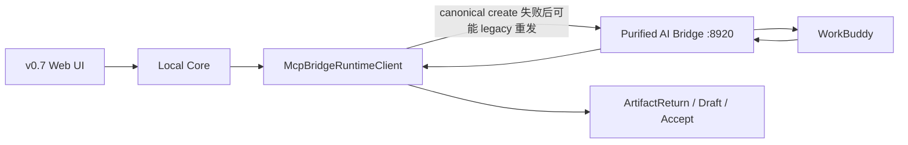
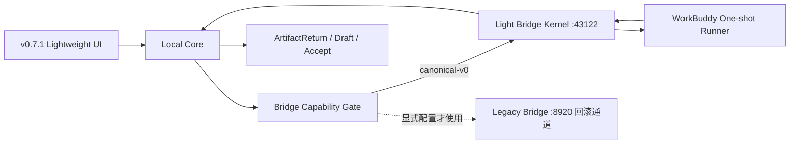

# LCOS MVP v0.7.1 UI 与 Light Bridge 大改前置方案

日期：2026-07-30

基线：

```text
worktree: E:\Codex 项目\OS开发\.worktrees\mvp-fast-build
branch: codex/mvp-fast-build
HEAD: 02b7ef1 feat(runtime): complete MVP 1.0 execution loop
working tree before this document: clean
```

## 1. 变更原因

当前 MVP 1.0 已跑通真实纵向闭环，但前端仍有双侧栏、节点点击后信息路径偏重、
Workspace 与 Scope 联动过度等交互问题；现有提纯 Bridge 也保留了较多历史服务面。

本轮拟复用两份已交付代码：

```text
Frontend:
C:\Users\1\Desktop\OS开发\MVP重构\mvp UI V0.7\0.7.1\
LCOS_MVP1.0_Frontend_v0.7.1_Lightweight_UI_20260730

Bridge:
C:\Users\1\Desktop\OS开发\MVP重构\bridge导入\light\
LCOS_Light_Bridge_Kernel_v0.1.0.zip
```

目标是在不重写 Canonical Run、ArtifactReturn、Revision、Accept/Retry/Reject
语义的前提下：

1. 正式接入 v0.7.1 轻量 UI；
2. 将 Light Bridge Kernel 作为可审计源码导入当前 Git 树；
3. 用 capabilities handshake 消除不确定失败后的 Legacy 双重创建风险；
4. 通过真实 WorkBuddy Markdown E2E 后，才把默认 Bridge endpoint 从旧 Bridge
   切换到 Light Bridge。

## 2. 审计结论

### Frontend v0.7.1

- 来源包明确基于当前 MVP 1.0 前端集成包制作；
- `runtimeBridge.ts`、`packages/contracts`、`packages/domain` 与当前 HEAD 无语义差异；
- 实际功能差异集中在 19 个 Web 文件，约 `+479/-460`；
- 保留 Import Copy、Preview、ContextManifest、Canonical Run、ArtifactReturn 和
  Accept/Retry/Reject；
- 未执行官方依赖环境下的 npm 质量链和真实浏览器 E2E，接入后必须在本仓库补做；
- 未发现凭证、Token、私钥或 `.env` 文件。

### Light Bridge Kernel v0.1.0

- 是独立 Python 3.11+ Task Plane，不是旧 Bridge 的补丁；
- 包含 SQLite Task Store、确定性 Task ID、并发幂等、重启恢复、Provider Registry、
  MCP/REST/CLI、changed files、cancel/finalize；
- 声明并测试 loopback 限制；
- 提供当前 `McpBridgeRuntimeClient` 需要的 MCP 工具；
- 未包含真实 WorkBuddy/Codex 执行器启动、完整 Runtime Reconciler、Watcher、
  SSE/WebSocket；
- `waiting_input` 仍不是已实现能力；
- 使用 FastAPI、Uvicorn、Pydantic、Typer；这些依赖只属于隔离的 Python 工具，
  不进入根 npm lockfile；
- 未发现凭证、Token、私钥、Runtime Snapshot 或用户数据。

## 3. 变更前流程



## 4. 变更后流程



能力握手后，一个 Local Core 进程只使用一种已确认合同。创建结果不确定时不得切换
合同重发 `create_task`。

## 5. 用户操作变化

### UI

- Workspace 单击只改变 active Workspace，不再改变 Scope 或 Camera；
- Locate 只移动 Camera；
- 节点单击只选中，并显示局部工具条；
- Canvas zoom 大于 20% 时显示 `?`，点击打开轻量信息浮层；
- Work Rail 只承担 Composer、Run、Waiting Input、Review、Completed；
- 默认 Workspace Rail 与 Work Rail 收起；
- 删除第二套 Utility Dock/Panel 和旧 NodeQuickLook。

### Runtime

- Command、Run、Review、Accept/Retry/Reject 的用户操作不改变；
- Bridge 不可用时仍显示结构化失败或 recovery_required；
- Light Bridge 未通过真实执行 E2E 前，用户启动方式不切换；
- `waiting_input` 继续明确为 UI/Canonical 状态能力，不伪装成已完成的 Provider Resume。

## 6. 数据流变化

不改变：

```text
Web instruction
→ ContextManifestV0
→ Canonical Run
→ RuntimeDispatch
→ RuntimeBinding
→ Bridge Task
→ ResultEnvelope / changed_files
→ ArtifactReturn.pending_review
→ Draft Revision
→ Accept / Retry / Reject
```

新增：

```text
Local Core startup
→ GET /v1/capabilities 或 MCP health_check
→ 固定 canonical/legacy contract mode
→ create/recover/sync/finalize
```

Light Bridge 的 SQLite 只保存 Provider Task Truth，不进入 LCOS Project SQLite，
不成为 Artifact、Revision 或 Current Truth。

## 7. 影响模块与预计文件

### UI 正式接入

- `apps/web/src/App.tsx`
- `apps/web/src/main.tsx`
- `apps/web/src/features/canvas/*`
- `apps/web/src/features/shell/*`
- `apps/web/src/features/workrail/WorkRail.tsx`
- `apps/web/src/features/workspace/WorkspaceDock.tsx`
- `apps/web/src/state/workRailMode.ts`
- `apps/web/src/runtime/v07UiContracts.ts`
- `apps/web/src/v071.css`
- 对应 Web tests

只导入包中真实有功能差异的文件；不覆盖相同的 Runtime、Contract、Domain 文件。

### Bridge 与 Local Core

- 新增 `tools/light-bridge-kernel/`
- `apps/local-core/src/bridge-mcp-client.ts`
- `apps/local-core/src/index.ts`
- `apps/local-core/tests/bridge-mcp-client.test.ts`
- Light Bridge 自带 Python tests
- launcher/runbook 是否接入 `43122`，只在真实 E2E 通过后决定

### 文档

- 本前置方案；
- v0.7.1 接入报告；
- Light Bridge Gate 与真实 E2E 报告；
- 最终大改交付 Handoff。

## 8. 文件、Schema 与依赖

- LCOS SQLite：不变，不做 migration；
- Project 文件与 `.creative-os` 格式：不变；
- npm 依赖与根 lockfile：不变；
- 新增隔离 Python 工具依赖：FastAPI、Uvicorn、Pydantic、Typer；
- Light Bridge Runtime Root 必须位于 Project 外并显式配置；
- 不导入 ZIP 中的 wheel、缓存或构建产物，只导入源码、测试、文档和依赖声明。

## 9. 实施顺序与开发成本

### Slice 1 — v0.7.1 UI

1. 精确移植 19 个功能差异文件；
2. 保留当前 Runtime 接线；
3. 跑 Web 定向测试、typecheck、build；
4. 在 1440×900、1366×768、125% 浏览器缩放下做交互验收。

预计：0.5–1 个开发日。

### Slice 2 — Light Bridge 仓内导入

1. 导入 clean source，不导入 wheel/dist；
2. 在隔离 Python 环境跑 11 项测试；
3. 补仓库启动说明和安全边界。

预计：0.25–0.5 个开发日。

### Slice 3 — Capability Gate 与兼容联调

1. Local Core 增加 capabilities handshake；
2. 删除“不确定失败后切 Legacy 合同重发”的行为；
3. 保留显式 Legacy endpoint 回滚能力；
4. 跑 create/replay/restart/recover/finalize 合同测试。

预计：0.5–1 个开发日。

### Slice 4 — 真实 WorkBuddy E2E 与默认切换

1. 明确并启动 one-shot Runner；
2. claim/start/submit-result；
3. Local Core sync；
4. Draft/Accept；
5. Bridge 与 Local Core 重启恢复；
6. 通过后才调整默认 endpoint/launcher。

预计：0.5–1.5 个开发日，取决于 Runner 现有可复用程度。

总计：约 2–4 个开发日。

## 10. 风险

1. Light Bridge 没有真正执行器唤醒，若直接替换会出现 Task 已创建但无人执行；
2. 当前 Local Core 的 canonical → legacy 自动重发可能产生重复 Task，必须先修；
3. v0.7.1 删除旧 Selection Inspector 路径，需确认 Runtime Review 信息没有被一起删掉；
4. v0.7.1 包未跑真实浏览器 E2E，可能存在 1366×768、125% 缩放或 pointer 回归；
5. Python Runtime 生命周期若直接塞进现有 npm launcher，会扩大故障面，因此默认切换前单独验收；
6. `waiting_input`、真正 Conversation Resume、自动 WorkBuddy 唤醒仍不得宣称完成；
7. 同时运行旧 Bridge 与 Light Bridge 时必须使用不同 Runtime Root，禁止共享数据库或任务目录。

## 11. 验收条件

### UI

- v0.7.1 架构合同通过；
- Workspace、Scope、Camera 三者不再被错误联动；
- 节点选中、拖动、局部工具条、`?` 信息浮层无粘连；
- Work Rail 的真实 Run、Review、Accept/Retry/Reject 仍可用；
- 浏览器刷新与 Local Core 重启后恢复；
- 1366×768、1440×900、125% 浏览器缩放可用。

### Bridge

- capabilities handshake 固定合同模式；
- 相同 Run 重放返回同一 Task；
- Bridge 重启可按 Run 恢复；
- WorkBuddy 真实写入声明的 Markdown 输出；
- changed_files 经 Path Guard 进入 Draft；
- Accept 前 Current 不变，Accept 后 CAS 推进；
- Retry 创建新 Canonical Run；
- 旧 Bridge 回滚路径可用；
- 不含凭证、Runtime Snapshot 或用户数据。

### 最低质量链

```text
UI 定向测试
→ Local Core / Bridge 定向测试
→ npm run check:fast
→ npm run test:integration
→ npm run test:architecture
→ npm run check
→ git diff --check
→ 浏览器 Golden Path
→ Light Bridge / WorkBuddy 真实 E2E
```

## 12. 回滚方案

- UI 单独提交；异常时 revert UI 提交，回到 `02b7ef1` 视觉与交互；
- Light Bridge 源码导入单独提交，不修改 Project 数据；
- Capability Gate 单独提交，并保留显式旧 endpoint；
- 未通过真实 E2E 前不修改默认 Bridge endpoint；
- 若默认切换后失败，恢复 `LOCAL_CORE_BRIDGE_MCP_URL=http://127.0.0.1:8920/mcp`；
- 不删除旧 Bridge 源码、Runtime 或历史任务，不使用破坏性 Git 清理。

## 13. 建议批准范围

建议一次批准 Slice 1–3：

```text
v0.7.1 UI 正式接入
Light Bridge clean source 导入
Capability handshake 与双创建风险修复
定向测试和集中质量链
```

Slice 4 可以继续准备 Runner，但只有真实 WorkBuddy E2E 通过后才允许把 Light Bridge
设为默认。若 E2E 不通过，MVP 继续使用已验证旧 Bridge，Light Bridge 保持可回滚
Spike，不影响现有 MVP 1.0。
