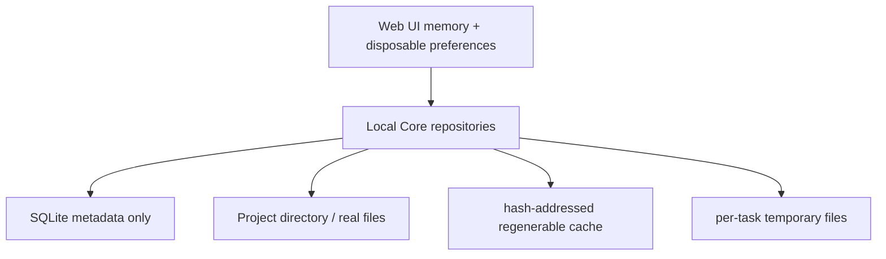

# Data and Storage Audit

## 1. 当前真实状态

| 项目 | 状态 |
|---|---|
| SQLite | 未实现 |
| schemaVersion | 正式后端未实现 |
| migration | 未实现 |
| Repository implementation | 未实现 |
| Project Directory / `.creative-os` | 未实现 |
| 文件导入 / 哈希 / 去重 | 未实现 |
| Watcher / stale / External Change | 未实现 |
| Preview / cache | 未实现 |
| Context persistence | 未实现 |
| Revision / Current / Draft | 仅 Domain 类型与前端 Fixture |
| Checkpoint persistence | 未实现 |

## 2. localStorage 审计

候选包：

```text
local-creative-os.prototype.v9.<projectId>
local-creative-os.prototype.v8
local-creative-os.projects.v1
```

`PersistedPrototypeState version: 9` 保存：

- nodes / edges；
- workspaces / scopes；
- activeWorkspaceId / activeScopeId；
- Work Rail preference；
- Project Catalog。

判定：

- `version: 9` 是 Prototype 数据格式版本，不是正式 `schemaVersion`；
- Project Graph、Workspace、Scope、Run、Revision、Checkpoint 不得继续由 localStorage 承担；
- Work Rail 折叠、宽度等可丢 UI preference 可继续在浏览器保存；
- 整合前必须把 localStorage 数据标记为 Fixture / disposable，不做静默 migration 到正式项目库。

## 3. Domain / Repository 缺口

现有 Contracts 只有接口，没有实现：

- `ProjectContract`；
- `ArtifactContract`；
- `ContextContract`；
- `ExecutionRuntimeContract`；
- `WorkspaceQueryContract`；
- `PreviewContract`。

`Relation` 尚未进入 Domain。Candidate `CanvasScope` 与冻结 Sub-canvas 范围存在产品/合同张力，不能直接按 localStorage 结构生成 SQL 表。

## 4. 目标存储边界



- SQLite：元数据、关系、状态、布局，不存大 BLOB；
- Source：默认链接，不默认移动或复制；
- Cache：缩略图、Preview、提取文本，可清理重建；
- Temp：任务完成/取消后清理；
- 正式 Artifact / Current Revision / Checkpoint 不得被缓存清理；
- `.creative-os` 仅 Local Core 写入。

## 5. 正式 Schema 进入前的门

本 Phase 不设计或创建 SQL。Phase 2 前必须先冻结：

1. `schemaVersion` 与 migration ledger；
2. 数据库备份、WAL checkpoint、失败恢复；
3. Project / Workspace / Artifact / ArtifactView / Relation / Note / Revision / Checkpoint 的唯一约束；
4. default-one-view-per-workspace 与 explicit additional view 的表达；
5. Current Revision 唯一性与 Pending Return 隔离；
6. Scope 是否进入 Alpha；
7. UI preference 与 Project truth 分离；
8. Windows 路径规范化、project-root containment；
9. 缓存清理后项目可恢复。

## 6. 性能与缓存优先级

冻结上限：

- 全局可再生缓存默认 5GB；
- Heavy Task 1；
- Light Task 2–3；
- 拖动期间只写内存，300–800ms debounce / batch；
- Preview 分 Thumbnail → Page Preview → Original；
- 不预生成所有高清页；
- 视频 Alpha 只链接、封面与元数据。

文档冲突处理：

- 旧存储预算有“流动边 8–12 条”表述；
- 最新 PRD/UI/AGENTS 冻结为持续流动线最多 2 条；
- 后端与测试采用最多 2 条，不自行折中。

## 7. 风险

- 把 Candidate v9 当正式 schema 会把 CanvasNode、Artifact、ArtifactView 混成一张对象；
- Scope 未冻结却先建表会固化未通过的 Child Scope；
- 将 Run 数据放 Web/localStorage 会破坏重启恢复；
- 将 Bridge result 直接设 Current 会绕过 Draft/Pending；
- 将外部绝对路径直接写入/回传而不做 containment 会造成安全缺口。
