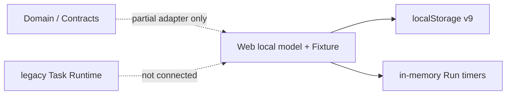
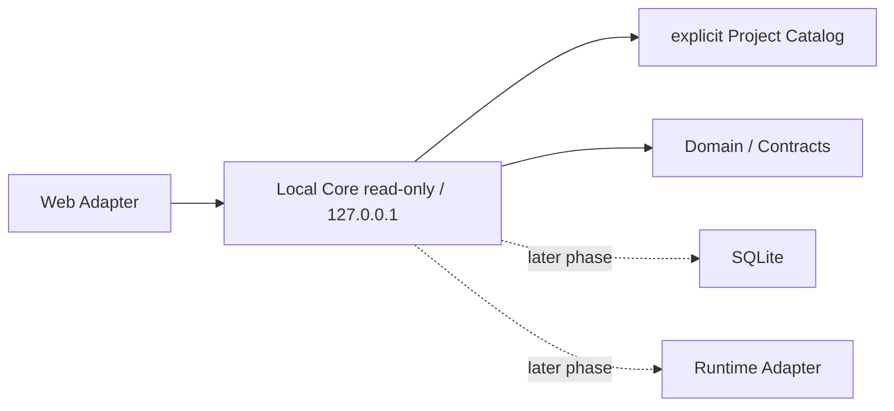

# Recommended Backend Phase 0

> 状态：提案，未批准，未编码

## 1. 推荐集成基线

采用 v0.6.0 候选包作为“前端整合输入”，不是直接覆盖源：

1. 校验固定 ZIP SHA256；
2. 由前端 owner 审查 37 candidate-only、20 different、8 repo-only；
3. 保留 Domain / Contracts 当前相同实现；
4. 修复测试发现范围，防止 `前端测试/` 被 Vitest 收集；
5. 根质量门显式覆盖 Web、Domain、Contracts；
6. 完整链通过；
7. 创建新的可追溯 frontend integration baseline commit；
8. 从该提交创建 `codex/backend-phase-0` 独立 worktree。

## 2. 目录结构

获批后的最小目标：

```text
apps/
  web/                 # 前端 owner
  local-core/          # 后端 owner；Phase 1 才创建
packages/
  domain/              # 纯领域类型/规则
  contracts/           # Repository/Runtime/Preview 等边界
  ui/                  # 不由后端修改
docs/
  backend-takeover/
  handoffs/
tests/
  local-core/          # 或 apps/local-core/tests，按现有工具最小选择
```

Phase 0 本身只修改 Domain / Contracts / 后端测试与文档；不修改 Web/UI/Bridge。

## 3. 最小合同

Phase 0 只冻结：

- Project identity / root；
- Workspace semantic viewport；
- Artifact / ArtifactView / ArtifactRevision；
- Relation；
- Note anchor（artifact / artifact_view / page）；
- Command / immutable ContextSnapshot；
- canonical Run / RunEvent；
- ChangedFile；
- Pending ArtifactReturn；
- Checkpoint；
- `Result<T>` / stable errors；
- Fixture 与 Runtime origin。

Scope、SQLite 表、REST 路径、SSE transport、Watcher 与写 Lease 不在本 Phase 实现。

## 4. 变更原因

当前 Web Candidate、主仓与合同没有共同 Git 基线；Local Core 不存在。直接引入 SQLite/Bridge 会把前端 Fixture 结构、候选 Scope 缺陷和 Bridge legacy Task 语义固化成后端事实。

## 5. 变更前流程



## 6. 变更后流程（Phase 1 目标，不在本轮实现）



## 7. 用户操作变化

Phase 0 无用户操作变化。Phase 1 只会增加诚实的 Runtime health / project availability；Fixture 与 Runtime 必须显式区分，不替换现有前端黄金路径。

## 8. 数据流变化

Phase 0 只冻结边界，无数据迁移。不得把 localStorage v9 自动导入正式存储。未来迁移必须显式、可预览、可回滚。

## 9. 预计修改文件

### 集成基线任务（前端 owner）

- `apps/web/**`
- 根 / Web `package.json`
- `package-lock.json`
- `scripts/smoke.mjs`
- test config / release docs

### Backend Phase 0（后端 owner，批准后）

- `packages/domain/src/index.ts`
- `packages/domain/tests/**`
- `packages/contracts/src/index.ts`
- `packages/contracts/tests/**`
- 一份 `docs/handoffs/**.md`

### 第一条编码任务（Phase 1，另批）

- 新建 `apps/local-core/package.json`
- 新建 `apps/local-core/tsconfig.json`
- 新建少量 `src/health`、`src/project-root`、`src/server` 文件
- 新建对应测试
- 根脚本仅在明确批准后接入

不预计修改 `apps/web`、`packages/ui` 或 Bridge。

## 10. 开发成本

- 前端基线整合：中等，主要成本在 65 个差异路径的 owner 审查与隔离验证；
- Backend Phase 0 合同冻结：小到中等；
- Phase 1 只读骨架：小切片；
- SQLite、Watcher、Preview、Bridge 均为后续独立 Phase。

## 11. 测试

集成基线：

```text
lint → typecheck → unit → build → smoke
```

并要求：

- Web / Domain / Contracts 各自隔离测试计数；
- `前端测试/` 不被根测试收集；
- lockfile 无非预期变化；
- v0.6 正常路径回归；
- Child Scope 与 Accept 仍按 PARTIAL/FAIL 诚实记录。

Backend Phase 0：

- Domain / Contracts lint、typecheck、unit；
- Artifact Return 优先级；
- terminal Run status；
- Fixture/Runtime origin；
- branded canonical RunId 与 legacy task mapping 类型隔离；
- Relation 与 Scope 决策测试。

Phase 1：

- 只绑定 `127.0.0.1`；
- 非 loopback 失败；
- 合法/缺失/逃逸 Project root；
- Abort / graceful close；
- 无文件写入、无 `.creative-os`、无 SQLite 文件产生。

## 12. 验收条件

1. 新基线来源可追溯、工作树干净；
2. Candidate 差异由正确 owner 决定；
3. 根质量门无测试目录污染；
4. Domain / Contracts 与 Web Adapter 的字段映射被记录；
5. Scope 不在未冻结前进入后端实现；
6. Phase 0 不引入 SQLite、Watcher、Bridge 或文件写入；
7. 第一条编码任务可独立回滚。

## 13. 风险

- 整合候选时误删主仓独有交互；
- v0.6 PARTIAL PASS 被误升格为完整 PASS；
- 为适配 Candidate 复制第二套 Domain；
- Scope 提前进入 Schema；
- 根测试再次扫描证据/解压目录；
- 未经批准修改 lockfile。

## 14. 回滚

- 集成基线用独立、小而可审查的提交；失败时使用可审查 revert；
- backend worktree 独立，不污染整合现场；
- Phase 0 只改纯类型/测试/文档；
- Phase 1 服务可删除，不创建用户数据；
- 不使用 `reset --hard`，不覆盖未提交文件。

## 15. 需用户决定项

1. 批准先整合 v0.6.0 并建立新基线；
2. 批准从新基线创建独立干净 worktree / `codex/backend-phase-0`；
3. 批准 Phase 1 仅做无 SQLite 的只读骨架；
4. 暂缓 Scope persistence，直到前端 Child Scope 闭环和产品范围确认；
5. 冻结新 `runId` + legacy `task_id` mapping。

## 16. 下一条最小安全编码任务

在上述 1–3 获批且新基线提交存在后：

> 建立仅绑定 `127.0.0.1` 的 Local Core 只读骨架，实现 health、显式 Project root 校验与只读 Project Catalog；使用结构化 Result/Error、AbortSignal 和 graceful shutdown；不引入 SQLite，不扫描/写入真实用户文件，不创建 `.creative-os`，不接 Bridge。
