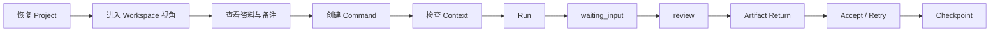

# Local Creative OS — Figma Make Alpha 高保真原型包

> 版本：2026-07-19 Stage 1  
> 用途：交给 Figma Make 生成桌面端高保真、可点击 Alpha 原型  
> 产品状态：交互与视觉目标稿，不代表 Runtime、Local Core 或文件能力已经接通

## 1. 这次原型要证明什么

用户能在一张持续存在的 Project Canvas 上完成一条清晰闭环：

原型的核心不是“AI 帮我做内容”，而是让用户看懂当前项目、把判断派出去、看见执行状态，并把结果安全地接回来。

## 2. 冻结边界

必须遵守：

- 一个 Project 只有一张持续 Canvas；
- Workspace 是同一 Canvas 的 Semantic Viewport，切换时是相机移动，不是换页面；
- OS 管项目，Bridge 管执行，GUI 管会话，文件系统管内容；
- Artifact 是内容身份，ArtifactView 是它在某个 Workspace 的视觉引用；
- AI 结果确认前保持 Draft / Pending，不自动成为 Current；
- Inspector 默认关闭、单实例、拥有局部返回栈；
- 旧 AdFrame 三栏 Demo 只提供 Review 业务证据，不作为 App Shell；
- 原型内所有文件与 Run 数据均为可交互 Fixture，必须可见标注“Prototype Data”。

本轮不画：

- 后端管理页、数据库、Connector 配置中心；
- 独立 Import 页面；
- Notion、飞书写回、Buddy 深度集成；
- Figma / Canva 直接执行；
- 多项目管理后台、多人权限、插件市场；
- 完整 Delivery Bundle、视频逐帧、区域批注；
- 三种 Canvas 视图切换或自动生成 Sub-canvas。

## 3. 原型画板

以桌面端 `1440 × 900` 为主画板，同时检查 `1366 × 768`。建议只做以下 8 个 Frame，避免 Figma Make 自行扩展产品范围。

### F01 — Continue a Project

用途：没有打开 Project 时的导航页。

必须显示：

- 顶部 Project Tabs 与激活的“+”；
- 标题“继续一个项目”；
- 最近项目 PortaSplit；
- 一项“2 个待确认结果”；
- “空白项目 / 打开本地项目 / 从飞书创建”三个入口，其中飞书标注 Spike；
- 不出现 Dashboard 图表、完成率或资产统计。

交互：点击 PortaSplit → F02。

### F02 — Project Canvas / Understand

用途：Alpha 默认态，也是视觉基准。

必须显示：

- 顶部 Project Tabs；
- 左侧悬浮 Workspace Dock，当前为 Understand；
- Canvas 中 6 个主节点、2 个折叠 Process；
- 左 Source、中 Working、右 Output、下 Process 的局部语法；
- 左下 Mini-map；
- Inspector 关闭，Canvas 占主要面积；
- 顶部或角落小型 `Prototype Data` 标签。

节点：客户反馈.md、品牌 Brief.pptx、参考构图.jpg、当前提案.pptx、AI 修改稿.pptx（Draft）、关键决策 Checkpoint。

交互：

- 单击当前提案 → F03 状态 Overlay；
- 双击当前提案 → F04 Relations Inspector；
- 点击 Build Workspace → 相机移动到 F05 的节点簇，不发生路由切换。

### F03 — Node Status Overlay

用途：证明“单击看状态”不会挤动 Canvas。

Overlay 使用屏幕坐标、贴近节点，宽 300px 左右。显示：

- 文件来源、Current 状态、最近修改；
- 父版本、备注数、一度关系数；
- “预览”“在 PowerPoint 中打开”动作；
- Overlay 不参与连线和 Mini-map。

交互：Enter 收起；点击预览 → F04 的 Preview 路由。

### F04 — Inspector Navigation

用途：证明单实例 Inspector 的局部导航。

右侧 400px Overlay Inspector，顶部固定：返回、当前对象名、关闭。

至少包含两种可切换状态：

1. Relations：按来源、引用、版本、相关 Run 分组；Canvas 同步提亮一度关系；
2. Preview：PPT 当前第 5 页占首屏 65% 以上，下方可写页级备注。

交互：Relations 点“客户反馈.md”进入 Preview；Back 返回 Relations；Esc 按栈退出；切换 Workspace 关闭 Inspector。

### F05 — Build Workspace + Command

用途：证明从多选资料到派活不超过 3 个核心动作。

场景：用户选中“当前提案.pptx + 客户反馈.md + 参考构图.jpg”，按 `C` 在鼠标附近创建 Command。

Command 默认只显示：

- 指令：“把第 5 页的产品利益点改得更直接，保留品牌蓝，不改封面”；
- Target：当前提案.pptx；
- Context 摘要：“已包含 3 个对象 · 2 条关键决策 · 1 个 Skill”；
- Executor：Codex；
- Output：保存为新版本；
- 主按钮 Run。

高级设置默认折叠。Target 与 Context 必须视觉分离。

交互：打开 Context Lens → F06；`Cmd/Ctrl + Enter` → F07 queued/running。

### F06 — Context Lens

用途：让用户知道本次 Run 使用了什么。

Inspector Context 模式显示：

- 目标文件与输出方式；
- 3 个引用对象，均可排除；
- 2 条关键决策与 Locked Elements；
- 相关对话摘要，而不是完整聊天；
- Skill：PPT Message Clarity；
- Snapshot ID、创建时间折叠在技术详情中；
- 敏感内容提示和排除入口。

交互：取消勾选参考图后 Context 数量从 3 变 2；确认返回 Command。

### F07 — Run Lifecycle / waiting_input

用途：展示 Bridge 目标状态机，但明确是原型目标。

同一个 Process Node 有三个 Prototype Variant：

- queued：显示执行者与排队，可取消；
- running：一条低强度流动银线，显示阶段摘要；
- waiting_input：暖橙强调，问题为“第 5 页的产品数字沿用旧版 30%，还是使用客户反馈中的 35%？”

用户动作：

- “使用客户反馈 35%”；
- “保留 30%”；
- “取消 Run”。

选择 35% 后进入 review，不创建新 Conversation。

### F08 — Artifact Return / Review / Checkpoint

用途：完成闭环。

显示：

- 新结果“当前提案_v7_AI.pptx”，Generated / Draft；
- 从 Run 到结果的一次性生成关系；
- Changed Files：1 modified、0 deleted；
- Compare 入口；
- Accept as Current、Retry、保留为独立 Draft；
- 结果按 Target → Working → Run → Pending Return Zone 顺序落位；
- 接受后生成 Revision，仍保留 AI 来源；
- 轻量 Banner：“已形成稳定修改集 · 创建 Checkpoint / 稍后”。

交互：Accept → Current Revision；Create Checkpoint → 完成态，旧 Run 折叠进入 Activity。

## 4. 全局组件与状态

必须建立可复用组件，而不是每个 Frame 重画：

- `ProjectTabBar`：普通、当前、待处理、溢出、全部关闭；
- `WorkspaceDock`：收起、展开、当前、Hover；
- `CanvasViewport` 与 `WorkspaceRegion`；
- `ArtifactNode`：Source、Working、Generated Draft、Current、Stale、Missing；
- `ProcessNode`：created、queued、running、waiting_input、review、completed、failed、cancelled；
- `DecisionNode / Checkpoint`；
- `NodeStatusOverlay`；
- `SelectionToolbar`；
- `SemanticEdge`；
- `CommandNode`；
- `InspectorShell`：Relations、Preview、Context、Activity、Compare；
- `MiniMapStepper`；
- `PendingReturnZone`；
- `Toast / Inline Notice`。

## 5. 节点视觉语法

节点不能只靠颜色区分。

| 家族 | 形态 | 边框 / 标识 | 位置倾向 | 文案状态 |
| --- | --- | --- | --- | --- |
| Source / Original | 文件卡 + 真实缩略图 | 实线瓷白、来源图标 | 左 | Source |
| Working | 文件卡，视觉权重最高 | 选中轮廓、Current 标识 | 中 | Current |
| Generated Draft | 文件卡 + AI 来源带 | 紫色细边、虚实混合状态 | 右 | Draft · 待确认 |
| Context | 小型组合卡 / Chips | 青灰组合边界 | 目标周围 | 3 objects |
| Process / Run | 180×56 摘要条 | 银灰过程形态 | 下 | Running / 需要输入 |
| Decision / Checkpoint | 轻量确认卡 | 暖金图标与确认痕迹 | 稳定结果附近 | Confirmed |

文件缩略图永远比分类色更抢眼；同一节点最多同时出现分类色与状态色两种语义色。

## 6. 视觉方向

关键词：`Porcelain Canvas + Liquid Chrome + restrained iridescence`。

- App Background：`#ECEDEA`；
- Canvas：`#F5F5F2`，3–5% 极浅点阵；
- Primary Text：`#192837`；
- Accent：`#7342E2`；
- Surface：`#FFFFFF / #F8F8F5`；
- 默认 Border：`rgba(25,40,55,.12)`；
- Node radius：20–24px；Dock 24px；Inspector 28px；
- Inspector 使用 Overlay，不压缩 Canvas；
- Liquid Chrome 只用于 Project “+”、Workspace 新增、Run、主要确认、Mini-map 激活控制；
- 虹彩只做小徽章、高光和激活点，不做整块渐变背景；
- 中文正文使用系统无衬线或 Noto Sans CJK SC；英文可用 Inter；
- 文件名 13–14px，正文 13px，状态与元数据不低于 12px。

## 7. 动效与键盘

- Workspace 切换：320–420ms 相机移动，不淡出成新页面；
- 状态 Overlay：160–220ms，4–8px 位移；
- Inspector：220–320ms 右侧滑入；
- Artifact Return：800–1200ms 一次性落位；
- 持续流动线只允许当前 Running 和选中生成关系，同屏最多 2 条；
- reduced motion 下关闭银线流动，保留快速定位与状态变化。

快捷键：

- `C` 创建 Command；
- `Enter` 展开 / 收起状态；
- 双击打开一度关系；
- `Cmd/Ctrl + O` 打开原生工具；
- `Cmd/Ctrl + Enter` 仅在 Command 编辑器内 Run；
- `Esc` 按局部栈逐级退出；
- `F / Shift + F` Fit Workspace / Project。

## 8. Figma Make 实施顺序

1. 先生成 F02 默认 Canvas，确认 App Shell、材质与节点分类；
2. 从同一页面扩展 F03/F04，验证 Overlay 与 Inspector；
3. 扩展 F05/F06，验证 Command 与 Context；
4. 扩展 F07/F08，验证 Run 与 Return；
5. 最后补 F01 和 1366×768 响应式；
6. 不要一次让模型生成全部页面后再统一修正。

## 9. 不得自行补全

Figma Make 不得自行加入：聊天侧栏、永久右栏、Dashboard 数据图、完整文件管理器、节点自由编辑器、流程看板、Agent 市场、团队成员、云同步、消息中心或计费页面。

遇到缺失信息时，优先使用本文件 Fixture，不得依据旧 AdFrame 截图推导新 Shell。

