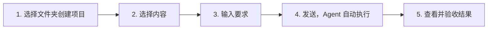
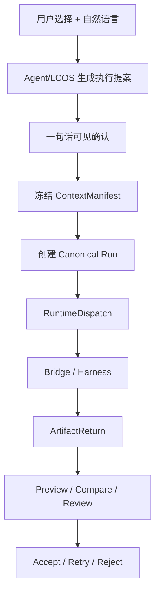

# LCOS 生产版交互收敛与 Agent 驱动施工总计划

> 日期：2026-08-03  
> 当前基线：`codex/backend-hardening-20260802 @ f3c6af2`  
> 面向：Buddy 后端 / Runtime / CLI / MCP 执行方，前端 UI 执行方  
> 性质：现有最新版 LCOS 的生产级改造工作单，不是 MVP 演示计划  
> 核心约束：不推倒已完成的 Backend、Bridge、Runtime Host、Revision、Preview 和 Golden Path；通过语义规范、流程合并、直接操作入口和 Agent 自动编排，把系统复杂度从用户路径中移走。

---

## 0. 一句话目标

LCOS 要成为一个用户可以像与本地 Agent 对话一样工作的可视化项目控制台：用户选择材料、说出意图，Agent 归纳 Context / Target / Intent / Provider / Result Policy，LCOS 负责安全校验、版本、证据与回滚，用户在五步内得到并验收结果。

---

## 1. 本次改造的完成定义

### 1.1 新用户主路径不得超过五步

1. 选择文件夹创建或打开项目；
2. 单选、框选或搜索要处理的内容；
3. 在选择区域下方输入要求；
4. 点击发送，由 Runtime Host 自动派发给可用本地 Agent；
5. 查看结果并接受、继续修改或放弃。

已有项目再次工作应缩短为三步：

```text
选择内容 → 输入要求 → 发送
```

### 1.2 下列事项不得成为主路径前置条件

- 创建 Workspace；
- 手动连线；
- 打开独立 Run 配置页；
- 逐字段配置 Context、Target、Intent、Provider 和 Output；
- 手动启动或唤醒 Buddy；
- 手动同步 Bridge；
- 理解 ContextManifest、ArtifactReturn、RuntimeBinding；
- 先创建“备注”等特殊节点；
- 理解 Revision 术语才能避免覆盖源文件。

### 1.3 “完成”必须同时成立

```text
GUI 可直接操作
+ Local Core 真实持久化
+ CLI/MCP 等价能力
+ Bridge/Harness 真实执行
+ 刷新/重启恢复
+ 失败路径可理解
+ 真实 E2E 证据
```

只有类型、按钮、接口、Fixture 或单元测试，不得标为完成。

---

## 2. 当前能力处理原则

### 2.1 保留并复用

| 已有能力 | 处理方式 |
|---|---|
| Project / Scope / Workspace / Artifact / ArtifactView | 保留对象骨架，修正用户动作和成员语义 |
| ArtifactRevision / Current / Draft / Accept | 保留并强化，所有 revise 继续只生成 Draft |
| ContextManifest | 保留为不可变执行证据，从 GUI 中隐藏技术细节 |
| Run 三语义 analyze / create / revise | 保留，改为 Agent 推荐、界面可见、用户可纠正 |
| RuntimeDispatch / RuntimeBinding / ArtifactReturn | 保留，作为后台执行生命周期 |
| Light Bridge 与 Runtime Host | 保留，解决零点击接单和可用性显示 |
| ActiveContext | 保留，升级为 GUI、CLI、MCP 共用的选择真相 |
| Artifact Workbench / Viewer Registry | 保留，承担右侧预览、Compare、Review |
| Checkpoint | 保留底层能力，产品语义改为 Workspace State / 里程碑 |
| CLI / MCP / Skill | 保留并扩成 Agent 可操作的完整项目控制面 |
| Golden Path 脚本 | 保留，升级为浏览器到真实 Harness 的验收链 |

### 2.2 删除或退出主路径

| 当前设计 | 处理 |
|---|---|
| 独立 `RunConfirmDialog` | 删除主路径；高级配置收进 Composer 的渐进展开 |
| Work Rail 强制提示词输入 | 删除；节点/选择下方 Context Composer 成为局部任务入口 |
| “新建备注”作为特殊工作流 | 删除入口；备注归一为轻量 Text Artifact |
| 连线后才能成为 Run Context | 删除限制；连线只表达长期语义关系 |
| 节点类型决定 Intent / Provider / Output | 删除推断链；由选择、能力和自然语言共同推断 |
| 手动 Bridge 同步作为正常操作 | 移入诊断与恢复菜单 |
| 单独“创建存档点”产品概念 | 合并为“保存工作现场 / 创建里程碑” |
| 所有文件统一白色卡片框架 | 弱化；内容对象以文件自身视觉为主 |

### 2.3 合并

| 原有分散能力 | 合并后的产品入口 |
|---|---|
| Target/Context 推断、Run 配置、Agent 选择、Output 选择 | Context Composer |
| Preview Modal、右栏信息、Revision Review、Compare | Artifact Workbench |
| Checkpoint、Workspace Camera、成员 Revision、Session Summary | Saved Workspace State |
| CLI 项目读取、MCP selection、Agent Skill | LCOS Agent Control Surface |
| Bridge 启动、Core 启动、Web 启动、恢复 | Runtime Host / Launcher |

---

## 3. 变更前后流程

### 3.1 变更前


### 3.2 变更后



### 3.3 系统内部仍然完整，但不甩给用户



---

## 4. 前端最终交互规格

## 4.1 Context Composer：唯一的局部 Run 发起入口

单击或多选节点后，在选区下方、屏幕坐标 Overlay 中出现 Composer。Overlay 使用 Portal，不进入 Canvas 布局，不推挤节点。

```text
┌────────────────────────────────────────────────────────┐
│ 参考                                                     │
│ [图缩略图 ×] [产品资料.pdf ×] [客户反馈.md ×]      [＋] │
│                                                         │
│ 修改目标  [脚本.md · Current V4]                    [×] │
│                                                         │
│ 根据这些参考，把开场压缩到三秒，并保留产品轮子卖点……    │
│                                                         │
│ [修改 ▾] [Auto/Codex ▾] [新 Draft Revision ▾]   [↑]   │
└────────────────────────────────────────────────────────┘
```

必须满足：

- 单击节点：针对当前节点发起；
- 多选/框选：严格使用已选对象；
- `C`：对当前选择打开 Composer；
- `Cmd/Ctrl + Enter`：发送；
- `Esc`：先关闭展开参数，再关闭 Composer；
- 拖动、缩放时 Composer 跟随选区，但不触发全图重排；
- 选择变化时保留未发送草稿，并明确提示“上下文已变化”；
- 不再跳转第二个 Run 页面。

## 4.2 提示词上方 Context Shelf

Context Shelf 只显示本次 Agent 真正可读取的对象。

| 内容 | Chip 表现 |
|---|---|
| 图片 | 真实缩略图 |
| 视频 | 首帧 + 时长 |
| PDF/PPTX | 原生文件图标 + 名称 + 页数 |
| Markdown/TXT/DOCX | 文件图标 + 标题 |
| 网页 | favicon + 页面标题 + 域名 |
| 飞书文档 | 飞书图标 + 用户可见标题 |
| 文件夹/集合 | 文件夹图标 + 名称 + 对象数 |
| 历史 Revision | 文件名 + 版本号 |
| Workspace | Workspace 名称 + 成员数，可展开排除 |

支持：

- 多选后“作为参考”；
- 节点拖入 Shelf；
- 点击 `＋` 搜索 Project、当前 Workspace、最近内容；
- 粘贴文件、链接和文字；
- 移除、排序、定位；
- 整个 Workspace 加入后，在派发前展开为精确 Revision 列表。

硬规则：

- Shelf 未显示的对象不得静默进入本次 Context；
- 直接关系、Workspace 成员只能作为推荐候选；
- 用户移除后本次 Run 不得重新偷偷加入；
- Context 与 Workspace Membership 永远不是同一字段。

## 4.3 Agent 先归纳，用户只纠正

Composer 自动生成一句执行摘要：

```text
将参考 5 项，修改「脚本.md · V4」，由 Codex 生成一个新 Draft Revision。
```

没有歧义时直接发送。有歧义时只问一个最小问题，例如：

```text
你希望修改「脚本.md」，还是根据这些资料创建一份新脚本？
```

不得把歧义转成完整配置表。

## 4.4 底部三级选项

一级，工作方式：

- 分析；
- 创建；
- 修改。

二级，执行者：

- Auto；
- Codex；
- WorkBuddy；
- 其他已注册 Harness。

每个 Agent 显示真实状态：Ready / Busy / Offline / Permission Required。Offline 不得在发送后才暴露。

三级，结果去向：

| Intent | Result Policy |
|---|---|
| analyze | 仅回复 / 创建分析 Artifact / 生成 Workspace Summary |
| create | 新建 Artifact / 多个 Artifact / 创建集合 |
| revise | 新 Draft Revision / 从历史版本分支 / 分别修改目标 |

`revise` 永远不出现“直接覆盖原文件”。

## 4.5 Context 与 Edit Target 分离

- 外部 Reference 默认只能分析或作为创建参考；
- Managed Artifact 才能成为 revise Target；
- Target 必须绑定明确 Base Revision；
- 一个 Managed Artifact + 多个 Reference 时可推荐前者为 Target，但必须可见；
- 多个可编辑对象时不得静默猜测，提供“全部作为参考 / 选择目标 / 分别生成 Revision”；
- 多目标修改必须明确是逐目标 Draft，不允许合并覆盖。

## 4.6 右侧栏重新定位

右侧区域分成两个互斥主模式，不同时堆叠：

1. **Artifact Workbench**：Preview、Metadata、Revision、Compare、Review；
2. **Workspace Agent Conversation**：以当前 Workspace / Canvas / Project 为范围的全局对话。

顶部必须明确上下文范围：

```text
上下文：当前 Workspace · 26 项   [检查]
```

右侧栏不再承担所有局部任务的强制输入；局部任务由 Context Composer 发起。Run 开始后，右栏自动切换到状态与结果，提供 waiting_input、日志、Compare、Accept、Retry、Reject。

## 4.7 单击、双击与历史版本

- 单击：选择，出现局部操作和 Composer；
- 双击内容文件：右侧 Workbench Preview；
- 双击集合/Scope：进入一度关系；
- 历史 Revision：显示来源 Run、Agent、时间、原 Prompt、Context；
- 历史 Revision 操作：基于此版本继续、与 Current 比较、打开来源 Run、查看当时 Workspace State、固定到 Canvas；
- “基于此版本继续”只能创建新的 Draft 分支。

## 4.8 内容对象与过程对象的视觉分工

内容对象弱框架、强内容：

- 图片直接显示缩略图；
- 视频显示首帧和时长；
- PDF/PPTX/DOCX/MD 显示原生类型图标、文件名、页数或摘要；
- 网页和飞书链接显示真实标题、favicon/来源；
- 节点创建时间、来源、Current/Draft 状态在近距离可见；
- 不要求双击后才知道图片是什么。

过程对象强化结构：

- Run；
- Prompt 摘要；
- Decision / Feedback；
- Context Snapshot；
- Session Summary；
- Agent Return；
- Draft Revision；
- Compare / Review；
- waiting_input / Error / Retry。

这些过程对象优先由真实系统事件投影生成，不让用户手动选择一堆过程节点类型。完整 JSON 和日志留给 CLI/Inspector，Canvas 显示对人有用的摘要。

---

## 5. Workspace：从视觉边框变成可操作 Context Set

## 5.1 生产语义

```text
Workspace
= 明确成员集合
+ Semantic Viewport
+ 工作意图
+ 默认 Agent 上下文范围
+ 可保存的工作现场
```

节点和 Workspace 是多对多关系；位置与成员关系分离。

## 5.2 必须提供的直接动作

选中一个或多个节点后：

- 加入 Workspace；
- 从当前 Workspace 移除；
- 移动到另一个 Workspace；
- 查看所属 Workspace；
- 新建 Workspace 并加入；
- 设为本次 Run Context。

还必须支持：

- 节点拖到 Workspace Dock：加入；
- 节点拖入 Workspace Frame：加入；
- 从 Frame 拖出：询问“仅调整位置 / 从 Workspace 移除”；
- 当前 Workspace 激活时，拖入文件、新建内容和 Run Return 默认加入；
- 默认加入后可撤销、移出或加入其他 Workspace。

## 5.3 数据真相修正

当前前端 `node.workspaceIds`、Workspace `focusedViewIds` 和 Core ArtifactView/Workspace 语义不应继续混用。

生产实现建议新增轻量、正交的成员关系：

```text
workspace_memberships
- workspace_id
- artifact_view_id
- added_at
- added_by (user | agent | run | import)
- sort_order nullable
- UNIQUE(workspace_id, artifact_view_id)
```

要求：

- `focusedViewIds` 回归“关注/焦点”，不再冒充成员；
- `workspaceIds` 只作为 Web ViewModel 派生值，不作为 Project Truth；
- 所有加入/移出操作走正式 Repository / API / Mutation；
- 删除 ArtifactView 时级联清理 Membership；
- 删除 Workspace 不删除 Artifact/View；
- Migration 必须可升级、可回滚、保留旧数据，并把现有显式 `workspaceIds/focusedViewIds` 证据迁入 Membership；
- 如果审计证明现有 Schema 已有等价关系，则复用，不重复建表，但必须统一唯一真相。

## 5.4 Workspace State 替代孤立 Checkpoint

UI 移除“创建存档点”，改成：

- 保存当前工作现场；
- 创建里程碑；
- 恢复现场；
- 从现场分支继续。

底层可继续复用 Checkpoint，但快照必须包含：

- Workspace 成员；
- 每个成员固定 Revision；
- Canvas 排布和 Camera；
- 关系；
- Workspace Intent；
- 关联 Run / Session；
- Session Summary；
- 保存时间和用户命名。

---

## 6. Backend / Contracts 的增量改造

原则：不砍现有大能力，不合并 Core 与 Bridge 真相，不重写 Revision Domain。

## 6.1 Canonical Composer Contract

```ts
interface CreateRunProposal {
  projectId: string
  workspaceId?: string
  prompt: string
  intent: 'analyze' | 'create' | 'revise'
  requestedProvider: string | 'auto'
  contextItems: Array<{
    artifactId: string
    revisionId: string
    order: number
  }>
  editTargets: Array<{
    artifactId: string
    baseRevisionId: string
  }>
  resultPolicy:
    | { type: 'reply_only' }
    | { type: 'create_artifact'; format?: string }
    | { type: 'create_collection' }
    | { type: 'draft_revision_per_target' }
}
```

字段名称可按现有 Contracts 调整，但语义不得再混合。

## 6.2 Agent Proposal 服务

新增轻量规划层，不新增第二套 Run：

```text
selection + activeContext + prompt + provider capabilities
→ proposeRun
→ visible one-line summary + confidence + ambiguity
→ user sends/corrects
→ existing createRun + dispatch
```

要求：

- 高置信度直接给默认值；
- 有歧义只返回最小澄清问题；
- 任何模型判断都要落成可见 Proposal；
- 用户更正后的值优先；
- Proposal 不是执行记录，真正发送后才冻结 ContextManifest；
- 没有可用模型时使用确定性规则，不阻塞基础工作。

## 6.3 Domain Guard

- analyze：禁止写目标文件；可返回 reply 或新分析 Artifact；
- create：只能创建新 Artifact；
- revise：必须有 Target + Base Revision，只能创建 Draft Revision；
- Provider 输出与 Result Policy 不符：进入 waiting_input/review，不猜；
- Accept 前不能改变 Current；
- Generic Mutation 不得绕过 Accept；
- 外部文件写入前校验 Hash；冲突进入 waiting_input；
- Run Retry 创建新 Run 并保存 `retryOfRunId`。

## 6.4 Process Projection

优先将已有 Run、Manifest、Binding、Return、Revision、Checkpoint 投影为 Canvas 过程视图，避免重复建立平行真相。

需要持久化的新增信息仅包括：

- 用户可见 Prompt 摘要；
- Run 与 Context/Target/Output 的视图关系；
- Session Summary / Handoff 引用；
- Workspace State 关联。

如果 durable RunEvent 是 waiting_input、恢复和 Activity 的必要条件，应做正式 additive migration；不得继续用 Fixture timer 模拟。

---

## 7. Runtime Host、Bridge 与 Harness

## 7.1 用户操作要求

- Launcher 一次启动 Web + Core + Bridge/Runtime Host；
- 用户关闭浏览器不终止 Core/Bridge；
- 正常使用不弹 Core CMD；
- Agent Ready/Busy/Offline 在发送前可见；
- 点击发送后自动 create → dispatch → claim/start → submit → ingest；
- 用户不去 Buddy 对话提示接单；
- 手动 sync/recover 只在诊断入口出现。

## 7.2 零点击接单 Gate

正式支持某个 Agent 前必须证明：

```text
LCOS 创建 Run
→ RuntimeDispatch bound
→ Agent 主动发现任务
→ claim/start
→ submit_result
→ LCOS 自动同步
→ ArtifactReturn 出现在 Review
```

没有这条 E2E 的 Provider 必须显示 `Manual` 或 `Offline`，不能显示 Ready。

## 7.3 Provider-neutral

- GUI 不写死 WorkBuddy；
- Provider Registry 提供能力、状态和限制；
- Auto 根据 intent、MIME、能力、可用性选择；
- 用户可覆盖 Auto；
- Bridge 继续只管执行状态，不接管 Project Truth。

---

## 8. CLI / MCP / Skill 完整操作面

Buddy 负责把 GUI 的核心动词映射到同一套 Local Core API。

### 8.1 Workspace

```text
lcos workspace list
lcos workspace inspect <id>
lcos workspace add <id> <view...>
lcos workspace remove <id> <view...>
lcos workspace move <from> <to> <view...>
lcos workspace save-state <id> --name <name>
lcos workspace restore-state <state-id>
```

### 8.2 Context 与选择

```text
lcos selection get
lcos context get
lcos context add <artifact-or-view...>
lcos context remove <artifact-or-view...>
lcos context search <query>
lcos target set <artifact> --revision <id>
lcos target clear
```

### 8.3 Run 与版本

```text
lcos run propose --prompt <text>
lcos run create --intent <...> --provider <...>
lcos run dispatch <id>
lcos run status <id>
lcos run cancel <id>
lcos run events <id>
lcos run retry <id>
lcos artifact inspect <id>
lcos revision list <artifact-id>
lcos revision compare <a> <b>
lcos revision accept <id>
lcos revision reject <id>
```

### 8.4 Canvas 与 Session

```text
lcos canvas link / unlink
lcos canvas arrange --preview
lcos canvas create-collection
lcos session summarize
lcos session handoff
lcos session resume-context
```

MCP 工具与 CLI 语义一一对应。Skill 不允许指导 Agent 修改 SQLite、内部 JSON 或绕过 Accept。

Agent 应能响应自然语言：

```text
把刚导入的参考图加入“包装方向”，和客户反馈一起整理，生成三条创意方向。
```

并自行完成查找、Membership、Context、Run Proposal、执行和结果归位。

---

## 9. Buddy 与前端 UI 的并行施工路径

并行不是各自发明合同。先冻结 Contract 与状态机，再并行。

## Phase 0：共同冻结（0.5–1 天）

共同输出：

- Context、Target、Workspace Membership、Intent、Result Policy 的术语表；
- `CreateRunProposal` 与 `RunProposalResult` Contract；
- Workspace Membership API；
- Provider Capability/Availability Contract；
- UI 状态图和错误码映射；
- 删除/合并入口清单；
- 基线截图和真实能力账本。

禁止施工双方在各自代码里复制领域类型。

## Phase 1：成员真相与安全语义（Buddy 主、UI 配合）

Buddy：

- 审计现有 Workspace 数据真相；
- 实现/迁移 canonical Membership；
- 补加入、移出、移动、列出 API；
- 补 analyze/create/revise 与 Result Policy Guard；
- 封死绕过 Accept 的 Current 修改路径；
- 补 Restart、FK、Unique、Migration 测试。

UI：

- 先用真实 API 接 Workspace 快捷操作；
- 不做临时 localStorage Membership；
- 节点归属即时反馈与 Undo。

验收：刷新、重启后成员关系一致；删除 Workspace 不删除内容；create/revise 不误覆盖。

## Phase 2：Context Composer（前端主、Buddy 提供 Proposal）

前端：

- 新建 Portal 型 Context Composer；
- 实现 Context Shelf、`＋` Picker、Target 区和三级选项；
- 删除主路径 `RunConfirmDialog`；
- Work Rail 移除强制局部 Composer；
- 实现选择变化、键盘、缩放、狭窄视口和可访问性；
- 单选、多选、Workspace、Project 四种范围明确显示。

Buddy：

- 提供 `proposeRun`；
- 提供 Project Search/Recent/Workspace expansion；
- 派发前冻结 ContextManifest；
- Provider 状态实时可读。

验收：已有项目从选择到发送最多三步；没有任何隐藏 Context。

## Phase 3：自动执行与结果回收（Buddy 主、UI 接状态）

Buddy：

- Runtime Host 自动发现/唤醒正式 Provider；
- 自动同步状态和 ArtifactReturn；
- waiting_input、cancel、retry、offline/recovery 状态闭合；
- RunEvent 持久化（如审计确认必要）；
- CLI/MCP 补齐。

UI：

- 发送前显示 Agent 可用性；
- 执行后右栏自动切 Run 状态；
- waiting_input 原地回答；
- Return 自动定位到 Canvas 和 Workbench；
- 不再暴露“手动去 Buddy 接单”路径。

验收：真实 WorkBuddy/Codex 至少一个 Provider 达成零点击 E2E。

## Phase 4：版本、过程与 Workspace State（共同）

前端：

- 历史 Prompt、来源 Run、Context 和 Agent 可见；
- Compare / Accept / Reject / Retry；
- 内容对象弱框架、过程对象强结构；
- “保存工作现场 / 创建里程碑”替代 Checkpoint 按钮。

Buddy：

- Revision Compare 数据；
- Session Summary / Handoff；
- Workspace State 快照与恢复；
- Process Projection；
- Source/Managed Artifact 边界。

验收：从任一历史 Revision 继续只能产生新 Draft；恢复 Workspace State 后成员、Revision、排布和来源一致。

## Phase 5：生产验收与删除旧路（共同）

- 删除未使用 RunConfirm、Fixture timer、假 waiting_input、旧 Composer 分支；
- 删除或隐藏重复入口；
- 完成新用户五步浏览器 E2E；
- 完成真实 Harness E2E；
- 完成 Restart Recovery；
- 完成失败矩阵；
- 更新用户说明书、CLI/MCP/Skill、Capability Ledger；
- 只有新链全部通过后，才删除旧路径。

---

## 10. 需求逐项兑现表

| 用户提出的问题/要求 | 本计划对应解决点 | 验收证据 |
|---|---|---|
| 不知道如何把节点加入 Workspace | 5.2 显式加入/移出/移动/查看归属 | GUI + API + 重启 E2E |
| 当前 Workspace 拖入/新建应默认归属 | 5.2 自动默认 + 可撤销 | 拖入/新建/Return 三条测试 |
| Workspace 归属不能代替本次参考 | 4.2 Context Shelf 独立 | Manifest 精确对象断言 |
| 提示词上方主动添加参考节点 | 4.2 Shelf + `＋` Picker | 单选/多选/搜索/拖入测试 |
| 右侧输入反直觉 | 4.1 局部 Composer；4.6 右栏重新定位 | 三步已有项目路径 |
| 外部 Reference 不应显示修改 | 4.5 Source/Target Guard | Reference revise 被拒绝 |
| 历史版本显示当时 Prompt | 4.7 Revision provenance | Run/Prompt/Context 可追溯 |
| 可从历史版本继续 | 4.7 只能创建新 Draft 分支 | Parent Revision 断言 |
| 自由选择本地 Agent | 4.4 Provider 选择与状态 | Registry + 两 Provider 状态测试 |
| 不知道编辑哪个对象 | 4.3 Agent Proposal + 最小澄清 | 歧义与非歧义用例 |
| 多选参考直接分析/整理 | 4.2/4.5 多选严格 Context | 无连线 Run E2E |
| 新建内容被误覆盖原版本 | 6.3 create/revise Guard | create 不写 Current 回归测试 |
| 修改永远产生新版本 | 6.3 Draft + Accept | Hash/Revision/Current 测试 |
| 不需要独立 Run 配置页 | 4.1 删除主路径 RunConfirm | 浏览器路径无二次页面 |
| 三级选择像 TapNow | 4.4 Intent/Agent/Result | Composer 交互测试 |
| 新建备注鸡肋 | 2.2 归一为 Text Artifact | 粘贴/双击文本进入 Context |
| 单选、多选、右栏范围不同 | 4.1/4.6 | Context 范围 E2E |
| 本地 Agent 能管理节点/Workspace/版本 | 8 CLI/MCP/Skill | 同语义 CLI/MCP 合同测试 |
| Agent 能连接和整理节点 | 8.4 Canvas 工具 | Agent 创建/解除关系 E2E |
| Workspace 作为版本现场 | 5.4 Saved Workspace State | 保存/恢复/分支 E2E |
| Checkpoint 鸡肋 | 5.4 产品语义合并 | UI 不再出现抽象 Checkpoint |
| 文件自身视觉优先 | 4.8 内容对象视觉 | 图片/PDF/PPT/MD/Link 截图验收 |
| 恢复 Run/Prompt/Decision 等过程节点 | 4.8 Process Projection | Canvas 显示真实事件摘要 |
| 创建时间、Agent、Prompt 不应藏起来 | 4.7/4.8 | 近距离 LOD 与 Workbench 验收 |
| 跨 Agent/项目/Session/时间/版本 | 8.4 Session + Context Pack | Handoff/Resume E2E |
| Bridge/Harness 不能手动接任务 | 7.2 零点击 Gate | create→submit 全链证据 |
| 新用户到结果不得超过五步 | 1.1、3.2 | 浏览器行为计数断言 |
| 不砍现有后端大能力 | 2.1、6 | Commit diff 与迁移审查 |

---

## 11. 测试与验收矩阵

### 11.1 Golden Path

```text
创建/打开项目
→ 自动索引目录
→ 框选多个 Reference
→ 输入任务
→ Agent Proposal 可见
→ 一键发送
→ 自动派发/接取
→ 自动返回
→ Preview/Compare
→ Accept
→ 重启恢复
```

### 11.2 必测用户场景

1. 五张图片 + PDF，只分析，生成分析 Artifact；
2. 一个脚本 + 多个参考，修改为 Draft Revision；
3. 多个参考，无 Target，创建三个新 Artifact；
4. 多个可编辑对象，系统要求最小澄清；
5. 从历史 Revision 分支继续；
6. 将节点加入、移出、移动 Workspace；
7. 当前 Workspace 导入文件、创建文本、接收 Return 自动归属；
8. 使用右侧栏对整个 Workspace 提问；
9. Agent 通过 MCP 管理 Workspace 和创建 Run；
10. 保存并恢复 Workspace State。

### 11.3 必测失败路径

- Bridge 离线；
- Provider Offline / Busy；
- Agent 未 claim；
- waiting_input；
- 用户取消；
- 返回文件与 Result Policy 不符；
- Source Hash 变化；
- 文件 missing / unreadable；
- Preview unsupported / worker failure；
- Migration 失败；
- SQLite 重启；
- Context 中 Revision 已过期；
- Workspace 删除；
- 多目标歧义；
- 大目录和大量节点降级。

### 11.4 性能与可访问性

- Composer 不触发全图业务重渲染；
- 选择更新 debounce；
- 80/150/300 节点 LOD 规则继续生效；
- 键盘完成选择、添加参考、发送、取消；
- Context Chip 有可读名称和移除按钮；
- 缩放时 Overlay 保持可用，不出现过大/过小档位跳变；
- 1366×768 与 1440×900 无遮挡；
- 长文件名、中文路径和多行 Prompt 正常。

---

## 12. 风险与控制

| 风险 | 控制 |
|---|---|
| Agent 误判 Target | Proposal 必须可见；低置信度最小澄清；Domain Guard 最后兜底 |
| 简化 UI 变成黑箱 | Context、Target、Intent、Provider、Result 一句话可核对 |
| Workspace 双重真相 | canonical Membership；Web 只用派生值 |
| 前后端并行导致合同漂移 | Phase 0 冻结 Contracts；自动 schema/type 测试 |
| 旧路径和新路径并存过久 | Phase 5 在新 E2E 通过后一次删除 |
| Harness 无法零点击 | Provider 明确标 Manual/Offline，不假装 Ready |
| 新 Schema 破坏数据 | additive migration、备份、upgrade/restart/rollback 测试 |
| Canvas 重新变拥挤 | 内容弱框架、过程分层、LOD 与按需展开 |
| 大模型判断不可复现 | Proposal 与最终 Manifest 均保存，用户修正有优先权 |

---

## 13. 回滚策略

- 每个 Phase 独立小提交；
- Contracts、Migration、Core、UI、CLI/MCP 分提交；
- 新 Composer 在开发阶段可 Feature Flag，但不得长期双主入口；
- Membership migration 必须提供反向读取兼容期；
- 新链路通过前保留旧数据读取，不保留旧写路径；
- Runtime/Bridge 改造可退回当前 `f3c6af2` Host 行为；
- 不重写 Git 历史，不自动 Push，不覆盖用户 Current。

---

## 14. 施工交付要求

Buddy 和前端每个 Phase 必须交付：

- 变更摘要；
- 修改文件；
- Contract/Schema 变化；
- 用户步骤前后对比；
- 真实测试命令和结果；
- 浏览器截图/视频证据；
- CLI/MCP 对应证据；
- 未完成项；
- 风险和回滚；
- Capability Ledger 更新。

禁止使用以下措辞替代证据：

- “接口已经预留”；
- “理论上支持”；
- “前端可后续接入”；
- “已有测试所以可用”；
- “Bridge 能力存在”；
- “用户可以手动完成”。

---

## 15. 开工顺序结论

```text
冻结语义和 Contract
→ 修 Workspace Membership 真相与 Domain Guard
→ 接 Context Composer 和 Agent Proposal
→ 打通零点击 Harness 与自动 Return
→ 接版本来源、过程投影、Workspace State
→ 补齐 CLI/MCP/Skill
→ 删除旧 Run 页面和重复入口
→ 跑五步新用户真实 E2E
```

前端可以在 Phase 0 Contract 冻结后立即制作 Context Composer、Context Shelf、Workspace 快捷动作和右侧栏模式；Buddy 同时完成 Membership、Proposal、Provider 状态与自动执行。双方共同使用真实 Contracts 和 Runtime，不以 Fixture 平行施工。

最终验收不是“功能数量更多”，而是：一个第一次打开 LCOS 的用户不需要理解内部架构，不需要打开 Buddy，不需要画关系图，就能在五步内得到安全、可追溯、可继续修改的真实结果。

---

## 16. 可搬迁、可复用的 LCOS 工程文件

### 16.1 为什么必须做

当前 Project Catalog 主要保存绝对 `rootPath`。虽然目录扫描使用相对路径并能稳定生成文件身份，但项目文件夹移动、磁盘盘符变化、跨机器复制或目录重命名后，Catalog 仍可能失去根路径，用户需要重新定位，甚至误建重复 Project。

LCOS 应像 Premiere Pro、DaVinci Resolve 一样，让“项目”拥有一个用户可以理解、双击打开、备份和迁移的工程文件，而不是只存在于某台机器的一条数据库记录中。

### 16.2 文件形式

建议正式定义两种格式：

```text
ProjectName.lcosproj    日常工程文件，元数据与画布真相，不内嵌大媒体
ProjectName.lcosbundle  可选便携归档，工程文件 + 用户选择的媒体/代理文件
```

`.lcosproj` 推荐使用带自定义扩展名的 SQLite 文件，而不是脆弱的大 JSON：

- 支持原子事务、Migration、索引和局部更新；
- 可复用现有 Metadata Repository 设计；
- 不存大 BLOB，符合现有架构规则；
- Preview Cache、Runtime staging、日志继续留在可删除缓存目录；
- 用户文件默认仍为链接，不移动、不复制；
- 工程文件可以放在项目根目录，也可以由用户另存。

如果第一阶段不能立即切换为每项目 SQLite，允许先实现 `.lcosproj` descriptor + export/import adapter，但必须经过 ADR 明确它只是迁移过渡，不能长期形成中央 SQLite 与工程文件双写、双真相。

### 16.3 工程文件保存什么

```text
Project Identity
├─ projectId / schemaVersion / createdAt / updatedAt
├─ displayName / projectRootHint
└─ applicationVersion / migrationHistory

Canvas Truth
├─ Scopes
├─ Workspaces
├─ Workspace Memberships
├─ ArtifactViews / Position / Size / Display
├─ Relations
└─ Saved Workspace States / Milestones

Content Identity
├─ Artifacts
├─ Revisions
├─ FileRecords
├─ Relative Asset Locators
├─ Content Hash / Size / Modified Time
└─ External Link Metadata

Work History
├─ Runs / ContextManifest
├─ Prompt / Provider / Intent / Result Policy
├─ ArtifactReturns / Decisions
├─ Session Summary / Handoff References
└─ Checkpoints（作为底层 Workspace State）
```

不保存：

- 原始大型媒体 BLOB；
- Preview Cache；
- Runtime staging；
- Provider Token；
- MCP URL 和本机私密配置；
- 可再生临时文件；
- 绝对路径作为唯一身份。

### 16.4 文件定位策略

每个本地文件保存一组可恢复 Locator：

```text
relativePath
contentHash
size
modifiedAt
fileName
rootAlias
lastKnownAbsolutePath（仅本机提示，不作为 Project Truth）
```

打开工程时按以下顺序恢复：

1. 工程文件旁边的相对 Project Root；
2. 工程文件记录的 root alias；
3. 当前 Project Catalog 最近位置；
4. 用户已授权的搜索根中按 relativePath + hash 匹配；
5. 仍找不到时只问一次“重新定位项目文件夹”。

用户选择新的根目录后，Local Core 批量校验：

- 相对路径一致：直接重绑定；
- 路径变化但 Hash 一致：自动修复 Locator；
- 同名但 Hash 不同：标记 stale/conflict；
- 缺失：保留离线节点和历史，不删除 Artifact；
- 找到多个候选：集中显示一次选择，不逐文件弹窗。

### 16.5 创建项目的零负担流程

用户选择已有文件夹后：

```text
选择文件夹
→ 自动以文件夹名命名 Project
→ 自动创建/绑定 ProjectName.lcosproj
→ 自动索引文件与子文件夹
→ 自动创建默认 Workspace 和内容节点
→ 直接进入 Canvas
```

不再要求用户额外填写 Project 名、Root Path、是否导入等重复信息。只有以下情况才确认：

- 文件数量超过性能阈值；
- 包含符号链接、受限目录或疑似敏感文件；
- 已存在另一个 `.lcosproj`；
- 导入预计产生大量节点，需要选择“全部 / 顶层 / 稍后整理”。

大目录确认只问一次，并给出系统推荐：

```text
发现 1,284 个文件。建议先导入顶层 86 项，子目录作为集合按需展开。
[按建议打开] [全部导入] [取消]
```

### 16.6 打开、另存和归档

- 双击 `.lcosproj`：启动 Runtime Host 并打开对应 Project；
- “打开文件夹”：若发现 `.lcosproj`，直接恢复；否则创建新工程；
- “另存工程”：复制工程元数据，不复制大型媒体；
- “打包项目”：生成 `.lcosbundle`，可选择包含原文件、代理文件、仅工程；
- “移动工程”：工程文件与 Project Root 一起移动时无须重新定位；
- “恢复项目”：即使部分文件缺失，也能恢复 Canvas、Workspace、Run、Revision 和离线状态。

### 16.7 与当前 Backend 的兼容施工

不直接推翻现有全局 Metadata Repository，按以下步骤迁移：

1. 写 ADR：确定 `.lcosproj` 是最终 Project Truth 还是可搬迁恢复载体；
2. 增加 Project File Contract、schemaVersion、Migration 和原子备份；
3. 先实现 export/open/rebind，验证移动目录和盘符变化；
4. 将 Project Catalog 降为“最近打开项目索引”，不再是项目唯一身份；
5. 证明 per-project store 稳定后，再把项目级表逐步迁入 `.lcosproj`；
6. Runtime、Cache 和凭证继续外置，不污染工程文件；
7. 提供从现有项目生成 `.lcosproj` 的一次性升级入口。

必须测试：

- 同盘移动目录；
- 跨盘移动；
- 工程文件和素材一起复制；
- 只移动素材根；
- 部分文件缺失；
- 同名不同 Hash；
- 中文路径和长路径；
- 旧 Schema 升级；
- 写入中断后的原文件恢复；
- 另一台机器打开无凭证工程。

---

## 17. 决策操作削减审计

### 17.1 判断标准

每增加一个用户决策，都必须满足至少一项：

- 不可逆；
- 有安全或隐私风险；
- 系统存在真实歧义且判断错误代价高；
- 会产生明显时间、存储或外部调用成本；
- 用户明确要求高级控制。

除此之外，系统应自动完成并用一句话反馈。减少点击不是把能力隐藏，而是让 Agent 和确定性规则先给出安全默认值，用户只在需要时纠正。

### 17.2 本施工单中最能减少决策的改动

| 改动 | 过去用户要决定什么 | 新默认 | 节省的操作 |
|---|---|---|---|
| 选择已有文件夹即建项目 | 名称、路径、是否导入、如何建节点 | 文件夹名 + 自动索引 + 默认 Workspace | 3–5 次 |
| `.lcosproj` 工程文件 | 从 Catalog 找项目、修绝对路径、重新导入 | 双击恢复，自动重绑定相对素材 | 多轮排错 |
| 默认 Workspace | 是否先创建 Workspace | 项目自动拥有一个工作现场 | 1 个概念决策 |
| Context Shelf | 自己理解关系、连线、配置 Context | 当前选择自动进入 Shelf，可增删 | 2–6 次 |
| Agent Proposal | 自己选 Intent、Target、Provider、Output | Agent 先归纳，一句话确认 | 3–4 次 |
| Auto Provider | 自己判断哪个 Agent 能做 | 按能力和在线状态推荐 | 1 次 + 失败返工 |
| 删除 RunConfirmDialog | 再填一次运行表单 | Composer 内直接发送 | 1 个页面、数次点击 |
| Result Policy 默认 | 判断返回要放哪里 | analyze/create/revise 各有安全默认 | 1 次 |
| 自动 Bridge/Harness | 打开 Buddy、提醒接单、回到 LCOS 同步 | Runtime Host 自动派发与回收 | 3–5 次 |
| Workspace 自动归属 | 导入后逐个加入 | 当前 Workspace 自动加入，可撤销 | N 次 |
| 显式 Membership 快捷动作 | 新建 Workspace 绕过成员管理 | 多选后直接加入/移出/移动 | 绕行流程 |
| Duplicate 定位已有 View | 判断是否重复导入 | 定位并提示已有对象 | 重复清理 |
| Link 自动元信息 | 手动命名 URL 节点 | 自动标题/favicon/来源，失败才让改名 | 1–2 次 |
| 历史 Prompt 回填 | 自己寻找旧指令和参考 | 来源 Run 自动展示，一键继续 | 多轮查找 |
| Workspace State | 分别记录版本、节点、Camera、Session | 一次保存完整现场 | 多项手工记录 |
| 单次根目录重定位 | 每个 missing 文件逐一选择 | 批量 Hash/relativePath 重绑定 | N 次 |
| waiting_input 原地回答 | 去 Agent 对话寻找任务 | LCOS 原位置回答并 Resume | 切换应用 |
| Accept 后自动记录现场 | 再创建 Checkpoint | 自动保留审查与工作现场 | 1 次 |

### 17.3 还应继续砍掉的伪决策

- 新建 Project 时手填与文件夹同名的名称；
- 文件夹非空时重复问“是否导入”，除非超过风险阈值；
- 让用户在 Source、Reference、Content 等内部分类中选一个；
- 让用户为普通 Run 选择 Skill；Agent 自己按能力加载；
- 让用户先决定是否建立 Relation；Run 不依赖长期关系；
- 让用户决定每个返回节点的初始坐标；系统按 Target/Run/Return 布局；
- 每次 Run 都选择 Agent；记住最近选择，Auto 为默认；
- 每次 Run 都选择输出格式；从目标和 Prompt 推断，用户可展开修改；
- 每次 Accept 后再问是否保存；Accept 本身就是持久决策；
- 每次打开项目都校验一遍无变化素材；使用 Hash/mtime 快速恢复；
- Runtime 离线后让用户选择技术恢复方式；先自愈，失败才显示一个“修复”入口。

### 17.4 不能为了少一步而隐藏的决策

- 覆盖或删除用户原文件；
- 多个 Edit Target 且输出策略不明确；
- 同名不同 Hash 的路径重绑定；
- 敏感文件进入外部 Provider Context；
- 大目录全量索引的明显性能成本；
- Accept Draft 为 Current；
- 恢复旧 Workspace State 是否影响当前未保存操作；
- 安装新 Provider、授权凭证或开放网络访问。

### 17.5 决策预算

把决策预算写入产品验收：

```text
首次创建项目并拿到结果：最多 5 个用户步骤
已有项目发起普通任务：最多 3 个用户步骤
无歧义 Run：发送前最多 0 个额外问题
有歧义 Run：最多 1 个澄清问题
项目目录整体搬迁：最多 1 次重新定位
正常 Bridge 执行：0 次外部应用切换
普通 Accept：1 次明确决定
```

任何新增 UI 如果突破预算，必须说明它阻止了什么不可逆风险；否则不得进入主路径。

---

## 18. Dz 修改原意台账（禁止在交接中删减）

### 18.1 使用规则

本节不是“参考意见”，而是施工范围的原意保护层。Buddy、前端 UI、Codex 和后续 Agent 必须遵守：

1. 开工前逐条阅读本台账，不允许只读二次摘要；
2. 每个编号只能标为：`未做 / 施工中 / 真实完成 / 阻塞 / 经 Dz 批准被替代`；
3. “接口存在、类型存在、按钮出现、Fixture 可演示”不能标记真实完成；
4. 如实现方式与原话不同，必须说明仍如何实现相同用户结果；
5. 如两个要求冲突，停止并向 Dz 展示冲突，不自行折中；
6. 每个 Handoff 附上本次覆盖的 `DZ-*` 编号；
7. Capability Ledger 增加 `Dz Requirement IDs` 列；
8. 上下文压缩或跨 Agent 交接时，本节必须原样保留，不重新概括成更短版本；
9. 未逐项复测前，不得使用“整体完成”“MVP 已闭环”“可以并主干”等结论；
10. 新反馈先补进本台账，再进入开发，防止只存在于聊天记录。

### 18.2 产品本质与总体方向

| ID | Dz 原始意图 | 禁止误译 | 必须达到的结果 |
|---|---|---|---|
| DZ-CORE-01 | LCOS 最初是为了方便管理本地 Agent 的上下文 | 不能退化成 Canvas 文件浏览器或漂亮节点 Demo | GUI 能管理 Context、Target、Agent、过程、版本和交接 |
| DZ-CORE-02 | 面向多 Agent、跨项目文件夹、跨对话 Session、跨时间、跨版本 | 不能只完成单项目、单次 Run 的临时链路 | Project/Workspace/Session/Revision/Handoff 可连续恢复 |
| DZ-CORE-03 | 大部分复杂操作应交给大模型判断，并由 LCOS 简单规则约束 | 不能把后台状态机和架构字段变成用户表单 | Agent 先归纳，用户只确认或纠正，LCOS 做安全兜底 |
| DZ-CORE-04 | 使用体验应像与 Agent 对话一样自然，接近腾讯 ima 的低门槛 | 不能要求用户理解 Artifact、Manifest、Binding 才能工作 | 用户说人话即可搜索、整理、分析、创建和修改 |
| DZ-CORE-05 | 原则上不砍已有后端大能力，而是在原框架上删 UI 冗余、合并流程、规范语义 | 不能借交互重做之名推倒 Runtime/Revision/Bridge | 保留现有 Backend 骨架，删除重复入口和错误推断 |
| DZ-CORE-06 | 现在不能再用做 MVP 时凑合凑数的方法写后端，要按生产级完成体做 | 不得用临时字段、假按钮、Fixture timer、硬编码文件名交差 | 单一真相、迁移、错误恢复、真实 E2E、可回滚 |
| DZ-CORE-07 | 很多问题不应该等用户逐个提醒 | 不能只修当前截图里的一个特例 | 每次缺陷修复都做同类面审计和新用户路径复测 |

### 18.3 新用户、Project 与工程文件

| ID | Dz 原始意图 | 禁止误译 | 必须达到的结果 |
|---|---|---|---|
| DZ-PROJ-01 | 创建项目应点击后进入文件管理器选择目录 | 不能要求用户手输路径 | Native Directory Picker，中文路径可用，错误明确 |
| DZ-PROJ-02 | 画布后续所有上传也要支持文件管理器选择，同时保留直接拖入 | 不能二选一 | Drag & Drop 与 Picker 走同一真实导入服务 |
| DZ-PROJ-03 | 选择有内容的文件夹创建项目，要把文件和子文件夹内容自动变成节点和节点集合 | 不能只创建空 Project；不能只扫顶层 | 递归索引、目录集合、稳定 ID、排除规则、进度和重启恢复 |
| DZ-PROJ-04 | 大目录可能节点爆炸，选择文件夹时增加一次确认 | 不能每个子目录反复确认 | 超阈值只问一次，推荐“顶层 + 子目录按需展开” |
| DZ-PROJ-05 | 选择已有文件夹开展项目并自动导入节点是高价值提效能力 | 不能藏到高级导入面板 | “打开文件夹”直接进入可工作的 Canvas |
| DZ-PROJ-06 | 新用户从创建项目到拿到结果，中间大于五步就是产品问题 | 不能用系统后台步骤给用户步骤计数洗白 | 浏览器 E2E 对用户动作计数 ≤5 |
| DZ-PROJ-07 | 已有项目普通任务应更短 | 不能每次重走项目配置 | 选择 → 输入 → 发送，最多三步 |
| DZ-PROJ-08 | 需要像 Premiere/DaVinci 一样的可复用工程文件 | 不能只在本机 Catalog/SQLite 中有记录 | `.lcosproj` 可打开、备份、迁移、恢复 Canvas/Workspace/History |
| DZ-PROJ-09 | 工程文件要减少文件夹移动、盘符和路径变化带来的麻烦 | 不能把绝对 rootPath 当唯一身份 | relativePath + hash + root alias 自动重绑定，最多统一问一次 |
| DZ-PROJ-10 | 项目整体搬迁后不应重新导入并生成重复项目 | 不能以新路径创建新 ID | 工程 Project ID 稳定，Catalog 只做最近打开索引 |
| DZ-PROJ-11 | 自动化应减少命名、路径、导入策略等重复决策 | 不能选择文件夹后再填同名 Project 表单 | 默认用文件夹名，安全场景直接创建 |

### 18.4 导入、格式与内容视觉

| ID | Dz 原始意图 | 禁止误译 | 必须达到的结果 |
|---|---|---|---|
| DZ-DATA-01 | 不只 JPG/MD，其他图片、DOCX、TXT 等常用文件也应导入 | 不能按反馈逐格式打补丁 | MIME/扩展 Registry，统一 Source/Preview/Fallback 策略 |
| DZ-DATA-02 | 用户以为 LCOS 应支持大部分文件导入 | 不能把“可建占位节点”宣称为支持 | 区分可导入、可预览、可分析、可编辑四种能力并展示 |
| DZ-DATA-03 | DOCX 导入失败必须正式处理 | 不能用 Import failed 卡片长期兜底 | 文件身份和节点必须成功；预览不支持时诚实 fallback |
| DZ-DATA-04 | PDF/PPT 只需要预览，不要求编辑 | 不能为了编辑器拖延预览 | 右侧 Workbench 可稳定只读预览 PDF/PPTX |
| DZ-DATA-05 | 所有文件预览最终都在右侧栏中间 | 不能各格式各弹一个 Modal | Viewer Registry → Artifact Workbench 单一路由 |
| DZ-DATA-06 | 早期单击/双击逻辑应保留，双击变成 Preview | 不能双击无动作或改变 Scope 导航 | 单击选择/Overlay；双击文件 Preview；双击 Scope 进入 |
| DZ-DATA-07 | 图片节点应直接看到图片，不应双击才看见 | 不能统一白卡占位 | Canvas 显示真实缩略图，失败才显示明确 fallback |
| DZ-DATA-08 | PPT、MD、链接等应以自己的图标、名称和内容特征为主 | 不能让节点框架抢过内容 | 内容对象弱框架、类型视觉和标题为第一层信息 |
| DZ-DATA-09 | 链接要知道是干什么的，并能给本地 Agent | 不能只保存裸 URL | 保存标题、域名、favicon/摘要、原 URL，并进入 Context |
| DZ-DATA-10 | 飞书文档也是网页链接，应显示人看到的标题 | 不能只显示 Feishu URL | 授权可用时取文档标题；失败允许用户命名且保留来源 |
| DZ-DATA-11 | 网页嵌套预览可做则做，但不是核心，不需要编辑 | 不能为 iframe 预览阻塞核心路径 | 安全允许时预览；受 CSP 限制时外部打开并明确原因 |
| DZ-DATA-12 | 图片预览区域拖动不应在 Canvas 复制节点 | 不能把内容拖拽和节点拖拽事件混在一起 | Viewer pointer 事件隔离，节点拖动只从节点容器开始 |
| DZ-DATA-13 | 选择非空文件夹导入必须真实发生，不接受“做了但没出现节点” | 不能以 inspection 成功代替索引成功 | Graph/SQLite/Canvas 数量一致并重启恢复 |

### 18.5 Canvas、Workspace 与直接操作

| ID | Dz 原始意图 | 禁止误译 | 必须达到的结果 |
|---|---|---|---|
| DZ-WS-01 | Workspace 不能只有选中后在里面新建才算成员 | 不能把当前相机或空间位置当成员关系 | 独立 canonical Membership，多对多 |
| DZ-WS-02 | 用户必须能主动把已有节点加入 Workspace | 不能只支持“选中节点后新建 Workspace” | 多选 → 加入已有 Workspace |
| DZ-WS-03 | 必须能从 Workspace 移除、移动到另一个 Workspace、查看所属空间 | 不能只实现 add | Add/Remove/Move/List 全部 GUI/Core/CLI/MCP 对齐 |
| DZ-WS-04 | 当前 Workspace 中拖入文件、新建内容、Run 返回应自动加入 | 不能把自动默认当唯一管理方式 | 自动加入 + Toast/Undo + 显式改归属 |
| DZ-WS-05 | Workspace 是明确的 Context Set，不只是边框和 Camera | 不能只做视觉 Frame | 成员、意图、上下文范围、状态保存都成立 |
| DZ-WS-06 | 节点位置与 Workspace 归属不是一回事 | 不能拖进矩形就只改坐标不改 Membership，反之亦然 | 拖入 Frame 有明确成员操作；移动位置单独持久化 |
| DZ-WS-07 | 一个节点可以属于多个 Workspace | 不能用单 workspaceId | 多对多唯一约束和多归属 UI |
| DZ-WS-08 | Workspace 可作为版本工作现场的载体 | 不能把 Workspace 直接等同单个 Revision | Live State + Frozen Saved State/Milestone |
| DZ-WS-09 | 存档点目前鸡肋，要优化掉 | 不能简单删 Checkpoint 后丢恢复能力 | UI 改为保存现场/里程碑，底层复用 Checkpoint |
| DZ-WS-10 | 框选/多选应该能快速作为 Context，不先连线 | 不能把 Relation 当 Run 准入条件 | 多选严格等于本次 Context，直接打开 Composer |
| DZ-WS-11 | 单点针对节点及其连线，多选只针对框选内容，右栏针对 Workspace/Canvas | 不能三个入口都使用模糊 Project 全上下文 | 每个入口显示精确范围；关系候选可见，不静默夹带 |
| DZ-WS-12 | Agent 应能帮助连接、搭建、排列和管理节点 | 不能只允许 Agent 改文件 | Canvas/Relation/Workspace MCP 与 Skill 可写且可审计 |
| DZ-WS-13 | 缩放需要丝滑、档位细，不能节点忽大忽小 | 不能用少数固定 Zoom 档位 | 连续缩放、合理 min/max、鼠标锚点稳定、LOD 平滑 |
| DZ-WS-14 | 按住空格新建节点的快捷操作不能无故消失 | 不能在 UI 接入中丢旧交互 | 依冻结 Spec 恢复并做键盘回归测试 |
| DZ-WS-15 | 功能不能大量隐藏到用户不点就不知道 | 不能只写用户说明书掩盖 discoverability | 关键动作在选择态、空状态和 Command Palette 可发现 |

### 18.6 Composer、Context 与 Run 发起

| ID | Dz 原始意图 | 禁止误译 | 必须达到的结果 |
|---|---|---|---|
| DZ-RUN-01 | 强制在右侧栏输入 AI 指令很反直觉 | 不能只把右栏换皮 | 局部任务在节点/选区下方 Composer 发起 |
| DZ-RUN-02 | 提示词上方像 TapNow/Lovart 一样直接选择参考节点 | 不能展示复杂 Relation 配置表 | Context Shelf 用缩略 Chip 增删、搜索、拖入和排序 |
| DZ-RUN-03 | 右侧对话栏可以保留，用于整个 Workspace/Canvas 上下文 | 不能删除全局会话能力 | 右栏顶部显示 Context 范围和对象数量，可检查/排除 |
| DZ-RUN-04 | 开始 Run 的独立界面僵化，可以去掉 | 不能在发送后再弹完整配置页 | Composer 内完成并一键箭头发送 |
| DZ-RUN-05 | 像 TapNow 选择模型/比例一样提供三级选项 | 不能把高级字段铺满 | Intent / Agent / Result Policy 三个紧凑渐进选项 |
| DZ-RUN-06 | 能自由选择本地 Agent | 不能由节点类型锁死 WorkBuddy/Codex | Provider Registry + Auto + 用户覆盖 + 在线状态 |
| DZ-RUN-07 | 能自由选择编辑对象 | 不能让前端内部推断成为不可改事实 | Edit Target 单独显示、可更换、绑定 Base Revision |
| DZ-RUN-08 | 多选几个引用可让 Agent 快速分析整理 | 不能强制必须存在 Target | analyze/create 支持 Context-only Run |
| DZ-RUN-09 | 新建文件比指定修改某文件更常见，Run 不能只围绕 revise | 不能默认 revise 或硬编码 script draft | analyze/create/revise 平等且意图显式 |
| DZ-RUN-10 | 新建内容绝不能变成覆盖原版本 | 不能由 Agent 猜落盘动作 | create 只建新 Artifact；revise 只建 Draft Revision |
| DZ-RUN-11 | 外部拖入的 Reference 不应出现“修改它”的误导 | 不能把任何文件节点都当可编辑 Artifact | Reference 默认只分析/创建；受管 Artifact 才 revise |
| DZ-RUN-12 | 系统可以聪明地给默认值，但不能锁死或自作主张 | 不能把自动推断变黑箱 | 一句话 Proposal 可见、可纠正、用户选择优先 |
| DZ-RUN-13 | 没歧义就直接执行，有歧义才最小提问 | 不能每次都让用户填表 | 无歧义 0 问题；有歧义最多 1 个澄清问题 |
| DZ-RUN-14 | Context 与 Edit Target 必须分开 | 不能把所有选中节点都当修改目标 | Manifest 记录 Context；Target 绑定明确 Revision |
| DZ-RUN-15 | 工作方式只是 Run 内部语义，不是三种节点 | 不能恢复“分析节点/创建节点/修改节点”分类 | 节点身份与用户 Intent 解耦 |
| DZ-RUN-16 | 新建备注入口没有价值且不知道怎么加入 Run | 不能保留特殊 Note 工作流凑功能数 | 备注归一为 Text Artifact，可自然进入 Context/Revision |
| DZ-RUN-17 | 点击箭头就开始生成 | 不能隐藏第二次确认页 | 单次明确发送动作，危险操作另行确认 |
| DZ-RUN-18 | 用户不应该自己梳理内部目标逻辑 | 不能把 Context/Target 识别责任甩给用户 | Agent Proposal 使用选择、能力和 Prompt 归纳 |

### 18.7 Revision、Prompt、过程与 Review

| ID | Dz 原始意图 | 禁止误译 | 必须达到的结果 |
|---|---|---|---|
| DZ-REV-01 | 选中以前修改过的版本，应看到当时输入的 Run Prompt | 不能只显示 V2/V3 数字 | Revision → Run → Prompt → Context → Agent 可追溯 |
| DZ-REV-02 | 历史 Prompt 是来源记录，不是可直接改写的历史 | 不能原地编辑旧 Revision | 只读显示；“基于此版本继续”创建新 Draft |
| DZ-REV-03 | 快速版本管理是核心能力 | 不能只有 Revision 后端表 | 选中→输入→执行→Compare→Accept/Reject 完整 GUI |
| DZ-REV-04 | 修改永远产生新 Revision | 不能 Provider 直接写 Current | Staging + Draft + 人工 Accept |
| DZ-REV-05 | Canvas 要重新展示重要过程节点 | 不能为了干净把 Run/Decision/Prompt 全藏二级 | 真实 Process Projection 在 Canvas 显示摘要 |
| DZ-REV-06 | Run 节点要看见谁执行、提示词、时间、Context、Target、Output 和状态 | 不能只显示“运行中/完成” | 近距离 LOD 展示关键过程证据 |
| DZ-REV-07 | JSON 对话上下文、MD 对话总结、Session Summary 是有价值过程资产 | 不能只留在临时日志 | 可持久化、可预览、可加入 Workspace/Context/Handoff |
| DZ-REV-08 | 节点创建时间等基础信息不应缺失 | 不能全部藏 Inspector | 文件名/来源/时间/版本状态在合适 LOD 可见 |
| DZ-REV-09 | 右侧栏用于 Run 过程、Compare、Review、Accept/Reject、错误和日志 | 不能再同时成为局部任务强制输入 | 发起与观察分离，状态自动切换 |
| DZ-REV-10 | 大预览如果没有额外价值就不要重复存在 | 不能 Modal、Workbench、卡片三套预览 | 统一 Workbench；最大化只是同一 Viewer 的可选模式 |
| DZ-REV-11 | 单击节点后旁边应有有用信息 | 不能只剩隐藏菜单或空右栏 | 选择 Overlay 提供预览、归属、参考、目标等直接动作 |

### 18.8 CLI、MCP、Skill 与本地 Agent

| ID | Dz 原始意图 | 禁止误译 | 必须达到的结果 |
|---|---|---|---|
| DZ-AGENT-01 | 实现 LCOS 自己的 MCP | 不能只有 Bridge MCP | Project/Selection/Workspace/Run/Revision/Canvas 正式 MCP |
| DZ-AGENT-02 | CLI 应尽量覆盖 GUI 操作 | 不能只做 doctor 和 run create | 核心用户动词有 CLI 等价命令和结构化输出 |
| DZ-AGENT-03 | 给本地 Agent 配对应 Skill | 不能 Skill 文档领先或落后实现 | Skill 与 CLI/MCP 能力自动一致性测试 |
| DZ-AGENT-04 | Agent 能主动读取任务 | 不能要求用户每次去 Agent 对话说“接任务” | Provider 达到零点击 claim/start/submit Gate |
| DZ-AGENT-05 | Agent 能管理节点、连线、Workspace、版本和 Session | 不能把 Agent 限制成文件修改器 | Provider-neutral Canvas/Project Control Surface |
| DZ-AGENT-06 | LCOS 在本地 Agent 内置浏览器中可成为 Cowart/tldraw 式视觉上下文 | 不能只导出静态 Context Pack | Agent 读取当前选择/视口/关系，并可安全回写操作 |
| DZ-AGENT-07 | 飞书链接节点应生成并注入上下文 | 不能只当普通字符串 | Link Descriptor、权限状态、标题和可读内容快照进入 Context |
| DZ-AGENT-08 | 右侧腾空区域可承担类似 Storyboard 的管理本质，但不必照搬 Storyboard | 不能机械复制某个开源 UI | 作为对象/版本/过程/会话的上下文工作台 |
| DZ-AGENT-09 | 多 Agent 应使用同一套 LCOS 世界观 | 不能 Codex/Buddy 各自发明 JSON 和规则 | 同一 Contracts、CLI、MCP、Skill、Domain Guard |
| DZ-AGENT-10 | Agent 应像回答用户一样归纳麻烦操作 | 不能让用户选择 Skill、内部 ID、Runtime Root | 自然语言 → Proposal → LCOS 命令编排 |

### 18.9 Runtime Host、Bridge 与后台体验

| ID | Dz 原始意图 | 禁止误译 | 必须达到的结果 |
|---|---|---|---|
| DZ-RT-01 | Bridge 唤起应与 Launcher 绑定，默认一直可用 | 不能 Web 启动了 Bridge 仍离线 | `dev:open` 管 Web/Core/Bridge/Host，状态一致 |
| DZ-RT-02 | Core 命令行窗口默认不弹 | 不能用可见黑窗作为正常产品体验 | 隐藏启动、文件日志、Diagnostics 可查看 |
| DZ-RT-03 | 关闭窗口后 Core/Bridge 仍可后台运行 | 不能关浏览器即断任务 | Host 生命周期独立于 Web；提供明确 Stop |
| DZ-RT-04 | 可像成熟产品一样从托盘唤起 | 不能为了托盘引入不必要大壳后假装轻量 | 先 ADR；若实现则状态、打开、停止、日志真实可用 |
| DZ-RT-05 | 正常 Run 不应需要手动打开 Buddy 和提示接单 | 不能把飞书唤醒当正式产品链 | 真正 Provider executor 主动取件；否则标 Manual |
| DZ-RT-06 | Bridge 要明确干净、轻巧 | 不能把历史 Runtime、凭证、源仓库杂物带进项目 | 提纯 Adapter/Kernel，凭证外置，安装可复现 |
| DZ-RT-07 | Bridge 负责执行，LCOS 管项目真相 | 不能把 Provider Task 状态塞进 Canonical Run | Dispatch/Binding 映射保持分离 |
| DZ-RT-08 | Changed Files 回来后由 LCOS 归位 | 不能把 Bridge Artifact 当 Project Artifact Truth | Ingestion → ArtifactReturn → Revision/Artifact → Review |
| DZ-RT-09 | Runtime 不可用不能 Fixture 静默接管 | 不能页面看起来正常但数据没保存 | 明确 Offline/Failed，Demo 必须用户显式选择 |
| DZ-RT-10 | Launcher 不杀非 LCOS 进程 | 不能粗暴结束全部 node.exe | PID/签名/工作目录识别后仅管理本实例 |

### 18.10 UI 操作性与可发现性

| ID | Dz 原始意图 | 禁止误译 | 必须达到的结果 |
|---|---|---|---|
| DZ-UX-01 | GUI 的功能位置要能找到 | 不能后端有 API 就算完成 | 关键入口可见，用户说明与当前 UI 一致 |
| DZ-UX-02 | 隐藏界面和按钮要整理，不应靠偶然点击发现 | 不能无限堆二级菜单 | 选择态快捷动作、空状态引导、Command Palette |
| DZ-UX-03 | UI 尽量简洁，接近 TapNow 的连续操作 | 不能用“专业”名义堆管理后台表单 | 选择→输入→轻量参数→发送 |
| DZ-UX-04 | 简洁不等于把重要过程信息全藏起来 | 不能再次矫枉过正 | 内容简洁，Run/Prompt/时间/状态在正确 LOD 显示 |
| DZ-UX-05 | 右侧预览、对话、Review 要有清楚职责 | 不能多套面板抢同一位置 | Workbench 与 Workspace Conversation 两个明确模式 |
| DZ-UX-06 | 文件夹、文件、链接、过程节点应各像自己 | 不能所有节点同皮肤只换颜色 | 形态、图标、缩略图、信息层次联合表达 |
| DZ-UX-07 | 用户操作后要知道是否保存、来自 Runtime 还是 Fixture | 不能只 Toast 一句“成功” | 持久状态、数据源、错误和恢复入口可见 |
| DZ-UX-08 | GUI 不做内容编辑器，但要看、判断、派活、追踪、归档 | 不能因为 Editor Host 预留就扩成 DCC | 只读 Viewer + Agent 操作 + Version Review |

### 18.11 开发、测试与交接习惯

| ID | Dz 原始意图 | 禁止误译 | 必须达到的结果 |
|---|---|---|---|
| DZ-DEV-01 | 独立 branch/worktree，不污染主线 | 不能在主开发 worktree 试验 | 明确 baseline、branch、clean status |
| DZ-DEV-02 | 快速纵向开发，小阶段测试能省则省，大版本集中验收 | 不能每片重复跑全链拖慢；也不能最终不测 | 每片做相关保护，Phase 收口跑完整链 |
| DZ-DEV-03 | 审计阶段不要做完整交付式测试 | 不能审计耗尽开发时间 | 快速找真实阻塞，施工后集中验证 |
| DZ-DEV-04 | 提交后同时告诉启动方式和测试步骤 | 不能等用户再追问 | 每次交付默认附启动与手工验收清单 |
| DZ-DEV-05 | 上下文压缩后直接续上，不回退旧 Stage、不重做已完成工作 | 不能重新翻完所有历史后走错任务链 | Handoff 记录 branch/HEAD/完成点/下一入口 |
| DZ-DEV-06 | 前面说过的要求不能在交接中丢失 | 不能只保存 Agent 的二次总结 | 本台账原样传递，新增反馈先登记 ID |
| DZ-DEV-07 | 不接受 Mock/Fixture/接口占位冒充真实能力 | 不能把类型测试写成产品完成 | Ledger 分层标记 GUI/Core/Bridge/CLI/MCP/E2E |
| DZ-DEV-08 | 同类问题一起查，不只修截图中的一个格式 | 不能 JPG 修完就结束 | Registry/矩阵测试覆盖同类入口 |
| DZ-DEV-09 | 开发大版本后让 Dz 用真实项目手工测试 | 不能只靠自动化断言 UX 完成 | 新用户 Dogfood、真实文件、真实 Agent |
| DZ-DEV-10 | 每个阶段小提交、不自动 Push、不重写历史 | 不能大混合 Commit | Commit 对应明确 Slice，Handoff 可回滚 |

### 18.12 后续 Handoff 强制模板

以后 Buddy 和 UI 的交付报告必须包含：

```markdown
## Dz Requirements Covered

| Requirement ID | 状态 | 真实实现 | GUI 证据 | Core/CLI/MCP 证据 | E2E | 未完成 |
|---|---|---|---|---|---|---|
| DZ-... | ... | ... | ... | ... | ... | ... |

## Dz Requirements Not Touched

- DZ-...

## Deviations Requiring Approval

- 无 / 列出编号、原因、替代流程、风险
```

任何没有 Requirement ID 的新增功能默认不进入本轮范围；任何本轮相关 Requirement ID 没有状态更新，视为交接不完整。
