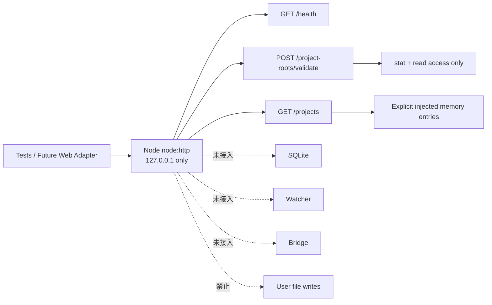

# Backend Phase 1A — Local Core Read-only Result

> 日期：2026-07-23
> 分支：`codex/backend-phase-0`
> 基线：`c1d60853aac4fbbe6753fc5b3c2b2ce04dcff8fa`
> 状态：实现与验证完成，已提交 `ef8f470`、未 Push

## 1. 任务摘要

本轮建立首个 `apps/local-core` 只读骨架，仅实现：

- `127.0.0.1` HTTP 服务；
- `GET /health`；
- `POST /project-roots/validate`；
- `GET /projects`；
- 显式注入的内存 Project Catalog；
- 稳定 `Result / ContractError`；
- AbortSignal；
- graceful shutdown 与端口释放。

未接 Web，未替换 Fixture，未实现 SQLite、Watcher、Bridge、Preview、Context、Version、Revision 或 Checkpoint。

## 2. 变更流程

### 变更前


### 变更后



用户操作与前端流程没有变化；本轮没有修改 `apps/web`。

## 3. 修改文件

### Local Core

- `apps/local-core/package.json`
- `apps/local-core/tsconfig.json`
- `apps/local-core/src/index.ts`
- `apps/local-core/src/server.ts`
- `apps/local-core/src/health.ts`
- `apps/local-core/src/errors.ts`
- `apps/local-core/src/project-root.ts`
- `apps/local-core/src/project-catalog.ts`
- `apps/local-core/tests/health.test.ts`
- `apps/local-core/tests/server.test.ts`
- `apps/local-core/tests/project-root.test.ts`
- `apps/local-core/tests/project-catalog.test.ts`

### Contracts / repository quality gate

- `packages/contracts/src/index.ts`
- `packages/contracts/tests/contracts.test.ts`
- `package.json`
- `package-lock.json`
- `docs/handoffs/BACKEND_PHASE_1A_LOCAL_CORE_READONLY_RESULT.md`

`package-lock.json` 只新增 `apps/local-core` workspace 与其指向已有 `@local-creative-os/contracts` workspace 的链接，共 11 行；没有新增第三方依赖。

## 4. API 与 Contract

### `GET /health`

返回：

```json
{
  "status": "ok",
  "service": "local-core",
  "mode": "read_only_phase_1a",
  "version": "0.1.0"
}
```

### `POST /project-roots/validate`

输入：

```json
{ "rootPath": "E:\\explicit-project" }
```

只执行路径规范化、`stat` 与读取权限校验。不创建目录、不递归扫描、不修复、不写 `.creative-os`。

### `GET /projects`

只返回启动时显式注入的 `ProjectCatalog`。默认 Catalog 为空；不扫描磁盘，也不读取前端 localStorage。

新增稳定错误码：

```text
INVALID_ARGUMENT
PROJECT_ROOT_NOT_FOUND
PROJECT_ROOT_NOT_DIRECTORY
PROJECT_ROOT_NOT_READABLE
PATH_OUTSIDE_ALLOWED_ROOT
ABORTED
INTERNAL
```

API 错误只返回稳定结构，不返回原始系统堆栈。

## 5. 测试结果

### 包级检查

```text
npm run lint --workspace @local-creative-os/local-core
退出码：0

npm run typecheck --workspace @local-creative-os/local-core
退出码：0

npm run test --workspace @local-creative-os/local-core
退出码：0
4 files / 21 tests passed

npm run build --workspace @local-creative-os/local-core
退出码：0
```

编译产物启动烟测：

```text
GET /health
{"status":"ok","service":"local-core","mode":"read_only_phase_1a","version":"0.1.0"}
退出码：0
```

### 根质量链

```text
npm run check
退出码：0

lint：通过；Web 保留基线已有 7 条 react-hooks / unused-expression warning
typecheck：Web / Local Core / Domain / Contracts 全通过
test：26 files / 95 tests 全通过
  Web：20 files / 69 tests
  Local Core：4 files / 21 tests
  Domain：1 file / 3 tests
  Contracts：1 file / 2 tests
build：Web 1802 modules transformed
smoke：2 built assets，React root present
```

初次包级检查曾发现两个类型问题：

1. `failure()` 返回类型未收窄，Local Core typecheck 退出码 2；
2. Contracts 的 `ES2023` 环境没有 DOM `AbortSignal`，Contracts typecheck 退出码 2。

两项均在本轮范围内修复；最终包级检查与根质量链全部通过。测试遇错后没有中断其他独立检查。

## 6. 安全负面证明

- 服务构造器只接受 `127.0.0.1`；`0.0.0.0`、`::`、局域网地址均有拒绝测试；
- 响应不授予任意来源 CORS；
- 目录校验只调用 `stat` 与 `access(R_OK)`；
- Catalog 只接受显式内存注入；
- 没有导入或调用 `child_process`；
- 没有 SQLite / DB 包与文件；
- 没有 Watcher；
- 没有 Bridge import、请求或连接；
- 没有 `.creative-os` 创建逻辑；
- 没有遥测；
- 测试只在系统临时目录创建 disposable Fixture，并在 `afterEach` 递归清理；
- 构建产生的 `apps/local-core/dist/` 与测试缓存位于现有 `.gitignore` 范围，不进入提交；
- graceful shutdown 测试证明关闭后同一端口可立即重新绑定。

## 7. 未实现能力

- SQLite、schemaVersion、migration；
- Watcher、changed files；
- Bridge / Runtime Adapter；
- Preview、Context、Version；
- Project Graph、Workspace、Artifact、Revision、Checkpoint 持久化；
- Web Adapter 与 Fixture 替换；
- 自动 Project 发现；
- Catalog 文件读写；
- 用户文件写入。

这些能力不是 Mock：本轮没有对外宣称它们可用。

## 8. 风险

- 当前 Catalog 是进程内显式注入，重启后为空，这是 Phase 1A 的有意限制；
- `PROJECT_ROOT_NOT_READABLE` 在 Windows 上用注入式只读文件系统稳定验证，因为管理员权限下无法可靠用 chmod 制造不可读目录；
- HTTP 目前是最小路由器，不包含认证、持久化或完整 API 版本策略；在未来接 Web 前仍需单独批准合同切片；
- Web 基线的 7 条 lint warning 未在本轮处理。

## 9. 回滚

本轮可独立回滚：

1. 删除 `apps/local-core/`；
2. 从根 `lint / typecheck / test` 移除 Local Core workspace；
3. 移除 Contracts 新增的 Phase 1A 类型、错误码与测试；
4. 移除 lockfile 中 Local Core workspace 的 11 行；
5. 删除本报告。

不涉及 Schema、用户数据或文件迁移。

## 10. 下一条建议任务

先评审并冻结 Web → Local Core 的只读 Adapter/API 版本与来源标识，不立即接 SQLite 或替换 Fixture。若下一阶段仍保持后端内聚，最小任务可先补：

```text
Local Core API contract tests
→ 显式配置加载边界（只读、无用户目录扫描）
→ 启动/关闭生命周期 runbook
```

进入 SQLite、Watcher、Bridge、真实文件写入或 Web Fixture 替换前，必须另行提交并批准变更协议。
