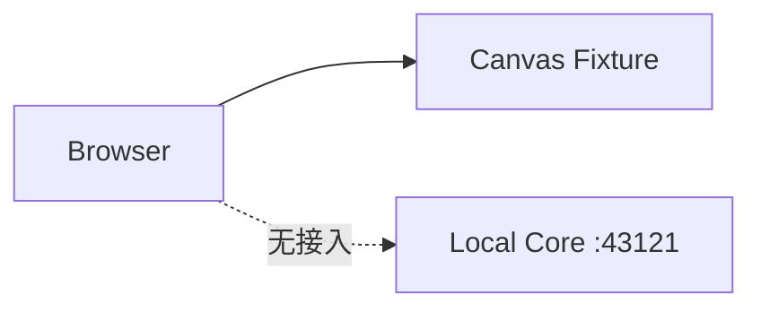
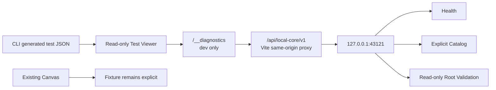

# Backend Phase 1B — Browser Preview Short Plan

> 日期：2026-07-23
> 分级：黄色；方案记录后可在同一任务继续
> 红线：不进入 SQLite、Watcher、Bridge、SSE、真实文件写入或正式数据迁移

## 目标

让开发者在浏览器的 dev-only Diagnostics 页面实时查看：

- Local Core Online / Offline；
- service / version / mode；
- request latency；
- Project Catalog；
- Project Root Validation；
- stable error code；
- fixture / runtime origin；
- browser integration checks；
- structured test result report。

## 修改文件

预计修改：

```text
apps/web/vite.config.ts
apps/web/src/main.tsx
apps/web/src/runtime/localCoreClient.ts
apps/web/src/features/diagnostics/RuntimeDiagnosticsPage.tsx
apps/web/src/features/diagnostics/runtime-diagnostics.css
apps/web/tests/localCoreClient.test.ts
apps/web/tests/runtimeDiagnostics.test.ts
scripts/dev-stack.mjs
package.json
.gitignore
docs/handoffs/BACKEND_LOCAL_CORE_DEVELOPMENT_RUNBOOK.md
docs/handoffs/BACKEND_PHASE_1B_BROWSER_PREVIEW_PLAN.md
```

不新增第三方依赖，不修改 `packages/domain`、正式 Project Graph 或 Bridge。

## 前后流程

### 变更前



### 变更后



## Contract 变化

- Local Core 正式 HTTP 路径保持不变；
- 浏览器开发代理增加版本命名空间 `/api/local-core/v1`；
- Web Runtime Client 复用现有 `HealthStatus`、`ProjectCatalogEntry`、`Result` 与稳定错误；
- Runtime Client 网络失败映射为现有 `UNAVAILABLE`，请求超时映射为现有 `ABORTED`；
- 不增加领域实体，不替换 Fixture，不改变 Artifact / Workspace / Run 语义。

## 测试

整批完成后统一执行：

```text
Runtime Client unit tests
Diagnostics source/route tests
npm run test:report
npm run check
Browser integration:
  /__diagnostics
  Online
  Offline
  Catalog
  Root validation success/error
  test JSON viewer
  console
```

## 风险

- Vite Proxy 仅开发环境存在，生产部署不能依赖；
- Local Core 未启动时必须明确 Offline，不能回退成 Fixture 冒充 Runtime；
- test JSON 写入 `public/dev-test-report.json`，可能包含本机路径，只允许本机 dev-only 查看，不提交生成结果；
- `dev:stack` 是开发 CLI 进程编排，不得由网页调用；
- Diagnostics 独立页面不能改变 Canvas / Inspector 冻结交互。

## 回滚

删除 Diagnostics 页面、Runtime Client、Vite Proxy、开发脚本和报告生成脚本配置即可。Local Core API、用户数据和现有 Fixture 无需迁移。

## 黄色结论

方案未触发红色条件，可以在本任务内继续实现。若后续要求进入生产路由、正式数据源切换、SQLite、Bridge、SSE、文件写入、Fixture 全量替换或网页执行 Shell，立即停止并生成 ADR / Handoff。
