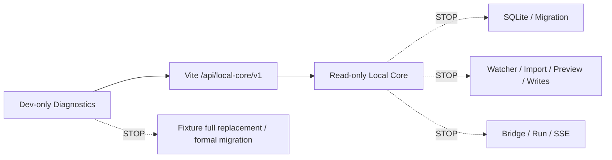

# Backend Phase 1B — Red Boundary Handoff

> 日期：2026-07-23
> 状态：Browser Preview 黄色范围已实现；红色能力未实施

## 已到达的边界



Browser Preview 已能读取 Health、显式 Catalog、Root Validation 和 CLI 生成的测试 JSON。继续推进将进入正式数据、文件、Runtime 或产品语义，因此在此停止扩展。

## 本轮未实施的红色能力

- SQLite、Schema、Migration、schemaVersion；
- Watcher、文件导入、Preview；
- Bridge、Run、waiting_input、SSE、recovery；
- 真实用户文件写入与 `.creative-os`；
- localStorage 正式迁移；
- Workspace / Scope / Artifact 核心语义；
- Accept / Revision / Current / Checkpoint；
- Fixture 全量替换；
- 非 loopback 与任意 CORS；
- 网页执行 Shell；
- 凭证与外部网络调用；
- path containment、hash、write lease。

## 为什么停止

这些能力会改变正式数据真相、安全模型、跨仓 Runtime 合同或冻结产品语义，不能由 Browser Preview 开发切片顺带决定。

## 下一阶段审批最低输入

进入任一红色能力前必须单独给出：

```text
目标与唯一范围
数据/文件真相来源
合同与身份
安全与冲突规则
迁移/恢复
Golden Path / Failure Path
测试
回滚
Owner
```

不得把当前 Diagnostics、Fixture、Vite Proxy 或测试 JSON 当作正式 Runtime、Repository 或持久化能力。
