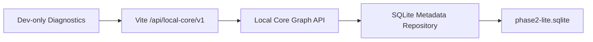

# Backend Phase 2 Lite Result

> 日期：2026-07-23
> 状态：完成；范围锁定在 disposable 元数据持久化

## 实际完成

- 使用 Node 内置 `node:sqlite`，仅保存 Project、Workspace、Artifact、ArtifactView、Relation 和 Canvas camera/zoom 元数据。
- `PRAGMA user_version = 1` 作为 `schemaVersion`；启动时执行 0 → 1 migration，拒绝更高版本。
- Artifact 与 ArtifactView 分表；删除 ArtifactView 不删除 Artifact。
- Local Core 增加 metadata status、Project Graph 读取和 disposable-only 保存接口。
- Diagnostics 读取真实 Runtime Catalog、数据库状态和 Project Graph；Fixture 不会自动写库。
- 数据库不存 BLOB，测试 Artifact 路径使用 `disposable://`，未写真实用户项目。

## 流程



重启恢复：

```text
PUT disposable snapshot
→ SQLite commit
→ 关闭 Local Core
→ 观察端口离线
→ 重启 Local Core
→ migration/version check
→ GET Project Graph
→ 数据恢复
```

## API

- `GET /metadata/status`
- `GET /projects/:projectId/graph`
- `PUT /projects/:projectId/graph`

写接口要求：

- `disposable: true`
- Project ID 以 `disposable-` 开头
- Project root 使用 `disposable://`
- snapshot `schemaVersion` 必须为 `1`

## 恢复证据

- SQLite：
  `E:\Codex 项目\OS开发-backend-phase-0\apps\local-core\.data\phase2-lite.sqlite`
- 保存：成功。
- 关闭后：`43121` 请求失败，确认 Offline。
- 重启后恢复：
  - Project：1
  - Workspace：1
  - Artifact：2
  - ArtifactView：2
  - Relation：1
  - Camera：`x=128, y=72, zoom=0.92`

## 测试

`npm run check`：通过。

- Web：79 tests
- Local Core：36 tests
- Domain：3 tests
- Contracts：2 tests
- 合计：120 tests
- build：通过
- smoke：通过
- lint：通过，保留 7 个既有 Web warning
- warning：Node 22 将 `node:sqlite` 标记为 Experimental

Repository 测试覆盖 migration、关闭/重新打开恢复、删除 View 保留 Artifact、拒绝非 disposable Project。

## 浏览器证据

Diagnostics 已显示：

- `phase_2_lite`
- `schemaVersion 1`
- Metadata only
- SQLite 绝对路径
- Runtime Project/Workspace/Artifact/View/Relation 数量
- camera 和节点位置
- 120/120 测试结果

浏览器自动化在最终截图阶段被 localhost URL policy 阻止，因此未生成新的截图文件；现有常驻页面仍由 Vite 提供并会自动刷新。

一次路径修复前的启动在 `apps/local-core/apps/local-core/.data/` 留下 45KB disposable 空库；删除动作被当前安全策略阻止，已明确忽略且不作为正式数据库。它不含用户数据，可在允许文件清理时删除。

## 明确未做

- Scope / Child Scope
- Note / Revision / Checkpoint
- Preview / Watcher / Bridge / Run / SSE
- 文件导入或真实用户文件写入
- localStorage 正式迁移
- 自动扫描用户目录
- Fixture 全量替换
- apps/web 主流程改造

## 回滚

回滚本阶段提交并删除 disposable 数据库即可。数据库位于被 `.gitignore` 排除的 `apps/local-core/.data/`；不影响真实用户项目。
