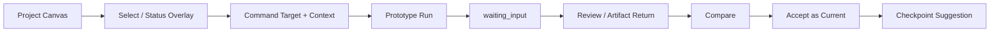

# Frontend Interaction Foundation Handoff

日期：2026-07-20  
基线：`1f85697`  
范围：Frontend Interaction Foundation 的纯前端 Fixture；不接 Local Core、Bridge、SQLite、真实文件或 Runtime。此阶段不是 Frontend Alpha 完成声明。

## 任务摘要

已建立独立的 `apps/web` 与 `packages/ui` workspace，并实现 Local Creative OS 的单 Canvas 交互基础。

## 实际范围

- Project Tabs、Workspace Semantic Viewport Dock、单张 Project Canvas；
- Source、Working、Generated、Context、Process、Decision 六类节点；
- Canvas 平移、缩放、节点拖拽、Mini-map 点击与视口拖动；
- 单击立即选择；详情由节点右上角 `?` 明确打开；双击一度 Relations；`Esc` 逐级退出；
- 中键 Canvas 平移与左键节点拖动分离；拖动超过 4px 后以 rAF 合帧开始，拖后 click 会被抑制；
- Space + Click 在精确 Canvas 坐标创建 Command；文件 Drop 在释放点创建 Fixture 节点；
- 连线已进入同一可编辑关系模型：从输出锚点拖到目标节点创建关系；关系可选中、Delete 删除；选中关系后从同一来源锚点点击目标可重连；节点移动时路径实时跟随；
- 单实例 Inspector：Relations、Preview、Context、Activity、Compare；
- Workspace Dock 支持显式收起/展开、Add Workspace、当前状态与数量提示；点击 Workspace 只移动 Canvas 相机并聚焦节点簇，不切页面；
- Target 与 Context 分离的 Command；
- `queued / running / waiting_input / review / completed / failed` 前端 Fixture 状态机；
- 动态 Run ID、Artifact Return、Compare、Accept as Current、Retry、Checkpoint 提示；
- 全局可见 `Prototype Data · Runtime not connected`，避免被误解为 Local Core/Bridge 已接通。

## 文件

### 新增

- `apps/web/package.json`
- `apps/web/tsconfig.json`
- `apps/web/vite.config.ts`
- `apps/web/src/App.tsx`
- `apps/web/src/main.tsx`
- `apps/web/src/model.ts`
- `apps/web/src/fixtures.ts`
- `apps/web/src/styles.css`
- `apps/web/src/features/canvas/*`
- `apps/web/src/features/workspace/WorkspaceDock.tsx`
- `apps/web/src/features/command/CommandComposer.tsx`
- `apps/web/src/features/inspector/Inspector.tsx`
- `apps/web/tests/fixtures.test.ts`
- `packages/ui/package.json`
- `packages/ui/src/index.ts`

### 修改

- 根 `package.json`：建立 npm workspaces，并将质量命令路由至 `apps/web`；
- 根 `index.html`：改为启动 Frontend Interaction Foundation 入口。

### 未修改

- 旧 `src/` AdFrame Review Prototype；
- `apps/local-core`、`packages/domain`、`packages/contracts`、`tests/e2e`。

## 已知边界与诚实性

| 能力 | 当前状态 |
|---|---|
| Canvas / 状态 / Golden Path | 前端 Fixture 已实现 |
| Preview | UI Fixture，不读本地真实文件 |
| Note | 前端输入态，不持久化 |
| Run / waiting_input / Return | UI 状态机，不调用 Bridge/Codex |
| Artifact Revision / Current | 前端 Fixture 显示与状态更新，不写 Project 真相 |
| Workspace / Camera | 内存态；刷新后回到 Fixture 默认值 |
| Local Core / SQLite / SSE / Connector | 未接通，刻意不实现 |

## 验证结果

| 命令/检查 | 真实结果 |
|---|---|
| `npm run lint` | 通过 |
| `npm run typecheck` | 通过 |
| `npm run test` | 通过：4 个 test files / 9 tests |
| `npm run build` | 通过：Vite 8.1.5 |
| `npm run smoke` | 通过：Preview 与 2 个构建资源可访问 |
| Browser 1440×900 | 通过：Canvas、Dock、Mini-map、六类节点、Prototype 标记可见 |
| Browser 1366×768 | 通过：Dock 收起，Canvas 主内容可用 |
| Golden Path | 通过：Select → C → Run → waiting_input → 35% → Return → Compare → Accept → Checkpoint |
| Console | 无相关 warn/error |
| R1 浏览器关系回归 | 通过：拖建 7→8、选中/删除 8→7、重连路径变化、节点移动后路径变化、临时连线归零 |
| R1 浏览器手感回归 | 通过：20 次快速选择、10 次连续拖动、单击/双击、详情 `?`、Enter 状态、C 创建 Command、中键平移、Space+Click 精确落点 |
| R2 Workspace Dock 回归 | 通过：1440×900 收起/展开、Add Workspace、Build Workspace 相机聚焦；1366×768 保持紧凑 Dock |
| R2 Command / Inspector 回归 | 通过：Space 创建后 Target 独立显示、Context 可切换、Run 可执行；Relations → Preview/局部回退保持单 Inspector |
| R3 Fixture 状态回归 | 通过：queued → running → waiting_input → review → Artifact Return/Compare → Accept as Current → Checkpoint；动态 Run ID 保持一致 |
| R3 双分辨率布局回归 | 通过：1366×768 与 1440×900 均无 Canvas 节点越界；右下 Space + Click 的内联 Command 面板自动夹紧在视口内 |
| R3 空态/冲突态回归 | 通过：Relations 无数据时展示可理解空态；waiting_input 可触发 Fixture 冲突提示，并以“保留 Current，返回 Canvas”恢复，不覆盖人工 Current |
| R3 loading/error/disconnected | 通过：Runtime 徽标打开 disconnected 说明；系统态面板保留现场并提供返回动作，loading/error 文案与恢复语义已纳入 Fixture UI |
| R3 Make 材质截图 | 已保存：`E:\Codex 项目\OS开发\.playwright-cli\r3-1366-foundation.png`、`r3-1366-states.png`、`r3-1366-inspector.png`、`r3-1366-command.png`；节点、Dock、Mini-map、Inspector、Command 均使用同一瓷白/内凹槽/柔阴影家族 |
| R3 1440 Inspector 对照 | 历史证据：`E:\Codex 项目\OS开发\.playwright-cli\r3-1440-inspector-final.png`；后续 v0.3 已改为对象驱动单列，不再使用四段平级 Tab |
| R3 信息层级回归 | 通过：默认节点隐藏重复分类文字与次级 subtitle，仅保留分类图标、预览槽、名称和 Draft/Current 最小状态；前后图：`E:\Codex 项目\OS开发\.playwright-cli\r3-1366-foundation.png` → `E:\Codex 项目\OS开发\.playwright-cli\r3-1366-low-noise-after.png`，1440 图：`E:\Codex 项目\OS开发\.playwright-cli\r3-1440-low-noise-after.png` |
| R3 新用户可发现性回归 | 通过：悬停后 `?` 与两个锚点 opacity=1；`?` 打开详情、双击打开 Relations、Add Note 新增节点；Mini-map 174×152 可拖动相机、可收起/展开；Dock Add Note 入口存在 |
| R3 连线可见性与 Golden Path | 通过：Source→Decision 临时预览线可见；透明 14px 命中带使浅色 Canvas 上连线可选中；Delete 后边数减少，Source→Draft 重连路径变化；Space Command → Run → waiting_input → 35% → Artifact Return → Accept Current → Checkpoint 连续通过 |
| 性能成熟度 Spike | Fixture `?perf=80`：真实浏览器 DOM 80 节点 / 79 命中边，navigation 89.6ms、first-paint 368ms；中键平移 860ms、20 次选择 204ms、拖动 802ms（含 Playwright 鼠标步进开销）。`?perf=150` 渲染 150 节点并显示 simplified detail；`?perf=300` 仅渲染 75 个聚合代表节点，显示 overview aggregate，不承诺 300 个完整节点同屏。 |
| P0 节点操作 | 通过：单选/批量 Delete 清理连接边；空白左键拖框选；Shift+点击追加/取消；框选组拖动；中键平移不冲突；锚点拖到空白可选 Command/Note/Context 并自动连线，Esc/外部取消无残留 |
| Workspace / New Run | 通过：Dock Hover 删除入口带确认文案，删除 Semantic Viewport 后回到保留 Workspace；右上 New Run 打开现有 Command Composer，状态明确 `Not persisted` |
| 本地文件 Drop | 通过：图片以 Object URL 在释放坐标生成真实缩略图；DOCX/PPT/PDF 等显示真实文件名与 `PREVIEW UNAVAILABLE`，不上传/移动/写盘；删除与卸载回收 Object URL |
| P0 取消与边界 | 通过：锚点空白菜单 Esc 后节点数、临时边均不变；当前前端原本没有 Undo，本轮未新增伪 Undo；未实现新建/切换 Canvas、Codex 提示词复制/生成 |
| UI Component Completion · Node states | 通过：`?perf=80` 双分辨率截图 `E:\Codex 项目\OS开发\.playwright-cli\components-1366-node-states.png`、`components-1440-node-states.png`；统一 CanvasCard 覆盖 default/hover/selected/multi-selected/dragging/pending/error/disabled，图片与文档 Drop 节点复用同一状态类；浏览器确认 hover details、selected、dragging class 均出现 |

## 关键修复

- V9 的 `Accepted — Draft` 被替换为 Accept 后真正 `Current`；
- Artifact Return 使用本次动态 Run ID 命名；
- 补齐 `failed` 状态及失败入口；
- Command 打开时关闭状态 Overlay，避免 Overlay 覆盖 Run；
- Context 选择真实更新前端状态，而非仅 Toast；
- 1366×768 下内联 Command 面板增加视口边界夹紧，避免底部/右侧溢出；
- Inspector 增加 Relations 空态与文件冲突恢复态，明确 Fixture / Local Core 边界；
- Runtime 徽标改为可点击的 disconnected 状态入口；系统状态面板补充 loading/error/disconnected 可恢复文案；
- 1366 窄屏 Dock 隐藏数量与 Current 文本，避免压缩后出现裁切残影；
- 组件按 Canvas / Dock / Overlay / Inspector / Command 拆分，未复制 V9 单体结构。

## 风险与下一步

1. 引入 Local Core 合同时，前端必须消费 `packages/domain` / `packages/contracts` 的冻结类型，不能把当前 Fixture 类型当作正式真相。
2. 实际文件 Preview、Note 持久化、Project 恢复、SSE Run 事件与 Artifact Revision 写入须由获批的后续 Sprint 接通。
3. 大量节点的 LOD/性能基线尚未做 80/150/300 实测；当前实现是 Alpha 视觉与交互垂直切片。
4. 后续接入 React Flow/ELK 前，应先做性能 Spike，不能在没有基线的情况下替换当前轻量 Canvas。
5. 性能场景通过 URL Fixture 开启（`?perf=80|150|300`），不写入 Project 真相；300 节点总览会主动降级边与细节，属于可再生演示数据。

## 回滚

本次功能集中在新增 `apps/web`、`packages/ui` 和根 workspace 配置。可通过对本次提交执行可审查的 `git revert` 回退；旧 Review Prototype 未被改动。

## 里程碑级前端审计（性能成熟度）

### 实际前端文件

`apps/web`：`package.json`、`tsconfig.json`、`vite.config.ts`、`src/App.tsx`、`src/main.tsx`、`src/model.ts`、`src/fixtures.ts`、`src/styles.css`、`src/interaction.css`、`src/features/canvas/CanvasMiniMap.tsx`、`NodeStatusOverlay.tsx`、`ProjectCanvas.tsx`、`src/features/command/CommandComposer.tsx`、`src/features/inspector/Inspector.tsx`、`src/features/workspace/WorkspaceDock.tsx`、`tests/fixtures.test.ts`。旧 `InspectorTabs.tsx` 已删除。

`packages/ui`：`package.json`、`src/index.ts`。

### 本轮证据

- 80 节点默认 / 聚焦截图：`E:\Codex 项目\OS开发\.playwright-cli\perf-80-default.png`、`perf-80-focused.png`；聚焦后非焦点边 opacity 约 `0.28`，焦点边保持 `1`，相机移动中焦点边约 `0.78`，无闪烁。
- 150 节点：DOM 150，`lod-simplified`，分类图标、名称、选择态可读。
- 300 节点：DOM 75，`lod-overview`，徽标明确 `300 nodes · overview aggregate · Fixture`；代表节点可点击选择，相机仍可通过中键与 Mini-map 移动。
- 300 总览截图：`E:\Codex 项目\OS开发\.playwright-cli\perf-300-overview.png`。
- 质量检查：`npm run typecheck`、`npm run smoke`、`git diff --check` 通过。

### Fixture / 未接通边界

`?perf=80|150|300` 只生成可再生性能 Fixture；节点、关系、LOD、相机和 Run 状态均为浏览器内存态。未读取真实文件、未写入 Project 真相、未连接 Local Core / SQLite / Bridge / Runtime / SSE / Connector，也未承诺 300 个完整节点同屏。

### 剩余缺口

1. 需要真实设备与生产构建下的 Chrome Performance trace，当前数字包含 Playwright 鼠标步进开销。
2. 150/300 节点仍未做虚拟化；若未来超过当前个人 Alpha 密度，应先建立预算再决定是否引入更深层 LOD。
3. 总览聚合目前是代表节点降采样，不是可展开的语义聚合模型；该模型需后续获批后再接 Domain/Local Core。

## UI Component Completion · Inspector / Command / Run

- Node state family：CanvasCard 统一覆盖 `default / hover / selected / multi-selected / dragging / pending / error / disabled`；图片与文档 Drop 节点复用同一状态类。双分辨率证据：`E:\Codex 项目\OS开发\.playwright-cli\components-1366-node-states.png`、`E:\Codex 项目\OS开发\.playwright-cli\components-1440-node-states.png`。
- Command Composer：Target 与 Context 保持分离；Skill / Executor / Output 采用渐进展开，明确 `Fixture` 与 `Runtime not connected`。证据：`E:\Codex 项目\OS开发\.playwright-cli\components-1440-command.png`。
- Inspector：旧版 Relations / Preview / Context / Activity / Compare 单实例证据保留作历史回归；当前 v0.3 已切换为对象驱动单列、关系 push/back 与同面板 Compare。证据：`E:\Codex 项目\OS开发\.playwright-cli\components-1366-inspector-relations.png`、`E:\Codex 项目\OS开发\.playwright-cli\components-1366-run-failed.png`、`E:\Codex 项目\OS开发\.playwright-cli\components-1366-run-retry.png`。
- 真实浏览器复验：1440×900 Command 展开；1366×768 Inspector/Run 无阻断 Console 错误。`npm run typecheck`、`npm run smoke`、`git diff --check` 通过。
- 边界：Inspector、Command、Run 仍由前端 Fixture 驱动；不读写 Local Core、不启动真实 Runtime、不持久化 Project/Run。

## CSS Material Baseline · Refined v0.2

- 来源：`E:\Codex 项目\OS开发\前端测试\Local_Creative_OS_CSS_Refined_v0.2.zip`，按 `README_REPLACE.md` 将包内 `styles.css`、`interaction.css` 作为完整基线替换，保持 `styles.css` → `interaction.css` 导入顺序。
- 交互回迁：补回 `multi-selected / error / disabled` 节点状态、Error/Disabled 标记、Command 渐进展开按钮；保留 marquee、anchor-create-menu、edge-hit、Workspace 删除、New Run、LOD、图片 preview 等 P0/P1 选择器。
- 视觉约束：`.scene` 已接入 `understand / explore / build / decide / blank` intent；边使用 `vector-effect: non-scaling-stroke`，普通银线静止，仅 running / selected-focused generate / artifact-return 动画；未恢复旧的窄屏节点 scale、Hover 几何位移、粗左色条或彩色整卡。
- CSS 后浏览器证据：`E:\Codex 项目\OS开发\.playwright-cli\css-refined-1440.png`、`E:\Codex 项目\OS开发\.playwright-cli\css-refined-1366-default.png`、`E:\Codex 项目\OS开发\.playwright-cli\css-refined-1366-lod150.png`、`E:\Codex 项目\OS开发\.playwright-cli\css-refined-1366-lod300.png`。
- CSS 后复验：1440×900 / 1366×768；中键平移相机 style 改变、Space+Click 创建 inline Command、New Run Target/Skill/Executor/Output 展开、150 DOM simplified、300 DOM 75 overview、Console 无阻断错误；`npm run typecheck`、`npm run smoke`、`git diff --check` 通过。

## UI Component Completion · Remaining visible controls

- Confirm：Workspace 删除改为前端 ConfirmDialog，明确只删 Semantic Viewport / Fixture Workspace，不删 Artifact 或本地文件；取消与确认均可操作。
- Toast：沿用统一 `.notice` 状态反馈，补齐原生打开、Workspace 筛选等操作响应，不再保留无反馈死按钮。
- Tooltip / Shortcut hints：为 Dock、New Run、Mini-map、分页、添加节点和危险操作补充 `title` / `aria-label`；快捷键提示继续显示 Space + Click、Middle drag、Enter。
- Permission / Preview unavailable：文件节点详情与 Inspector Preview 对 DOCX/非可预览文件显示文件名、类型、大小和 `Preview unavailable`，原生打开明确提示需 Local Core 权限；不伪造内容。
- 浏览器证据：`E:\Codex 项目\OS开发\.playwright-cli\ui-completion-confirm-toast.png`；1440×900 Confirm、Toast、详情操作与 DOCX Drop 均通过，Console 无阻断错误。

## Independent retest hooks · P0 evidence

- 稳定测试钩子：`data-testid="workspace-dock"`、`workspace-delete-*`、`canvas`、`canvas-node-*`、`anchor-out-*`、`selection-marquee`、`anchor-create-menu`、`anchor-create-command/note/context`、`confirm-dialog`、`toast`。
- Workspace 删除：点击 `workspace-delete-*` → ConfirmDialog → 确认后剩余 Workspace 正常、Toast 明确提示 Artifact 与文件未受影响。
- 多选：首节点点击 + Shift 点击第二节点，`selected` 与 `multi-selected` 均为 2。
- 锚点空白创建：`anchor-out-brief` 拖到空白，临时边可见，菜单出现；点击 Note 后节点 8→9、边 8→9、菜单清除。
- 本地图片 Drop：Fixture 文件 Drop 后节点 8→9、图片节点 1 个、`src` 为 `blob:` Object URL；不上传、不写盘。
- 最新证据：`E:\Codex 项目\OS开发\.playwright-cli\retest-p0-hooks.png`。

## UI Component Completion · State chain / continuous use

- 1440×900 Golden Path：Command progressive disclosure → `queued` → `running` → `waiting_input`（选择 35%）→ `review` → Artifact Return → Compare → Accept as Current → Checkpoint；状态与 Toast 均正常。
- Failed → Retry 已验证可回到 Queued；Inspector Relations → Preview 返回栈可用。
- 连续操作清理：Accept / Checkpoint 后 `node-overlay=0`、`edge.temporary=0`、`anchor-create-menu=0`；未出现残留临时边或菜单。
- 1366×768：Command Composer 位于视口内，Fixture / Runtime not connected 文案完整；证据：`E:\Codex 项目\OS开发\.playwright-cli\state-chain-1366-command.png`。
- 1440×900 状态链证据：`E:\Codex 项目\OS开发\.playwright-cli\state-chain-1440.png`。
- 顶部 Project Tab / Add Tab 仍不实现新 Canvas/切换 Canvas，但已补诚实 Toast 响应并标注暂缓。

### 对照 UI Spec 后仍缺失 / 暂缓

1. Local Core 驱动的真实 Preview、Permission、Project/Workspace 持久化与重启恢复。
2. Bridge/SSE 真实 Run 事件、真实 Artifact Revision、文件冲突哈希与权限判定。
3. 新建/切换 Canvas、Codex 提示词复制/生成（明确暂缓，不在本轮实现）。
4. Toast/Confirm/Tooltip/Shortcut、六类节点状态与 Run 状态链的前端 Fixture 已覆盖；未再发现当前范围内的可见死控件。

## Minimal Adapter Boundary · contracts integration

- 已核对 `packages/contracts/src/index.ts` 实际导出：`WorkspaceQueryContract`、`PreviewContract`、`ExecutionRuntimeContract`、`Result` / `ContractError`，并通过 workspace package 依赖接入 `apps/web`。
- 新增 `apps/web/src/adapters/fixtureAdapter.ts`：只用 contracts 接口推导参数/结果类型，不复制 domain/contracts 类型；提供 `workspace.getWorkspaces/updateViewport`、`preview.getPreview`、`runtime.getRun/retryRun` 的窄 Fixture 实现，来源固定标识为 `fixture`。
- UI 接入范围：App 启动从 WorkspaceQuery Fixture 读取 Workspace；Retry 通过 Runtime facade 执行 Fixture 边界调用后维持现有内存态；其余页面状态未大规模重构。
- 新增单测 `apps/web/tests/fixtureAdapter.test.ts`：Workspace 查询、Preview origin、Runtime Fixture-only 错误均通过。
- 验证：web unit `13 passed`、`typecheck`、`smoke`、`git diff --check` 通过；1440×900 浏览器确认 Workspace 数量、Command Fixture 标识、Run waiting_input 正常。证据：`E:\Codex 项目\OS开发\.playwright-cli\adapter-boundary-1440.png`。
- 当前明确缺口：contracts 的 Workspace 查询是 Domain Workspace（品牌 ID、viewport、updatedAt），而 UI 仍有轻量 CanvasNode/UI Workspace 模型；adapter 已隔离映射，未将 UI 类型冒充正式领域真相。真实 runtime 接入前需由后端实现 contracts，不在本轮补造第二套契约。

## State Truth Consistency · Return / Retry / Accept

- 分离 `runStatus`（execution）与 `artifactReview`（`idle | pending | accepted`）；Artifact Return 进入 Pending 时 Run 保持 `review`，不再错误显示 `completed`。
- Accept Current 后才将 `artifactReview=accepted`、Run 置为真实 terminal `completed`；Artifact card、Run pill、Run/Command 节点副标题、Inspector Activity 与 Toast 均从同一 App 状态派生。
- Retry 会清理 review 状态、生成新的动态 Run ID 并进入 `queued`；旧 Draft 不冒充新 Current。
- 浏览器链验证：`RUN-044 · review · artifact pending review` → Accept → `RUN-044 · completed · artifact accepted`；Retry → `RUN-045 · queued`。证据：`E:\Codex 项目\OS开发\.playwright-cli\state-source-consistency-1440.png`。
- 回归修复：Retry 使用 `runId + enabled` guard 与 effect cleanup，旧 timer/closure 无法推进新 Run；Retry 后等待 2200ms 仍为 `RUN-045 · queued`。Inspector tabs 改为替换当前 route，Compare 可切到 Activity，始终只有一个 Inspector。单测 `15 passed`；最新证据：`E:\Codex 项目\OS开发\.playwright-cli\retest-stale-retry-1440.png`。

## CSS Material Baseline · Refined v0.3 + Inspector information architecture

- 来源：`E:\Codex 项目\OS开发\前端测试\Local_Creative_OS_CSS_Refined_v0.3.zip`。已完整替换 `apps/web/src/styles.css` 与 `apps/web/src/interaction.css`，导入顺序仍为 `styles.css` → `interaction.css`。
- `bright-pearlescent-overrides.css` 未额外导入：其亮色覆盖已包含在 v0.3 `styles.css`，避免重复加载。
- v0.3 的 `max-width:1400` 点状 Dock 规则已被最小交互补丁覆盖：1366/1440 默认保持 205px 可读展开态；只有显式 Collapse 进入 52–58px 紧凑态，980 以下才允许响应式紧凑。
- Inspector 已改为对象驱动单列渐进披露：无顶部 Relations/Preview/Context/Activity Tab；对象主内容优先（文件 Preview、Run Activity、Context 组成、Decision 正文），Related / Context / Activity 为可折叠摘要；关系点击在同一实例 push，Back 返回，Compare 为同一面板临时扩展。
- 1366 下 Inspector 为右侧浮动覆盖层并独立滚动，不挤压 Canvas；命令面板同样保持浮动边界。
- v0.3 证据：`E:\Codex 项目\OS开发\.playwright-cli\v03-dock-1366-expanded.png`、`v03-dock-1440-expanded.png`、`v03-inspector-1440-file.png`、`v03-inspector-1366-context.png`、`v03-state-chain-1440.png`。
- 完整质量链：`npm run check`（lint → typecheck → unit 15 → build → smoke）通过；浏览器双分辨率 Console 无阻断错误。当前仍为 Frontend Interaction Foundation，Fixture/Local Core 边界不变。

## Canvas Maturity Slice · persistent selection / fit recovery / resize

- 变更前流程：空白左拖只显示临时 marquee；Mini-map Fit 使用固定相机；节点尺寸仅由 Fixture 初始值提供。
- 变更后流程：`空白左拖 → pointerup 写 selectedIds → 派生 world selection-bounds → 组拖/点击空白/Esc/删除清除`；`中键平移 → 视口无节点相交 → 定位内容 → fitBounds(padding + zoom clamp)`；`单选 → resize handle → 3–5px/rAF 暂存 → pointerup 一次提交`。
- 修改文件：`apps/web/src/features/canvas/canvasGeometry.ts`、`ProjectCanvas.tsx`、`CanvasMiniMap.tsx`、`apps/web/src/styles.css`、`apps/web/src/interaction.css`、`apps/web/tests/canvasGeometry.test.ts`。
- 浏览器证据：`E:\Codex 项目\OS开发\.playwright-cli\canvas-maturity-1366-resize-multiselect.png`。已实测节点尺寸由约 `210×132` 调整到 `263×178`，并从 standard 进入 expanded；Shift 多选生成持续 `selection-bounds`，控制台无 error/warn。
- 单测：`canvasGeometry` 覆盖 selection bounds、fit bounds、LOD density、resize clamp；当前 Web 单测 `8 files / 19 tests passed`，typecheck passed。
- Mini-map fit 已改为真实节点 bounds、viewport、padding 与 zoom clamp；远向中键平移后的“空视口→定位内容”完整浏览器序列仍待专用 middle-button 自动化复验，不能把代码/单测当作该手测证据。
- v0.3 视觉纠偏：移除全高 4px 左色条，保留顶部 2px 环境光；Dock Add 保持完整可读按钮，仅主 Add Workspace 右侧使用约 20px 小型虹彩锚点；次级控件回到瓷白/冷灰；标题/状态层级收敛；InspectorTabs 无 JSX/CSS 残留。
- 边界：尺寸与 selection bounds 仅为前端 Fixture 内存派生，不写 domain/contracts、不接 Local Core；无 Undo 新增。回滚仅需恢复上述前端文件与本 handoff 段落。

## Dock empty-pill / flicker regression · 2026-07-21

- 根因：`.dock-add { width:22px }` 错把“小型虹彩锚点”应用到整个 Add 按钮，旧 `::after` 同时遮住图标；v0.3 两处 `max-width:1400` 规则仍试图自动隐藏 Dock 文案，形成脆弱的覆盖链。
- 修复：Add Workspace / Note / Context 恢复完整宽度；只有 Add Workspace 使用右侧小型虹彩锚点；删除 1366 桌面自动点状折叠规则，Compact 只由用户显式 Collapse 触发。
- 浏览器证据：展开态 `205px`，三个 Add 均约 `168×34px`；显式收起 `52px`，重新展开恢复 `205px`；连续 10 帧、每帧 180ms 的截图 SHA-256 完全一致，未检测到持续闪烁；Console 无 error/warn。截图：`E:\Codex 项目\OS开发\.playwright-cli\dock-flicker-fix-expanded.png`。
- 验证：lint、typecheck、19 unit、build、smoke、`git diff --check` 通过。回滚点为 `WorkspaceDock.tsx`、`styles.css`、`interaction.css` 的本节变更。

## Laptop touchpad Canvas navigation · 2026-07-21

- 普通双指滑动现在以 `0.5` 灵敏度平移 Canvas；触控板捏合（浏览器 `Ctrl/Meta + wheel`）仍以指针位置为锚点缩放；鼠标中键平移保持不变。
- 高频 wheel 输入通过 `requestAnimationFrame` 合并，每帧至多提交一次相机更新；平移不改变节点选择，也不触发页面滚动。
- 浏览器用同一组连续 10 次双指滑动复验：原位移 `120×80` 降为 `60×40`，相机由 `(250, 85, 1)` 移到 `(190, 45, 1)`；缩放与选择保持不变，Console 无 error/warn。证据：`E:\Codex 项目\OS开发\.playwright-cli\touchpad-two-finger-pan.png`。
- 单测覆盖双指平移与指针锚定缩放；当前能力仍属于 Frontend Interaction Foundation 的纯前端相机交互，不接 Local Core/Bridge。
