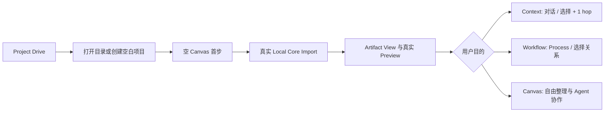

# LCOS GUI 大批次收口 Handoff

日期：2026-08-09
状态：本批次实现与集中验收完成，尚未提交

## 任务摘要

本批次把 GUI 从“可演示界面”推进到无需理解 Codex 也能进入项目、导入第一份资料并理解基本界面角色的产品入口，同时完成 Context / Workflow 的能力与布局分化、真实 Preview 消费、Canvas 相机恢复与 Sidecar 适配。

## 实际范围

- 首次启动与空项目：空 Catalog 回到 Project Drive；生产默认不再隐式进入 Sample；打开已有目录、创建空白项目、首份资料导入形成连续路径。
- Canvas：空状态、首份 Artifact 引导、2%–200% 手动缩放；恢复 / 定位阅读相机限制为最高 125%，避免单节点占满屏幕。
- 节点 Preview：图片使用真实图片预览，文本 / Markdown 使用文本缩略图，其余格式使用明确文件态，不再把任意 data URL 当图片。
- Context：只显示明确对话来源或当前选择 + 1 hop；空状态不伪造 Project History；采用时间阅读轨迹。
- Workflow：只显示当前选择 + 1 hop 或真实 Process / Run 关系；采用左到右关系层级；不写死业务 Schema。
- Sidecar：410×900 下隐藏全局 Agent 栏；能力来源条、Composer、底部 Dock 互不遮挡；空项目无横向溢出。

## 变更流程

## 测试结果

- `npm run lint`：通过；仅保留仓库既有 warning。
- `npm run typecheck`：Web、Local Core、Domain、Contracts 全部通过。
- `npm run test --workspace @local-creative-os/web`：39 files / 200 tests 通过。
- `npm run test:architecture`：13 files / 70 tests 通过。
- `npm run build`：通过；Vite 保留主 chunk 大于 500 kB 的既有提示。
- `npm run smoke`：通过，15 个构建资源，React root 存在。
- 冷刷新后复走 Ctrl+A、Context、Workflow：新增浏览器 warning / error 为 0。

## 真实浏览器验收

- 410×900 空项目：无横向溢出；无全局 Agent rail；无空小地图。
- 1440×900：`LCOS_VNext3_体验` 4 个节点正常；Ctrl+A 选中 4/4；多选操作条出现。
- 弹层：打开“更多”后点击 Canvas，弹层从 1 个降为 0。
- 节点：再次单击已选节点会出现针对该节点的提示词输入框与对象工作台。
- 1920×1080：无横向溢出、0 破图、0 个可见无名称按钮。
- Context / Workflow：来源文案、成员集合、布局和空状态均明确分化。

证据：`docs/audit/evidence/gui-big-batch/`。

## 风险与明确缺口

- PDF / PPT 等 Windows Shell 预览尚未由 Local Core 生成；本批次没有用 Mock 冒充。GUI 已准备好消费真实图片 Preview，但正式 Windows 缩略图仍是后端 Renderer 能力缺口。
- 主 bundle 约 1.3 MB（gzip 约 302 kB），进入正式封装前应做按能力入口拆包。
- `App.tsx` 虽已拆出 Shell、Surface、Onboarding、Resolver 与 Layout 模块，但仍承担较多编排职责；后续只做可审查的职责下沉，不再为“拆文件”做大范围机械移动。
- lint warning 基线较多，其中 React Hook warning 应在后续稳定性批次专门清理，避免与视觉重构 Diff 混杂。

## 回滚说明

本批次未改变领域 Schema 或数据库迁移。可按文件回退 Onboarding、Surface resolver / layout、Preview 渲染和 CSS；相机阅读上限可独立回退 `canvasGeometry.ts`。正式数据与源文件不受回滚影响。

## 临时数据清理

验收项目 `LCOS First Run E2E` 已从 LCOS Catalog 移除；测试 Markdown 及其导入副本已删除。仅可能残留空目录，不含用户内容。
