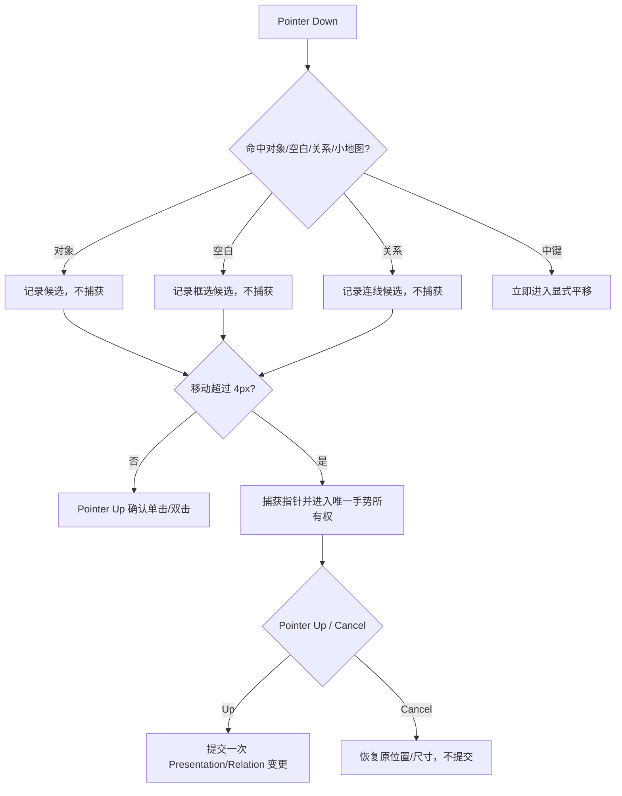

# LCOS GUI Interaction Foundation Round 1 Handoff

日期：2026-08-09
状态：完成，未提交
Worktree：`E:/Codex 项目/OS开发/.worktrees/mvp-fast-build`
Branch：`codex/backend-hardening-20260802`
基线 HEAD：`b02d2a64f99aa43ba2f1501e3e540b844564920b`

## 任务摘要

依据 VNext3.1 Brief 与「正式版原型2」，完成 GUI 正式软件化第一轮 Interaction Foundation。目标是让不了解 Codex 的创意从业者打开项目后立即进入可读现场，并使画布高频手势在真实 Runtime、真实浏览器和失败路径下保持稳定。

## 实际范围

- 恢复相机的可读性、内容邻域聚焦与 Shell Safe Insets。
- 单选连续压力、4px 拖拽阈值、尾随单击隔离、双击确认延迟。
- 框选、多选保持、组拖、删除与撤销。
- 中键平移、Pointer Cancel 回滚、Workspace 框体缩放累计偏移修复。
- 关系创建、重复关系去重、端点重连、删除、锚点拖到空白创建。
- 小地图真实安全视口、点击定位与对象不变性。
- 内部对象拖拽与外部文件 Drop 隔离。
- Active Context 异步恢复与用户选择意图的竞态隔离。
- ArtifactView 位置写入 Local Core、相机作为导航偏好重载恢复的边界验证。

## 变更流程



## 修改文件

- `apps/web/src/App.tsx`
- `apps/web/src/features/canvas/ProjectCanvas.tsx`
- `apps/web/src/features/canvas/CanvasMiniMap.tsx`
- `apps/web/src/features/canvas/canvasGeometry.ts`
- `apps/web/tests/canvasGeometry.test.ts`
- `apps/web/tests/v061CanvasInteractionContract.test.ts`
- `tests/e2e/interaction-foundation.spec.ts`
- `docs/audit/LCOS_GUI_PRODUCTIZATION_BASELINE_20260809.md`
- `docs/handoffs/HANDOFF_GUI_INTERACTION_FOUNDATION_ROUND1_20260809.md`

## 真实验收结果

### 完整检查链

`npm run check:fast`：通过。

- lint：通过，有既存 warning，无新增 error。
- typecheck：通过。
- unit test：通过。
- architecture test：13 files / 70 tests 通过。
- production build：通过。

### Interaction Foundation E2E

命令：

```text
npm exec playwright test tests/e2e/interaction-foundation.spec.ts --reporter=line
```

结果：5/5 通过。

1. 连续选择 20 次、3px 抖动、阈值后拖拽、尾随点击、双击、中键平移、Ctrl+滚轮缩放。
2. 框选、多选保持、组拖、删除、撤销。
3. 关系创建、重连、删除、锚点拖到空白。
4. 小地图跳转且 Project 对象数量不变。
5. Local Core ArtifactView 位置持久化与相机导航偏好重载恢复。

每项测试创建完全独立、全 ID 隔离的临时 Runtime Project，并在测试后通过 Local Core 删除；不修改用户 Sample。

### 既有 Phase 4 回归

命令：

```text
npm exec playwright test tests/e2e/vnext-phase4.spec.ts --workers=1 --reporter=line
```

结果：3/3 通过。

专项 E2E 与 Phase 4 E2E 并行双 Worker 运行时，旧 Phase 4 的共享 Sample 投送用例出现一次时序失败；串行独立复跑 3/3 通过。原因是旧用例共享 Runtime Sample，不具备并行隔离，不能将并行结果作为产品回归失败，也不应把 `force` 或延长等待作为修复。后续应将旧 Phase 4 用例迁移到本轮的独立 Project Fixture 方式。

## 浏览器证据

- 首次真实 Runtime 基线：25% 总览、节点约 70×48 px、中心空白，已在 Codex 任务中截图。
- 修复后恢复：45% 最低阅读尺度并进入密集内容邻域。
- 小地图定位 `view-reference` 后，相机从 `x=532.02, y=-9.08` 移动到 `x=1415.46, y=393.13`，节点落入 Shell 安全工作区；截图已在 Codex 任务中回传。
- 连续选择 20 次无误开 Workbench；正常双击仍打开 Workbench。

## 数据与 Schema

- 无 Schema 变更、无 migration。
- Project Graph、ArtifactView、Relation 仍由 Local Core 保存。
- Camera 继续使用可丢失导航偏好恢复，不进入 Artifact/Relation 领域真相。
- 不改变 Artifact、View、Workspace、Run 的冻结对象模型。

## 已知风险与债务

- `App.tsx` 已经完成过展示层拆分，但后续能力接线使编排层再次增长；本轮未做大范围二次重构。
- production main chunk 约 1.30 MB（gzip 约 298 kB），Vite 仍提示 500 kB 以上 chunk。
- lint 有既存 unused import、exhaustive-deps 与 Fast Refresh warning；本轮没有用批量格式化或无关清理掩盖交互 Diff。
- 旧 Phase 4 E2E 仍依赖共享 Sample，不能安全并行。

## 未完成

本 Handoff 只声明 Interaction Foundation Round 1 完成，不声明全部 GUI VNext3.1 完成。下一轮仍需推进：正式 Design System 收口、Shell 信息层级、内容对象视觉与 Workbench、Saved View、Context renderer、Workflow/Agent 直接操控、Run Rail、动效、无障碍、性能预算和完整 Golden/Failure Path。

## 回滚说明

- 相机恢复：回滚 `restorationFocusBounds`、`fitBoundsForReading`、`restoredCameraIsMeaningful` 调用即可恢复原覆盖率判断，无数据迁移。
- 手势状态机：回滚 `ProjectCanvas.tsx` 本轮阈值、Cancel、Drop 隔离和延迟确认逻辑；Local Core 数据格式不受影响。
- 小地图：回滚 `cameraSafeViewportBounds` 和 Safe Insets 中心定位；不影响 Project 数据。
- E2E 和文档可独立删除，不影响 Runtime。

## Git 状态

未创建 Commit、Tag 或 Push。等待 Dz 明确授权后再提交。
