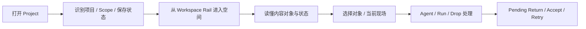

# HANDOFF · GUI Product Interface Foundation · Round 2

日期：2026-08-09
分支：`codex/backend-hardening-20260802`
基线：`b02d2a64f99aa43ba2f1501e3e540b844564920b`
状态：核心实现、多尺寸内置浏览器验收与完整检查链已完成；Sidecar 已按后续纠正协议改为 Canvas-first

逐项完成审计：`docs/audit/LCOS_GUI_PRODUCT_INTERFACE_ROUND2_COMPLETION_MATRIX_20260809.md`

## 任务摘要

把 Round 1 已经可操作的 LCOS Canvas，从“工程画布”推进成非 Codex 用户也能理解的正式产品界面基础。实现遵循 VNext3.1 Brief 与 Figma Make 原型的视觉骨架，不改变冻结对象模型、主交互、Domain、Local Core、Bridge 或 Schema。

## 实际范围

- Canonical design system / token / voice。
- Project Strip、Workspace Rail、Scope / Capability Dock、Agent / Run Rail。
- 六类内容对象的视觉和状态表达。
- 默认相机、安全区、Workbench 异步投影适配。
- Drop Destination Sheet 的目标、后果、focus 和无障碍表达。
- 1280×720 真实 Runtime 视觉与交互复核、构建和 smoke。
- Codex 左侧侧边栏开合与拖动场景的 480 / 600 / 855 Canvas-first Sidecar、1280 独立桌面恢复；全局 Agent 只在独立桌面模式呈现。

## 变更流程

## 本轮修改文件

- `apps/web/src/product-interface.css`
- `apps/web/src/main.tsx`
- `apps/web/src/App.tsx`
- `apps/web/src/features/canvas/CanvasNodeVisual.tsx`
- `apps/web/src/features/canvas/canvasGeometry.ts`
- `apps/web/src/features/drop/DropShelf.tsx`
- `apps/web/src/features/shell/ProjectStripVNext.tsx`
- `apps/web/src/features/shell/SurfaceDock.tsx`
- `apps/web/src/features/workrail/WorkRail.tsx`
- `apps/web/tests/canvasGeometry.test.ts`
- `apps/web/tests/productInterfaceFoundation.test.ts`
- `packages/ui/src/index.ts`
- `opendesign/design-systems/lcos-product/**`
- `docs/audit/LCOS_GUI_PRODUCT_INTERFACE_ROUND2_BASELINE_20260809.md`
- `docs/audit/evidence/gui-round2/**`

`CanvasMiniMap.tsx`、`ProjectCanvas.tsx`、交互合同测试与 Round 1 handoff 是进入本轮前已存在的 Round 1 变更，本轮没有把它们冒充为新增成果。

## 测试结果

| 检查 | 结果 | 说明 |
|---|---|---|
| `git diff --check` | 通过 | 仅有 LF / CRLF 提示 |
| `npm run check:fast` | 通过 | lint → typecheck → unit → architecture → build |
| `npm run smoke` | 通过 | 14 个构建资产，React root 正常 |
| Browser 1280×720 冷刷新 | 通过 | 0 error / 0 warning |
| Agent Rail | 通过 | 7 条优先显示，共 19 条；范围中文化 |
| Current Workbench | 通过 | 2 个内容对象 + 3 个 Run 同屏，96% |
| Product Interface contract | 通过 | 6 / 6；contrast、focus、responsive、dynamic reflow、reduced motion、memo |
| Keyboard focus | 通过 | LCOS 首入口呈现 2px 实线 focus ring |
| IAB 720 / 855 / 1280 / 1440 / 1920 | 通过 | 使用 Codex 内置浏览器 viewport capability；Sidecar 不渲染 Agent，桌面 Agent 能力保留 |
| IAB console | 通过 | 0 error / 0 warning |
| Canvas-first Sidecar | 通过（纠正版） | Workspace 横向工具带、Canvas 全宽、Dock 两行全宽；Agent / Run Rail 退出 Sidecar；855 → 1280 → 855 动态切换 |

## 证据

- `docs/audit/evidence/gui-round2/01-agent-run-rail-1280.png`
- `docs/audit/evidence/gui-round2/02-current-workbench-1280.png`
- `docs/audit/evidence/gui-round2/03-keyboard-focus-1280.png`
- `docs/audit/evidence/gui-round2/07-iab-sidebar-agent-after-855.png`
- `docs/audit/evidence/gui-round2/08-iab-constrained-agent-after-720.png`
- `docs/audit/evidence/gui-round2/09-iab-responsive-agent-1280.png`
- `docs/audit/evidence/gui-round2/10-iab-responsive-agent-1440.png`
- `docs/audit/evidence/gui-round2/11-iab-responsive-agent-1920.png`
- `docs/audit/evidence/gui-round2/12-iab-current-workbench-855.png`
- `docs/audit/evidence/gui-round2/19-sidecar-portrait-600-agent-final.png`
- `docs/audit/evidence/gui-round2/20-sidecar-portrait-480-agent.png`
- `docs/audit/evidence/gui-round2/21-sidecar-portrait-855-agent.png`
- `docs/audit/evidence/gui-round2/22-sidecar-to-desktop-1280-agent.png`
- `docs/audit/evidence/gui-round2/23-sidecar-portrait-855-final-clean.png`
- 参考原型：`C:/Users/1/Desktop/正式版原型2.zip`，只读解包对照。

## 风险与未完成

- 主 JS chunk 仍约 1.3 MB（gzip 约 298 KB），需要后续性能目标处理 code splitting。
- Sidecar 是同一 Canvas 的响应式 viewport，不是新的手机页面或第二份 Project Graph；节点不会为了竖屏被静默自动排布。全局 Agent 属于独立 LCOS，不属于 Codex + LCOS Sidecar 协作态。
- 多代样式仍未物理退役；当前正式 token 已由最后加载的 Product Interface 层统一，清理旧 CSS 必须单独批准。
- `App.tsx` 确实曾拆出多个 feature / shell 组件，但仍承载大量历史兼容编排与未使用分支；后续应按运行路径和职责继续减重，而不是为了“文件看起来小”再次机械拆分。
- 真实 Golden Path 的 Drop / waiting_input / Artifact Return 已有 Round 1 E2E 基础；本轮新增的是 Shell 动态尺寸回归，没有重复执行写入型 Runtime 流程。

## 下一步建议

1. 下一目标单列 `First-run & Empty State`：安装后首次启动、创建 / 打开 Project、导入第一个对象、解释 Workspace / Current Workbench / Agent。
2. 再下一目标处理 CSS 退役与 bundle code splitting；不把它们混入视觉微调。

## 回滚说明

- 移除 `main.tsx` 中 canonical token 与 `product-interface.css` 的两个 import，可恢复 Round 1 视觉。
- 组件展示层变更可逐文件回退；无数据库、Schema 或 Project Truth 回滚。
- 当前未提交、未建新分支、未打 Tag、未 Push。
