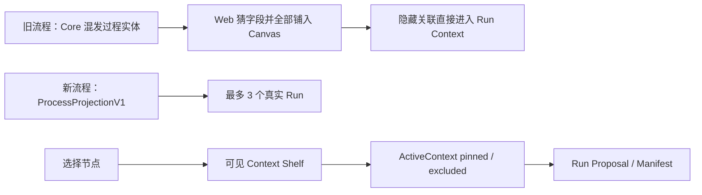

# LCOS Batch 1 — 语义止血施工交付（2026-08-04）

## 摘要

本批修复 Buddy/UI 大合并后的首要合同与交互问题：Process Projection 不再把 Revision、Checkpoint、Session 伪装成 Run；节点 Composer 的 Context 变成显式、可增删并真实写回 Core；四个纯文本 Select 改为带图标、状态与说明的轻量菜单；修复 `.lcosproj` 时间相关测试，并补通用 Mutation 不得绕过 Accept 的保护性测试。

## 变更流程

## 实际范围

- 新增共享 `ProcessProjectionV1Item` Contract；
- Core 只投影活跃 Run + 最近终态 Run，总数最多 3；
- Context/Target/Output 从真实 Manifest、Run Target 和 Artifact Return 映射到 View；
- 修复 `getArtifactViewsByProject` 错用不存在的 `artifact_views.project_id`；
- Web 删除默认 Canvas Session Summary 投影；
- Context Shelf 显示目标与参考，支持移除一跳默认参考、加入其他 Canvas 内容；
- `pinnedContextIds` / `excludedContextIds` 写回 Local Core，发送只使用 Shelf 最终列表；
- 工作方式、执行者、结果去向、编辑对象改为轻量 Popover Menu；
- Composer 使用部分缩放补偿和 2×2 参数布局，修复 56% Zoom 下的巨大面板/竖排小字；
- `.lcosproj` 最近项目测试改用确定性未来时间，避免与系统当前时间竞争；
- 新增 Current Revision 通用 Mutation 防绕过测试。

## 修改文件

- `packages/contracts/src/index.ts`
- `apps/local-core/src/process-projection-service.ts`
- `apps/local-core/src/metadata-repository.ts`
- `apps/local-core/tests/process-projection-service.test.ts`
- `apps/local-core/tests/metadata-repository.test.ts`
- `apps/local-core/tests/runtime-http.test.ts`
- `apps/local-core/tests/lcosproj-service.test.ts`
- `apps/web/src/App.tsx`
- `apps/web/src/features/canvas/ProjectCanvas.tsx`
- `apps/web/src/features/canvas/SelectionComposer.tsx`
- `apps/web/src/porcelain-studio.css`
- `apps/web/src/runtime/localCoreClient.ts`
- `apps/web/src/runtime/projectionAdapters.ts`
- `apps/web/tests/v06RunConfirmation.test.ts`
- `docs/audit/LCOS_POST_REFACTOR_FULLSTACK_UI_AUDIT_20260804.md`

## 测试结果

- `npm run check:fast`：PASS
  - Web：126/126
  - Local Core：227/227
  - Domain：5/5
  - Contracts：4/4
  - Architecture：38/38
  - Production build：PASS
- `npm run test:integration`：5/5 PASS
- `git diff --check`：PASS
- lint 仍有历史 warning，但无 lint error；本批未扩大范围清理全部旧 warning。

## 浏览器证据

环境：`http://127.0.0.1:5173/`，Runtime Local Core，约 1280×720。

验证：

1. 页面真实加载，默认 Canvas 从 16 个视图降为 8 个视图，其中 Process 恰好 3 个真实 Run；
2. 选择 `Feedback Notes`，Shelf 显示 Target + `Script` 参考；
3. 删除 `Script` 后 UI Chip 消失；
4. 加入 `Brief` 后 UI Chip 出现；
5. Core ActiveContext 实际返回：
   - `pinnedContextIds=["view-brief"]`
   - `excludedContextIds=["view-script"]`
   - `targetArtifactId="artifact-feedback"`
6. 工作方式菜单真实展开并显示分析、创建、修改的结果解释；
7. 未发送 Run，避免验收产生新的执行数据。

截图：`C:/Users/1/AppData/Local/Temp/lcos-batch1-context-composer-20260804.png`

## 未完成

- 旧相机仍可能恢复到历史 56% Zoom；本批没有擅自覆盖用户保存的 Camera。后续应设计“投影集合显著变化时建议定位内容”，而不是强制重置。
- Work Rail 全局 Composer 仍使用旧参数控件，本批只修用户指出的节点 Composer。
- Activity 尚未接纳被移出 Canvas 的历史 Run/Session Summary；数据仍在 Core，不丢失。
- `waiting_input`、Safe Write、零点击 Executor 仍是红区，未实现。
- `App.tsx` 仍有历史 hooks/unused warning，需要独立清理片，避免与语义修复混成巨大 Diff。
- Bundle 仍有 >500kB 警告，需要后续按页面/Viewer 做动态拆分。

## 风险与回滚

- 风险：用户以前习惯在 Canvas 看全部历史过程；现在需等待 Activity 接口消费后查看完整历史。
- 数据风险：无 Schema、无 Migration、无用户文件写入；Project Truth 未改变。
- 回滚：回退本批 Contract/Service/Web 投影和 Composer 文件即可；无需数据库回滚。

## 下一步

进入 Batch 2：失败恢复入口、Revision Compare、Feedback/Decision、Preview 统一、Fixture/Runtime 清理和功能可发现性。红区继续按独立 Gate 处理。

## Runtime Host / 托盘补充修复

- 修复裸 `npm run bridge` 没有默认子命令而报 `Missing command`：现在默认进入 `serve`，并使用工作树内 `.codex-runtime/bridge` 作为显式 Runtime Root。
- `npm run dev:stack` 已实测同时启动 Web、Local Core、Light Bridge；5173、43121、43122 均返回 HTTP 200。
- 修复 Windows PowerShell 5.1 无 BOM UTF-8 中文字符串导致托盘脚本解析失败的问题；菜单文本改为 ASCII JSON Unicode 转义。
- 托盘现在从 `$PSScriptRoot` 定位仓库、保持单实例、支持双击打开 GUI，并等待 Stop 完成后再重启或退出。
- Launcher 已绑定托盘生命周期：`dev:open` 自动复用或启动托盘，状态文件记录 `trayPid`，`dev:status` 展示，`dev:stop` 精确回收。
- `npm run tray` 已实测保持运行，第二实例会立即退出；新增 4 项 Architecture 守卫测试。

当前托盘定位仍是开发宿主入口，而非安装版桌面应用：干净工作树可从托盘打开 GUI；工作树有未提交修改时，Launcher 按安全规则拒绝启动。
