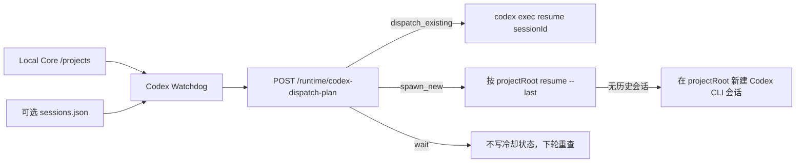

# LCOS Codex 派单收尾报告（2026-08-04）

## 结论

Buddy 交付的 Canonical Context、MCP/CLI、Agent Surface、Bridge Kernel 与浏览器探针均通过现有质量链；但 `CODEX_TO_GPT_HANDOFF_20260804.md` 中“零注册看门狗可直接使用”的结论不成立。本次已修复该运行阻塞，并补上回归保护。

本报告覆盖并修正原 Handoff 的 Codex 自动派单部分；原文仍作为 Buddy 阶段历史证据保留。

## 本次实际修改

1. 看门狗不再强制要求 `sessions.json`，而是从 Local Core `GET /projects` 自动发现项目。
2. `sessions.json` 降级为可选的“项目 → 精确 Codex 会话”绑定；缺失时走按项目目录恢复最近会话。
3. 修复 Codex 会话忙碌检测：递归查找真实的 `~/.codex/sessions/YYYY/MM/DD/*.jsonl`，并按完整 session ID 匹配。
4. 修复调度状态字段漂移：统一使用 `lastDispatchByRun`，兼容空文件与损坏文件重建。
5. `wait` 决策不再误记为已派单；干跑也不会污染冷却状态。
6. 锁文件改存 PID；进程已不存在时自动回收陈旧锁，不再要求用户手工删除。
7. 增加单轮、无副作用诊断：`LCOS_ORCHESTRATOR_ONCE=1` + `LCOS_ORCHESTRATOR_DRY_RUN=1`。
8. 新增 4 项架构回归测试，锁定自动发现、嵌套会话保护、无副作用诊断、锁与冷却状态。

## 修正后的真实流程

## 验证结果

- 子代理独立全套基线：`npm run check:fast` PASS。
  - Web 129 tests
  - Local Core 236 tests
  - Domain 5 tests
  - Contracts 4 tests
  - Architecture（Buddy 基线）42 tests
  - Web build PASS
- `npm run test:integration`：5/5 PASS。
- Light Bridge Kernel pytest：30/30 PASS。
- `tests/e2e/agent-surface-probe.mjs`：PASS。
- `tests/e2e/single-click-probe.mjs`：PASS。
- 收尾后 `npm run test:architecture`：46/46 PASS。
- 看门狗 PowerShell AST：PASS。
- 看门狗单轮干跑：PASS；成功访问在线 Local Core，当前没有待派 Codex Run，因此没有调用模型或修改项目数据。
- `git diff --check`：PASS。

## 能力边界（必须如实表述）

- 已验证：Core 能生成派单计划；看门狗能自动发现项目；CLI 语法与本机 `codex-cli 0.146.0-alpha.9.2` 一致；MCP/CLI 任务生命周期已有测试。
- 未在本次制造真实任务验证：`LCOS Run → 看门狗启动真实 Codex 模型回合 → Codex claim/start/submit → LCOS 完成`。原因是在线项目当前无待办，而为测试强行创建 Run 会改变用户项目状态并触发真实模型执行。
- 因此当前可以称为“派单链实现并通过无副作用诊断”，不能称为“真实 Codex Golden Path 已完整复现”。合并前应在一次性测试项目中完成一次 analyze Run（零文件返回）的真实 E2E，并保存 Run/Task/Event 证据。
- 桌面 Codex App 没有供外部 PowerShell 向指定可见窗口注入消息的公开接口；看门狗调度的是 Codex CLI 会话。`sessions.json` 精确绑定时可做忙碌保护，零注册 `--last` 模式无法同等精确判断目标会话是否正被桌面端占用。

## 修改文件

- `tools/codex-orchestrator/watch.ps1`
- `tools/codex-orchestrator/README.md`
- `tests/architecture/codex-orchestrator.test.ts`
- `docs/handoffs/LCOS_CODEX_DISPATCH_CLOSEOUT_20260804.md`

## 风险与回滚

- 风险：零注册模式按项目目录选择最近会话；同目录存在多个用途不同的 Codex 会话时，可能投递到非预期会话。生产使用建议注册精确 session ID。
- 风险：真正的 CLI E2E 会消耗模型回合并可能产生文件改动，必须只在一次性项目运行。
- 回滚：恢复上述两个 orchestrator 文件并删除新增测试与本报告；不会触及 Schema、Project Truth 或 Bridge Runtime 数据。
