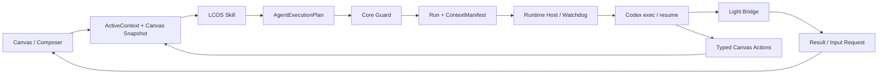

# LCOS Gate F 最终收口实施计划

> 基线：7cdf8c3 支持包 + 2026-08-05 Windows 真机证据
> 目标：不替换现有技术路线，优先补齐真实 Codex 闭环、waiting_input、观察—行动循环和用户可见恢复能力。

## 目标流程

## 本轮切片

1. **C1 Codex 会话绑定修复**
   - 从本次 `codex exec --json` 输出解析 session id。
   - 禁止按最近修改的 JSONL 猜会话。
   - 显式 Codex 路径探测和诊断。

2. **C2 waiting_input 正式合同**
   - Bridge ResultEnvelope 支持 `waiting_input`。
   - InputRequest 独立保存，可自由文本和选项回答。
   - 回答后同一 Run / Session 恢复。

3. **C3 真实状态与分析结果**
   - `run.started` 只在 Provider 实际 running 时产生。
   - analyze reply_only 的 summary 写回 Run 并在 UI 可见。

4. **C4 Agent 自修正与自然语言 Context**
   - Skill 明确一次自动修正循环。
   - Context 指令直接走安全命令，扩大上下文才 Proposal。

5. **C5 Canvas 观察—行动能力**
   - Agent Browser 接 `afterVersion`。
   - 补 `select_views`、`focus_views`、`move_view`、`open_preview`、`add_to_workspace`。
   - Snapshot 增加视口外摘要与近期操作。

6. **C6 用户恢复与诊断**
   - 人话错误映射、复制诊断。
   - waiting_input 卡片、Run Activity、重新连接入口。

7. **C7 资源连接器最小落地**
   - 统一 Connector Port。
   - Obsidian Vault Markdown 只读连接器，不做双向写回。

## 禁止项

- 不用脚本模拟 Codex 代替真实执行。
- 不使用 DOM 抓取作为 Context Truth。
- 不替换 React Flow。
- 不把 waiting_input 塞进 failed/retry。
- 不自动安装或执行未知 Skill。
- 不做正式 Windows 安装器。
