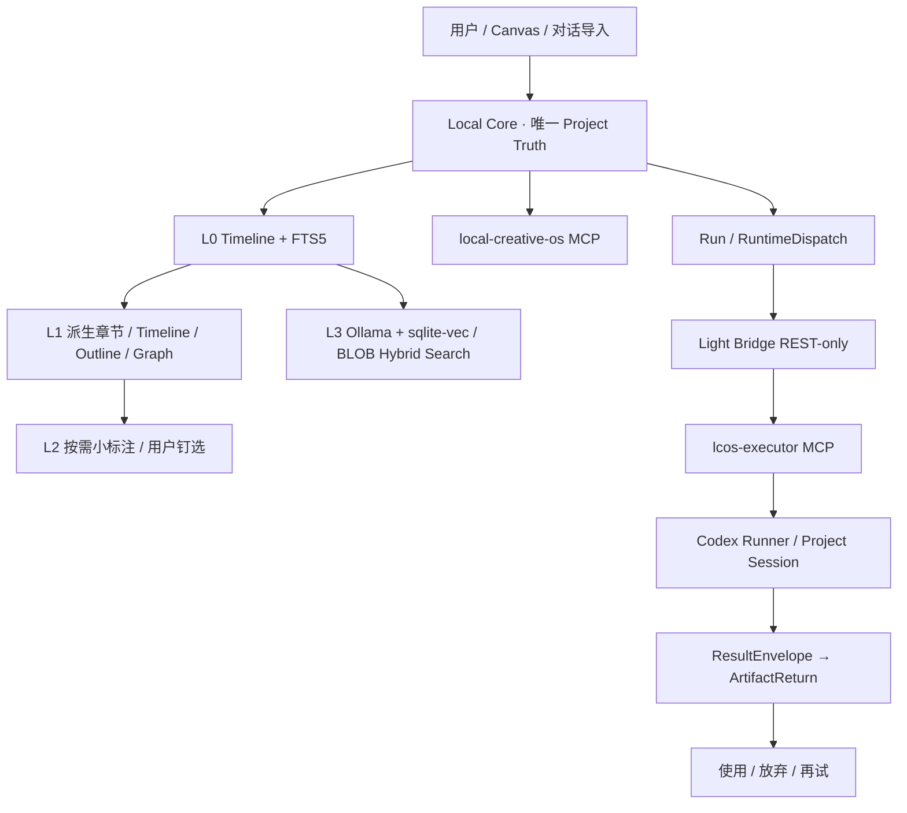

# LCOS Gate F Plus 大轮开发与验证报告

> 日期：2026-08-05  
> 产品版本：0.9.0  
> Local Core Schema：v18  
> 状态：Windows Evidence Candidate  
> 说明：本报告只记录实际代码和本环境真实验证。目标 Windows、Codex、Ollama 与 native sqlite-vec 未实测的部分不会被写成完成。

## 1. 最终流程



## 2. 本轮完成

### 2.1 MCP 与 Bridge

- 拆分 `local-creative-os` 和 `lcos-executor`；
- Agent 65 tools、Executor 12 tools、零重叠；
- Light Bridge 删除公共 `/mcp`，只保留内部 REST；
- Local Core 通过 Bridge REST Adapter 调度；
- Installer 使用稳定启动脚本，不写死 fnm 临时 node 路径；
- 安装前备份 Codex 配置；
- 只清理精确匹配旧签名的 `ai_bridge`；
- 普通会话默认启用 Agent MCP，Executor MCP 默认关闭；
- Runner 会话使用独立 executor 工具面；
- MCP/Bridge E2E 覆盖实际 REST claim/start/result 与 Canvas Action。

### 2.2 Watchdog 与 Session

- Node Watchdog 取代大型同步 PowerShell 主循环；
- PowerShell 仅保留薄启动包装；
- 同一 Project 串行；不同 Project 默认并发 2；
- Runner 超时、进程树终止、有限重试和持久 cooldown；
- 一个卡死 Runner 不阻塞其他 Project；
- 只使用正式 Provider Session Binding，不用 `sessions.json` 或 `resume --last` 猜会话。

### 2.3 Context Import L0

- `ContextImportSourceV0`；
- Codex JSONL 分片上传，最大 512 MiB；
- 流式逐行解析，不整文件进内存；
- 手动粘贴时间线；
- Message / Tool / Event / File Reference 归一化入库；
- source event 去重；
- FTS5 trigger + BM25；
- 文件引用匹配已有 FileRecord/Artifact，并建立 relation；
- 不自动导入陌生路径；
- 导入诊断进入 UI。

### 2.4 L1 管理视图

- 章节按回合、新指令、工具密度和体量规则派生；
- 章节边界不复制消息；
- 用户可改名、锁定；刷新不覆盖锁定章节；
- Timeline / Outline / 基础关系图 / Search 读取同一时间线；
- 普通消息不铺满 Canvas；
- 会话节点和钉选 Decision 使用既有 Artifact/View；
- 视口外 Cluster 与最近变化进入 Agent Snapshot。

### 2.5 L2 按需小标注

- UI 的“提炼这一章”创建真实 Codex analyze Run；
- Skill 读取章节原文后提交短标题、最多三条决策/待办与文件；
- 标注绑定 sourceHash；
- 用户标注优先，自动重建不能覆盖；
- 原文变化时拒绝旧标注伪装为最新。

### 2.6 L3 语义索引

- Ollama `/api/embed` 批量 Embedding；
- sqlite-vec 安装器、动态加载与 KNN 路径；
- native extension 不可用时 BLOB cosine fallback；
- 持久 `conversation_embedding_jobs`；
- Core 重启恢复中断任务；
- inputHash + embeddingVersion + indexVersion；
- 只索引 stale 消息；
- FTS5 + Vector 混合评分、来源和理由；
- CLI/MCP/Web 查看状态、触发构建和混合搜索；
- Ollama 关闭时 FTS5 保持可用。

### 2.7 Canvas / UI / 项目入口

- Canvas Snapshot 增加可见节点、关系、视口外 Cluster、最近变化；
- 按需 SVG Observation + `screenshotRef`；
- Typed Actions：select、focus、move、viewport、relation、workspace、preview；
- 项目工具入口：搜索、`.lcosproj` 打开/导出、批量备份、Session Binding；
- Activity / Recovery / stale 文件操作补入口；
- Handoff、Workbench 与错误文案进一步去除后端术语；
- Conversation 导入、时间线、大纲、关系图、搜索与索引有 GUI 入口。

## 3. 本环境实际验证

以下命令真实通过：

```text
npm run build:local-core
node scripts/validate-gatef-plus.mjs
node scripts/conversation-import-smoke.mjs
node scripts/conversation-import-recovery-smoke.mjs
node scripts/conversation-semantic-smoke.mjs
node scripts/schema-v18-migration-smoke.mjs
node scripts/codex-watchdog-smoke.mjs
node scripts/lcosproj-browser-smoke.mjs
node scripts/gatef-core-smoke.mjs
LCOS_LARGE_CONVERSATION_LINES=36000 node scripts/conversation-large-import-smoke.mjs
LCOS_LIGHT_BRIDGE_PYTHON=/opt/pyvenv/bin/python3 node scripts/lcos-mcp-bridge-e2e.mjs
python -m pytest tools/light-bridge-kernel/tests
python -m compileall tools/light-bridge-kernel
```

关键结果：

```text
Local Core / Domain build：PASS
Gate F Plus contract checks：23 / 23 PASS
Conversation fixture：139 messages / 4 sections / 2 pinned decisions / 3 file refs
Failed import retry：deterministic identity / stale cleanup / single row PASS
Semantic fixture：139 indexed，第二次增量 0
Schema v17 → v18：备份与旧行保留 PASS
Watchdog：跨项目并发、同项目串行、卡死任务超时 PASS
.lcosproj Browser：下载/上传/重启恢复/临时路径隐藏 PASS
大文件流式导入：87,529,780 bytes / 36,000 messages / 21 chunks PASS
MCP split E2E：Agent 65 / Executor 12 / Bridge /mcp=404 PASS
Light Bridge：35 / 35 pytest PASS
```

大文件脚本以 `LCOS_LARGE_CONVERSATION_LINES=36000` 实际生成并导入约 87.5 MB JSONL；代码使用 4 MiB 分片与流式逐行解析。Windows 仍需用真实 80 MB 以上 Codex 会话复测内存和中断恢复。


### 3.1 源码交付清理

最终源码 Manifest 与 ZIP 主动排除：

```text
.git / node_modules / build / dist / runtime 数据 / 日志 / Python 缓存
历史 E2E 截图输出
旧包中路径编码已损坏的 OS 历史资料归档目录
嵌套 ZIP / 7z / tar
```

这些内容不是当前全栈运行源码；排除它们可避免 Windows 解压路径损坏和把旧测试产物误当作本轮证据。对话导入的真实脱敏 fixture 仍保留。

## 4. 设计减法

本轮没有增加第二套 Project Truth：

```text
Conversation 原始时间线：SQLite 单真相
章节 / 大纲 / 关系图：派生视图
Embedding：可重建索引
Canvas Observation：视觉补充
Bridge Task：执行态
Artifact / Revision / Current：仍由 Local Core 管理
```

没有采用：

```text
全量 AI 压缩后再导入
每条消息一个 Canvas 节点
DOM 抓取
每次 Run 新建 Session
Bridge 拥有 Project Context
向量库阻塞导入
```

## 5. 当前诚实边界

### 必须在用户 Windows 实测

- Codex 0.147 或目标版本真实加载两个 MCP；
- 新会话、精确 resume、waiting_input 同 Session 恢复；
- 同一 Project 连续 5 Run；
- revise / create / analyze 三种真实变体；
- Windows Runner running cancel / 进程树终止；
- Agent Browser 上下文更新端到端 ≤1 秒；
- Runtime Host 生命周期。

### 必须有真实 Ollama / native extension

- Windows sqlite-vec DLL 加载；
- Ollama 模型真实批量 embedding；
- native KNN + FTS5 混合搜索；
- 模型或索引版本变化后的重建。

### 本环境依赖限制

当前容器不能可靠取得完整 Web/Vite/Vitest/Playwright 依赖，因此没有重新声称完整 Web build 和浏览器 E2E 全绿。已完成 Local Core 编译、全 TS/TSX 语法扫描、MJS syntax、HTTP smoke 和结构测试；最终以 Windows `npm ci` 后质量链为准。

## 6. 回滚

- Schema v18 是向前 Migration，升级前生成 v17 备份；
- Conversation 是新增域，不修改人工 Current；
- FTS / Vector 可重建；
- 关闭 L3 不影响 L0/L1；
- Watchdog 可回退到手动 Runner，但不得恢复 `sessions.json` 或 `resume --last`；
- Bridge 可回退 0.3.x，但不得恢复公共 MCP。

## 7. 当前判断

```text
可作为 Windows Evidence Candidate：是
可直接宣称正式合并：否
需要推倒重写：否
下一步：按 Windows Evidence 清单运行并回传完整 evidence 目录
```
